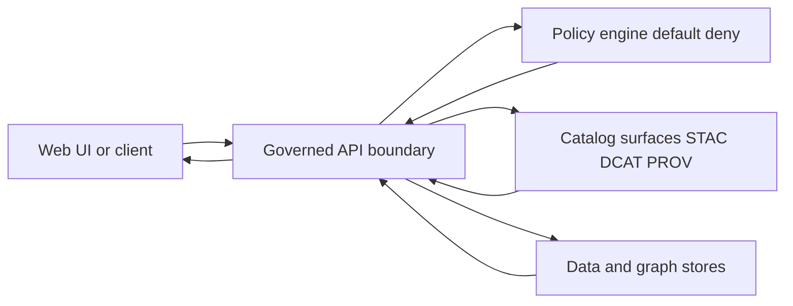

<!-- [KFM_META_BLOCK_V2]
doc_id: kfm://doc/8c9a5cc0-5d55-44a7-a8d4-3b5d0d4d3f62
title: API Templates
type: standard
version: v1
status: draft
owners: KFM API team; KFM Docs
created: 2026-03-04
updated: 2026-03-04
policy_label: public
related: [docs/templates/, src/server/, schemas/, docs/standards/, docs/governance/]
tags: [kfm, templates, api, contracts, openapi, evidence]
notes: [Directory README for governed API template artifacts]
[/KFM_META_BLOCK_V2] -->

# API Templates
Governed templates and examples for proposing, validating, and shipping changes to the KFM API boundary.

<p align="center">
  
  
  
  
  
</p>

> **Owners:** KFM API Maintainers, KFM Docs  
> **Status:** draft  
> **Last updated:** 2026-03-04  
> **Path:** `docs/templates/api/README.md`

**Jump to:** [Scope](#scope) · [Where it fits](#where-it-fits) · [Acceptable inputs](#acceptable-inputs) · [Exclusions](#exclusions) · [Directory tree](#directory-tree) · [Quickstart](#quickstart) · [Usage](#usage) · [Diagram](#diagram) · [Tables](#tables) · [Gates](#gates-and-definition-of-done) · [FAQ](#faq) · [Claim register](#claim-register)

---

## Scope

This folder is for **governed templates** that shape how we write, review, and ship **API contract** changes.

### Non-negotiables

- **CONFIRMED:** Trust membrane — UI/clients must never access databases directly; all access crosses the governed API + policy boundary.
- **CONFIRMED:** Fail-closed policy — every request must be policy-checked; deny is the safe default.
- **CONFIRMED:** Evidence-first citations — citations are `EvidenceRef` objects that must resolve (policy-applied) into `EvidenceBundle` objects.
- **PROPOSED:** API-specific helper templates (OpenAPI fragments, example payloads, checklists) live here so contract work is consistent and reviewable.

### In scope

- Template docs for:
  - API contract extension proposals (endpoint additions/changes)
  - OpenAPI snippet patterns (paths, schemas, errors)
  - Evidence resolver payload shapes (`EvidenceRef`, `EvidenceBundle`)
  - Focus Mode request/response payload shapes (citations + audit receipt references)
  - Contract-test checklists and review gates

### Out of scope

- Endpoint implementation code (belongs under `src/server/`)
- Canonical JSON Schemas (belongs under `schemas/`)
- Rego/OPA policy bundles (belongs under the repo’s policy home)
- Real tokens, credentials, production secrets
- Sensitive location details that policy would redact/generalize

---

## Where it fits

**Upstream → contracts → downstream** (expected):

- **Upstream:** pipelines/ingest produce datasets + catalogs (STAC/DCAT/PROV) and run receipts.
- **This folder:** provides *templates* for describing and changing the **API contracts** that expose those governed surfaces.
- **Downstream:** `src/server/` implements the governed API and serves `web/` (UI), which must not bypass it.

Related canonical paths (see `docs/MASTER_GUIDE_v13.md` if present):

- `docs/templates/` — governed document templates (universal, story node, API)
- `src/server/` — API service implementation + API contract definitions
- `schemas/` — JSON Schemas (STAC/DCAT/PROV, story nodes, UI, telemetry)
- `tools/` + `.github/` — validators and CI gates

---

## Acceptable inputs

Put only *template* and *example* artifacts here:

- Markdown templates (`.md`)
- Example payloads (`.json`) with **synthetic IDs** and **no sensitive fields**
- OpenAPI fragments (`.yaml` / `.yml`) intended to be merged into the canonical spec
- Checklists and review gate documents (`.md`)

---

## Exclusions

Do **not** put these here (and where they go instead):

- Endpoint code → `src/server/…`
- Production OpenAPI spec (source of truth) → `src/server/…/contracts/` (or your repo’s canonical location)
- Runtime-generated receipts/citation bundles → `data/…` or `mcp/runs/…` (per governance)
- Policy code and fixtures → `policy/…` (or equivalent)
- Schema sources → `schemas/…`

---

## Directory tree

Expected shape (some files may be added over time):

```text
docs/templates/api/
├── README.md
├── TEMPLATE__API_CONTRACT_EXTENSION.md        # optional mirror; canonical may live in docs/templates/
├── openapi/
│   ├── fragment__errors.yaml
│   ├── fragment__evidence_resolve.yaml
│   └── fragment__focus_ask.yaml
├── examples/
│   ├── evidence_ref.example.json
│   ├── evidence_bundle.example.json
│   ├── focus_ask.request.example.json
│   └── focus_ask.response.example.json
└── checklists/
    ├── api_change_gate.md
    ├── policy_test_gate.md
    └── contract_test_gate.md
```

If your repo already keeps `TEMPLATE__API_CONTRACT_EXTENSION.md` in `docs/templates/`, prefer linking to `../TEMPLATE__API_CONTRACT_EXTENSION.md` instead of duplicating it.

---

## Quickstart

### 1) Propose an API change (contract-first)

```bash
# PSEUDOCODE: adjust paths to your repo conventions
cp ../TEMPLATE__API_CONTRACT_EXTENSION.md \
  ../../architecture/adr/2026-03-04__api__add_evidence_resolver_fields.md
```

Fill in the template, including:

- What endpoint(s) change
- Backwards compatibility story (or version bump)
- New/changed request and response schemas
- Policy posture and default-deny behavior
- Required tests (contract tests + policy tests + integration)

### 2) Add/adjust OpenAPI (contract)

```bash
# PSEUDOCODE: edit the canonical OpenAPI spec (source of truth)
$EDITOR ../../../src/server/contracts/openapi/kfm-api-v1.yaml
```

### 3) Add policy fixtures and tests (fail-closed)

- Add/adjust policy rules for the new endpoint/action.
- Add fixture inputs for “public user”, “steward user”, “restricted dataset”, etc.
- Ensure CI runs policy tests and blocks merges on deny-by-default regressions.

### 4) Implement endpoint + tests

- Implement the handler in `src/server/…`
- Add:
  - unit tests (handler logic)
  - integration tests (end-to-end with policy + catalogs)
  - contract tests (OpenAPI output matches expected, and clients don’t break)

---

## Usage

### Contract-first rule

**CONFIRMED:** “Contract-first” means schemas and API contracts are first-class artifacts; development starts from contracts, and contract changes trigger strict versioning/compatibility checks.

Operationally:

1. Update contract (OpenAPI + docs) first
2. Add tests and policy gating
3. Implement
4. Verify the contract output in CI (schema + policy + integration)

### Evidence and citations rule

**CONFIRMED:** In KFM, a “citation” is an `EvidenceRef` that must resolve (with policy applied) into an `EvidenceBundle`. Publishing Story Nodes and Focus responses must hard-verify citations; otherwise the system must reduce scope or abstain.

Practical implications for API contracts:

- Any response that includes citations should return `EvidenceRef` objects, not raw URLs.
- Clients resolve those refs through `POST /api/v1/evidence/resolve`.
- Fail closed if refs are unresolvable or unauthorized.

Example `EvidenceBundle` (template JSON):

```json
{
  "bundle_id": "sha256:bundle...",
  "dataset_version_id": "2026-02.abcd1234",
  "title": "Storm event record: 2026-02-19",
  "policy": {
    "decision": "allow",
    "policy_label": "public",
    "obligations_applied": []
  },
  "license": { "spdx": "CC-BY-4.0", "attribution": "Source org" },
  "provenance": { "run_id": "kfm://run/2026-02-20T12:00:00Z.abcd" },
  "artifacts": [
    {
      "href": "processed/events.parquet",
      "digest": "sha256:2222",
      "media_type": "application/x-parquet"
    }
  ],
  "checks": { "catalog_valid": true, "links_ok": true },
  "audit_ref": "kfm://audit/entry/123"
}
```

---

## Diagram



---

## Tables

### Template inventory

| Template / Example | Purpose | Status |
|---|---|---|
| `../TEMPLATE__API_CONTRACT_EXTENSION.md` | Propose endpoint/contract changes | PROPOSED (link to canonical template) |
| `openapi/fragment__evidence_resolve.yaml` | Standardize evidence resolver contract bits | PROPOSED |
| `examples/evidence_bundle.example.json` | Shared reference shape for `EvidenceBundle` | PROPOSED |
| `checklists/api_change_gate.md` | Review gates for contract changes | PROPOSED |

### Change-type requirements matrix

| Change type | Contract extension doc | OpenAPI update | Policy update + tests | Contract tests | Integration tests | Notes |
|---|---:|---:|---:|---:|---:|---|
| Add new endpoint | ✅ | ✅ | ✅ | ✅ | ✅ | Default deny; add fixtures |
| Add response field (backwards compatible) | ✅ | ✅ | Maybe | ✅ | ✅ | Prefer additive changes |
| Breaking change | ✅ | ✅ (new version) | ✅ | ✅ | ✅ | Provide rollback path |
| New citation-bearing feature | ✅ | ✅ | ✅ | ✅ | ✅ | Citations resolve via evidence resolver |

---

## Gates and definition of done

> These are “merge blockers” for governed branches.

- [ ] Contract extension doc completed (problem, proposal, compatibility, policy posture, tests)
- [ ] OpenAPI updated (paths + schemas + errors) and validated
- [ ] Default-deny policy preserved; policy tests updated and passing
- [ ] Contract tests added/updated (OpenAPI output diff checked)
- [ ] Integration tests cover happy path + policy deny path
- [ ] Observability: logs/metrics include request IDs + audit refs where applicable
- [ ] Docs updated in the canonical location (don’t leave behavior undocumented)
- [ ] Rollback plan documented (how to revert safely)

---

## FAQ

### Why does KFM treat API docs as “governed templates”?
Because the API is a trust boundary: it enforces policy, mediates evidence, and is the only safe path from UI/clients to data.

### Where do I put the real OpenAPI spec?
In the repo’s canonical API contract location (commonly under `src/server/…/contracts/`). This folder is only for templates and fragments.

### Can I publish a Story Node or Focus answer with plain URLs instead of EvidenceRefs?
No. The evidence resolver contract is the gate that makes citations auditable and policy-safe.

---

## Appendix

<details>
<summary>Example OpenAPI fragment (illustrative)</summary>

```yaml
# openapi/fragment__evidence_resolve.yaml
paths:
  /api/v1/evidence/resolve:
    post:
      summary: Resolve an EvidenceRef into an EvidenceBundle
      requestBody:
        required: true
        content:
          application/json:
            schema:
              $ref: "#/components/schemas/EvidenceResolveRequest"
      responses:
        "200":
          description: Evidence bundle
          content:
            application/json:
              schema:
                $ref: "#/components/schemas/EvidenceBundle"
        "403":
          description: Policy denied
        "404":
          description: Evidence ref not found
```

</details>

---

## Claim register

| Claim | Status | How to verify |
|---|---|---|
| UI/clients never access DB directly; all access via governed API + policy boundary | CONFIRMED | See KFM Data Source Integration Blueprint “Boss mode summary” |
| Evidence resolver resolves EvidenceRef to EvidenceBundle and applies policy | CONFIRMED | See Source Snapshots bundle “Evidence resolver and governed API contracts” |
| Publishing gate requires citations resolve through `/api/v1/evidence/resolve` | CONFIRMED | See Source Snapshots bundle “Publishing gate” |
| This folder is the canonical home for API templates | UNKNOWN | Search repo for existing `docs/templates/api/` usage; update this README accordingly |

---

**Back to top:** [↑](#api-templates)
