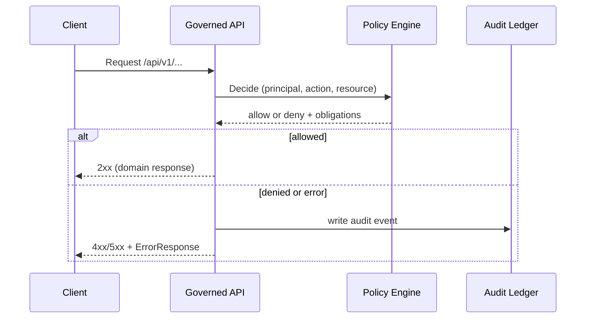

<!-- [KFM_META_BLOCK_V2]
doc_id: kfm://doc/5c1d69b0-7e8f-4a30-a5c7-6a5cf33be0b4
title: TEMPLATE — API Error Model
type: standard
version: v1
status: draft
owners: [TODO]
created: 2026-03-04
updated: 2026-03-04
policy_label: public
related: [docs/templates/api/, contracts/openapi/, policy/]
tags: [kfm, api, contracts, errors]
notes:
  - "Template: stable, policy-safe error envelope for the governed API."
  - "Keep messages safe-to-expose; log sensitive diagnostics internally keyed by audit_ref."
[/KFM_META_BLOCK_V2] -->

# TEMPLATE — API Error Model
One stable, policy-safe JSON shape for **all** governed API errors.

> **Status:** draft (template) • **Owners:** TODO • **Applies to:** Governed API (`/api/v1/*`)  
>     
> Quick links: [Scope](#scope) · [Requirements](#requirements) · [Canonical ErrorResponse model](#canonical-errorresponse-model) · [Examples](#examples) · [Definition of Done](#definition-of-done)

---

## Scope

This template defines a **stable error envelope** for KFM’s governed API so that:

- clients can reliably parse and display errors,
- stewards can debug using `audit_ref` without exposing internal details,
- responses do not leak restricted existence via subtle differences (policy-safe behavior).

---

## Where it fits

**Path:** `docs/templates/api/TEMPLATE__API_ERROR_MODEL.md`

This template is intended to be implemented as:

- an OpenAPI schema (e.g., `components.schemas.ErrorResponse`),
- a shared server DTO (e.g., `ErrorResponse` dataclass / pydantic model),
- a global exception handler/middleware that converts errors into this envelope.



---

## Requirements

### CONFIRMED requirements (must implement)

1. **Stable error model** for all errors:
   - `error_code` (machine-stable)
   - `message` (human-readable, **policy-safe**)
   - `audit_ref` (used for debugging / steward review)
2. **Optional remediation hints** are allowed when policy-safe.
3. **Do not leak sensitive existence** through differences in error content (align 403/404 behavior with policy).

### PROPOSED extensions (optional; only add if you can keep them policy-safe)

- `remediation[]` objects with a `hint` (and optional `doc_ref`)
- `details` for *validation* errors (field-level errors that are safe to disclose)
- `http_status` duplication (useful for clients, but redundant with HTTP status line)
- `request_id` / `trace_id` for observability (only if safe + consistent)

### UNKNOWN / governance decisions (must be resolved before “stable” status)

- Exact policy behavior for “deny-as-404” vs “deny-as-403” (per endpoint/resource type).
- Canonical registry for `error_code` values (where it lives, who owns it, how changes are reviewed).

---

## Canonical ErrorResponse model

### JSON shape (v1)

```json
{
  "error_code": "kfm.request.invalid",
  "message": "Invalid request parameters.",
  "audit_ref": "kfm://audit/entry/2026-03-04T12:34:56Z.abcd1234",
  "remediation": [
    {
      "hint": "Verify that bbox is [minLon,minLat,maxLon,maxLat].",
      "doc_ref": "kfm://doc/TODO#bbox"
    }
  ],
  "details": {
    "field_errors": [
      {"field": "bbox", "issue": "expected 4 numbers"},
      {"field": "time", "issue": "expected RFC3339 interval"}
    ]
  }
}
```

### Field semantics

| Field | Type | Required | Meaning | Policy / safety notes |
|---|---:|:---:|---|---|
| `error_code` | string | ✅ | Stable, machine-readable identifier. | **Never** embed secrets, raw IDs, or stack traces. Keep it coarse-grained. |
| `message` | string | ✅ | Human-readable summary. | Must be **policy-safe**. Avoid “resource exists but you can’t access it” unless policy allows. |
| `audit_ref` | string | ✅ | Opaque reference to audit ledger / receipt. | Should be safe to expose; stewards use it to find details. |
| `remediation` | array | ❌ | Optional safe hints. | Hints must not reveal restricted existence or how-to-locate sensitive targets. |
| `details` | object | ❌ | Optional structured details (typically validation). | Only include fields safe to disclose; omit internal stack traces and SQL. |

> **Rule of thumb:** if it shouldn’t be visible in a public screenshot, it should not be in `message`, `remediation`, or `details`.

---

## HTTP status mapping guidance

> This section is **guidance**; the final mapping should be enforced by policy tests.

| HTTP | Typical `error_code` | When to use | Safety note |
|---:|---|---|---|
| 400 | `kfm.request.invalid` | Request syntax/validation failed. | `details.field_errors` is usually safe here. |
| 401 | `kfm.auth.unauthenticated` | Missing/invalid auth. | Don’t reveal which auth mechanism failed. |
| 403 | `kfm.auth.forbidden` | Authenticated, but not allowed **and policy allows existence disclosure**. | Consider “deny-as-404” to prevent enumeration. |
| 404 | `kfm.resource.not_found` | Resource not found **or** policy requires “not found” behavior. | Prefer this for restricted existence. |
| 409 | `kfm.request.conflict` | Version conflict / write conflict. | Safe if it doesn’t reveal restricted resources. |
| 422 | `kfm.request.unprocessable` | Semantically invalid (optional; many APIs just use 400). | Ensure messages don’t leak sensitive constraints. |
| 429 | `kfm.rate_limited` | Rate limit. | Keep hints generic (retry-after). |
| 500 | `kfm.internal` | Unexpected server error. | Do not echo exception text. |
| 503 | `kfm.upstream.unavailable` | Upstream dependency unavailable. | Do not leak internal hostnames; safe “dependency unavailable” is fine. |

---

## Examples

### 1) Validation error (400)

```json
{
  "error_code": "kfm.request.invalid",
  "message": "Invalid request parameters.",
  "audit_ref": "kfm://audit/entry/2026-03-04T12:34:56Z.abcd1234",
  "details": {
    "field_errors": [
      {"field": "bbox", "issue": "expected 4 numbers"},
      {"field": "time", "issue": "expected RFC3339 interval"}
    ]
  }
}
```

### 2) Policy denial (403 or 404)

> **IMPORTANT:** choose the status code that matches policy and does not leak restricted existence.

```json
{
  "error_code": "kfm.policy.denied",
  "message": "Requested resource is not available.",
  "audit_ref": "kfm://audit/entry/2026-03-04T12:35:10Z.efgh5678",
  "remediation": [
    {"hint": "Try a broader time range or a public dataset filter."}
  ]
}
```

### 3) Rate limited (429)

```json
{
  "error_code": "kfm.rate_limited",
  "message": "Too many requests.",
  "audit_ref": "kfm://audit/entry/2026-03-04T12:36:01Z.rate0001",
  "remediation": [
    {"hint": "Retry after a short delay."}
  ]
}
```

### 4) Internal error (500)

```json
{
  "error_code": "kfm.internal",
  "message": "An unexpected error occurred.",
  "audit_ref": "kfm://audit/entry/2026-03-04T12:37:22Z.err9999"
}
```

---

## Implementation notes

### Recommended OpenAPI fragment (copy/paste)

> Keep the required fields **exactly** stable across versions. Only add optional fields.

```yaml
components:
  schemas:
    ErrorResponse:
      type: object
      required: [error_code, message, audit_ref]
      properties:
        error_code:
          type: string
          description: Stable machine-readable error identifier.
        message:
          type: string
          description: Human-readable, policy-safe message.
        audit_ref:
          type: string
          description: Opaque reference to audit ledger entry/receipt.
        remediation:
          type: array
          description: Optional policy-safe hints.
          items:
            type: object
            properties:
              hint: { type: string }
              doc_ref: { type: string }
        details:
          type: object
          description: Optional structured details (e.g., validation errors).
          additionalProperties: true
```

### Server-side guidance (fail-closed)

- Always catch unhandled exceptions and convert to `error_code="kfm.internal"` with a generic message.
- Log full diagnostics internally keyed by `audit_ref` (and optionally `trace_id`), but do **not** return diagnostics to the client.
- Ensure policy decisions can drive “deny-as-404” behavior consistently across endpoints (no ad hoc differences).

---

## Definition of Done

- [ ] OpenAPI contract includes `ErrorResponse` (required: `error_code`, `message`, `audit_ref`).
- [ ] All governed routes return `ErrorResponse` on errors (no raw framework errors leak through).
- [ ] Policy tests cover 403/404 alignment and verify no “ghost metadata” leaks.
- [ ] Error messages and remediation hints are reviewed for policy safety.
- [ ] Observability: server logs/audit ledger can locate full details using `audit_ref`.

---

## Appendix

<details>
<summary>Suggested error_code registry pattern (PROPOSED)</summary>

Maintain a reviewed registry (example path):

- `contracts/errors/error_codes_v1.json`

Minimal structure:

```json
[
  {"error_code": "kfm.request.invalid", "http_status": 400, "summary": "Invalid request parameters."},
  {"error_code": "kfm.auth.unauthenticated", "http_status": 401, "summary": "Authentication required."},
  {"error_code": "kfm.policy.denied", "http_status": 404, "summary": "Requested resource is not available."},
  {"error_code": "kfm.internal", "http_status": 500, "summary": "Unexpected server error."}
]
```

Rules:

- Additive changes only in v1 (new codes ok; do not rename/remove).
- Any change requires:
  - contract test updates,
  - policy safety review,
  - release note entry if client-visible.

</details>

---

_Back to top:_ [TEMPLATE — API Error Model](#template--api-error-model)
