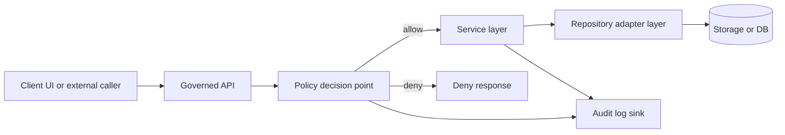

<!-- [KFM_META_BLOCK_V2]
doc_id: kfm://doc/2a8c8a74-8120-4fa5-9b8b-8e3d3c8a25fb
title: TEMPLATE — API Auth Matrix
type: standard
version: v1
status: draft
owners: ["@Kansas-Frontier-Matrix/core", "@Kansas-Frontier-Matrix/security"]
created: 2026-03-04
updated: 2026-03-04
policy_label: restricted
related: ["docs/governance/ROOT_GOVERNANCE.md", "docs/specs/api/", "policy/"]
tags: [kfm]
notes: ["Template file. Copy to a concrete service and replace all TODOs."]
[/KFM_META_BLOCK_V2] -->

# TEMPLATE — API Auth Matrix
One-line purpose: define **who can do what** in a KFM governed API, with a fail-closed, test-enforced authorization contract.

---

## Impact
**Status:** draft (template)  
**Owners:** `@Kansas-Frontier-Matrix/core`, `@Kansas-Frontier-Matrix/security`  
**Applies to:** `{{SERVICE_NAME}}` (TODO)  
**Last updated:** 2026-03-04  
**Policy label:** restricted  

  

**Quick links:** [Scope](#scope) · [Where it fits](#where-it-fits-in-the-repo) · [Roles](#roles-and-principals) · [Matrix](#authorization-matrix) · [CI gates](#ci-and-test-gates) · [Appendix](#appendix)

---

## Scope

### What this template is for
- A single source of truth for **AuthN** (authentication) and **AuthZ** (authorization) expectations for a governed API.
- A contract that can be enforced in CI so “missing policy” becomes a **hard failure**, not a review comment.
- A documentation surface that security review can sign off on.

### What this template is not for
- Not a place to store secrets, API keys, or real tokens.
- Not a full threat model (link an ADR / threat model doc instead).
- Not a substitute for policy-as-code implementation (OPA/Rego, etc.); it must map to it.

### Evidence labels used in this doc

- **CONFIRMED**: backed by an explicitly cited KFM source document.
- **PROPOSED**: recommended default pattern; safe to adopt unless superseded by governance/ADR.
- **UNKNOWN**: not yet decided, or requires governance/security review before implementation.

> **Rule:** If a statement is not explicitly labeled, treat it as **PROPOSED** in this template.

---

## Where it fits in the repo

**Path:** `docs/templates/api/TEMPLATE__AUTH_MATRIX.md`  

Directory context (example):

```text
docs/
  templates/
    api/
      TEMPLATE__AUTH_MATRIX.md
  specs/
    api/
      {{SERVICE_NAME}}__AUTH_MATRIX.md
policy/
  # OPA/Rego policies for governed access
```

**Downstream consumers**
- `policy/` (OPA/Rego packages, Conftest policies)
- `docs/specs/api/` (service API specs and route inventories)
- CI gates (contract tests that assert every route has a policy rule)

**Upstream inputs**
- OpenAPI contract for `{{SERVICE_NAME}}` (or route inventory)
- Identity provider decision (OIDC issuer, audience, signing keys), if applicable
- KFM governance and sensitivity taxonomy

---

## Acceptable inputs

Provide or link the following:

- `{{OPENAPI_SPEC_PATH}}` (TODO)
- Roles list + definition source (org policy, governance doc, ADR)
- Claim mapping (which JWT claims/scopes exist and what they mean)
- Sensitivity classes used by the service (public/restricted/etc.)
- Audit/event schema reference (what gets logged for auth decisions)

---

## Exclusions

- ❌ UI and external clients directly accessing DB/storage (violates trust membrane).
- ❌ Inline “if user.is_admin” checks without a policy boundary.
- ❌ “Break-glass” bypass without explicit governance + logging.


## Quickstart

```bash
# Copy this template to a concrete service doc
cp docs/templates/api/TEMPLATE__AUTH_MATRIX.md \
  docs/specs/api/{{SERVICE_NAME}}__AUTH_MATRIX.md
```

Then:
1. Replace all `{{...}}` placeholders.
2. Generate the route inventory from OpenAPI and fill the route-level matrix.
3. Link every matrix row to a policy rule id and add CI coverage tests.


---

## Architecture invariants

These are KFM-wide invariants; this matrix must not violate them.

- **Trust membrane:** UI/clients MUST NOT access DB/storage directly; all access crosses the governed API + policy boundary. (**CONFIRMED**)  
- **Fail-closed:** any request without an explicit allow policy MUST be denied. (**CONFIRMED**)  
- **Cite-or-abstain (Focus Mode):** any AI answer must cite evidence or abstain; each answer produces an audit reference. (**CONFIRMED**)  

> If your service cannot meet an invariant, mark it **UNKNOWN** and open an ADR that proposes an exception, with rollback.

---

## Definitions

- **Principal:** the authenticated identity making a request (human, service account, job, workflow).
- **Role:** a coarse-grained set of permissions assigned to principals (RBAC).
- **Scope:** a fine-grained permission string (OAuth2/OIDC style), typically embedded in a token.
- **Resource:** a domain object controlled by the API (dataset, catalog item, story node, etc.).
- **Action:** an operation on a resource (`read`, `write`, `delete`, `promote`, `admin`, …).
- **Sensitivity class:** policy label that constrains distribution and exposure (`public`, `restricted`, etc.).
- **Decision:** allow/deny from the policy engine, with a reason and audit metadata.

---

## Roles and principals

### Roles register

> Replace / refine this list to match KFM governance decisions for your deployment.

| Role ID | Role name | Who is it | Typical AuthN | Notes |
|---|---|---|---|---|
| `public` | Anonymous/Public | Unauthenticated user | none | Should only access explicitly public endpoints. |
| `user` | Authenticated User | Logged-in human | OIDC (PROPOSED) | Minimum baseline capabilities. |
| `contributor` | Contributor | Human who can submit drafts | OIDC (PROPOSED) | Can create/modify *draft* objects only. |
| `steward` | Data Steward | Human reviewer/publisher | OIDC (PROPOSED) | Can approve/publish. |
| `operator` | Operator | On-call / ops | OIDC + MFA (PROPOSED) | Operational actions; tightly audited. |
| `service` | Service Account | Non-human workload identity | workload OIDC / mTLS (PROPOSED) | Used by ETL, schedulers, other services. |
| `admin` | Admin | Break-glass governance role | OIDC + MFA (PROPOSED) | Avoid; prefer narrow operator/steward. |

### Principal types

| Principal type | Example | Notes |
|---|---|---|
| Human user | `sub=user:123` | Must be attributable to a real person. |
| CI workflow | `sub=repo:org/repo:ref:...` | Prefer keyless OIDC identities. |
| Service account | `sub=svc:etl-runner` | Must be least-privilege and rotatable. |

---

## Claims and attributes

> Fill these in only after the IdP/token format is decided.

| Field | Source | Type | Meaning | Required | Notes |
|---|---|---:|---|:---:|---|
| `iss` | token | string | Issuer | ✅ | Must match allowlist. |
| `aud` | token | string/array | Audience | ✅ | Must include `{{SERVICE_AUDIENCE}}` (TODO). |
| `sub` | token | string | Subject/principal id | ✅ | Must be stable. |
| `exp` | token | int | Expiration | ✅ | Reject expired. |
| `role` | token / directory | string/array | Role(s) | ✅ | RBAC input. |
| `scope` | token | string | OAuth scopes | ⛔️/✅ | Decide if used. |
| `tenant` | token | string | Tenant/org boundary | ⛔️/✅ | Required in multi-tenant. |
| `kfm:sensitivity_clearance` | directory | string | Clearance level | ⛔️/✅ | Needed if restricted data is served. |

---

## Policy boundary and request flow



**Notes**
- Authorization MUST happen **before** any storage access.
- The policy decision MUST be logged (deny and allow), with a correlation id.

---

## Authorization matrix

### How to fill out
1. Inventory your API routes (OpenAPI preferred).
2. Normalize each route to `{resource, action}`.
3. Decide which roles can do which actions.
4. Record required claims/scopes (if any).
5. Link each row to an OPA/Rego rule (or equivalent).
6. Add tests that assert:
   - Every route has a matrix row
   - Every matrix row has a policy rule
   - Default is deny

### Route-level matrix (required)

> Add one row per externally callable operation.  
> Tip: generate this from OpenAPI as a CSV/JSON in CI, then render into markdown.

| Method | Path | Operation ID | Resource | Action | AuthN required | Allowed roles | Required scopes/claims | Sensitivity | Evidence & audit event | Policy rule ref | Notes |
|---:|---|---|---|---|:---:|---|---|---|---|---|---|
| GET | `/healthz` | `healthCheck` | `system` | `read` | ❌ | `public` | none | public | `audit.system.health` (PROPOSED) | `kfm.system.allow_health` (PROPOSED) | Keep minimal. |
| GET | `/datasets` | `listDatasets` | `dataset` | `list` | ✅ | `user,contributor,steward,operator,admin` | `scope=kfm:datasets:read` (PROPOSED) | mixed | `audit.dataset.list` (PROPOSED) | `kfm.dataset.allow_list` (PROPOSED) | Redact restricted fields. |
| POST | `/datasets` | `createDataset` | `dataset` | `create` | ✅ | `contributor,steward` | `scope=kfm:datasets:write` (PROPOSED) | restricted | `audit.dataset.create` (PROPOSED) | `kfm.dataset.allow_create` (PROPOSED) | Draft only unless steward. |
| POST | `/datasets/{id}:promote` | `promoteDataset` | `dataset` | `promote` | ✅ | `steward,operator` | `scope=kfm:datasets:promote` (PROPOSED) | restricted | `audit.dataset.promote` (PROPOSED) | `kfm.dataset.allow_promote` (PROPOSED) | Must enforce promotion gates. |
| POST | `/focus/query` | `focusQuery` | `focus` | `invoke` | ✅ | `user,contributor,steward,operator` | `scope=kfm:focus:invoke` (PROPOSED) | mixed | `audit.focus.query` (PROPOSED) | `kfm.focus.allow_query` (PROPOSED) | Must enforce cite-or-abstain. |

> Replace sample rows with real routes. Keep *deny by default*.

### Resource-action summary matrix (optional but useful)

| Resource | Actions | Notes |
|---|---|---|
| `dataset` | `list,read,create,update,delete,promote` | Promotion is a distinct action. |
| `catalog` | `read,write,publish` | Includes STAC/DCAT/PROV surfaces. |
| `story_node` | `read,draft,review,publish` | Governance review required. |
| `policy` | `read,update` | Highly restricted; admin/operator only. |

---

## Sensitivity and redaction rules

- If a response can contain **restricted** attributes, the route MUST either:
  - enforce clearance via policy (**PROPOSED**), or
  - return a redacted view by default (**PROPOSED**).

Add a redaction table when applicable:

| Field | Sensitivity | Redaction rule | Who can see it | Notes |
|---|---|---|---|---|
| `dataset.raw_location` | restricted | remove or coarsen | `steward,operator` | Avoid targeting risk. |

---

## CI and test gates

### Required CI checks (fail closed)

- [ ] **Coverage:** every OpenAPI operation has a matrix row.
- [ ] **Policy linkage:** every matrix row references a policy rule id.
- [ ] **Default deny:** tests assert that unknown routes/actions are denied.
- [ ] **No bypass:** tests assert storage adapters cannot be called without a policy allow.
- [ ] **Audit:** allow/deny decisions emit an audit event with correlation id.

### Suggested automation pattern (PROPOSED)

1. Export OpenAPI operation list → `build/auth_matrix_routes.json`
2. Validate that `docs/specs/api/{{SERVICE_NAME}}__AUTH_MATRIX.md` covers all operations
3. Validate that `policy/` contains `data.kfm.<service>.<rule>` for each referenced policy rule
4. Run integration tests that exercise allow/deny for representative roles

---

## Operational notes

- Token validation MUST check issuer, audience, signature, expiration, and (if used) nonce/jti replay controls.
- Prefer **least privilege** service accounts and short-lived credentials.
- Treat “admin” as an exception role; prefer narrow roles + explicit actions.

---

## FAQ

**Why do we need both a doc matrix and policy-as-code?**  
Because the doc is what humans review and sign off on, while policy-as-code is what CI and runtime enforce.

**What if the IdP/token format is not decided?**  
Mark fields as **UNKNOWN**, ship only public endpoints, and block promotion to protected environments until decided.

---

## Appendix

<details>
<summary>Example OPA rule naming convention (PROPOSED)</summary>

- Package: `kfm.{{service}}`
- Rules: `allow_<resource>_<action>`
- Input shape: `{principal, request, resource, context}`

Example (pseudocode):

```rego
package kfm.dataset

default allow_list = false

allow_list {
  input.principal.authenticated == true
  input.principal.role[_] == "user"
}
```

</details>

<details>
<summary>Template copy command</summary>

```bash
# Copy this template to a concrete service doc
cp docs/templates/api/TEMPLATE__AUTH_MATRIX.md \
  docs/specs/api/{{SERVICE_NAME}}__AUTH_MATRIX.md
```

</details>

---

### Back to top
[↑ Back to top](#template--api-auth-matrix)
