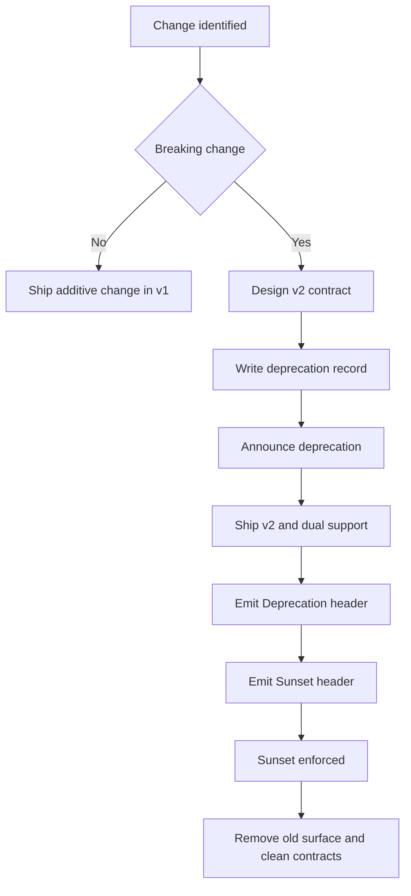

<!-- [KFM_META_BLOCK_V2]
doc_id: kfm://doc/7c22560e-9227-4550-b9ee-1c188c807011
title: TEMPLATE — API Deprecation Policy
type: standard
version: v1
status: draft
owners: <TEAM_OR_OWNER>
created: 2026-03-04
updated: 2026-03-04
policy_label: public
related: [docs/templates/TEMPLATE__API_CONTRACT_EXTENSION.md, docs/governance/ROOT_GOVERNANCE.md, docs/governance/REVIEW_GATES.md]
tags: [kfm, template, api, deprecation, versioning]
notes: [Copy this template into a governed location and fill placeholders before enforcing.]
[/KFM_META_BLOCK_V2] -->

# TEMPLATE — API Deprecation Policy
One-line purpose: define **how** KFM APIs communicate, enforce, and retire deprecated behaviors without breaking clients unexpectedly.

> **Status:** template (copy + fill)<br>
> **Owners:** `<TEAM_OR_OWNER>`<br>
> **Applies to:** `<SERVICE_NAME>` (`/api/v1/*`, `/api/v2/*`, GraphQL if applicable)<br>
> **Last updated:** `2026-03-04`
>
>   
>
> **Quick nav:**
> - [Scope](#scope)
> - [Lifecycle](#deprecation-lifecycle)
> - [Signals and client notices](#signals-and-client-notices)
> - [Definition of done](#definition-of-done)

---

## Scope
**In scope:** REST/HTTP endpoints, GraphQL schemas, and any SDKs/clients shipped from this repo.

**Out of scope:** dataset promotion/deletion policies (see `docs/governance/*` and dataset lifecycle docs).

## Where this fits
- **Template location (this file):** `docs/templates/api/TEMPLATE__DEPRECATION_POLICY.md`
- **Governed location (copy-to target):** `docs/standards/api/DEPRECATION_POLICY.md` (recommended)
- **Related contracts:** `contracts/openapi/`, `schemas/`, `policy/rego/`
- **Related templates:**
  - `docs/templates/TEMPLATE__API_CONTRACT_EXTENSION.md` (required when changing contracts)
  - `docs/templates/TEMPLATE__KFM_UNIVERSAL_DOC.md` (general governed doc structure)

## Acceptable inputs
When instantiating this policy for a service, you must fill:
- `<SERVICE_NAME>` / `<API_BASE_URL>`
- Supported versions (e.g., `v1`, `v2`) and versioning scheme
- Default deprecation windows (or explicit statement that durations are case-by-case)
- Required notification channels (email list, Slack, status page, release notes)
- Ownership + escalation contacts

## Exclusions
- Do **not** silently change semantics for an existing endpoint without following this policy.
- Do **not** reuse removed identifiers (paths, GraphQL field names, event types) for a different meaning.
- Do **not** remove endpoints that are still required for policy enforcement (evidence resolution, audit receipts) without a signed steward exception.

---

## Evidence labels used in this doc
Every meaningful rule should be tagged as one of:
- **[CONFIRMED]** Backed by a governed KFM source or a published external standard.
- **[PROPOSED]** Recommended policy; requires steward/owner approval to become enforceable.
- **[UNKNOWN]** Placeholder; must be resolved before promoting this doc to governed status.

---

## Policy statement
- **[CONFIRMED]** KFM API versioning is **major-version** scoped: freeze `/api/v1` semantics and introduce `/api/v2` only for breaking changes.
- **[CONFIRMED]** The governed API is an enforcement boundary: it applies policy decisions/redaction and must avoid leaking restricted existence via inconsistent errors.
- **[PROPOSED]** Deprecation is a *communication + migration* process first; enforcement (breaking/removal) happens only after the published sunset criteria are met.

---

## Definitions
- **Deprecation:** A resource is still available, but its use is discouraged and it has a planned retirement.
- **Sunset:** The scheduled point at which an API resource is likely to become unresponsive.
- **Removal:** The endpoint/field is no longer available (or is policy-blocked) after sunset.
- **Breaking change:** A change that causes a previously valid client request to fail or produce materially different meaning.

---

## Deprecation lifecycle

| Phase | What it means | Minimum requirements | Typical duration |
|---|---|---|---|
| 0. Proposal | Change identified; plan drafted | Draft deprecation record + replacement contract + impact assessment | [UNKNOWN] |
| 1. Announced | Public notice is published | Deprecation notice + OpenAPI/GraphQL marks + migration guidance | [PROPOSED] 0–30 days |
| 2. Deprecated | Clients are warned on every response | `Deprecation` header + Link to guidance + monitoring dashboards | [PROPOSED] 90–180 days |
| 3. Sunset scheduled | Sunset date is committed | `Sunset` header + status page entry + CI gates for removal | [PROPOSED] 180–365 days |
| 4. Sunset enforced | Old surface stops working (or is denied) | Policy denies/410/404 behavior + safe error model | N/A |
| 5. Removed | Docs/contracts cleaned up | Changelog + registry updated + tests ensure it’s gone | N/A |

> NOTE: Replace “Typical duration” with your service’s actual SLO-aware timelines.

---

## Signals and client notices

### HTTP response headers
- **[CONFIRMED]** Use the standardized headers for REST endpoints:
  - `Deprecation` (signals the resource is or will be deprecated)
  - `Sunset` (signals the planned end-of-life time)
- **[CONFIRMED]** Provide a machine-followable link to more information using `Link`:
  - `rel="deprecation"` (deprecation information)
  - `rel="sunset"` (sunset information)

**Example (REST):**

```http
HTTP/1.1 200 OK
Deprecation: @1772582400
Sunset: Thu, 02 Jul 2026 00:00:00 GMT
Link: </docs/standards/api/deprecations/2026-03-04__datasets__v1.md>; rel="deprecation"
Link: </docs/standards/api/deprecations/2026-03-04__datasets__v1.md>; rel="sunset"
Content-Type: application/json
```

**Formatting rules:**
- **[CONFIRMED]** `Deprecation` is a Structured Header Date (RFC 9651), e.g. `Deprecation: @1772582400`.
- **[CONFIRMED]** `Sunset` is an HTTP-date timestamp (RFC 7231), e.g. `Sunset: Thu, 02 Jul 2026 00:00:00 GMT`.
- **[PROPOSED]** Do not add per-request client identifiers in headers (keep them cache-friendly and privacy-safe).

### OpenAPI contract signals
- **[CONFIRMED]** Mark deprecated operations in OpenAPI with `deprecated: true`.

```yaml
paths:
  /api/v1/datasets:
    get:
      deprecated: true
      summary: "List datasets (deprecated; use /api/v2/datasets)"
      description: "See migration guide: docs/standards/api/deprecations/2026-03-04__datasets__v1.md"
```

### GraphQL contract signals (if applicable)
- **[CONFIRMED]** Mark deprecated GraphQL fields with `@deprecated(reason: "...")` and link to the migration guide.

```graphql
type Dataset {
  legacyId: ID @deprecated(reason: "Use datasetVersionId. See docs/standards/api/deprecations/2026-03-04__dataset__legacyId.md")
}
```

---

## Required artifacts

### 1) Deprecation record (human + machine)
**[PROPOSED]** Each deprecation must have a record stored in-repo that is linkable from headers and OpenAPI.

Recommended file path:
- `docs/standards/api/deprecations/YYYY-MM-DD__<surface>__<from>_to_<to>.md`

Recommended front-matter (optional but encouraged):

```yaml
---
deprecation_id: kfm://deprecation/<uuid>
service: <SERVICE_NAME>
surface: <REST|GraphQL|SDK>
from_version: v1
to_version: v2
announced: 2026-03-04
sunset: 2026-07-02
owners:
  - <TEAM_OR_OWNER>
contact:
  slack: <#channel>
  email: <list@example.org>
replacement:
  - /api/v2/datasets
risk:
  severity: <low|medium|high>
  notes: <free text>
policy_impacts:
  - <none|requires_new_obligations|changes_error_shapes>
---
```

### 2) Contract change documentation
- **[CONFIRMED]** Any breaking change must ship with an API contract change doc using `docs/templates/TEMPLATE__API_CONTRACT_EXTENSION.md`.

### 3) Changelog / release notes
- **[PROPOSED]** Each deprecation must appear in `CHANGELOG.md` (or equivalent) with:
  - what is deprecated
  - replacement
  - announced date
  - sunset date

### 4) Observability
- **[CONFIRMED]** Every governed operation emits audit/telemetry (who/what/when/why) and is safe for policy.
- **[PROPOSED]** Add a deprecation usage dashboard:
  - Requests per deprecated route/field
  - Top clients (only when policy + privacy allow)
  - Error rate and migration progress

---

## Enforcement rules

### Backwards compatibility guarantees
- **[CONFIRMED]** `/api/v1` semantics are frozen; you may only add backwards-compatible fields.
- **[PROPOSED]** Backwards-compatible means:
  - new response fields are additive and optional
  - new request fields are optional
  - no tightening of validation that breaks previously valid requests

### What happens after sunset
Choose one policy-safe behavior per endpoint class:
- **[PROPOSED]** `410 Gone` for endpoints whose existence is not sensitive.
- **[PROPOSED]** `404 Not Found` for endpoints where differentiating errors could leak restricted existence.

Regardless of status code:
- **[CONFIRMED]** Use the stable KFM error model (error_code, message, audit_ref).
- **[CONFIRMED]** Messages must be policy-safe and not reveal restricted existence.

---

## Directory tree
Suggested minimum layout once this template is instantiated and enforced:

```text
docs/
  standards/
    api/
      DEPRECATION_POLICY.md
      deprecations/
        YYYY-MM-DD__<surface>__<from>_to_<to>.md
contracts/
  openapi/
    kfm-api-v1.yaml
    kfm-api-v2.yaml
policy/
  rego/
  tests/
```

---

## Diagram



---

## Definition of done
A deprecation is **not complete** until:
- [ ] Deprecation record exists (and is linked from headers + OpenAPI/GraphQL)
- [ ] Replacement endpoint/field is implemented and documented
- [ ] OpenAPI/GraphQL marks deprecated surface (`deprecated: true` / `@deprecated`)
- [ ] Runtime headers are emitted (`Deprecation`, `Sunset`, `Link`)
- [ ] Monitoring dashboard shows usage trending down
- [ ] Migration guide includes concrete request/response examples
- [ ] CI gates exist to prevent accidental removal before sunset
- [ ] Sunset enforcement behavior is implemented and policy-safe
- [ ] Changelog/release notes updated with dates
- [ ] Rollback plan documented (how to temporarily re-enable old surface if needed)

---

## FAQ

### Can we deprecate immediately for security/legal reasons?
- **[PROPOSED]** Yes, but you must still publish a deprecation record with:
  - the reason (in policy-safe terms)
  - the enforcement behavior (deny/410/404)
  - the replacement (if any)
  - the steward/owner approval reference

### Do we need a new major version for every breaking change?
- **[CONFIRMED]** Yes. Breaking changes require a new major version surface (e.g., `/api/v2`).

---

## Appendix

<details>
<summary>Example deprecation notice (copy/paste)</summary>

```markdown
# Deprecation Notice — /api/v1/datasets

- **Announced:** 2026-03-04
- **Deprecated:** 2026-03-04
- **Sunset:** 2026-07-02
- **Replacement:** /api/v2/datasets

## Why
<policy-safe reason>

## Migration steps
1. Replace calls to `/api/v1/datasets` with `/api/v2/datasets`.
2. Update parsing to use `dataset_version_id` and `audit_ref` fields.
3. Run contract tests.

## Compatibility notes
- `/api/v1/datasets` will continue to function until the Sunset date.
- After sunset, requests will return `<410|404>` with `error_code=deprecated_endpoint`.
```

</details>

---

## References
- RFC 9745: Deprecation HTTP Response Header Field
- RFC 8594: Sunset HTTP Header Field
- OpenAPI Specification (deprecated operations)
