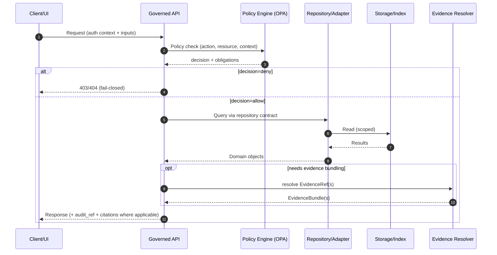

<!-- [KFM_META_BLOCK_V2]
doc_id: kfm://doc/<uuid>
title: TEMPLATE — Endpoint Review
type: standard
version: v1
status: draft
owners: <team-or-person>
created: 2026-03-04
updated: 2026-03-04
policy_label: public
related: [docs/templates/api/]
tags: [kfm, template, api, governance]
notes: [
  "Use this template to propose or modify an API endpoint behind the governed policy boundary.",
  "If a required field is unknown, mark it UNKNOWN and list the smallest verification steps.",
  "If the endpoint emits summaries/narratives/answers, cite-or-abstain rules apply."
]
[/KFM_META_BLOCK_V2] -->

# TEMPLATE — Endpoint Review

**Purpose:** A structured review checklist + evidence record for **one** API endpoint (new or changed).

> **How to use:** Copy this file into your PR description, ADR, or `docs/reviews/api/<...>.md`. Replace all `<...>` placeholders.

---

## Impact

- **Status:** experimental | active | stable | deprecated
- **Owners:** <owner(s)>
- **Reviewers:** <security>, <governance>, <domain steward>, <api>
- **PR / Branch:** <link>
- **Ticket:** <link>
- **Last reviewed:** YYYY-MM-DD
- **Target release:** <release or milestone>

### Quick links

- [Endpoint summary](#endpoint-summary)
- [Architecture fit](#architecture-fit)
- [Policy and governance](#policy-and-governance)
- [Contract](#contract)
- [Security and threat model](#security-and-threat-model)
- [Observability and audit](#observability-and-audit)
- [Tests and gates](#tests-and-gates)
- [Rollback plan](#rollback-plan)
- [Approvals](#approvals)

---

## Endpoint summary

| Field | Value |
|------|-------|
| **Method** | `<GET|POST|PUT|PATCH|DELETE>` |
| **Path** | `< /api/v1/... >` |
| **One-line purpose** | `<what this endpoint enables>` |
| **Primary consumers** | `<Map UI | Story UI | CLI | internal service | public clients>` |
| **Data domains touched** | `<land | water | climate | heritage | ...>` |
| **Data lifecycle zone(s)** | `<RAW | WORK | PROCESSED | PUBLISHED>` |
| **Sensitivity posture** | `<public | restricted | sensitive-location | other>` |
| **AuthN** | `<none | JWT | API key | session | mTLS>` |
| **AuthZ model** | `<RBAC | ABAC | mixed>` |
| **SLO tier** | `<critical | standard | best-effort>` |

### Change type

- [ ] New endpoint
- [ ] Backwards-compatible change
- [ ] Breaking change (requires version bump + migration plan)
- [ ] Bug fix only
- [ ] Performance-only change
- [ ] Policy behavior change (requires governance review)

---

## Architecture fit

### Trust boundary and layering

**Requirement:** Clients/UI MUST access governed data only through the governed API + policy boundary (PEP). No direct DB/storage access.

- **Client → API:** `<describe ingress (gateway, auth, CORS, etc.)>`
- **Policy Enforcement Point (PEP):** `<where policy is evaluated>`
- **Repository/adapter layer:** `<which module abstracts storage/indexes>`
- **Storage/index touched:** `<PostGIS | object store | graph | search index | vector index | ...>`



### Invariants checklist

- [ ] UI/client cannot bypass the PEP (no direct DB/storage URLs; network policies + tests enforce).
- [ ] Core logic does not bypass repository/adapter layer to access storage directly.
- [ ] Policy is **fail-closed** on missing metadata, missing catalogs, missing evidence, or policy engine errors.
- [ ] Endpoint does not rely on “best effort” access control (no client-side filtering as the primary control).

---

## Policy and governance

### Policy label & sensitivity classification

- **policy_label:** `<public | restricted | sensitive-location | ...>`
- **Sensitivity drivers:** `<private land ownership | archaeology | species | health | ...>`
- **Granularity controls:** `<round coords | suppress small counts | redact fields | generalized derivative only | ...>`

**Assertion label (choose one):** **CONFIRMED** / **PROPOSED** / **UNKNOWN**

**If UNKNOWN, smallest verification steps:**
1. `<smallest step>`
2. `<smallest step>`

### Policy decision points

List every policy decision this endpoint depends on.

| Decision point | Inputs to policy | Policy output used by code | Fail-closed behavior |
|---|---|---|---|
| `pre-check` | `<user role, endpoint, params>` | `<allow/deny + obligations>` | `<deny>` |
| `dataset/record/field access` | `<dataset_version_id, field list>` | `<redaction plan>` | `<deny or generalized>` |
| `evidence/citation` | `<EvidenceRef(s)>` | `<bundle + audit_ref>` | `<deny if unresolvable>` |

- **Policy bundle ref (hash/commit):** `<policy_bundle_hash or git sha>`
- **Obligations applied:** `<none | redact | generalize | attribute | watermark | log-only | ...>`

### Evidence discipline

If the endpoint returns anything that could be interpreted as a factual claim (data, narrative, summary, counts), it MUST be traceable to evidence.

- **Does the response include EvidenceRefs or EvidenceBundles?** `<yes/no>`
- **If yes:** describe the fields and resolver route used: `<...>`
- **If no:** justify why evidence linking is not required for this endpoint: `<...>`

#### Claims table (required for endpoints that summarize/transform data)

| Claim (what the endpoint asserts) | Label (CONFIRMED / PROPOSED / UNKNOWN) | EvidenceRef(s) | Notes / smallest verification steps |
|---|---|---|---|
| `<claim 1>` | `<label>` | `<kfm://evidence/...>` | `<...>` |
| `<claim 2>` | `<label>` | `<...>` | `<...>` |

---

## Contract

### Inputs

- **Path params:** `<...>`
- **Query params:** `<...>`
- **Request body schema:** `<name + link>`
- **Validation rules:** `<types, ranges, bbox/time rules, max sizes>`

| Input | Type | Required | Constraints | Notes |
|---|---|---:|---|---|
| `<bbox>` | `<...>` | ✅/❌ | `<WGS84, max area, etc.>` | `<...>` |
| `<time>` | `<...>` | ✅/❌ | `<ISO 8601, max span>` | `<...>` |

### Outputs

- **Response media type:** `application/json` (or `<...>`)
- **Response schema:** `<name + link>`
- **Pagination:** `<none | cursor | page/limit>`
- **Caching:** `<ETag | Cache-Control | vary-by-policy/auth>`

| Field | Type | Meaning | Evidence/policy notes |
|---|---|---|---|
| `audit_ref` | `string` | Run/audit receipt reference | MUST be present for governed actions |
| `policy` | `object` | Decision summary (safe) | Must not leak restricted rules |
| `citations` | `array` | EvidenceRefs or bundle IDs | Required when returning summaries/answers |

#### Example response (redacted / policy-safe)

```json
{
  "audit_ref": "kfm://audit/<id>",
  "policy": {
    "decision": "allow",
    "policy_label": "public",
    "obligations_applied": []
  },
  "data": [],
  "citations": []
}
```

### Error semantics (fail-closed)

List explicit status codes and conditions.

| Status | When | Response body contract | Notes |
|---:|---|---|---|
| 400 | invalid input | `{error_code, message, audit_ref?}` | input validation |
| 401 | unauthenticated | `<...>` | |
| 403 | unauthorized | `<...>` | do not confirm existence of restricted resources |
| 404 | not found | `<...>` | may be used instead of 403 to avoid leakage |
| 409 | conflict | `<...>` | idempotency collisions |
| 429 | rate limit | `<Retry-After>` | |
| 5xx | internal/policy engine error | `<...>` | MUST fail-closed if policy cannot be evaluated |

### Idempotency & determinism

- **Is the operation idempotent?** `<yes/no>`
- **Idempotency key:** `<header/query/body field>`
- **Deterministic output requirements:** `<hashes, stable ordering, canonical JSON, etc.>`
- **Replay behavior:** `<same request → same output; how verified>`

---

## Security and threat model

### Threats / abuse cases (checklist)

- [ ] Enumeration: endpoint cannot be used to list restricted dataset IDs, keys, or record identifiers.
- [ ] Inference: endpoint cannot leak sensitive locations via aggregation, rare counts, or precise geometries.
- [ ] Bypass: no alternate code path avoids the PEP (including “internal” flags, debug params, or cached blobs).
- [ ] Injection: inputs cannot trigger unsafe downstream behavior (SQL, Cypher, template injection, prompt injection).
- [ ] SSRF/egress: endpoint cannot be used to fetch arbitrary URLs or exfiltrate data.
- [ ] Over-permission: authorization is least-privilege; default-deny on unknown roles/resources.
- [ ] Logging leakage: logs do not contain restricted payloads/coordinates/PII beyond policy allowances.

### Prompt-injection / model-output safety (only if endpoint uses LLMs)

- **Tool allowlist enforced:** `<yes/no>`
- **Cite-or-abstain hard gate implemented:** `<yes/no>`
- **Evidence-only grounding:** model sees only policy-filtered evidence bundles (no raw restricted text).

**If UNKNOWN, smallest verification steps:**
1. `<run eval harness / add golden test>`
2. `<confirm evidence resolver redaction path>`

### Secrets and keys

- **Any upstream keys used?** `<yes/no>`
- **Where stored?** `<vault/secret manager; never committed>`
- **Rotation & least privilege:** `<describe>`

---

## Observability and audit

### Audit receipt

- **Does endpoint produce an audit receipt?** `<yes/no>`
- **audit_ref format:** `<kfm://audit/...>`
- **What is recorded (policy-safe):** `<inputs hash, evidence bundle digests, policy decision hash, version, latency, output hash>`

### Logs, metrics, traces

- **Structured logs:** `<fields: request_id, user_role, policy_decision, dataset_version_id, audit_ref>`
- **Metrics:** `<p50/p95 latency, error rate by status, policy deny counts, cache hit rate>`
- **Tracing:** `<trace_id propagation; spans for policy, repo, evidence resolver>`

### “What changed?” support (if endpoint returns versioned resources)

- [ ] Response includes `dataset_version_id` (or equivalent) when returning dataset-derived outputs.
- [ ] Response includes digests/checksums where feasible (or resolvable via EvidenceRef).

---

## Tests and gates

### Required tests (minimum)

- [ ] **Unit tests** for request validation + error semantics
- [ ] **Integration tests** against a fixed small slice of data (stable results)
- [ ] **Contract tests** that assert:
  - [ ] policy filtering works (deny/allow cases)
  - [ ] redaction/generalization obligations are applied
  - [ ] evidence/citations resolve when required
- [ ] **Policy regression tests** (OPA/Conftest fixtures) for deny-by-default
- [ ] **Link checks / catalog validation** if returning catalog identifiers/links
- [ ] **Load/perf test** if endpoint is on a critical path (tiles, map queries)

### Test evidence (attach artifacts)

- **Test run id / CI link:** <link>
- **Golden fixtures:** <path>
- **Coverage notes:** <...>

---

## Rollback plan

- **Rollback strategy:** `<feature flag | version pin | revert commit | route disable>`
- **Blast radius:** `<who/what breaks>`
- **Safe fallback behavior:** `<deny or degraded-but-policy-safe>`

---

## Approvals

### Sign-off checklist

- [ ] **API owner** approved
- [ ] **Security** reviewed threat model + auth
- [ ] **Governance / policy steward** reviewed policy label + obligations
- [ ] **Domain steward** reviewed sensitivity/CARE implications (if applicable)
- [ ] **SRE/ops** reviewed observability + SLO impacts (if applicable)

| Role | Name | Date | Notes |
|---|---|---|---|
| API owner | `<...>` | YYYY-MM-DD | `<...>` |
| Security | `<...>` | YYYY-MM-DD | `<...>` |
| Governance | `<...>` | YYYY-MM-DD | `<...>` |

---

## Appendix (optional)

### Evidence bundle shape (example)

> Replace with your actual schema link if the endpoint returns EvidenceBundles.

```json
{
  "bundle_id": "sha256:<bundle>",
  "dataset_version_id": "<version>",
  "title": "<title>",
  "policy": {
    "decision": "allow",
    "policy_label": "<label>",
    "obligations_applied": []
  },
  "license": { "spdx": "<SPDX>", "attribution": "<text>" },
  "provenance": { "run_id": "kfm://run/<id>" },
  "artifacts": [
    { "href": "<path-or-url>", "digest": "sha256:<...>", "media_type": "<...>" }
  ],
  "checks": { "catalog_valid": true, "links_ok": true },
  "audit_ref": "kfm://audit/<id>"
}
```

### Open questions

- `<question 1>`
- `<question 2>`
