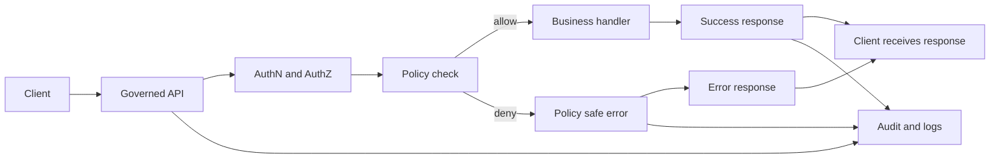

<!-- [KFM_META_BLOCK_V2]
doc_id: kfm://doc/15d636ee-3763-442e-a830-9bde68c8ac9a
title: TEMPLATE Policy Safe Error Guide
type: standard
version: v1
status: draft
owners: <TEAM_OR_OWNER>
created: 2026-03-04
updated: 2026-03-04
policy_label: public
related: [docs/standards/governance/ROOT-GOVERNANCE.md, contracts/openapi/, policy/]
tags: [kfm, template, api, policy, errors]
notes: [Template. Copy into a service-specific guide and replace placeholders.]
[/KFM_META_BLOCK_V2] -->

# Policy Safe Error Guide Template
Template for **policy-safe**, **fail-closed** error responses across the KFM governed API.

> **Status:** template • **Owners:** `<TEAM_OR_OWNER>` • **Applies to:** `<SERVICE_OR_API_NAME>` • **Last updated:** 2026-03-04  
> **Badges:** TODO (build, contract-tests, policy-gate, security)  
> **Quick links:** [Scope](#scope) · [Error model](#error-model) · [Status code mapping](#status-code-mapping) · [Examples](#examples) · [Checklist](#checklist)

---

## Scope
This guide defines the **public contract** for error handling and abstention-like responses for:

- `<API_BASE_PATH>` (example: `/api/v1/*`)
- `<SERVICE_OR_API_NAME>` (example: `kfm-api`, `evidence-resolver`, `focus-orchestrator`)

The goals are:

- Keep errors **machine-stable** for clients (stable `error_code` and consistent structure).
- Keep errors **policy-safe** (no sensitive data, no “ghost metadata”).
- Keep errors **operationally useful** via an `audit_ref` and request correlation.

## Where it fits
- **File:** `docs/templates/api/TEMPLATE__POLICY_SAFE_ERROR_GUIDE.md`
- **Derived guides live in:** `docs/api/<service>/POLICY_SAFE_ERROR_GUIDE.md` (recommended)

Upstream and downstream dependencies:

- **Upstream:** `policy/` (OPA/Rego bundle or equivalent), authN provider, request validation layer.
- **Downstream:** Map UI, Story UI, Focus Mode UI, API clients, CI contract tests, observability pipeline.

## Acceptable inputs
This template assumes:

- A **governed API** acting as the enforcement boundary (policy, redaction, evidence resolution).
- A **Policy Decision Point** (PDP) that returns at least `allow/deny` (optionally obligations).
- An **audit ledger** (or run-receipt system) capable of issuing `audit_ref` identifiers.

## Exclusions
This template MUST NOT be used to justify unsafe behavior such as:

- Returning stack traces, SQL errors, internal hostnames, object-store URLs, or secrets.
- Echoing sensitive user input (PII, tokens, precise coordinates, restricted IDs).
- Using status code differences to help clients enumerate restricted resources.

---

## Design overview
A governed request should follow this control flow. Errors are produced **after** policy enforcement and must remain policy-safe.



---

## Non-negotiables
These requirements are intended to be **test-enforced** (fail-closed).

1. **Stable error model**: every error response uses a stable shape with `error_code`, `message`, and `audit_ref`.
2. **Policy-safe messaging**: `message` never leaks restricted existence, sensitive fields, or internal implementation details.
3. **Audit-first**: every governed error response includes an `audit_ref` so stewards/operators can investigate.
4. **403/404 leakage control**: align `403` vs `404` behavior with policy to avoid revealing restricted existence.
5. **Logs are sensitive**: structured logs must be redacted; retention and access are governed.

---

## Error model
This section defines the error envelope that clients can rely on.

### Minimal contract
All error responses MUST be JSON with **at least** these fields:

- `error_code` (string): stable, machine-readable
- `message` (string): policy-safe human message
- `audit_ref` (string): investigation handle (run receipt id, audit ledger URI, etc.)

```json
{
  "error_code": "KFM_POLICY_DENY",
  "message": "Access is not available for this request.",
  "audit_ref": "kfm://audit/entry/<id>"
}
```

### Recommended envelope
If you need more structure, keep the minimal contract unchanged and add **only policy-safe** fields:

```json
{
  "error_code": "KFM_POLICY_DENY",
  "message": "Access is not available for this request.",
  "audit_ref": "kfm://audit/entry/<id>",
  "request_id": "<uuid-or-trace-id>",
  "http_status": 403,
  "category": "policy",
  "retryable": false,
  "remediation": {
    "user_action": "Try a public dataset or broaden your spatial/temporal scope.",
    "steward_action": "Review audit_ref to confirm role and policy label."
  }
}
```

**Rules for optional fields**

- ✅ OK: booleans, enums, short remediation hints, generic category labels.
- ✅ OK: field names for validation errors (but NOT raw values).
- ❌ Never include: stack traces, internal file paths, SQL fragments, object-store locations, dataset existence hints, sensitive coordinates, raw principal identifiers.

### HTTP headers
Every error response SHOULD include:

- `X-Request-Id: <id>` (or equivalent)
- `Cache-Control: no-store` for auth/policy-related errors
- `Retry-After` for `429`/`503` where applicable

---

## Status code mapping
Use this table to keep behavior consistent across services.

> IMPORTANT: The exact choice of `403` vs `404` for protected resources must be treated as a **policy decision**.

| Scenario | HTTP status | error_code | Policy-safe message | Notes |
|---|---:|---|---|---|
| Missing/invalid auth | 401 | `KFM_AUTH_REQUIRED` | "Authentication is required." | Do not reveal which auth method is valid. |
| Authenticated but not allowed | 403 or 404 | `KFM_POLICY_DENY` | "Access is not available for this request." | Use 404 when enumeration risk is high. |
| Resource not found (public) | 404 | `KFM_NOT_FOUND` | "Not found." | Keep generic. |
| Request validation error | 400 or 422 | `KFM_INVALID_REQUEST` | "Request is invalid." | Include safe field errors (names only). |
| Rate limited | 429 | `KFM_RATE_LIMITED` | "Too many requests." | Include `Retry-After`. |
| Upstream dependency failed | 502 | `KFM_UPSTREAM_ERROR` | "A dependency is unavailable." | Do not name internal services. |
| Timeout | 504 | `KFM_TIMEOUT` | "The request timed out." | Include `retryable: true` when safe. |
| Unexpected server error | 500 | `KFM_INTERNAL_ERROR` | "An unexpected error occurred." | No stack traces. |

---

## Policy denial patterns

### Avoid existence leakage
When a request targets a **potentially restricted** resource (dataset, layer, story node, evidence ref):

- Prefer behavior that does **not** allow clients to distinguish:
  - “does not exist” vs “exists but restricted”
- Use generic messages and stable codes.

Recommended decision matrix (fill with your governance decision):

- **High enumeration risk** (IDs are guessable; endpoints public): return `404` with `KFM_NOT_FOUND` OR return `403` with generic message, but be consistent.
- **Low enumeration risk** (IDs unguessable; user already in an authenticated workflow): return `403` with `KFM_POLICY_DENY`.

> TODO: document how your service classifies “enumeration risk” and enforce via tests.

### Policy reason codes
Policy engines often produce detailed reasons. **Do not** return raw policy text.

Instead:

- Map policy engine outputs to a small, normalized set of **safe reason codes** (optional).
- Keep the mapping stable and versioned.

Example safe reason codes (optional):

- `insufficient_role`
- `restricted_resource`
- `requires_generalization`
- `rights_unclear`
- `citation_required`

---

## Abstention responses
Some KFM surfaces (especially Focus Mode) treat “abstain” as a **normal outcome**, not an error.

### When to abstain
Abstain when:

- The system cannot produce verified citations (cite-or-abstain hard gate).
- The only admissible evidence is restricted for the requester’s role.
- The user request would require disallowed specificity (e.g., sensitive locations).

### Suggested abstain response shape
Use `200 OK` (or a domain-specific status) with a **non-error** body:

```json
{
  "status": "abstained",
  "message": "I can't answer with the available evidence for your role.",
  "audit_ref": "kfm://audit/entry/<id>",
  "safe_alternatives": [
    "Try a broader region or time window.",
    "Switch to public datasets in the catalog."
  ]
}
```

Rules:

- Explain “why” only in policy-safe terms.
- Provide safe alternatives.
- Provide `audit_ref` for steward review.

---

## Logging and audit requirements
### What to emit
Every governed operation (success, deny, abstain, error) should emit a structured record including:

- who (principal and role)
- what (endpoint and parameters)
- when (timestamp)
- why (declared purpose, if collected)
- policy decision (allow/deny) + obligations + reason codes
- inputs/outputs by digest when applicable

### Safety notes
- Audit logs may contain sensitive information and must be governed.
- Apply log redaction, retention controls, and access controls.

---

## Testing requirements
Contract tests MUST verify:

- Error responses always include required fields: `error_code`, `message`, `audit_ref`.
- Error messages contain **no** disallowed substrings (stack traces, “SELECT”, “Traceback”, internal hostnames).
- `403/404` behavior is consistent with the chosen policy posture.
- For Focus Mode: missing citations leads to **abstain**, not a hallucinated answer.

Recommended fixtures:

- allow/deny cases for each role
- restricted resource IDs that should not leak existence
- validation failures with safe field error reporting

---

## Checklist
Use this before merging changes to error handling.

- [ ] Error responses conform to the minimal contract (`error_code`, `message`, `audit_ref`).
- [ ] No sensitive content is returned (validated by automated leak tests).
- [ ] 403/404 policy is documented and tested for enumeration-resistance.
- [ ] All governed operations emit audit/log records; logs are redacted.
- [ ] OpenAPI includes an `ErrorResponse` schema and endpoints reference it.
- [ ] Client UX can display policy-safe “why” and link `audit_ref` for steward review.

---

## Examples
### Policy deny

```json
{
  "error_code": "KFM_POLICY_DENY",
  "message": "Access is not available for this request.",
  "audit_ref": "kfm://audit/entry/2026-03-04T12:34:56Z.<id>"
}
```

### Not found

```json
{
  "error_code": "KFM_NOT_FOUND",
  "message": "Not found.",
  "audit_ref": "kfm://audit/entry/2026-03-04T12:34:56Z.<id>"
}
```

### Validation error with safe field list

```json
{
  "error_code": "KFM_INVALID_REQUEST",
  "message": "Request is invalid.",
  "audit_ref": "kfm://audit/entry/2026-03-04T12:34:56Z.<id>",
  "field_errors": [
    {"field": "bbox", "issue": "required"},
    {"field": "time_range", "issue": "invalid_format"}
  ]
}
```

---

## Appendix
<details>
<summary>OpenAPI contract fragment</summary>

```yaml
components:
  schemas:
    ErrorResponse:
      type: object
      required: [error_code, message, audit_ref]
      properties:
        error_code: { type: string }
        message: { type: string }
        audit_ref: { type: string }
```

</details>

<details>
<summary>Pseudocode for exception mapping</summary>

```text
# Pseudocode
try:
  authenticate()
  decision = policy_check(request)
  if decision == deny:
    return error(403_or_404, KFM_POLICY_DENY, safe_message, audit_ref())
  result = handler()
  return success(result, audit_ref_if_governed())
except ValidationError as e:
  return error(422, KFM_INVALID_REQUEST, "Request is invalid.", audit_ref(), safe_fields(e))
except RateLimit as e:
  return error(429, KFM_RATE_LIMITED, "Too many requests.", audit_ref(), retry_after=e.retry_after)
except Exception:
  return error(500, KFM_INTERNAL_ERROR, "An unexpected error occurred.", audit_ref())
```

</details>

---

## Back to top
[Back to top](#policy-safe-error-guide-template)
