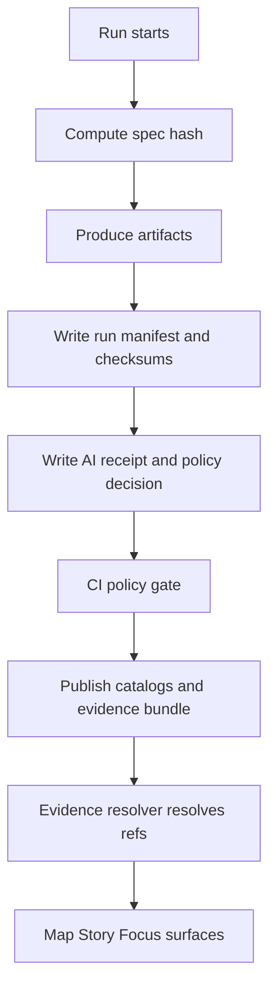

<!-- [KFM_META_BLOCK_V2]
doc_id: kfm://doc/55469088-c676-4879-be69-68ceae387392
title: Evidence templates
type: standard
version: v1
status: draft
owners: KFM Engineering
created: 2026-03-05
updated: 2026-03-05
policy_label: restricted
related: [docs/templates, docs/architecture, docs/governance]
tags: [kfm]
notes: [Directory README for evidence/receipt templates used across KFM pipelines and governed UX.]
[/KFM_META_BLOCK_V2] -->

# Evidence templates
Templates that make evidence **consistent, verifiable, and policy-safe** across KFM.

- **Path:** `docs/templates/evidence/`
- **Purpose (one line):** copy/paste starting points for receipts/manifests that power KFM’s **evidence resolver** and **fail-closed** gates.

> **IMPACT**
> - **Status:** experimental (template set evolving)
> - **Owners:** KFM Engineering (TODO: set CODEOWNERS)
> - **Used by:** pipelines, dataset promotion gates, Evidence Resolver, Story publishing, Focus Mode
> - **Policy posture:** default-deny; fail-closed when required evidence is missing
>
> **Badges (placeholders)**
> - 
> - 
> - 
>
> **Jump**
> - [Scope](#scope)
> - [Where it fits](#where-it-fits)
> - [Inputs](#inputs)
> - [Exclusions](#exclusions)
> - [Directory tree](#directory-tree)
> - [Quickstart](#quickstart)
> - [Usage](#usage)
> - [Diagram](#diagram)
> - [Evidence artifact matrix](#evidence-artifact-matrix)
> - [Definition of done](#definition-of-done)
> - [Appendix](#appendix)

---

## Scope

**CONFIRMED:** In KFM, a “citation” is not a pasted URL. It is an **EvidenceRef** that resolves—via the **Evidence Resolver**—into an **EvidenceBundle** (policy decision + metadata + digests + audit references).  
**PROPOSED:** This directory standardizes the *minimum* templates needed so every run can emit the same shape of evidence artifacts.

This directory exists to help you:

- produce **receipts** and **manifests** that are deterministic and checksum-verifiable
- avoid “almost the same, but different” JSON across teams/tools
- make CI policy gates straightforward (OPA/Conftest)
- keep public outputs **policy-safe** (redaction + generalized geometry where required)

[Back to top](#evidence-templates)

---

## Where it fits

**CONFIRMED:** KFM uses a trust membrane: clients must not access storage/DB directly; access goes through a governed API and policy boundary, and governed operations produce audit references.  
**CONFIRMED:** Dataset promotion is gated (Raw → Work → Processed) and requires checksums plus catalog triplets (DCAT/STAC/PROV).

### Upstream

- ingestion pipelines and batch jobs (create run evidence)
- Focus/Story runs (create AI receipts + audit receipts)

### Downstream

- Evidence Resolver (turns EvidenceRefs into EvidenceBundles)
- governed APIs and UI surfaces (Map/Story/Focus) that must display policy-safe trust info

[Back to top](#evidence-templates)

---

## Inputs

What belongs in `docs/templates/evidence/`:

- **Templates** (`TEMPLATE__*.json`, `TEMPLATE__*.md`, `TEMPLATE__*.yaml`) for:
  - run manifests and receipts
  - checksums/digests
  - redaction and sensitivity reports
  - evidence bundle responses (API DTO templates)
  - audit events (fail-closed records)
- **Schema references** (links to `contracts/` paths) and field dictionaries
- **Tiny examples** that are safe to publish (no real secrets, no restricted coordinates)

[Back to top](#evidence-templates)

---

## Exclusions

What must **not** live here:

- actual run outputs, raw data, or processed datasets (belongs under `data/` zones)
- secrets, API keys, credentials, tokens (use vault/secret manager)
- precise restricted locations (use generalized geometry or references only)
- policy decisions for real merges/runs (those belong in `audit/` or immutable evidence storage)

[Back to top](#evidence-templates)

---

## Directory tree

**UNKNOWN:** The exact file list in this directory depends on what has already landed in your repo.  
**PROPOSED:** This is the *recommended* template set to keep CI + governance consistent.

```text
docs/templates/evidence/
├── README.md
├── TEMPLATE__SPEC_HASH.txt
├── TEMPLATE__RUN_RECORD.json
├── TEMPLATE__RUN_MANIFEST.json
├── TEMPLATE__AI_RECEIPT.json
├── TEMPLATE__CHECKSUMS.txt
├── TEMPLATE__POLICY_DECISION.json
├── TEMPLATE__REDACTION_REPORT.json
├── TEMPLATE__EVIDENCE_BUNDLE.json
└── TEMPLATE__AUDIT_EVENT.json
```

[Back to top](#evidence-templates)

---

## Quickstart

### 1) Copy templates into a run folder

> Replace paths below with your actual run layout (for example `data/work/<dataset_id>/<run_id>/...`).

```bash
# from repo root
mkdir -p evidence

cp docs/templates/evidence/TEMPLATE__SPEC_HASH.txt        evidence/spec_hash.txt
cp docs/templates/evidence/TEMPLATE__RUN_MANIFEST.json    evidence/run_manifest.json
cp docs/templates/evidence/TEMPLATE__AI_RECEIPT.json      evidence/ai_receipt.json
cp docs/templates/evidence/TEMPLATE__CHECKSUMS.txt        evidence/checksums.txt
```

### 2) Fill placeholders and compute digests

**CONFIRMED:** `spec_hash` should be computed from canonical JSON (RFC 8785 JCS) + SHA-256 (stable across platforms).  
**PROPOSED:** Add a repo tool like `tools/spec_hash.py` and a `make evidence` target.

```bash
# PROPOSED (adapt to your repo)
python tools/spec_hash.py pipelines/spec.json > evidence/spec_hash.txt
python tools/write_run_manifest.py --out evidence/run_manifest.json
python tools/write_ai_receipt.py   --out evidence/ai_receipt.json

# checksums for every produced artifact
python tools/write_checksums.py --manifest evidence/run_manifest.json --out evidence/checksums.txt
```

### 3) Validate and gate in CI

**CONFIRMED:** A minimal evidence gate can require `spec_hash`, `run_manifest.json`, and `ai_receipt.json` and default-deny when missing.

```bash
# PROPOSED: conftest with a policy pack under policy/rego
conftest test evidence --policy policy/rego
```

[Back to top](#evidence-templates)

---

## Usage

### EvidenceRef vs URL

**CONFIRMED:** In KFM, citations should be **EvidenceRefs**, not raw URLs. EvidenceRefs resolve into EvidenceBundles through the Evidence Resolver.  
**PROPOSED:** Treat EvidenceRef as the only citation format allowed in Story Nodes and Focus responses.

### Geometry policy

**CONFIRMED:** Evidence projections should avoid raw geometry fields by default. If geometry is required, it must be generalized and policy-approved.

### Fail-closed behavior

**CONFIRMED:** Missing or unverifiable evidence is not a warning — it is a hard failure for:
- dataset promotion
- Story publishing
- Focus Mode responses that cannot support claims

[Back to top](#evidence-templates)

---

## Diagram



[Back to top](#evidence-templates)

---

## Evidence artifact matrix

The point of templates is that every team/tool writes the **same minimum shape**, so policy + UX can depend on it.

| Artifact | Why it exists | Minimum fields | Typical format | Zone |
|---|---|---|---|---|
| `spec_hash.txt` | Stable identity for “what we meant to run” | `jcs:sha256:<hex>` | text | work |
| `run_record.json` | Who/what/when run context | actor, tool versions, code ref, start/end, status | JSON | work |
| `run_manifest.json` | What files were produced | outputs[{path, digest, media_type, bytes}] | JSON | work |
| `checksums.txt` | Verifiable integrity | sha256 for every output file | text | work and processed |
| `ai_receipt.json` | What the model/tool produced and why | inputs, outputs, model/tool id, digests, policy refs | JSON | work |
| `policy_decision.json` | Policy decision + obligations | decision, label, reason codes, obligations | JSON | work and published |
| `redaction_report.json` | What was redacted/generalized | rule ids, fields affected, before/after summary | JSON | work and processed |
| `evidence_bundle.json` | Policy-safe bundle returned to UI | policy, license, provenance, artifacts, audit_ref | JSON | published API surface |
| `audit_event.json` | Explains fail-closed outcomes | error_code, message, inputs by digest, time | JSON | audit |

[Back to top](#evidence-templates)

---

## Definition of done

Use this checklist when adding a new template or changing an existing one.

- [ ] **Schema:** there is a versioned schema under `contracts/` (Draft 2020-12 JSON Schema or equivalent)
- [ ] **Determinism:** canonicalization + hashing rules are documented (and tested)
- [ ] **Validation:** there is a validator command (local) and a CI check (required)
- [ ] **Policy gate:** default-deny rule exists (OPA/Conftest) with fixture tests
- [ ] **Sensitivity:** template includes a `policy_label` / classification field (or a reference to one)
- [ ] **No secrets:** no credentials or sensitive payloads in examples
- [ ] **Docs updated:** any consuming docs (pipeline, story, focus, promotion) are updated or explicitly noted

[Back to top](#evidence-templates)

---

## FAQ

### Do these templates replace catalogs like DCAT/STAC/PROV?

**No.** Templates here cover *run evidence and receipts*. Catalog artifacts (DCAT/STAC/PROV) remain required for discovery, map/timeline rendering, and provenance.

### Where should real evidence bundles live?

Not here. Real evidence should be stored in immutable, digest-addressed storage (for example an OCI evidence bundle or an append-only audit store), and referenced from releases.

### Can I add custom fields?

Yes — but add them in a backwards-compatible way:

- add optional fields
- bump schema versions
- add fixture tests
- update the Evidence Resolver contract if the UI depends on them

[Back to top](#evidence-templates)

---

## Appendix

<details>
<summary>Template design rules and examples</summary>

### Claim labeling in this doc

To keep docs auditable, we label meaningful statements:

- **CONFIRMED:** supported by governing KFM blueprint documents
- **PROPOSED:** recommended design choice (safe default) but not yet enforced everywhere
- **UNKNOWN:** depends on current repo state; verify with `git grep` and CI config

### Recommended identifiers

- `dataset_id`: stable string (snake_case)
- `dataset_version_id`: content-derived version (for example hash-based)
- `run_id`: `kfm://run/<ISO8601>.<short-hash>` (or your stable scheme)
- `audit_ref`: `kfm://audit/<id>` (opaque to clients)

### Policy labels

Recommended minimum classes:

- `public`
- `restricted`
- `sensitive-location`
- `sensitive-personal`

### Minimal EvidenceBundle shape

This is a **template**, not an authoritative schema.

```json
{
  "bundle_id": "sha256:...",
  "dataset_version_id": "YYYY-MM.<hash>",
  "title": "Human-readable title",
  "policy": {
    "decision": "allow",
    "policy_label": "public",
    "obligations_applied": []
  },
  "license": { "spdx": "CC-BY-4.0", "attribution": "..." },
  "provenance": { "run_id": "kfm://run/..." },
  "artifacts": [
    { "href": "processed/example.parquet", "digest": "sha256:...", "media_type": "application/x-parquet" }
  ],
  "checks": { "catalog_valid": true, "links_ok": true },
  "audit_ref": "kfm://audit/..."
}
```

### “Refs-only” bundles

When projecting evidence into UIs, prefer references and digests over raw payloads.

If geometry must be included, ensure it is generalized and policy-approved.

</details>
