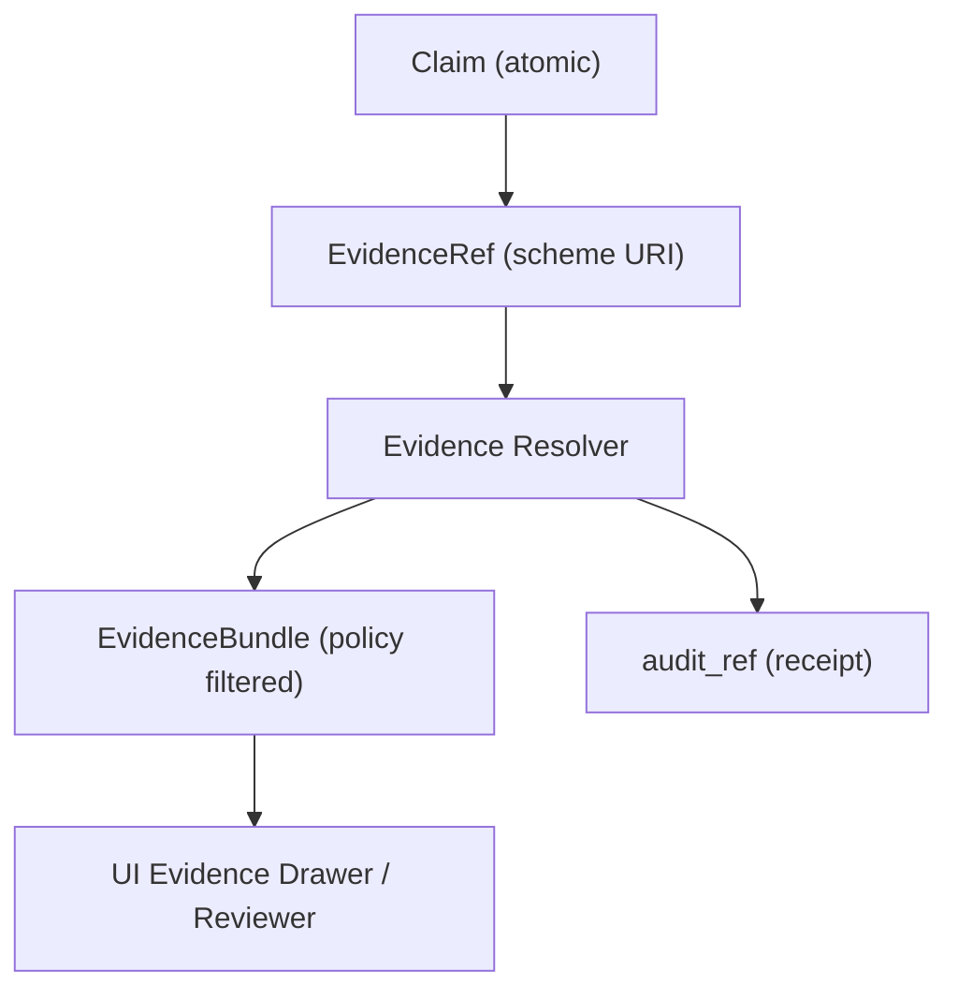

<!-- [KFM_META_BLOCK_V2]
doc_id: kfm://doc/580fd919-1995-4403-a59c-4be6ef87200e
title: TEMPLATE — Citation Block
type: standard
version: v1
status: draft
owners: KFM Core
created: 2026-03-05
updated: 2026-03-05
policy_label: public
related: []
tags: [kfm, template, evidence, citation]
notes: [Copy/paste template for attaching resolvable EvidenceRefs to a single claim.]
[/KFM_META_BLOCK_V2] -->

# TEMPLATE — Citation Block

Copy/paste block for citing **one atomic claim** with **resolvable EvidenceRefs** (not bare URLs).

> **Status:** draft  
> **Owners:** KFM Core  
> **Badges:**    
> **Quick links:** [Template](#template) · [EvidenceRef schemes](#evidenceref-schemes-quick-reference) · [Checklist](#pre-merge-checklist)

---

## Scope

Use this template anywhere a human or system needs to **justify a factual statement** with governed evidence:
- Story Nodes (narrative claims)
- Focus Mode answers (AI claims)
- Design docs / ADRs (when claiming “X exists/works/was decided”)

Key requirements for KFM citations:
- Citations must resolve to a **stable, inspectable view** inside KFM.
- A citation is not just a URL; it should point to an **immutable dataset version** and a specific **evidence span** (row, asset, page+span, etc.).
- Use canonical IDs so citations **survive rehosting** and infrastructure changes.

**KFM rule of thumb:** one claim → one block → 1–3 EvidenceRefs.

---

## Where it fits

This file lives at:

- `docs/templates/evidence/TEMPLATE__CITATION_BLOCK.md`

It is intended to be **copied into**:
- story markdown,
- dataset notes,
- runbooks,
- review checklists.

---

## Acceptable inputs

- **Claim status**: `CONFIRMED` | `PROPOSED` | `UNKNOWN`
- **EvidenceRefs** using supported schemes (see below)
- **Policy label** for the intended audience (ex: `public`)
- **As-of date** when a claim depends on freshness (“as of 2026‑03‑05…”)
- For `UNKNOWN`: smallest verification steps to move to `CONFIRMED`

---

## Exclusions

Do **not** use this block to:
- cite with raw URLs as the only “evidence” (URLs may be included as *context*, but the citation must be an EvidenceRef),
- include restricted coordinates/PII in a public doc,
- assert “floating” claims in Story Nodes without evidence (if you can’t cite it, mark it `UNKNOWN` and keep it out of published narrative).

---

## Diagram

---

## Template

> Copy everything between the `BEGIN/END` markers.  
> Keep the markers intact — linters and review tooling may rely on them.

<!-- BEGIN KFM_CITATION_BLOCK v1 -->
### Citation

- **Claim ID:** `<claim_id>` (stable within the doc; ex: `C-01`)
- **Status:** `CONFIRMED` | `PROPOSED` | `UNKNOWN`
- **Audience policy label:** `<public|restricted|...>`
- **As-of (optional):** `YYYY-MM-DD` (required if claim depends on freshness)
- **Confidence (optional):** `<high|medium|low>` (human judgement)

**Claim (one sentence, atomic):**
> `<claim_text>`

#### EvidenceRefs (must resolve)
1. `<evidence_ref_1>`
   - Supports the claim because: `<one short reason>`
2. `<evidence_ref_2>` (optional)
   - Supports the claim because: `<one short reason>`
3. `<evidence_ref_3>` (optional)
   - Supports the claim because: `<one short reason>`

#### Resolver output (auto-filled by CI/tooling; leave blank in hand-authored docs)
- **bundle_id:** `<bundle_id>`
- **bundle_digest:** `<sha256:...>`
- **dataset_version_id(s):** `<dataset_version_id[, ...]>`
- **artifact_digest(s):** `<sha256:...[, ...]>`
- **rights/license:** `<SPDX or CC identifier + rights holder>`
- **provenance:** `<prov://... or run_receipt ref>`
- **audit_ref:** `<kfm://audit/...>` (if produced by a governed operation)

#### If Status = UNKNOWN: smallest steps to verify
- [ ] `<verification step 1>`
- [ ] `<verification step 2>`
- [ ] `<verification step 3>` (optional)

<!-- END KFM_CITATION_BLOCK v1 -->

---

## EvidenceRef schemes quick reference

Minimum scheme set (supported by the evidence resolver contract):

- `dcat://...` — dataset/distribution metadata  
- `stac://...#asset=<asset_key>` — collection/item/asset metadata  
- `prov://...` — run lineage (activities/entities/agents)  
- `doc://...#page=<n>&span=<start>:<end>` — document page + evidence span  
- `graph://...` — entity/relationship evidence (if graph projection is enabled)

### Document evidence spans (doc://)

Recommended pattern:

- Prefer **character offsets** for `span=<start>:<end>` (stable for a given OCR text artifact).
- Optionally add a bounding box selector if your tooling supports it.

Example (placeholder):

- `doc://sha256:<ocr_text_digest>#page=12&span=1832:1935`

> NOTE: Some older drafts may show `&span;=` in extracted text. Treat it as the `span` selector.

---

## Pre-merge checklist

- [ ] Every `CONFIRMED` claim has ≥1 EvidenceRef.
- [ ] Every EvidenceRef is **parseable without network calls** (no guessing).
- [ ] EvidenceRefs **resolve** in the test environment.
- [ ] Citations are **allowed** for the doc/story’s intended policy label.
- [ ] If media is included, rights metadata exists (license + rights holder + attribution).
- [ ] No restricted details leak into `public` docs.

---

Appendix: authoring tips (optional)

- Keep claims atomic. If a paragraph contains 3 factual statements, use 3 blocks.
- Prefer citing the smallest evidence span that supports the claim (page+span; row id; asset key).
- If a claim mixes “what happened” with “why it happened,” cite them separately:
  - “what” → evidence (document span / dataset record)
  - “why” → evidence (secondary source) or mark `PROPOSED` / `UNKNOWN`

