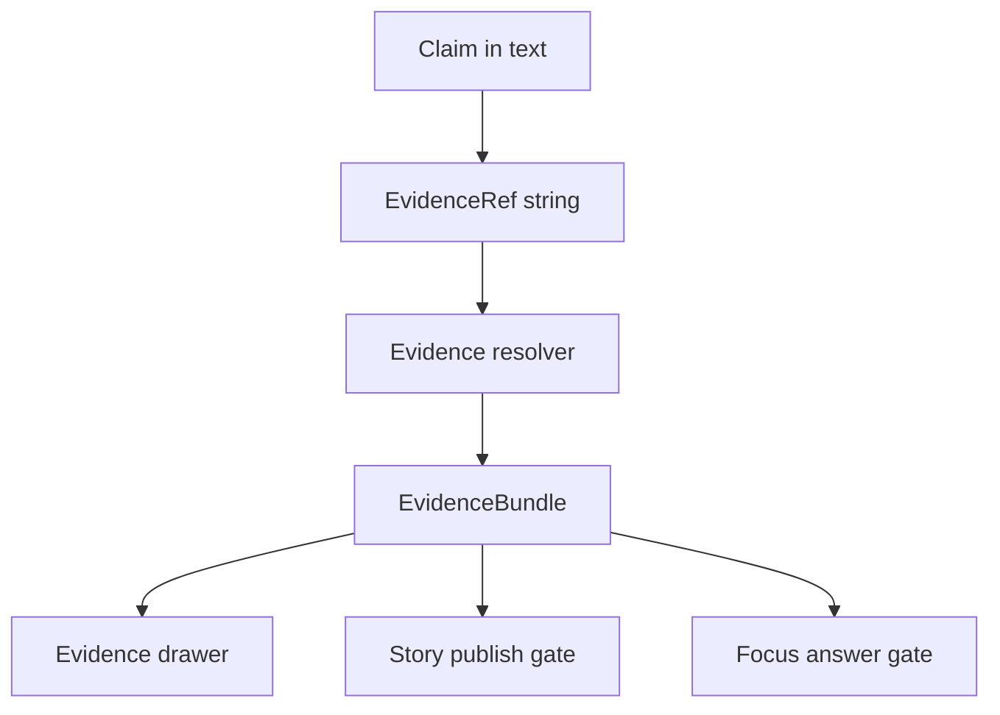

<!-- [KFM_META_BLOCK_V2]
doc_id: kfm://doc/e39728f0-290f-44ff-8f68-fb28f1b6e921
title: TEMPLATE — EvidenceRef
type: standard
version: v1
status: draft
owners: <OWNER_TEAM_OR_NAME>
created: 2026-03-05
updated: 2026-03-05
policy_label: public
related: [
  "docs/templates/evidence/TEMPLATE__EVIDENCE_REF.md"
]
tags: [kfm, template, evidence, citation, provenance]
notes: [
  "Template for authoring EvidenceRef references and the minimum context needed to make them resolvable, reviewable, and policy-safe."
]
[/KFM_META_BLOCK_V2] -->

# TEMPLATE — EvidenceRef
One EvidenceRef record + the minimum supporting context required to validate, resolve, and review it.

> **IMPACT (required)**
>
> - Status: **experimental**
> - Owners: `<OWNER_TEAM_OR_NAME>`
> - Badges: TODO · CI · Linkcheck · PolicyPack
> - Quick links: [Scope](#scope) · [Template](#template) · [EvidenceRef schemes](#evidenceref-schemes) · [Verification gates](#verification-gates) · [Appendix](#appendix)

---

## Scope

### Purpose
- [CONFIRMED] Represent citations as **EvidenceRefs** (not free-form URLs) so they can be resolved into an inspectable, reproducible **EvidenceBundle** via the evidence resolver.
- [CONFIRMED] Capture enough detail so reviewers can verify:
  - **what** the reference points to,
  - **why** it supports a claim,
  - **whether** it is **policy-allowed**, and
  - **how** to reproduce the same view later (even after rehosting).

### Where it fits in the repo
- Intended home: `docs/templates/evidence/`
- Typical consumers:
  - Story Nodes (publish gate requires resolvable citations)
  - Focus Mode outputs (hard citation verification)
  - Dataset documentation (human-auditable evidence pointers)

### Acceptable inputs
- An EvidenceRef string using an allowed scheme (see [EvidenceRef schemes](#evidenceref-schemes))
- A set of **claims** (each labeled `CONFIRMED` / `PROPOSED` / `UNKNOWN`)
- Enough identifiers to support resolution without guesswork:
  - dataset version IDs, artifact digests, doc page+span, run IDs, etc.

### Exclusions
- [CONFIRMED] **No secrets** (tokens, passwords, private keys).
- [CONFIRMED] **No raw restricted artifacts** embedded inline (paste links/refs only; let policy decide access).
- [CONFIRMED] **No “citation by URL only”** without a canonical identifier and evidence span.
- [PROPOSED] Avoid including precise sensitive coordinates unless the policy label explicitly allows it and obligations are documented.

---

## How EvidenceRefs become inspectable



---

## Template

> Copy this template into a new file (or section) and fill in every `<...>` placeholder.
> Delete helper text blocks once complete.

### 1) Header fields (machine-friendly)

```yaml
# Optional YAML front matter (keep if your repo tooling uses it)
evidence_ref_record_id: "<kfm://evidence_ref/<uuid> OR leave blank>"
evidence_ref: "<scheme://...>"
scheme: "<dcat|stac|prov|doc|graph>"
intended_use: "<story_node|focus_mode|dataset_doc|analysis>"
policy_label_context: "<public|restricted|...>"
created: "<YYYY-MM-DD>"
updated: "<YYYY-MM-DD>"
owners: ["<team-or-name>"]
review_state: "<draft|review|published>"
```

### 2) Claim(s)

> [REQUIRED] Every claim must be labeled: `CONFIRMED`, `PROPOSED`, or `UNKNOWN`.
> If `UNKNOWN`, list the smallest verification steps to make it `CONFIRMED`.

| claim_id | claim_text | status | smallest_verification_steps_if_unknown | notes |
|---|---|---|---|---|
| C1 | `<claim statement>` | `<CONFIRMED|PROPOSED|UNKNOWN>` | `<steps>` | `<optional>` |
| C2 | `<claim statement>` | `<CONFIRMED|PROPOSED|UNKNOWN>` | `<steps>` | `<optional>` |

### 3) EvidenceRef (the citation pointer)

> [REQUIRED] EvidenceRefs must be parseable without network calls (syntax-checkable offline).

- **evidence_ref**: `<scheme://...>`
- **what it should resolve to**: `<DCAT dataset|DCAT distribution|STAC item|STAC asset|PROV bundle|Document span|Graph entity>`
- **expected resolver outcome**:
  - decision: `<allow|deny|allow_with_obligations|unknown>`
  - obligations expected: `<list or []>`
  - policy-safe error expectation (if deny/unresolvable): `<what the UI should show>`

### 4) Resolution anchors (minimum identifiers)

Fill only the subsection that matches your `scheme`.

#### A) DCAT (`dcat://...`) anchors
- dataset_id: `<kfm dataset id>`
- dataset_version_id: `<immutable dataset version id>`
- distribution_id (optional): `<distribution key or id>`
- artifact_digest (optional): `sha256:<...>` (if referencing a specific distribution artifact)

> [PROPOSED] Canonical form example: `dcat://<dataset_id>@<dataset_version_id>#distribution=<distribution_id>`

#### B) STAC (`stac://...`) anchors
- collection_id: `<stac collection id>`
- item_id (optional): `<stac item id>`
- asset_key (optional): `<asset key>`

> [PROPOSED] Canonical form example: `stac://<collection_id>/<item_id>#asset=<asset_key>`

#### C) PROV (`prov://...`) anchors
- run_id: `<kfm run id>`
- related_dataset_version_id (optional): `<dataset_version_id>`
- artifact_digest (optional): `sha256:<...>`

> [PROPOSED] Canonical form example: `prov://<run_id>`

#### D) Document span (`doc://...`) anchors
- doc_artifact_digest: `sha256:<...>`
- page: `<int>`
- span: `<start_char_offset>:<end_char_offset>`
- bbox (optional): `<x1,y1,x2,y2>` (only if your doc pipeline provides stable page-coordinate mapping)

> [CONFIRMED] Canonical form example: `doc://sha256:<digest>#page=<n>&span=<start>:<end>`

#### E) Graph (`graph://...`) anchors
- entity_id: `<stable graph/entity id>`
- edge_id (optional): `<stable relationship id>`
- query_hint (optional): `<human hint for reviewers>`

> [PROPOSED] Canonical form example: `graph://<entity_id>#edge=<edge_id>`

### 5) Rights and attribution (must be explicit)

- license_spdx: `<SPDX id or URL>`
- attribution_text: `<required attribution string>`
- rights_notes: `<any constraints, media restrictions, “metadata-only” posture, etc.>`
- allowed_to_mirror: `<yes|no|unknown>`
  - if `unknown`, list verification steps: `<steps>`

### 6) Policy + sensitivity context

- classification: `<open|restricted|...>`
- sensitivity_notes: `<what makes this sensitive, if applicable>`
- redaction_or_generalization_applied:
  - `<none|describe exact obligations already applied>`
- reviewer_guidance:
  - `<what reviewers should check first>`

### 7) Verification gates

> [REQUIRED] EvidenceRefs must not ship “unverified.” If you cannot pass a gate, mark it and explain.

| gate | required | result | evidence / link / notes |
|---|---:|---|---|
| Syntax check (offline parse) | yes | `<pass|fail|unknown>` | `<notes>` |
| Resolver check (test env) | yes | `<pass|fail|unknown>` | `<notes>` |
| Policy check (intended audience/role) | yes | `<pass|fail|unknown>` | `<notes>` |
| Rights check (media attribution present) | yes | `<pass|fail|unknown>` | `<notes>` |
| Bundle digest recorded | yes | `<pass|fail|unknown>` | `<bundle_id sha256>` |
| Audit reference recorded | yes | `<pass|fail|unknown>` | `<audit ref>` |

---

## EvidenceRef schemes

> [CONFIRMED] Minimal schemes (minimum set): `dcat://`, `stac://`, `prov://`, `doc://`, `graph://`.

| scheme | resolves to | use when | must include (minimum) |
|---|---|---|---|
| `dcat://` | dataset or distribution metadata | citing “what is this dataset / license / publisher / distributions” | dataset id + dataset_version_id |
| `stac://` | collection, item, or asset metadata | citing “which asset exists / extents / where files are” | collection id; optionally item id and asset key |
| `prov://` | lineage for a run (activities, entities, agents) | citing “how this was produced” | run_id |
| `doc://` | governed document + page/span | citing a statement in a document | doc digest + page + span |
| `graph://` | entity relations | citing graph assertions (if enabled) | stable entity id |

> [CONFIRMED] Rules:
> - EvidenceRefs must be parseable without network calls.
> - Resolver must validate syntax and return policy-safe errors.

---

## Verification gates

### Definition of Done checklist
- [ ] Every claim is labeled `CONFIRMED`, `PROPOSED`, or `UNKNOWN`
- [ ] EvidenceRef syntax is valid and parseable offline
- [ ] Resolver returns a bundle **or** returns a policy-safe error (no ambiguity)
- [ ] Bundle includes: dataset_version_id, digests, provenance links, rights metadata, audit ref (as applicable)
- [ ] Rights/attribution are explicit (no “TBD” for published artifacts)
- [ ] Any sensitive content is handled by policy label + obligations (redaction/generalization), not by informal convention
- [ ] No restricted artifacts are embedded inline in this doc

---

## Appendix

<details>
<summary>Example: Document span EvidenceRef (copy/paste)</summary>

```text
evidence_ref: doc://sha256:abcd1234...#page=12&span=1832:1935
```

Reviewer notes:
- Confirm the doc digest matches the referenced artifact.
- Confirm page/spans align with the derived OCR text artifact used for highlighting.
- Confirm rights metadata and policy label allow the intended use.

</details>

<details>
<summary>Example: What to do when a claim is UNKNOWN</summary>

Pattern:
- Keep the claim in the doc.
- Label as `UNKNOWN`.
- Add the smallest verification steps (links to tasks, commands, or steward checks).
- Do not promote/publish content that depends on UNKNOWN claims.

</details>

---

[Back to top](#template--evidenceref)
