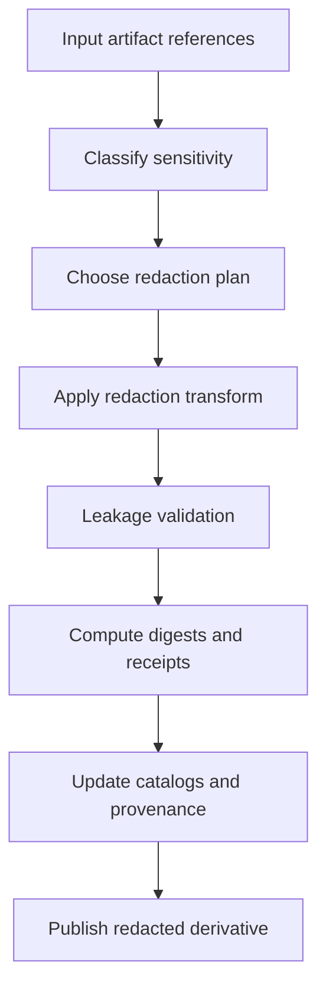

<!-- [KFM_META_BLOCK_V2]
doc_id: kfm://doc/9c8b1d3a-3d9e-4b5b-9f8f-6d65d8f8a3e1
title: TEMPLATE — Redaction Log
type: standard
version: v1
status: draft
owners: KFM Governance Working Group (TODO)
created: 2026-03-05
updated: 2026-03-05
policy_label: public
related:
  - docs/templates/evidence/
  - docs/templates/evidence/TEMPLATE__EVIDENCE_MANIFEST.md (if exists; TODO)
  - docs/governance/ (policy + sensitivity; TODO)
tags: [kfm, template, evidence, redaction, governance]
notes:
  - This is a TEMPLATE. Copy it and fill it out for each redaction event.
  - Do not store restricted/raw sensitive content in-repo; reference via hashes/ids.
[/KFM_META_BLOCK_V2] -->

# TEMPLATE — Redaction Log
One-file, auditable record of **what was redacted**, **why**, **how**, and **what artifacts were produced**.

> **Status:** active template (fill-in)  
> **Owners:** `@kfm-governance` (TODO)  
> **Policy label:** `public` (template default — change per use)  
> **Badges (TODO):**    
> **Quick nav:** [Scope](#scope) · [Where-it-fits](#where-it-fits) · [Inputs](#acceptable-inputs) · [Exclusions](#exclusions) · [Quickstart](#quickstart) · [Usage](#usage) · [Diagram](#diagram) · [Tables](#tables) · [Gates](#task-list-gates-definition-of-done) · [FAQ](#faq) · [Appendix](#appendix)

---

## Scope
Use this log whenever you:
- publish a **public derivative** from a restricted/sensitive source,
- redact/generalize any **evidence artifact** destined for the repo, Story Nodes, Focus Mode, or public UI,
- apply a **policy gate** that changes outputs (redact/deny/aggregate/generalize).

This log is an **evidence artifact** itself. Treat it as immutable once approved.

[Back to top](#template--redaction-log)

---

## Where it fits
**This template lives at:** `docs/templates/evidence/TEMPLATE__REDACTION_LOG.md`

**PROPOSED instantiation locations (choose one house style):**
- `docs/evidence/redaction/<redaction_log_id>.md`
- `docs/evidence/redaction/<artifact_id>__redaction_log.md`
- `data/processed/prov/<pipeline>/<run_or_episode_id>/redaction.log.md` (if your project stores operational provenance under `data/`)

**Key invariant (non-negotiable):**
- UI/clients must only see **policy-safe** outputs; any “before” content that is restricted MUST NOT be embedded here. Use hashes, stable IDs, and governed references only.

[Back to top](#template--redaction-log)

---

## Acceptable inputs
- Policy-safe metadata about the input artifact(s): IDs, hashes, schema names, dataset versions.
- Redaction transform references: script path, container image digest, commit SHA, tool versions.
- Result artifact references: IDs + hashes + paths (or URLs to governed storage if not in repo).
- Reviewer decisions and timestamps.

[Back to top](#template--redaction-log)

---

## Exclusions
Do **not** put these in this file:
- Raw sensitive coordinates, site identifiers, secret URLs, signed links, tokens, credentials.
- “How to locate” instructions or operational details that would bypass redaction.
- Full restricted source content (screenshots, extracted tables, unredacted text dumps).

If you need restricted review materials, store them in an access-controlled system and record **only**:
- pointer/handle (non-resolving ID), plus
- content digest (sha256), plus
- access policy label.

[Back to top](#template--redaction-log)

---

## Directory tree
**PROPOSED pattern for a redaction “bundle” (keep logs + receipts together):**

```text
docs/evidence/redaction/
└── <redaction_log_id>/
    ├── REDACTION_LOG.md
    ├── outputs.json              # produced artifact list + digests
    ├── validation.log            # leakage checks + schema validation output
    └── diff-summary.txt          # optional, policy-safe
```

If you store provenance under `data/`, keep this same structure but under your governed provenance root.

[Back to top](#template--redaction-log)

---

## Quickstart

```bash
# 1) Copy template
cp docs/templates/evidence/TEMPLATE__REDACTION_LOG.md \
   docs/evidence/redaction/REDACTION_LOG__<redaction_log_id>.md

# 2) Fill in required sections (search for "TODO" and "<...>")
# 3) Attach outputs.json + validation.log (policy-safe only)
# 4) Request review + approval (see "Approvals" section)
```

If this repo doesn’t use `docs/evidence/redaction/`, create the equivalent directory and update “Where it fits” above.

[Back to top](#template--redaction-log)

---

## Usage

### 1) Header
Fill this section first. It is the minimum index for the log.

**Redaction log identity**
- `redaction_log_id`: `urn:kfm:redaction:<sha256_16>` (recommended) or UUID
- `created_at`: `YYYY-MM-DDThh:mm:ssZ`
- `created_by`: service/user identifier (no secrets)
- `status`: `draft` | `in_review` | `approved` | `rejected` | `superseded`

**Target context**
- `dataset_id`: `urn:kfm:dataset:<...>` (or equivalent)
- `dataset_version_id`: `urn:kfm:dataset_version:<...>` (or equivalent)
- `pipeline_or_workflow_id`: `<id>`
- `run_id_or_episode_id`: `<id>`
- `lifecycle_stage`: `RAW` | `WORK` | `PROCESSED` | `PUBLISHED` (choose stage where this redaction applies)

**Policy posture**
- `policy_label`: `public` | `restricted` | `internal` | `...`
- `decision_status`: `CONFIRMED` | `PROPOSED` | `UNKNOWN`
  - **CONFIRMED**: policy basis is identified and reviewer agrees.
  - **PROPOSED**: candidate approach pending review.
  - **UNKNOWN**: blocked; needs governance decision.

### 2) Source artifacts
List every input artifact that contributed to the redacted output(s). References only.

### 3) Redaction plan and actions
Record each redaction action with:
- what element was changed,
- what technique was used,
- what sensitivity risk it mitigates,
- what the new output is.

### 4) Validation
Record leakage checks, schema checks, and spot checks (policy-safe descriptions).

### 5) Outputs
Record all produced artifacts + digests + where they are stored.

### 6) Approvals
Two-person rule recommended for sensitive redactions.

[Back to top](#template--redaction-log)

---

## Diagram



[Back to top](#template--redaction-log)

---

## Tables

### Log header fields

| Field | Required | Example | Notes |
|---|---:|---|---|
| `redaction_log_id` | ✅ | `urn:kfm:redaction:1a2b3c4d5e6f7a8b` | Stable, collision-resistant |
| `created_at` | ✅ | `2026-03-05T18:22:00Z` | Use UTC |
| `status` | ✅ | `draft` | Move to `approved` only after sign-off |
| `dataset_id` | ✅ | `urn:kfm:dataset:...` | |
| `dataset_version_id` | ✅ | `urn:kfm:dataset_version:...` | |
| `run_id_or_episode_id` | ✅ | `urn:kfm:run:...` | |
| `lifecycle_stage` | ✅ | `PROCESSED` | Where this redaction “lands” |
| `policy_label` | ✅ | `restricted` | Label of the *source* context |
| `decision_status` | ✅ | `PROPOSED` | CONFIRMED/PROPOSED/UNKNOWN |

### Source artifact register (references-only)

| Source artifact id | Type | Location (ref) | Digest | Sensitivity | Notes |
|---|---|---|---|---|---|
| `<artifact_id_1>` | `<pdf/csv/geojson/...>` | `<repo-path-or-governed-href>` | `sha256:<...>` | `<public/restricted/...>` | `<policy-safe note>` |
| `<artifact_id_2>` | `<...>` | `<...>` | `sha256:<...>` | `<...>` | `<...>` |

### Redaction actions table (repeat rows as needed)

| Action id | Element redacted | Technique | Reason code | Before ref | After ref | Tooling ref | Decision status |
|---|---|---|---|---|---|---|---|
| `R-001` | `<field / region / rowset / geometry>` | `mask` / `drop` / `aggregate` / `generalize` | `SENS-LOC` | `sha256:<input>` | `sha256:<output>` | `<script@commit or image@digest>` | `PROPOSED` |
| `R-002` | `<...>` | `<...>` | `<...>` | `<...>` | `<...>` | `<...>` | `CONFIRMED` |

### Reason codes (starter set)

| Code | Meaning | Example |
|---|---|---|
| `SENS-LOC` | Sensitive location risk | archaeology site, sensitive species |
| `PII` | Personally identifying info | names + addresses |
| `RIGHTS` | Rights/licensing restriction | cannot redistribute |
| `SEC` | Security-sensitive details | credentials, access paths |
| `OTHER` | Other (describe) | `<free text>` |

[Back to top](#template--redaction-log)

---

## Task list gates definition of done

### Required before approval
- [ ] All source artifacts listed with stable IDs + digests (no raw restricted content).
- [ ] Each redaction action has a reason code and technique.
- [ ] Transform is reproducible: tool version + script path + commit SHA or image digest recorded.
- [ ] Leakage validation completed and recorded (attach `validation.log` or equivalent).
- [ ] All output artifacts listed with digests and storage refs.
- [ ] Provenance linkage recorded (PROV entity/activity IDs or pointers).
- [ ] Reviewer sign-off captured (see Approvals).

### Required before publish/promotion
- [ ] Catalog updates referenced (STAC/DCAT/PROV pointers or IDs).
- [ ] CI/regression checks pass for “no sensitive leakage” (or equivalent gate).
- [ ] Any `UNKNOWN` decision_status is resolved to `CONFIRMED` or the publish is blocked.

[Back to top](#template--redaction-log)

---

## FAQ

### Can I paste the unredacted text/rows here “just for reviewers”?
No. Store restricted review materials in an access-controlled system. Put only IDs/hashes here.

### What if I’m not sure whether something is sensitive?
Set `decision_status: UNKNOWN`, add the smallest verification steps, and block publish.

### Do I need one log per file?
Prefer **one log per redaction event** (a single “transform run”), even if it produces multiple outputs.

[Back to top](#template--redaction-log)

---

## Appendix

<details>
<summary>Example filled-out skeleton (policy-safe)</summary>

### Redaction log identity
- redaction_log_id: `urn:kfm:redaction:0123abcd4567ef89`
- created_at: `2026-03-05T18:22:00Z`
- created_by: `svc:kfm-pipeline`
- status: `in_review`

### Target context
- dataset_id: `urn:kfm:dataset:example`
- dataset_version_id: `urn:kfm:dataset_version:example:2026-03-01`
- pipeline_or_workflow_id: `kfm-etl-example`
- run_id_or_episode_id: `urn:kfm:run:deadbeef`
- lifecycle_stage: `PROCESSED`

### Policy posture
- policy_label: `restricted`
- decision_status: `PROPOSED`
- policy_basis:
  - `<opa_rule_id>` (TODO)
  - `<policy_doc_ref>` (TODO)

### Source artifacts
(References-only; no restricted content)

### Redaction actions
- R-001: generalized geometry to coarse region id; removed precise coordinates

### Validation
- leakage scan: PASS
- schema validation: PASS

### Outputs
- output_1: `data/processed/...` digest `sha256:...`

### Approvals
- reviewer_1: `<name or handle>` at `<timestamp>` (approve/reject)
- reviewer_2: `<name or handle>` at `<timestamp>` (approve/reject)

</details>

[Back to top](#template--redaction-log)
