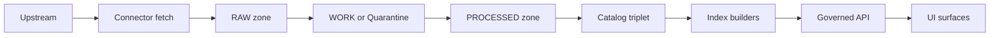

<!-- [KFM_META_BLOCK_V2]
doc_id: kfm://doc/00000000-0000-0000-0000-000000000000
title: EXAMPLE Dataset Onboarding Spec
type: standard
version: v1
status: draft
owners: <data-steward-team-or-name>
created: 2026-03-05
updated: 2026-03-05
policy_label: public
related: [
  "docs/governance/promotion-contract.md",
  "data/registry/datasets/<dataset_id>.yml",
  "src/pipelines/<dataset_id>/spec.yaml"
]
tags: [kfm, dataset, onboarding, template]
notes: [
  "Template only. Replace placeholders and delete sections you do not use.",
  "All claims must be marked CONFIRMED / PROPOSED / UNKNOWN and have evidence or a verification step."
]
[/KFM_META_BLOCK_V2] -->

# EXAMPLE: Dataset Onboarding Spec

Template to onboard a dataset into KFM with **deterministic identity**, **fail-closed governance**, and **promotion gates** from RAW → WORK/QUARANTINE → PROCESSED → CATALOG/TRIPLET → PUBLISHED.

> **IMPACT**
> - **Status:** example template (copy + adapt)
> - **Owners:** `<data-steward-team-or-name>`
> - **Applies to:** any new dataset or major dataset refactor (connector, schema, policy, catalogs)
> - **Last updated:** 2026-03-05
> - **Badges:** TODO • CI: TODO • Policy: TODO • Catalogs: TODO
>
> Quick links: [Scope](#scope) · [Dataset identity](#dataset-identity) · [Promotion contract](#promotion-contract-summary) · [Spec yaml](#machine-readable-onboarding-spec-yaml) · [Run receipt](#run-receipt-template) · [Done](#definition-of-done)

---

## Scope

**Goal (CONFIRMED / PROPOSED / UNKNOWN):** `<one sentence>`

**Dataset (CONFIRMED / PROPOSED / UNKNOWN):**
- `dataset_id`: `<lower_snake_case>`  
- `title`: `<human title>`  
- `domain`: `<e.g., hazards | demographics | environment | transport>`  
- `data_kind`: `<tabular | vector | raster | text | mixed>`  
- `policy_label`: `<public | restricted | sensitive-location | ...>`  

**Non-goals (CONFIRMED):**
- `<what you are explicitly NOT building in this onboarding>`

---

## Where it fits in the repo

- **This file:** `docs/templates/examples/EXAMPLE__DATASET_ONBOARDING_SPEC.md` (template)
- **Registry entry:** `data/registry/datasets/<dataset_id>.yml` (source inventory + governance inputs)
- **Pipeline spec (source-of-truth):** `src/pipelines/<dataset_id>/spec.yaml`
- **Artifacts (by zone):**
  - `data/raw/<domain>/<dataset_id>/...`
  - `data/work/<domain>/<dataset_id>/...`
  - `data/processed/<domain>/<dataset_id>/...`
  - `data/catalog/<domain>/<dataset_id>/...`

---

## Acceptable inputs

- Upstream documentation (API docs, download pages, data dictionaries)
- License / terms-of-use text or snapshot
- Example payloads / sample files
- Steward decisions about sensitivity, redaction, and obligations

## Exclusions

- No secrets in repo (API keys, passwords, tokens). Use a vault/secret manager.
- No direct UI or client access to storage/DB (must go through governed API + policy).
- No promotion to PUBLISHED without passing all required gates and emitting catalogs + receipts.

---

## Dataset identity

### Dataset summary

| Field | Value | Status | Evidence / verification step |
|---|---|---|---|
| dataset_id | `<id>` | UNKNOWN | Decide slug; record in registry |
| dataset_version_id format | `<e.g., YYYY-MM.<hashprefix>>` | PROPOSED | Confirm conventions + implement |
| publisher | `<org>` | UNKNOWN | Verify upstream publisher |
| upstream canonical URL | `<url>` | UNKNOWN | Verify stable landing page |
| update cadence | `<daily/weekly/monthly/annual/irregular>` | UNKNOWN | Verify cadence |
| spatial extent | `<bbox or region>` | UNKNOWN | Compute from data; store in catalogs |
| temporal extent | `<start/end>` | UNKNOWN | Compute from data; store in catalogs |
| license | `<SPDX or URL>` | UNKNOWN | Capture terms snapshot; steward sign-off |
| sensitivity | `<low/medium/high>` | UNKNOWN | Run sensitivity review |

### Identifier rules

**CONFIRMED requirements (fill in):**
- Stable `dataset_id` is used across DCAT/STAC/PROV and in API/UI.
- Every promoted version has a deterministic `spec_hash` and content digests for produced artifacts.
- Evidence references must resolve to stable IDs without guessing.

**UNKNOWN verification steps:**
1. Confirm `dataset_id` naming rules (allowed chars, length).
2. Confirm `dataset_version_id` convention (time-based vs digest-based).
3. Confirm canonical `spec_hash` computation method (YAML→canonical JSON→sha256).

---

## Promotion contract summary

KFM promotion is **fail-closed**: a dataset version is blocked from PUBLISHED unless required artifacts exist and validate.

### Lifecycle zones



### Gates (minimum)

| Gate | What must exist | Fail-closed check (example) |
|---|---|---|
| A. Identity + versioning | dataset_id + dataset_version_id; spec_hash; digests | spec_hash test; digest verification |
| B. Licensing + rights | license + rights fields; upstream terms snapshot | fail if unknown/missing |
| C. Sensitivity + redaction | policy_label + obligations | OPA tests verify redactions |
| D. Catalog triplet | DCAT + STAC + PROV validate + cross-link | schema validate + linkcheck |
| E. QA thresholds | dataset QA checks documented and met | fail QA → quarantine |
| F. Run receipt + audit | run receipt includes inputs/tools/hashes/policy | schema validate + (optional) signature verify |
| G. Release manifest | promotion manifest references artifacts + digests | manifest exists; refs match |

---

## Upstream acquisition plan

### Upstream details

- **Upstream type (CONFIRMED / PROPOSED / UNKNOWN):** `<api | bulk_download | scrape | streaming>`
- **Auth (CONFIRMED / PROPOSED / UNKNOWN):** `<none | api_key | oauth | signed_url>`
- **Incremental cursor (CONFIRMED / PROPOSED / UNKNOWN):** `<modified_date | eventDate | publicationDate | none>`
- **Rate limits (CONFIRMED / PROPOSED / UNKNOWN):** `<provider limits + backoff policy>`

### Acquisition strategy

**Discover (PROPOSED):**
- Resolve endpoints, parameters, required headers, and auth needs.
- Cache capability metadata (endpoints, schemas, max page size, etc).

**Acquire (PROPOSED):**
- Prefer incremental slices by date/ID; otherwise snapshot + diff.
- Record every request/response in an acquisition manifest with checksums.

**RAW zone requirements (CONFIRMED):**
- Append-only; never mutate raw artifacts.
- Store license/terms snapshot alongside raw acquisition.

---

## Normalization + canonical mapping

### Normalization rules (fill in)

- Encoding: UTF-8
- Geometry: WGS84 (EPSG:4326) unless documented otherwise
- Time: ISO 8601 (UTC preferred; preserve original timezone if provided)
- Field names: `<snake_case | camelCase | preserve upstream>`

### Canonical mapping table (minimum)

| Upstream field / concept | Canonical field / concept | Transform | Status | Notes |
|---|---|---|---|---|
| `<upstream_id>` | `source_record_id` | `str()` | UNKNOWN | Must be stable |
| `<upstream_datetime>` | `event_datetime` | parse to ISO 8601 | UNKNOWN | Reject future dates if historic |
| `<geom>` | `geometry` | reproject + validate | UNKNOWN | enforce bounds |
| `<name>` | `title` | trim | UNKNOWN |  |

---

## QA + validation gates

### Minimum validation (baseline)

- Row-level schema validation (required fields present; coercion documented)
- Geometry validity + bounds (no self-intersections; within expected extent)
- Temporal consistency (no impossible future dates; sane durations)
- License + attribution captured in DCAT; restrictions encoded in policy
- Provenance completeness: promoted artifacts have PROV chain + deterministic checksums

### Dataset-specific thresholds (example)

| Check | Threshold | Fail behavior | Status | Notes |
|---|---:|---|---|---|
| Null rate for key fields | `< <= 1% >` | quarantine | UNKNOWN |  |
| Row count drift vs last release | `< <= 5% unless explained >` | quarantine | UNKNOWN |  |
| Geometry bounds | `<within Kansas bbox>` | quarantine | UNKNOWN |  |
| Orphan join keys | `<0>` | quarantine | UNKNOWN |  |

---

## Sensitivity + policy (FAIR + CARE)

### Classification

**policy_label (CONFIRMED / PROPOSED / UNKNOWN):** `<public | restricted | sensitive-location | ...>`

### Obligations and redaction plan (example table)

| Risk surface | Data element | Obligation | Method | Authority | Status |
|---|---|---|---|---|---|
| Sensitive location | `geometry` | generalize | buffer + snap-to-grid | `<steward>` | UNKNOWN |
| PII | `person_name` | remove | drop field | `<steward>` | UNKNOWN |
| Small counts | `case_count` | suppress | min cell size | `<steward>` | UNKNOWN |

### Policy decision record

- **Decision id (UNKNOWN):** `kfm://policy_decision/<id>`
- **Decision summary (UNKNOWN):** `<what was allowed/denied and why>`
- **Verification step:** attach policy test outputs (OPA/Conftest) and a steward approval record (if required).

---

## Outputs + directory layout

### Expected output artifacts

**RAW (required):**
- `acquisition_manifest.json`
- raw payloads (`*.json`, `*.csv`, `*.tif`, etc)
- `checksums.sha256`
- `terms_snapshot.html` or `terms_snapshot.txt`

**WORK (required):**
- normalized intermediate files
- QA report(s)
- redaction candidates / diffs

**PROCESSED (required for publish):**
- publishable artifacts (GeoParquet, PMTiles, COG, text corpora, etc)
- `checksums.sha256`
- derived runtime metadata (bbox, time ranges, counts)

**CATALOG/TRIPLET (required for publish):**
- DCAT dataset record
- STAC collection + items (if spatial/temporal assets)
- PROV lineage bundle
- run receipt(s)
- promotion manifest

### Suggested repo layout (example)

```text
data/
  raw/<domain>/<dataset_id>/...
  processed/<domain>/<dataset_id>/spec=<spec_hash>/...
  catalog/
    stac/<domain>/<dataset_id>/<spec_hash>/{collection.json, items/*.json}
docs/
  data/<domain>/<dataset_id>.md
src/
  pipelines/<dataset_id>/
    spec.yaml
    acquire.py
    normalize.py
    qa.py
    stac.py
    prov.py
    sign.py
.github/
  workflows/<dataset_id>.yml
  policies/<dataset_id>.rego
```

---

## Catalog triplet requirements

### DCAT minimum fields (fill in)

- `dct:title`, `dct:description`
- `dct:publisher` (org id)
- `dct:license` (SPDX or URL)
- `dct:spatial` (bbox or admin coverage)
- `dct:temporal` (start/end)
- `dct:accrualPeriodicity` (update cadence)
- `dcat:distribution` (download/API endpoints)
- `prov:wasGeneratedBy` (link to PROV activity)

### STAC minimum fields (if applicable)

**Collection:**
- `id`, `title`, `description`, `license`
- `extent.spatial.bbox`, `extent.temporal.interval`
- `keywords`, `providers`

**Item:**
- `id`, `geometry`, `bbox`, `datetime`
- `properties` (at minimum: `proj:epsg`; plus domain fields as needed)
- `assets` with roles + hrefs
- `links` including `collection` and lineage link(s)

### PROV minimum fields

- **Entity:** raw_asset, normalized_table, derived_tile, etc.
- **Activity:** ingest_run, transform_job, redaction_job
- **Agent:** connector/service; steward approval
- Relations: `wasGeneratedBy`, `used`, `wasDerivedFrom`, `wasAssociatedWith`

---

## Machine-readable onboarding spec (YAML)

> **Source of truth (PROPOSED):** store this YAML in `src/pipelines/<dataset_id>/spec.yaml`, then compute `spec_hash` from a canonicalized form.

```yaml
kfm_spec_version: v1

dataset_id: "<dataset_id>"
title: "<human title>"
domain: "<domain>"
data_kind: "<tabular|vector|raster|text|mixed>"

upstream:
  type: "<api|bulk_download|scrape|stream>"
  url: "<canonical upstream url>"
  cadence: "<daily|weekly|monthly|annual|irregular>"
  auth:
    mode: "<none|api_key|oauth>"
    secret_ref: "<vault path or env var name>"
  incremental_cursor: "<modified_date|eventDate|publicationDate|none>"

normalize:
  encoding: "utf-8"
  crs: "EPSG:4326"
  time:
    format: "iso8601"
    timezone: "UTC"
  field_naming: "snake_case"

qa:
  schema:
    required_fields: ["source_record_id", "event_datetime"]
  thresholds:
    max_null_pct: 0.01
    max_row_count_drift_pct: 0.05
  actions:
    on_fail: "quarantine"

policy:
  label: "<public|restricted|sensitive-location>"
  obligations:
    - kind: "redact_field"
      field: "<field_name>"
    - kind: "generalize_geometry"
      method: "<method>"

outputs:
  processed:
    - kind: "geoparquet"
      path: "data/processed/<domain>/<dataset_id>/spec=<spec_hash>/data.parquet"
  catalogs:
    dcat: "data/catalog/<domain>/<dataset_id>/<spec_hash>/dcat.jsonld"
    stac_collection: "data/catalog/stac/<domain>/<dataset_id>/<spec_hash>/collection.json"
    prov: "data/catalog/<domain>/<dataset_id>/<spec_hash>/prov.json"
```

---

## Run receipt template

> Run receipts are append-only audit artifacts. They should include inputs, outputs, environment, validation, and policy decision references.

```json
{
  "run_id": "kfm://run/<iso8601>.<suffix>",
  "actor": { "principal": "svc:pipeline", "role": "pipeline" },
  "operation": "ingest+publish",
  "dataset_id": "<dataset_id>",
  "dataset_version_id": "<dataset_version_id>",
  "spec_hash": "sha256:<spec_hash>",
  "inputs": [
    { "uri": "data/raw/<domain>/<dataset_id>/<file>", "digest": "sha256:<...>" }
  ],
  "outputs": [
    { "uri": "data/processed/<domain>/<dataset_id>/spec=<spec_hash>/<file>", "digest": "sha256:<...>" }
  ],
  "environment": {
    "container_digest": "sha256:<...>",
    "git_commit": "<commit>",
    "params_digest": "sha256:<...>"
  },
  "validation": { "status": "pass", "report_digest": "sha256:<...>" },
  "policy": { "policy_label": "<label>", "decision_id": "kfm://policy_decision/<id>" },
  "created_at": "<iso8601>"
}
```

---

## Promotion manifest template

```json
{
  "kfm_promotion_manifest_version": "v1",
  "dataset_slug": "<dataset_id>",
  "dataset_version_id": "<dataset_version_id>",
  "spec_hash": "sha256:<spec_hash>",
  "released_at": "<iso8601>",
  "artifacts": [
    { "path": "<relative>", "digest": "sha256:<...>", "media_type": "application/octet-stream" }
  ],
  "catalogs": [
    { "path": "dcat.jsonld", "digest": "sha256:<...>" },
    { "path": "stac/collection.json", "digest": "sha256:<...>" },
    { "path": "prov.json", "digest": "sha256:<...>" }
  ],
  "qa": { "status": "pass", "report_digest": "sha256:<...>" },
  "policy": { "policy_label": "<label>", "decision_id": "kfm://policy_decision/<id>" },
  "approvals": [
    { "role": "steward", "principal": "<id>", "approved_at": "<iso8601>" }
  ]
}
```

---

## CI/CD outline (fail-closed)

- [ ] Job 1: Acquire + Normalize
- [ ] Job 2: QA (hard fail on any rule breach)
- [ ] Job 3: Change detection → classify release kind (material/minor)
- [ ] Job 4: Package artifacts + emit STAC + PROV
- [ ] Job 5: Sign / attest (optional but recommended)
- [ ] Job 6: Policy gate (OPA/Conftest) on catalogs + checksums
- [ ] Job 7: Publish to `data/processed` + `data/catalog` only if all gates pass

---

## Definition of Done

**A dataset onboarding is DONE when:**
- [ ] Connector implemented and registered in dataset registry.
- [ ] RAW acquisition produces deterministic manifest + checksums.
- [ ] Normalization emits canonical schema and/or STAC assets (as applicable).
- [ ] Validation gates implemented and enforced in CI.
- [ ] Policy label + obligations defined; restricted fields/locations redacted by tests.
- [ ] Catalogs emitted (DCAT always; STAC/PROV as applicable) and link-check clean.
- [ ] API contract tests pass for at least one representative query (policy + evidence).
- [ ] Backfill strategy documented (historical ranges and expected runtime).
- [ ] Rollback plan documented (how to supersede a bad version without mutating history).

---

## Appendix: Minimal verification steps (to turn UNKNOWN → CONFIRMED)

1. **License/terms:** capture a time-stamped snapshot of upstream terms; steward sign-off.
2. **Sensitivity review:** identify sensitive fields/locations; define obligations; add policy tests.
3. **Sample ingest:** run pipeline on a small fixed slice; assert stable checksums and counts.
4. **Catalog validation:** validate DCAT/STAC/PROV; run linkcheck; ensure EvidenceRefs resolve.
5. **Evidence smoke test:** load into API (or fixture) and confirm responses include provenance bundle and are policy-filtered.
