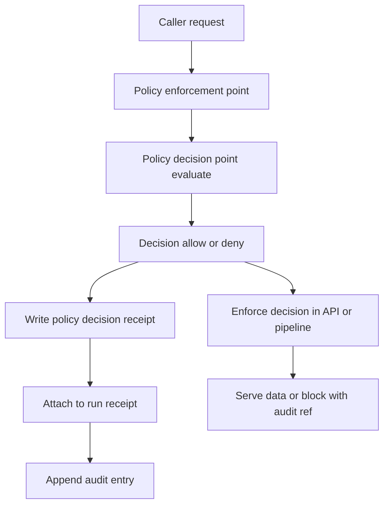

<!-- [KFM_META_BLOCK_V2]
doc_id: kfm://doc/4cf3a0b0-bad2-4d92-9e98-4a0d0ce3dc78
title: EXAMPLE Policy Decision Record
type: standard
version: v1
status: draft
owners: KFM Governance
created: 2026-03-05
updated: 2026-03-05
policy_label: public
related: [
  "docs/templates/examples/EXAMPLE__POLICY_DECISION_RECORD.md",
  "policy/",
  "receipts/",
  "docs/governance/",
  "docs/standards/"
]
tags: [kfm, policy, governance, audit, template]
notes: [
  "Example-only. Copy this file to create a real Policy Decision Record (PDR).",
  "Do not commit secrets or restricted locations."
]
[/KFM_META_BLOCK_V2] -->

# EXAMPLE Policy Decision Record
One-file, copyable record of an allow/deny (and obligations) produced by KFM policy-as-code.

> [!IMPORTANT]
> This is an **example**. Copy it to `docs/policy/decisions/` (or your repo’s equivalent) and edit.
> Never include secrets, raw PII, or precise sensitive locations in a PDR.

## Impact
- **Status:** experimental (template)
- **Owners:** KFM Governance (Policy Stewards + Platform Stewards)
- **Badges:**  <!-- TODO: replace -->
   <!-- TODO: replace -->
- **Quick links:** [Quickstart](#quickstart) · [Worked example](#worked-example) · [Template](#template-copy-paste)

## Quick nav
- [Scope](#scope)
- [Where it fits](#where-it-fits)
- [Inputs](#inputs)
- [Exclusions](#exclusions)
- [Quickstart](#quickstart)
- [Diagram](#diagram)
- [Worked example](#worked-example)
- [Template (copy/paste)](#template-copy-paste)

---

## Scope
A **Policy Decision Record (PDR)** is the human-readable twin of a machine receipt (`policy_decision.json`).
It captures:

- what was asked (request context + sanitized inputs),
- what policy decided (allow/deny + obligations),
- why (reasons, evidence, alternatives),
- under which policy version (bundle digest / commit),
- and how to reproduce the decision.

PDRs exist to make decisions auditable and explainable **without re-running the entire system**.

## Where it fits
Path (recommended):

```text
docs/
  policy/
    decisions/
      PDR-YYYY-MM-DD-<slug>.md
```

Upstream (inputs):
- `policy/` (OPA/Rego policy bundles and tests)
- `receipts/` (run receipts, provenance, attestation bundles)
- `data/catalog/` (DCAT/STAC/PROV catalog surfaces)

Downstream (consumers):
- Review workflows (Promotion Queue, Story Review Queue)
- Audit ledger / audit retention
- Post-incident review and policy regression tests

## Inputs
A PDR is appropriate when **any** of these happen:

- Dataset promotion decision (RAW → WORK → PROCESSED → PUBLISHED)
- Story Node publish/review decision
- Evidence resolve decision (`/evidence/resolve`)
- Focus Mode request decision (`/focus/ask`)
- A policy bundle change that alters decisions (behavior change)

### Minimal required fields
Blank means “not applicable”, not “unknown”.

| Field | Required | Description |
|---|---:|---|
| `pdr_id` | ✅ | Stable identifier (suggest `PDR-YYYY-MM-DD-<slug>`) |
| `decision_at` | ✅ | ISO 8601 timestamp for when decision was made |
| `decision_scope` | ✅ | One of: `dataset_promotion`, `story_publish`, `evidence_resolve`, `focus_answer`, `other` |
| `subject` | ✅ | What the decision was about (dataset/story/evidence/focus query) |
| `policy_engine` | ✅ | PDP identity (OPA) + bundle digest/commit |
| `input_digest` | ✅ | SHA-256 of the canonicalized input JSON (do not store secrets in the input) |
| `decision` | ✅ | `allow` or `deny` |
| `deny_reasons[]` | If deny | Stable IDs + messages (safe to disclose) |
| `obligations[]` | If allow | Required actions (redaction, UI notice, logging, throttling, etc.) |
| `audit_ref` | ✅ | Audit entry reference / URI |
| `evidence_refs[]` | ✅ | EvidenceBundle refs (or receipt paths) that justify the decision |
| `review` | ✅ | Who reviewed/approved (or “auto-approved by policy”) + next review date |

## Exclusions
A PDR is **not**:
- a place to debate policy philosophy (use an ADR / RFC),
- a place for raw restricted data,
- a substitute for machine receipts (you still must persist `policy_decision.json`),
- a place to store credentials, API keys, or auth tokens.

> [!CAUTION]
> If you need to reference sensitive entities (e.g., protected sites/species),
> use **generalized identifiers** and store precise material only in restricted stores governed by policy.

---

## Quickstart
1) Copy this example to a new record:

```bash
# choose a slug that is stable and descriptive
cp docs/templates/examples/EXAMPLE__POLICY_DECISION_RECORD.md \
  docs/policy/decisions/PDR-2026-03-05-<slug>.md
```

2) Fill out the **Template** section.

3) Attach / link the machine receipts:
- `receipts/.../policy_decision.json`
- `receipts/.../run_record.json` (or equivalent)
- `data/catalog/{dcat,stac,prov}/...` entries relevant to the decision

4) (Recommended) Add a regression test fixture:
- a minimal `input.json` reproducing the decision
- a policy test asserting allow/deny + obligations

---

## Diagram


---

## Worked example
### Summary
| Field | Value |
|---|---|
| `pdr_id` | `PDR-2026-03-05-sensitive-location-missing-redaction-receipt` |
| `decision_at` | `2026-03-05T02:41:13Z` |
| `decision_scope` | `dataset_promotion` |
| `subject` | `kfm://dataset_version/ks.example.species_observations.2026-03-05.sha256-deadbeef` |
| `decision` | **deny** |
| `policy_label` | `restricted_sensitive_location` |
| `audit_ref` | `kfm://audit/entry/2026-03-05T02:41:13Z.0001` |

### Context
- **Who/what triggered this:** CI promotion job `promote_dataset` (service account)
- **Requested action:** Promote dataset from `work` → `processed`
- **Why now:** Daily ingest completed; promotion attempted automatically

### Evidence & receipts
- Evidence bundles (must resolve through Evidence Resolver; do not paste raw URLs):
  - `kfm://evidence/bundle/sha256:1111...` (DCAT record)
  - `kfm://evidence/bundle/sha256:2222...` (STAC collection)
  - `kfm://evidence/bundle/sha256:3333...` (PROV activity bundle)
- Run receipts (paths are illustrative):
  - `receipts/runs/2026-03-05/promote_dataset/run_01/policy_decision.json`
  - `receipts/runs/2026-03-05/promote_dataset/run_01/openlineage.json`
  - `receipts/runs/2026-03-05/promote_dataset/run_01/prov.jsonld`
  - `receipts/runs/2026-03-05/promote_dataset/run_01/checksums.txt`

### Sanitized policy input (excerpt)
```json
{
  "action": "promote",
  "from_zone": "work",
  "to_zone": "processed",
  "dataset_version_id": "ks.example.species_observations.2026-03-05.sha256-deadbeef",
  "resource": {
    "policy_label": "restricted_sensitive_location",
    "license_spdx": "CC-BY-4.0"
  },
  "obligations": {
    "redaction": "missing"
  },
  "receipts": {
    "checksums_verified": true,
    "catalogs": {
      "dcat_valid": true,
      "stac_valid": true,
      "prov_valid": true
    }
  }
}
```

### Policy engine identity (PDP)
- **Engine:** OPA
- **Policy bundle:** `policy/` @ `git:sha1:<placeholder>`
- **Bundle digest:** `sha256:<placeholder>`
- **Input digest:** `sha256:<placeholder>` (canonical JSON digest; see `input_digest`)

### Decision output (machine shape)
```json
{
  "decision": "deny",
  "deny_reasons": [
    {
      "id": "obligation:redaction:required",
      "msg": "Promotion to processed requires redaction obligations for restricted_sensitive_location datasets."
    }
  ],
  "obligations": [],
  "audit_ref": "kfm://audit/entry/2026-03-05T02:41:13Z.0001"
}
```

### Why this decision
- **CONFIRMED:** Dataset is classified `restricted_sensitive_location` (input `resource.policy_label`).
- **CONFIRMED:** Redaction obligation is not satisfied (`obligations.redaction = missing`).
- **CONFIRMED:** Policy posture is fail-closed; missing required obligations yields deny.

### Alternatives considered
1) **Allow promotion but force generalization automatically**  
   - **PROPOSED** only if the transform is deterministic, attested, and produces a separate `public_generalized` dataset version.
2) **Block promotion and require steward review** (chosen)  
   - Keeps the trust boundary explicit and prevents accidental publication.

### Impact assessment
- **User impact:** Dataset remains in `work` and is not available to general users.
- **Operational impact:** Promotion queue requires steward action; alerts fired to `#kfm-ops`.
- **Risk:** Reduced; prevents sensitive location leakage.

### Follow-ups / remediation tasks
- [ ] Produce `redaction_receipt.json` proving the approved redaction profile executed
- [ ] Re-run promotion with updated receipts and attach attestation bundle
- [ ] Add a policy regression test fixture for this case

### Repro steps
```bash
# Example: run OPA/conftest locally on the same normalized input
conftest test -p policy/opa receipts/runs/2026-03-05/promote_dataset/run_01/policy_input.json

# Or, if you have a single decision endpoint:
curl -sS -X POST http://localhost:8181/v1/data/kfm/promotion/allow \
  -H 'content-type: application/json' \
  -d @receipts/runs/2026-03-05/promote_dataset/run_01/policy_input.json
```

### Review
- **Reviewed by:** `steward_on_call` (role), `platform_on_call` (role)
- **Decision:** deny upheld
- **Next review:** 2026-04-05 (or sooner if redaction pipeline changes)

---

## Definition of Done
Before considering a PDR “complete”, ensure:

- [ ] `pdr_id`, `decision_at`, `decision_scope`, `subject`, and `audit_ref` are present
- [ ] Policy identity is pinned (policy bundle ref + digest and/or commit)
- [ ] `input_digest` is recorded, and the stored input is **sanitized**
- [ ] If **deny**: `deny_reasons[]` includes stable IDs and safe-to-disclose messages
- [ ] If **allow**: `obligations[]` are explicit and actionable (who enforces them, where)
- [ ] Evidence references are resolvable via the Evidence Resolver (or are stored as restricted pointers)
- [ ] Linked receipts exist (`policy_decision.json` at minimum; provenance/attestation as applicable)
- [ ] Any UNKNOWN claim includes the smallest verification step to make it CONFIRMED
- [ ] A reviewer (or “auto-approved by policy”) is recorded, with a next review date
- [ ] (Recommended) A regression test fixture is added for non-trivial decisions


---

## Template (copy/paste)
<details>
<summary>Open the blank template</summary>

> [!TIP]
> Keep the record short. If it gets long, move deep analysis into an ADR/RFC and link it.

### Summary
| Field | Value |
|---|---|
| `pdr_id` | `PDR-YYYY-MM-DD-<slug>` |
| `decision_at` | `YYYY-MM-DDTHH:MM:SSZ` |
| `decision_scope` | `dataset_promotion` \| `story_publish` \| `evidence_resolve` \| `focus_answer` \| `other` |
| `subject` | `kfm://...` |
| `decision` | allow \| deny |
| `audit_ref` | `kfm://audit/entry/...` |

### Context
- Who/what triggered this:
- Requested action:
- Why now:

### Evidence & receipts
- Evidence refs:
- Receipt paths:

### Sanitized policy input
```json
{
  "action": "<...>",
  "user": {"role": "<...>"},
  "resource": {"policy_label": "<...>"},
  "context": {"purpose": "<...>"}
}
```

### Policy engine identity (PDP)
- Engine:
- Policy bundle ref:
- Bundle digest:
- Input digest:

### Decision output
```json
{
  "decision": "deny",
  "deny_reasons": [{"id":"<stable-id>","msg":"<safe message>"}],
  "obligations": [],
  "audit_ref": "kfm://audit/entry/<...>"
}
```

### Why this decision
- CONFIRMED:
- CONFIRMED:
- UNKNOWN (verification step):

### Alternatives considered
1) ...
2) ...

### Impact assessment
- User impact:
- Operational impact:
- Risk:

### Follow-ups / remediation tasks
- [ ] ...
- [ ] ...

### Repro steps
```bash
# conftest / opa eval command here
```

### Review
- Reviewed by:
- Next review date:

</details>

---

## Basis
This template is aligned with KFM’s default-deny, fail-closed, evidence-first governance posture, and with the expectation that policy decisions are recorded alongside run receipts and provenance.

[Back to top](#example-policy-decision-record)
