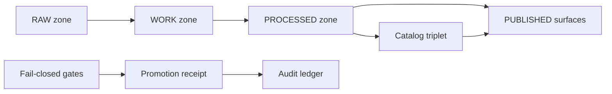

<!-- [KFM_META_BLOCK_V2]
doc_id: kfm://doc/0a66c6d0-3d4b-4f24-8be5-8b00b4b78b47
title: EXAMPLE Promotion Receipt
type: standard
version: v1
status: draft
owners: [kfm-platform, kfm-governance]
created: 2026-03-05
updated: 2026-03-05
policy_label: public
related: ["docs/templates/examples/EXAMPLE__RUN_RECEIPT.md", "docs/templates/examples/EXAMPLE__RELEASE_MANIFEST.md"]
tags: [kfm, promotion, provenance, receipts, audit]
notes: ["Template/example only. Do not treat placeholder IDs as real dataset IDs.", "Related doc paths are aspirational; verify they exist in the live repo before linking."]
[/KFM_META_BLOCK_V2] -->

# EXAMPLE — Promotion Receipt
One-file example of a **promotion receipt** for moving a dataset version across KFM lifecycle zones (RAW → WORK → PROCESSED → PUBLISHED).

> **Status:** draft (example/template)  
> **Owners:** kfm-platform, kfm-governance  
> **Policy label:** public (template)  
> **Badges:** TODO (schema-validated / signed / policy-gated)

## Quick nav
- [Scope](#scope)
- [Where it fits](#where-it-fits)
- [Inputs](#inputs)
- [Exclusions](#exclusions)
- [Promotion flow](#promotion-flow)
- [Example receipt](#example-receipt)
- [Required gates](#required-gates)
- [Validation checklist](#validation-checklist)
- [Appendix](#appendix)

## Scope
A promotion receipt is an **append-only audit artifact** emitted when KFM promotes a dataset version between lifecycle zones.

- ✅ **CONFIRMED:** KFM uses promotion gates across zones (Raw → Work → Processed) and requires checksums plus STAC/DCAT/PROV catalogs for promotion. *(Sources: KFM Comprehensive Data Source Integration Blueprint v1.0 (2026-02-12); Tooling the KFM pipeline briefing (2026-02-27).)*  
- ✅ **CONFIRMED:** Promotion moves are fail-closed and require (at minimum) a deterministic `spec_hash`, a signed run receipt/attestation, and a “pass” data-quality summary. *(Sources: Tooling the KFM pipeline briefing (2026-02-27); New Ideas 2-26-26.)*  

## Where it fits
**Path:** `docs/templates/examples/EXAMPLE__PROMOTION_RECEIPT.md`

**Upstream inputs (typical):**
- A successful pipeline **run receipt** (`run_receipt.json`)
- Produced artifacts + digests (e.g., GeoParquet/COG/PMTiles)
- Catalog triplet (DCAT + STAC + PROV) for the dataset version

**Downstream uses (typical):**
- CI promotion lane gates (Conftest/OPA)
- Ops audit / incident response (what changed, when, why)
- Safe UI rendering (receipt viewer validates schema + signature before display)

> **IMPORTANT (governance):** Do not claim repository paths exist unless verified in the live repo. This file is an example of the *target* contract and layout.  

## Inputs
Acceptable inputs to generate a promotion receipt (minimum):
- `dataset_id`, `dataset_version_id`
- `from_zone`, `to_zone`
- Artifact list with content digests (sha256 recommended)
- Catalog triplet refs (DCAT/STAC/PROV) with digests
- Gate results (schema checks, DQ checks, policy decision)
- References to run receipt + build/run context (CI run, commit, container digest)

## Exclusions
This file is **not**:
- A per-run **run receipt** (that’s emitted on every pipeline execution)
- A story / Focus Mode answer receipt
- A substitute for STAC/DCAT/PROV catalogs (it links to them)

## Promotion flow


_Back to top: [Quick nav](#quick-nav)_

## Example receipt
This is a **single JSON document** (example values) you can copy and adapt.

```json
{
  "receipt_type": "kfm.promotion_receipt.v1",
  "receipt_version": "1.0.0",

  "promotion_id": "kfm://promotion/2026-03-05T18:30:12Z.example_dem_10m.work_to_processed.01",
  "created_at": "2026-03-05T18:30:12Z",

  "actor": {
    "principal": "svc:ci",
    "role": "ci",
    "workflow": {
      "provider": "github",
      "repository": "example-org/kansas-frontier-matrix",
      "run_id": "1234567890",
      "run_attempt": 1,
      "ref": "refs/heads/main",
      "commit": "deadbeefdeadbeefdeadbeefdeadbeefdeadbeef"
    }
  },

  "promotion": {
    "from_zone": "WORK",
    "to_zone": "PROCESSED",
    "reason": "Standardize upstream DEM tiles into KFM canonical GeoParquet + catalogs",
    "requested_by": "kfm://change/EXAMPLE-123",
    "ticket_url": "https://example.invalid/EXAMPLE-123"
  },

  "dataset": {
    "dataset_id": "kfm://dataset/example_dem_10m",
    "dataset_version_id": "kfm://dataset_version/example_dem_10m/2026-03-05.abcd1234",
    "title": "Example DEM 10m (template)",
    "description": "Template-only dataset used to illustrate promotion receipt structure.",
    "license": {
      "spdx_id": "CC0-1.0",
      "terms_snapshot": {
        "uri": "data/raw/example_dem_10m/terms_snapshot.html",
        "digest": "sha256:1111111111111111111111111111111111111111111111111111111111111111"
      }
    },
    "policy_label": "public"
  },

  "contracts": {
    "spec_hash": "jcs:sha256:2222222222222222222222222222222222222222222222222222222222222222",
    "processed_schema": {
      "schema_ref": "schemas/processed/example_dem_10m.schema.json",
      "schema_digest": "sha256:3333333333333333333333333333333333333333333333333333333333333333"
    }
  },

  "artifacts": [
    {
      "uri": "data/processed/example_dem_10m/2026-03-05/dem_10m.parquet",
      "media_type": "application/x-parquet",
      "digest": "sha256:4444444444444444444444444444444444444444444444444444444444444444",
      "size_bytes": 12345678,
      "roles": ["primary"],
      "extent": {
        "bbox_wgs84": [-102.051, 36.993, -94.588, 40.003],
        "crs": "EPSG:4326"
      },
      "temporal_extent": null
    }
  ],

  "catalog_triplet": {
    "stac_item": {
      "uri": "data/catalog/stac/items/example_dem_10m/2026-03-05.abcd1234.json",
      "digest": "sha256:5555555555555555555555555555555555555555555555555555555555555555"
    },
    "dcat_dataset": {
      "uri": "data/catalog/dcat/datasets/example_dem_10m/2026-03-05.abcd1234.json",
      "digest": "sha256:6666666666666666666666666666666666666666666666666666666666666666"
    },
    "prov_bundle": {
      "uri": "data/catalog/prov/bundles/example_dem_10m/2026-03-05.abcd1234.prov.json",
      "digest": "sha256:7777777777777777777777777777777777777777777777777777777777777777"
    }
  },

  "gates": [
    {
      "gate_id": "A.identity_versioning",
      "status": "pass",
      "evidence": [
        {
          "uri": "data/audit/example_dem_10m/2026-03-05/identity_check.json",
          "digest": "sha256:8888888888888888888888888888888888888888888888888888888888888888"
        }
      ]
    },
    {
      "gate_id": "B.licensing_rights",
      "status": "pass",
      "evidence": [
        {
          "uri": "data/raw/example_dem_10m/terms_snapshot.html",
          "digest": "sha256:1111111111111111111111111111111111111111111111111111111111111111"
        }
      ]
    },
    {
      "gate_id": "C.sensitivity_policy",
      "status": "pass",
      "policy_decision": {
        "decision_id": "kfm://policy_decision/2026-03-05T18:29:58Z.example_dem_10m.allow",
        "decision": "allow",
        "reason_codes": [],
        "obligations": []
      }
    },
    {
      "gate_id": "D.catalog_triplet",
      "status": "pass",
      "evidence": [
        {
          "uri": "data/catalog/stac/items/example_dem_10m/2026-03-05.abcd1234.json",
          "digest": "sha256:5555555555555555555555555555555555555555555555555555555555555555"
        },
        {
          "uri": "data/catalog/dcat/datasets/example_dem_10m/2026-03-05.abcd1234.json",
          "digest": "sha256:6666666666666666666666666666666666666666666666666666666666666666"
        },
        {
          "uri": "data/catalog/prov/bundles/example_dem_10m/2026-03-05.abcd1234.prov.json",
          "digest": "sha256:7777777777777777777777777777777777777777777777777777777777777777"
        }
      ]
    },
    {
      "gate_id": "E.data_quality_thresholds",
      "status": "pass",
      "summary": {
        "null_rates": { "elevation": 0.0004 },
        "geometry_valid": true,
        "schema_assert": { "epsg": 4269, "dtype": "float32" }
      },
      "evidence": [
        {
          "uri": "data/audit/example_dem_10m/2026-03-05/dq_report.json",
          "digest": "sha256:9999999999999999999999999999999999999999999999999999999999999999"
        }
      ]
    },
    {
      "gate_id": "F.run_receipt_audit",
      "status": "pass",
      "run_receipt": {
        "uri": "data/audit/example_dem_10m/2026-03-05/run_receipt.json",
        "digest": "sha256:aaaaaaaaaaaaaaaaaaaaaaaaaaaaaaaaaaaaaaaaaaaaaaaaaaaaaaaaaaaaaaaa"
      }
    }
  ],

  "attestations": [
    {
      "type": "cosign.keyless",
      "subject": {
        "uri": "data/processed/example_dem_10m/2026-03-05/dem_10m.parquet",
        "digest": "sha256:4444444444444444444444444444444444444444444444444444444444444444"
      },
      "bundle": {
        "rekor_uuid": "00000000-0000-0000-0000-000000000000",
        "certificate_oidc_issuer": "https://token.actions.githubusercontent.com",
        "certificate_subject": "repo:example-org/kansas-frontier-matrix:ref:refs/heads/main"
      },
      "verification": {
        "command_example": "cosign verify-blob --certificate-oidc-issuer https://token.actions.githubusercontent.com --certificate-identity-regexp 'repo:example-org/kansas-frontier-matrix.*' <artifact>"
      }
    }
  ],

  "integrity": {
    "receipt_digest": "sha256:bbbbbbbbbbbbbbbbbbbbbbbbbbbbbbbbbbbbbbbbbbbbbbbbbbbbbbbbbbbbbbbb",
    "signing": {
      "method": "cosign.keyless",
      "bundle_uri": "data/audit/example_dem_10m/2026-03-05/promotion_receipt.sigstore.json"
    }
  },

  "links": {
    "previous_promotion_receipt": null,
    "release_manifest": {
      "uri": "data/releases/example_dem_10m/2026-03-05/manifest.json",
      "digest": "sha256:cccccccccccccccccccccccccccccccccccccccccccccccccccccccccccccccc"
    }
  }
}
```

_Back to top: [Quick nav](#quick-nav)_

## Required gates
This template aligns with the **minimum gates** commonly referenced in KFM docs:

| Gate | What it proves | Where it shows up in the receipt |
|---|---|---|
| A. Identity & versioning | IDs are deterministic; `spec_hash` is present; content digests exist | `dataset.*`, `contracts.spec_hash`, `artifacts[].digest` |
| B. Licensing & rights | License fields exist and upstream terms are snapshotted | `dataset.license.*` |
| C. Sensitivity & policy | Policy label + decision + obligations are captured | `dataset.policy_label`, `gates[].policy_decision` |
| D. Catalog triplet | DCAT/STAC/PROV exist, validate, and cross-link | `catalog_triplet.*` |
| E. QA thresholds | Dataset-specific checks ran and passed | `gates[].summary`, `gates[].evidence` |
| F. Run receipt & audit | The underlying run receipt exists and is referenced | `gates[].run_receipt` |
| G. Release manifest (optional lane) | Promotion is recorded as a release manifest | `links.release_manifest` |

> **NOTE:** If a gate is **missing** or **fails**, promotion must be denied (fail-closed).  

## Validation checklist
Minimal (copy/paste) checks you can run **in CI**.

```bash
# 1) Schema validate (promotion receipt schema)
# PROPOSED: replace with your actual schema path
jsonschema -i promotion_receipt.json schemas/promotion_receipt.v1.schema.json

# 2) Policy gate (deny-by-default)
# PROPOSED: conftest policy pack path
conftest test promotion_receipt.json -p policy/promotion/

# 3) Verify digests exist (example: quick sanity)
jq -e '.artifacts[] | select(.digest | test("^sha256:"))' promotion_receipt.json > /dev/null
```

## Appendix
<details>
<summary>Notes on spec_hash</summary>

- ✅ **CONFIRMED:** `spec_hash` is intended to be computed from normalized catalog JSON using RFC-8785 JSON Canonicalization Scheme (JCS) + SHA-256. *(Source: New Ideas 2-26-26.)*  
- **PROPOSED implementation detail:** store as `jcs:sha256:<hex>` and compute in CI from normalized STAC/DCAT JSON.

</details>

<details>
<summary>Notes on signatures & attestations</summary>

- ✅ **CONFIRMED intent:** gate moves require a signed run receipt + attestation that is present and verifiable. *(Source: New Ideas 2-26-26; Tooling the KFM pipeline briefing (2026-02-27).)*  
- **PROPOSED implementation detail:** use keyless signing (e.g., Sigstore/cosign) and store the signature bundle next to the receipt in the audit zone.

</details>

## Sources
- Kansas Frontier Matrix (KFM) — Comprehensive Data Source Integration Blueprint v1.0 (2026-02-12)
- Kansas Frontier Matrix (KFM) — Architecture, Governance, and Delivery Plan (Tooling the KFM pipeline) (Date: 2026-02-27)
- New Ideas 2-26-26 (Promotion contract notes: spec_hash + signed receipts + DQ pass)
- New Ideas Feb-2026 (Run receipt as first-class artifact; CI pre-promotion gate)
