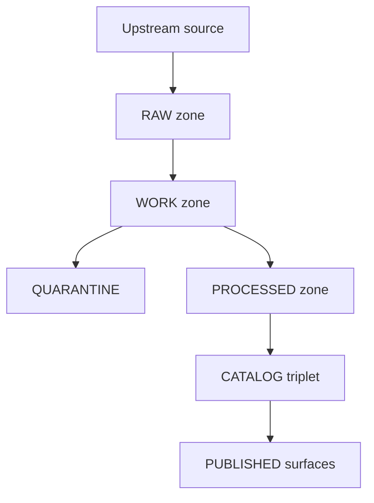

<!-- [KFM_META_BLOCK_V2]
doc_id: kfm://doc/77bb02c3-c1f0-4c7e-9be1-d4e3f9d14d01
title: EXAMPLE — Promotion Request
type: standard
version: v1
status: draft
owners: [TODO]
created: 2026-03-05
updated: 2026-03-05
policy_label: public
related: [TODO]
tags: [kfm, template, example, promotion, promotion-contract]
notes: [Copy/paste example for promoting a DatasetVersion across KFM lifecycle zones. Replace TODOs before use.]
[/KFM_META_BLOCK_V2] -->

# EXAMPLE — Promotion Request
Request to promote a specific **DatasetVersion** through the KFM lifecycle (RAW → WORK/QUARANTINE → PROCESSED → CATALOG/TRIPLET → PUBLISHED) with **fail-closed** gates and evidence links.

> IMPORTANT: This file is an **example template**. Copy it into a PR body or issue, then replace every `TODO:` and delete the Appendix before requesting a real promotion.

---

## Impact
- Status: **example**
- Owners: **TODO**
- Applies to: DatasetVersion promotions into `processed/` + `catalog/` + `published/` surfaces
- Decision deadline: **TODO (optional)**
- Decision output: **PROMOTE** or **BLOCK** (fail-closed)

Badges (optional): TODO

## Quick nav
- [How to use](#how-to-use)
- [Where it fits](#where-it-fits)
- [Promotion path](#promotion-path)
- [Request metadata](#request-metadata)
- [Promotion summary](#promotion-summary)
- [Evidence bundle](#evidence-bundle)
- [Gate checklist](#gate-checklist)
- [Approvals](#approvals)
- [Rollback plan](#rollback-plan)
- [Appendix](#appendix)

## Labels used in this document
- **CONFIRMED**: Required by the KFM lifecycle and Promotion Contract.
- **PROPOSED**: Recommended pattern; adopt or adjust via governance.
- **UNKNOWN**: Requires verification in the current repo/pipeline environment.

---

## How to use
1. Copy this file into your PR description (or create an issue using it as the body).
2. Fill all `TODO:` fields (including digests and paths/URIs).
3. Attach or link to evidence artifacts so a reviewer can verify without guessing.
4. Keep it **fail-closed**: if any required gate is not `pass`, the correct decision is **BLOCK**.

## Where it fits
**Path (PROPOSED):** `docs/templates/examples/EXAMPLE__PROMOTION_REQUEST.md`

**Used by (PROPOSED):**
- PRs that add or update a dataset version and request promotion
- Steward review workflows (licensing, sensitivity, and readiness)
- Release notes / audit trail (when promotion is approved)

**Acceptable inputs:**
- A single DatasetVersion promotion request (one dataset_id + one version_id)
- Evidence pointers (paths/URIs) plus **content digests** (sha256, OCI digest, etc.)
- Links to CI runs validating gates (policy, catalogs, contracts)

**Exclusions:**
- Requests to waive gates (use a separate “exception” process/template)
- Requests to add a brand-new upstream source without an onboarding spec
- Requests that lack an explicit license or sensitivity classification (must remain QUARANTINE)

---

## Promotion path

Notes:
- **QUARANTINE (CONFIRMED):** used for failed validation, unclear licensing, sensitivity concerns, or upstream instability; quarantined items are **not promoted**.
- **PUBLISHED (CONFIRMED):** runtime surfaces may only serve versions that have processed artifacts, validated catalogs, run receipts, and a policy label assignment.

---

## Request metadata
- Request ID: `TODO` (e.g., `kfm://promotion/<uuid>` or GH issue id)
- Request type: `promotion`
- Mode: `GOVERNED` | `SANDBOX` (publish requests should be `GOVERNED`)
- Submitted by: `TODO`
- Steward reviewer: `TODO`
- Requested on: `YYYY-MM-DD`
- Target environment: `dev` | `staging` | `prod` | `release/<name>`
- Target surfaces: `api` | `map` | `story` | `focus` (select all that apply)

## Promotion summary
- Dataset ID: `TODO`
- DatasetVersion ID: `TODO`
- From zone: `work` | `quarantine`
- To zones: `processed` + `catalog` + `published`
- Reason for promotion: `TODO`
- User impact: `TODO` (what becomes visible and where)
- Backfill scope: `TODO` (time range, spatial extent, partitions)
- Rollback posture: `TODO` (revocation SLA; how we unpublish)

---

## Evidence bundle
Provide stable pointers; prefer **content-addressed** references (digests). Reviewers should be able to validate every gate without guessing.

### Evidence table
| Artifact | Required gate | Pointer (path or URI) | Digest | Status | Notes |
|---|---|---|---|---|---|
| Raw acquisition manifest | A, B, E | `TODO` | `sha256:...` | pass/warn/fail | |
| Raw checksums (all assets) | E | `TODO` | `sha256:...` | pass/warn/fail | |
| License or terms snapshot | B | `TODO` | `sha256:...` | pass/warn/fail | |
| Work QA report | E | `TODO` | `sha256:...` | pass/warn/fail | |
| Processed artifact manifest | E | `TODO` | `sha256:...` | pass/warn/fail | |
| Processed artifacts | E | `TODO` | `sha256:...` | pass/warn/fail | |
| DCAT dataset record | D | `TODO` | `sha256:...` | pass/warn/fail | |
| STAC collection and items | D | `TODO` | `sha256:...` | pass/warn/fail | |
| PROV bundle | D | `TODO` | `sha256:...` | pass/warn/fail | |
| Run receipt | E | `TODO` | `sha256:...` | pass/warn/fail | |
| Policy decision record | C, F | `TODO` | `sha256:...` | pass/warn/fail | |
| OPA policy test output | F | `TODO` | `sha256:...` | pass/warn/fail | |
| Evidence resolver CI proof | F | `TODO` | `sha256:...` | pass/warn/fail | |
| API contract test output | F | `TODO` | `sha256:...` | pass/warn/fail | |
| Release manifest | PROPOSED | `TODO` | `sha256:...` | pass/warn/fail | Optional but recommended |

### Evidence resolver smoke test
- EvidenceRef tested in CI: `TODO`
- Expected outcome: `allow` or `deny` with obligations
- Actual outcome: `TODO`
- Notes: `TODO`

---

## Gate checklist
If any **required** gate is not `pass`, the decision must be **BLOCK**.

### Gate A — Identity and versioning
Label: **CONFIRMED**
- [ ] Dataset ID is stable and follows naming convention. `pass/warn/fail`
- [ ] DatasetVersion ID is immutable and derived from a stable `spec_hash`. `pass/warn/fail`
- [ ] `spec_hash` is reproducible across platforms (canonical JSON + test). `pass/warn/fail`

Evidence:
- Spec pointer: `TODO`
- `spec_hash` value: `TODO`
- Stability test output: `TODO`

### Gate B — Licensing and rights metadata
Label: **CONFIRMED**
- [ ] License is explicit and compatible with intended use. `pass/warn/fail`
- [ ] Rights holder and attribution obligations recorded. `pass/warn/fail`
- [ ] If license is unclear, dataset remains in QUARANTINE. `pass/warn/fail`

Evidence:
- SPDX or license URL: `TODO`
- Terms snapshot pointer: `TODO`
- Steward notes: `TODO`

### Gate C — Sensitivity classification and redaction plan
Label: **CONFIRMED**
- [ ] `policy_label` assigned. `pass/warn/fail`
- [ ] If sensitive or restricted, redaction/generalization plan exists and is recorded in PROV. `pass/warn/fail`

Label: **PROPOSED**
- [ ] Redaction is deterministic and composable (profile-based). `pass/warn/fail`

Evidence:
- Policy label decision pointer: `TODO`
- Redaction profile pointer: `TODO` (if applicable)
- PROV activity pointer: `TODO`

### Gate D — Catalog triplet validation
Label: **CONFIRMED**
- [ ] DCAT record exists and validates against KFM DCAT profile. `pass/warn/fail`
- [ ] STAC collection/items exist (if applicable) and validate against KFM STAC profile. `pass/warn/fail`
- [ ] PROV bundle exists and validates against KFM PROV profile. `pass/warn/fail`
- [ ] Cross-links between DCAT, STAC, and PROV are present and resolvable. `pass/warn/fail`

Evidence:
- Validator outputs: `TODO`
- Link-check outputs: `TODO`

### Gate E — Run receipt and checksums
Label: **CONFIRMED**
- [ ] `run_receipt` exists for each producing run. `pass/warn/fail`
- [ ] Inputs and outputs are enumerated with checksums. `pass/warn/fail`
- [ ] Runtime environment is recorded (container image digest, parameters). `pass/warn/fail`

Evidence:
- Receipt pointer: `TODO`
- Checksums pointer: `TODO`

### Gate F — Policy tests and contract tests
Label: **CONFIRMED**
- [ ] OPA policy tests pass for this DatasetVersion (fixtures-driven). `pass/warn/fail`
- [ ] Evidence resolver resolves at least one EvidenceRef for this DatasetVersion in CI. `pass/warn/fail`
- [ ] API contracts and schemas validate for dependent queries. `pass/warn/fail`

Evidence:
- CI run link: `TODO`
- Test artifact pointers: `TODO`

### Gate G — Production posture extras
Label: **PROPOSED**
- [ ] SBOM and build provenance for pipeline images and API/UI artifacts. `pass/warn/fail`
- [ ] Performance smoke checks (tile rendering, evidence resolve latency). `pass/warn/fail`
- [ ] Accessibility smoke checks (evidence drawer keyboard navigation). `pass/warn/fail`

Evidence:
- `TODO`

---

## Quality and QA summary
- Schema validation tool and version: `TODO`
- QA report pointer: `TODO`
- Key metrics and thresholds (include units and pass/fail):
  - `TODO` (metric name, value, threshold, outcome)
- Sampling used: `full` | `tiles` | `random` | `stratified`
- Sampling seed: `TODO` (if any)

---

## Governance notes
These fields are **PROPOSED** unless your repo already defines them as a contract.

- policy_label: `public` | `restricted` | `restricted_sensitive_location` | `public_generalized` | `quarantine` | `embargoed` | ...
- CARE gate status: `allow` | `redact` | `deny` | `unknown`
- Sovereignty gate status: `clear` | `restricted` | `conflict` | `unknown`
- Redaction summary: `TODO`
- Known sensitive fields: `TODO`
- Public derivative planned: `yes/no` (if restricted inputs)

---

## Approvals
Decision options: **PROMOTE** or **BLOCK**

- Steward approval: `TODO` (name, date, notes)
- Policy owner approval: `TODO` (name, date, notes)
- Security approval: `TODO` (optional)
- Histories and ethics review: `TODO` (if relevant)

---

## Promotion execution record
Label: **PROPOSED** fields where tooling varies.

- Pipeline run id: `TODO`
- OpenLineage run id: `TODO` (optional)
- Release tag or manifest pointer: `TODO`

Post-promotion verification (minimum):
- [ ] `/datasets` (or equivalent) lists the new version under policy. `pass/fail`
- [ ] One representative map tile renders (if spatial). `pass/fail`
- [ ] Evidence drawer resolves and shows license + version. `pass/fail`

---

## Rollback plan
- Trigger conditions: `TODO` (rights dispute, sensitivity leak, broken catalogs, etc.)
- Rollback steps: `TODO` (unpublish release manifest, revoke tags, deny in policy, etc.)
- Revocation SLA: `TODO`

---

## Appendix

Example filled request with fake values

> NOTE: Delete this section in real promotion requests.

- Request ID: `kfm://promotion/00000000-0000-0000-0000-000000000000`
- Mode: `GOVERNED`
- Submitted by: `alice@example.org`
- Steward reviewer: `steward@example.org`
- Dataset ID: `noaa_ncei_storm_events`
- DatasetVersion ID: `noaa_ncei_storm_events@sha256:deadbeef...`
- From zone: `work`
- To zones: `processed` + `catalog` + `published`
- policy_label: `public`

Decision: **BLOCK** (because Gate B license snapshot missing)

