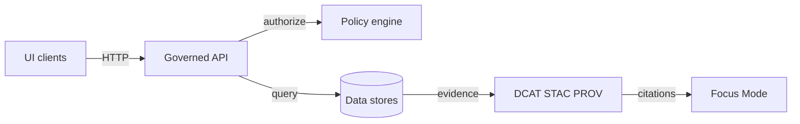

<!-- [KFM_META_BLOCK_V2]
doc_id: kfm://doc/9b7e1d2d-3f9a-4f86-9c4f-0c245c30b3fa
title: EXAMPLE — Universal Doc Published
type: standard
version: v1
status: published
owners: ["@kfm/core"]
created: 2026-03-05
updated: 2026-03-05
policy_label: public
related: ["kfm://doc/<replace-me>", "docs/governance/<replace-me>.md", "docs/specs/<replace-me>.md"]
tags: [kfm, template, example, published]
notes: ["Universal example doc for KFM markdown style, evidence discipline, and promotion gates."]
[/KFM_META_BLOCK_V2] -->

# EXAMPLE — Universal Doc Published
One-file example you can copy to create a **published**, evidence-first KFM document.

> **Status:** published (stable)  
> **Owners:** `@kfm/core` (replace)  
> **Policy label:** public (replace if restricted)  
> **Last updated:** 2026-03-05  
>
>     
>
> **Jump to:** [Scope](#scope) · [Where it fits](#where-it-fits) · [Evidence](#evidence) · [Interfaces](#interfaces) · [Gates](#promotion-gates) · [Changelog](#changelog)

---

## Scope
**What this doc is:** a universal “good citizen” document format for KFM that is ready to be marked **published**.

**What this doc is not:** a complete spec for any one subsystem. It is a template showing *how to write* specs, runbooks, ADRs, and dataset notes in a governed, evidence-first way.

**Audience:** engineers, analysts, maintainers, reviewers.

---

## Where it fits
**Path:** `docs/templates/examples/EXAMPLE__UNIVERSAL_DOC__PUBLISHED.md`

**Upstream inputs (examples):**
- Governance charter / ethics / sovereignty rules
- Dataset catalogs (DCAT / STAC / PROV)
- Run records (CI, pipeline logs, signed attestations)

**Downstream consumers (examples):**
- Governed API contracts
- UI/Story rendering
- Focus Mode answers (citation-first)

> Replace the items above with *actual* repo paths once confirmed. This file is intentionally “universal.”

---

## Acceptable inputs
Include content that is:
- **Evidence-citable** (source docs, schemas, logs, signed artifacts).
- **Contract-like** (schemas, interfaces, invariants, gates, SLOs).
- **Operationally actionable** (commands, runbooks, rollback steps).

---

## Exclusions
Do **not** put the following here:
- Secrets, tokens, private keys, credentials.
- Raw datasets or large binaries (use governed storage + catalogs).
- Instructions that bypass governance boundaries (example: UI direct-to-DB access).
- Sensitive location guidance that enables targeting (needs governance review).

---

## Evidence
This repo uses **cite-or-abstain** discipline.

### Claim labels
Every meaningful claim MUST be labeled as one of:
- **CONFIRMED**: backed by evidence (cite it).
- **PROPOSED**: a design decision or plan (must include owner + next verification step).
- **UNKNOWN**: not verified yet (include smallest verification steps).

### Evidence links
For each **CONFIRMED** claim, include:
- the primary artifact (doc, schema, log, signed provenance)
- where it lives (path, object URL, digest)
- how to verify (command or checklist)

---

## Document conventions
### Normative keywords
Use these words intentionally:
- **MUST / MUST NOT**: non-negotiable, enforced by CI/policy.
- **SHOULD / SHOULD NOT**: strongly recommended defaults.
- **MAY**: optional.

### Dates
Use absolute dates (YYYY-MM-DD). Avoid “today/yesterday” in published docs.

### Sensitivity
If policy label is not `public`, add:
- a redaction note
- reviewer/owner
- distribution rules

---

## Architecture snapshot


---

## Claims register
Use a small table so reviewers can audit quickly.

| Claim ID | Statement | Status | Evidence | Verification steps |
|---|---|---|---|---|
| C-001 | UI and external clients do not access storage directly; all reads go through governed APIs and policy. | CONFIRMED | `<replace with link + artifact>` | `conftest` policy suite passes; API integration tests prove no direct DB route. |
| C-002 | Dataset promotion requires checksums + DCAT/STAC/PROV triplet before publishing. | CONFIRMED | `<replace with link + artifact>` | Run CI “promotion gate” job on a sample dataset. |
| C-003 | Add signed provenance for non-container geospatial artifacts via Cosign. | PROPOSED | `<replace with design doc>` | Prototype in CI; verify signatures offline using bundles. |
| C-004 | This subsystem’s data retention is 365 days. | UNKNOWN | `<none>` | Check ops/runbook; confirm with storage lifecycle config; record decision in ADR. |

---

## Interfaces
Describe *what crosses boundaries*.

### Interface summary
| Interface | Purpose | Owner | Stability | Notes |
|---|---|---|---|---|
| `GET /datasets` | List datasets (metadata only) | `@api-team` | stable | Returns IDs, titles, extents, policy. |
| `GET /datasets/{id}` | Dataset details + catalogs | `@api-team` | stable | Includes catalog URIs + digests. |
| `POST /focus/query` | Focus Mode query endpoint | `@ai-team` | beta | Must return citations or abstain. |

> Replace example endpoints with your actual API surface and link to the OpenAPI/GraphQL schema.

---

## Promotion gates
Publishable artifacts should move through zones.

| Zone | Purpose | Required artifacts | Gate |
|---|---|---|---|
| RAW | Immutable ingest | acquisition manifest, checksums | schema + integrity checks |
| WORK | Cleaning/standardization | validation reports | reproducibility + lineage |
| PROCESSED | Derived products | STAC items, derived checksums | deterministic transform |
| PUBLISHED | User-facing | DCAT dataset, STAC collection, PROV doc | policy + catalogs verified |

### Gate checklist
- [ ] **Identity**: stable dataset ID + versioning rules recorded
- [ ] **Schema**: validators pass (fail-closed)
- [ ] **Extents**: spatial/temporal extents present
- [ ] **License**: explicit, machine-readable
- [ ] **Sensitivity**: classified; redaction rules applied where needed
- [ ] **Provenance**: PROV present; inputs and transforms recorded
- [ ] **Integrity**: checksums recorded; artifacts content-addressed
- [ ] **Policy**: OPA/Conftest suite passes
- [ ] **Run record**: who/what/when/why captured (audit reference)

---

## Quickstart
### Copy this template
```bash
# from repo root
cp docs/templates/examples/EXAMPLE__UNIVERSAL_DOC__PUBLISHED.md \
   docs/<area>/<NEW_DOC_NAME>.md
```

### Fill in the MetaBlock
Update:
- `doc_id` (new UUID)
- `title`
- `owners`
- `policy_label`
- `related`

### Replace placeholders
Search for `<replace` and resolve each item before publishing.

---

## Changelog
| Date | Change | Owner |
|---|---|---|
| 2026-03-05 | Initial published example created. | `@kfm/core` |

---

## FAQ
### Why tables and claim labels
So reviewers can verify what is “true”, what is “planned”, and what is still unknown without reading the full narrative.

### Can I remove sections
Yes, but do not remove:
- MetaBlock
- Impact block
- Evidence discipline
- At least one diagram
- Gate checklist (if doc affects published artifacts)

---

## Appendix
<details>
  <summary>Example evidence bundle layout</summary>

```text
docs/
  reports/
    qa/
      2026-03-05/
        policy/
          conftest.json
          decision.txt
        catalogs/
          dataset.dcat.jsonld
          collection.stac.json
          run.prov.jsonld
        integrity/
          checksums.sha256
          manifest.json
```

</details>

---

[Back to top](#example--universal-doc-published)
