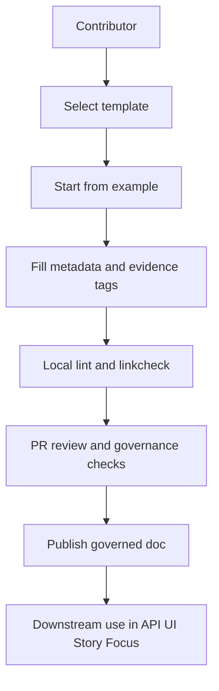

\<!-- [KFM_META_BLOCK_V2]
doc_id: kfm://doc/4ae7758c-c919-4849-a406-390a0e5ad66c
title: Documentation Template Examples
type: standard
version: v1
status: draft
owners: KFM Maintainers
created: 2026-03-05
updated: 2026-03-05
policy_label: public
related: [docs/templates/README.md, docs/templates/examples/README.md]
tags: [kfm]
notes: [
  "Template examples only. Must remain non-sensitive.",
  "Uses KFM evidence discipline tags: CONFIRMED / PROPOSED / UNKNOWN."
]
[/KFM_META_BLOCK_V2] -->

<div align="center">

# Docs Template Examples
One-line purpose: **Example-filled, copy/pasteable docs that demonstrate how to use KFM templates safely and consistently.**

`docs/templates/examples/README.md`


</div>

---

> **IMPACT**
>
> - **Status:** **PROPOSED** — Active for contributions, pending first governance review
> - **Owners:** **UNKNOWN** — add CODEOWNERS / owning team handle
> - **Primary audience:** **PROPOSED** — contributors writing docs, Story Nodes, and API contract changes
> - **Policy posture:** **CONFIRMED** — template-only content should be non-sensitive by default
>
> **Quick nav:** [Scope](#scope) · [Where it fits](#where-it-fits) · [Acceptable inputs](#acceptable-inputs) · [Exclusions](#exclusions) · [Directory tree](#directory-tree) · [Quickstart](#quickstart) · [Usage](#usage) · [Diagram](#diagram) · [Example registry](#example-registry) · [Definition of done](#definition-of-done) · [FAQ](#faq) · [Appendix](#appendix)

---

## Scope

**PROPOSED:** This folder contains **example-filled documents** that demonstrate correct use of the templates in `docs/templates/` (front matter, evidence discipline, links, diagrams, and safe redaction posture).

**Non-goals**
- **CONFIRMED:** This folder is not a source of authoritative policy, schemas, or production runbooks.
- **PROPOSED:** If an example reveals a missing requirement, convert that insight into a governed change (template update, ADR, API contract extension), not “tribal knowledge.”

[Back to top](#docs-template-examples)

---

## Where it fits

**CONFIRMED:** KFM is designed as a governed, evidence-first system where public-facing outputs are traceable to versioned sources and policy controls are enforced in CI and at runtime.

This directory sits at:

- **Path:** `docs/templates/examples/`
- **Upstream:** contributor intent + internal standards + template contracts (in `docs/templates/`)
- **Downstream:** governed docs, Story Nodes, API contract change proposals, and review/CI gates

**CONFIRMED invariants examples should never contradict**
- **CONFIRMED:** Trust membrane: UI/external clients do not access databases directly; access is via governed API + policy boundary.
- **CONFIRMED:** Fail-closed policy: if policy/evidence checks can’t be satisfied, the system blocks the request or the promotion.
- **CONFIRMED:** Dataset promotion gates: `Raw → Work → Processed` require checksums and STAC/DCAT/PROV catalogs.
- **CONFIRMED:** Focus Mode must cite or abstain and emit an audit reference.

[Back to top](#docs-template-examples)

---

## Acceptable inputs

**CONFIRMED:** Examples must be **redaction-safe** and **template-only**.

Allowed content includes:

- **PROPOSED:** “Hello-world” example docs created from templates (with placeholders filled)
- **PROPOSED:** Minimal JSON/YAML snippets that demonstrate formatting and schema shape
- **CONFIRMED:** References to evidence and provenance (links/IDs) rather than raw sensitive data

Minimum requirements for every example file:

- **PROPOSED:** Include the KFM MetaBlock header (or the repository’s chosen equivalent for that doc family)
- **PROPOSED:** Use evidence discipline tags (CONFIRMED / PROPOSED / UNKNOWN) for substantive assertions
- **PROPOSED:** Keep examples deterministic and GitHub-stable (consistent ordering/indentation)

[Back to top](#docs-template-examples)

---

## Exclusions

Do **not** put these in `docs/templates/examples/`:

- **CONFIRMED:** Secrets, tokens, credentials, private keys
- **CONFIRMED:** PII or protected personal data
- **CONFIRMED:** Sensitive geospatial coordinates or “how to find” vulnerable locations
- **CONFIRMED:** Raw datasets or large binaries (put those under `data/` or `mcp/` per repo rules)
- **CONFIRMED:** Authoritative policy text or production schemas (promote to governed locations instead)

**If unsure, default-deny.** Put a stub example here and link to the governed review path.

[Back to top](#docs-template-examples)

---

## Directory tree

**UNKNOWN:** The exact contents of your current checkout may differ.  
**Verification step (smallest):** run `ls -la docs/templates/examples` and update this tree to match.

**PROPOSED minimum tree**

```text
docs/templates/
└── examples/
    ├── README.md
    ├── example-universal-doc.md
    ├── example-story-node.md
    └── example-api-contract-extension.md
```

**CONFIRMED referenced templates elsewhere in the repo docs**
- **UNKNOWN:** confirm files exist in your checkout:
  - `docs/templates/TEMPLATE__KFM_UNIVERSAL_DOC.md`
  - `docs/templates/TEMPLATE__STORY_NODE_V3.md`
  - `docs/templates/TEMPLATE__API_CONTRACT_EXTENSION.md`

[Back to top](#docs-template-examples)

---

## Quickstart

### 1) Pick a template and copy an example

```bash
# PSEUDOCODE: adjust paths if your repo layout differs
ls -la docs/templates/examples

cp docs/templates/examples/example-universal-doc.md \
  docs/research/drafts/2026-03-05__example__universal-doc.md
```

### 2) Replace placeholders

Checklist (quick):

- Replace `doc_id` with a new UUID
- Update `title`, `owners`, `policy_label`, and `related`
- Remove “UNKNOWN” tags once you’ve verified the facts
- Ensure all links are relative and resolve

### 3) Run local checks

```bash
# PSEUDOCODE: use your repo's actual doc lint/linkcheck commands
make docs-lint
make docs-linkcheck
```

[Back to top](#docs-template-examples)

---

## Usage

### How to use these examples

- **PROPOSED:** Treat each example as a “known-good shape” for authoring.
- **PROPOSED:** When creating a new doc, start from an example that matches the doc family:
  - “standard doc”
  - “Story Node”
  - “API contract extension”

### How to edit examples safely

- **CONFIRMED:** Keep examples non-sensitive and free of precise location patterns.
- **PROPOSED:** Prefer stub identifiers (`kfm://…`) and fake-but-realistic values over copying real sensitive records.
- **PROPOSED:** If you need realism, use:
  - generalized geometry
  - null geometry
  - redacted IDs and hashes

[Back to top](#docs-template-examples)

---

## Diagram



[Back to top](#docs-template-examples)

---

## Example registry

**PROPOSED:** Add one row per example file in this directory.

| Example file | Intended template | Demonstrates | Sensitivity posture |
|---|---|---|---|
| `example-universal-doc.md` | `TEMPLATE__KFM_UNIVERSAL_DOC.md` | MetaBlock, section order, citations, Mermaid | Public, template-only |
| `example-story-node.md` | `TEMPLATE__STORY_NODE_V3.md` | Evidence refs, narrative structure, safe claims | Public, redaction-safe |
| `example-api-contract-extension.md` | `TEMPLATE__API_CONTRACT_EXTENSION.md` | Additive contract changes, rollback notes | Public, no secrets |

**UNKNOWN:** If these examples do not exist yet, create them as part of the next documentation PR.

[Back to top](#docs-template-examples)

---

## Definition of done

A new or updated example is ready when:

- [ ] **CONFIRMED:** It contains no secrets, credentials, or PII
- [ ] **CONFIRMED:** It contains no sensitive location inference or precise protected coordinates
- [ ] **PROPOSED:** It includes the KFM MetaBlock header (or the repo-standard header for that doc family)
- [ ] **PROPOSED:** All substantive assertions are tagged CONFIRMED / PROPOSED / UNKNOWN
- [ ] **PROPOSED:** Links are relative and resolve in GitHub
- [ ] **PROPOSED:** Markdown renders cleanly (no broken fences)
- [ ] **PROPOSED:** Includes at least one Mermaid diagram when it improves comprehension
- [ ] **PROPOSED:** Any referenced schema/API/policy change is linked to the governed contract location

[Back to top](#docs-template-examples)

---

## FAQ

### Why keep examples separate from templates

**PROPOSED:** Templates stay minimal and reusable; examples show “filled-in reality” without making templates noisy.

### Can examples include real data

**CONFIRMED:** Avoid real sensitive data.  
**PROPOSED:** If you must reference reality, do it via EvidenceRef IDs and governed bundles, not copied raw records.

### How do I convert an UNKNOWN to CONFIRMED

**CONFIRMED:** Verify it with the smallest possible step, then update the doc:

- Check file existence with `ls`
- Link to the authoritative governed doc
- Add a test, schema validation, or CI gate when applicable

[Back to top](#docs-template-examples)

---

## Appendix

<details>
<summary>Formatting and governance conventions</summary>

### Evidence discipline tags

Use these tags for substantive statements:

- **CONFIRMED:** backed by an authoritative governed doc, schema, test, or source artifact
- **PROPOSED:** design intent or recommended future behavior
- **UNKNOWN:** not yet verified in this repo snapshot

**PROPOSED rule:** If a statement affects safety, policy, or external behavior, do not leave it as UNKNOWN—either verify it or remove it.

### Safe example data pattern

**PROPOSED:** Prefer:

- placeholder IDs (stable format, fake values)
- generalized time ranges
- redaction-safe geometry (null/generalized)
- minimal “shape-only” JSON

Avoid:

- unique personal identifiers
- precise lat/long for culturally sensitive sites
- join keys that enable re-identification

### Promotion path

**PROPOSED:** When an example uncovers a missing rule:

1. Add a short note in the example (“this should be enforced”)
2. Create a governed contract change (template/schema/policy)
3. Add CI validation so the rule is test-enforced

</details>

[Back to top](#docs-template-examples)
