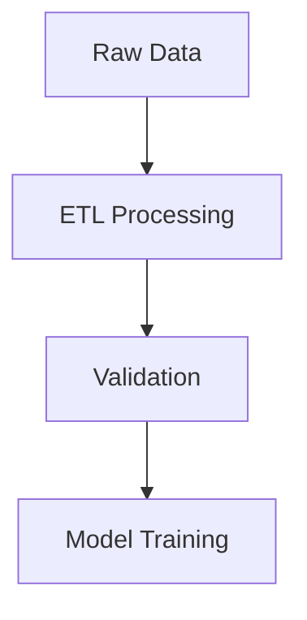

<div align="center">

# 🧪 **Kansas Frontier Matrix — Experiment Documentation Template**  
`docs/templates/experiment.md`

**Purpose:**  
Provide a **strict, fully governed, machine-validated experiment template** for documenting **ETL, AI/ML, geospatial processing, historical analysis, and validation experiments** within the Kansas Frontier Matrix (KFM).  
Aligned with **MCP-DL v6.3**, **Diamond⁹ Ω / Crown∞Ω**, **FAIR+CARE**, **ISO 19115**, **STAC/DCAT**, and the strict **Kansas Frontier Matrix Matrix Markdown Protocol**.

[](../README.md)
[](../../LICENSE)
[](../standards/faircare.md)
[]()

</div>

---

## 🧭 Overview

Use this template to document any **experiment** that affects KFM datasets, workflows, AI pipelines, or governance systems.  
All experiment docs:

- Must pass **docs-lint**, **FAIR+CARE audit**, and **telemetry export**  
- Must follow **strict YAML front-matter**, **emoji section headers**, **single-code-block rules**, and **one-mermaid-per-section guardrails**  
- Are registered in the **Governance Ledger** with provenance and checksum linkage  
- Are used for **Focus Mode v2** narrative citations and STAC/DCAT linking  
- Must maintain **fully reproducible, ethical, and transparent scientific practice**

**Storage pattern:**  
```
docs/experiments/<domain>/<experiment-name>.md
```

---

## 🧱 Metadata (YAML Front-Matter — Required)

```yaml
---
title: "🧪 [Experiment Title]"
path: "docs/experiments/[domain]/[filename].md"
version: "vX.Y.Z"
last_updated: "YYYY-MM-DD"
review_cycle: "Quarterly / Autonomous"
commit_sha: "<commit-hash>"
sbom_ref: "releases/vX.Y.Z/sbom.spdx.json"
manifest_ref: "releases/vX.Y.Z/manifest.zip"
telemetry_ref: "releases/vX.Y.Z/focus-telemetry.json"
telemetry_schema: "schemas/telemetry/docs-experiment-template-v2.json"
governance_ref: "docs/standards/governance/ROOT-GOVERNANCE.md"
license: "CC-BY 4.0"
mcp_version: "MCP-DL v6.3"
---
```

> **Failure to include any required field breaks CI (`docs-lint.yml`).**

---

## 🎯 Objective

Describe the experiment’s **purpose**, **hypothesis**, and **expected outcomes**.

**Example:**  
> Assess viability of using multi-temporal NDVI derivatives to detect prairie restoration zones and rank restoration opportunities.

---

## 🔬 Methodology

Document all components precisely.

| Component | Description |
|---|---|
| **Data Sources** | e.g., NOAA, USGS 3DEP, MODIS/VIIRS, KHS, NARA |
| **Transform Pipeline** | ETL steps, scripts, staging paths |
| **Models** | AI model versions, architecture details, training configs |
| **Tools** | Python, GDAL, PyTorch, spaCy, Neo4j, Cesium |
| **Environment** | Docker tag, container digest, GPU model, RAM, OS |

**Example Commands**
```bash
python src/pipelines/etl/landsat_ingest.py --year 1995 --bbox kansas
python src/ai/train_focus_v2.py --epochs 25 --config configs/ai/focus_v2.yaml
```

---

## ⚙️ Configuration & Parameters

Use this table to ensure reproducibility.

| Parameter | Description | Value |
|---|---|---|
| `epochs` | Training iterations | 20 |
| `learning_rate` | Optimizer step | 5e-4 |
| `bbox` | Spatial extent | [-102.05, 37.00, -94.60, 40.00] |
| `temporal_range` | Years or dates | 1950–2025 |
| `ocr_model` | Versioned OCR engine | tesseract-5.3.2 |

Reference supporting manifests:

```
data/checksums/manifest.json
data/sources/*_source_metadata.json
```

---

## 📊 Results

Present outputs, metrics, figures, or derived datasets.

| Metric | Description | Value |
|---|---|---|
| Accuracy | NER or classifier accuracy | 94.6% |
| RMSE | Regression error | 0.128 |
| Drift Score | Model stability | 0.017 |
| Coverage | Data completeness | 98.2% |

**Optional Mermaid Diagram**


---

## 🧠 Discussion

Interpret findings, list limitations, and propose improvements.

**Example:**  
> NDVI variance increases during drought epochs; consider detrending with Daymet shortwave radiation to isolate vegetation stress signatures.

---

## 🧩 FAIR+CARE Validation

Document ethics, openness, and governance outcomes.

| Principle | Evidence |
|---|---|
| **Findable** | STAC Item created; DOI/ARK issued |
| **Accessible** | CC-BY licensing; alt-text for figures |
| **Interoperable** | ISO 19115 metadata; STAC/DCAT-compliant |
| **Reusable** | Versioned scripts; SBOM; checksum lineage |
| **CARE** | Cultural sensitivity review; Indigenous land checks |

Attach associated reports:

```
reports/fair/faircare_summary.json
reports/audit/data_provenance_ledger.json
```

---

## 🔁 Reproducibility Instructions

Detailed script to permit full replication.

```bash
# Clone repository
git clone https://github.com/bartytime4life/Kansas-Frontier-Matrix.git
cd Kansas-Frontier-Matrix

# Build environment
docker compose up --build

# Run the experiment
make run-experiment EXPERIMENT=example_experiment
```

Expected runtime should be stated.

---

## 📁 Outputs & Storage

| Artifact | Location | Format |
|---|---|---|
| Logs | reports/experiments/logs/ | JSON |
| Figures | reports/experiments/figures/ | PNG/SVG |
| Processed Data | data/processed/experiments/ | CSV/Parquet |
| Telemetry | releases/v10.2.0/focus-telemetry.json | JSON |

---

## 🔍 CI / QA Integration

All experiment docs must pass:

| Workflow | Purpose |
|---|---|
| `docs-lint.yml` | YAML, headers, links, Mermaid guardrails |
| `faircare-validate.yml` | Ethics + governance |
| `stac-validate.yml` | If experiment generates STAC metadata |
| `telemetry-export.yml` | Logs sustainability & reproducibility metrics |

---

## 🕰️ Version History

| Version | Date | Author | Summary |
|---|---|---|---|
| v10.2.2 | 2025-11-12 | A. Barta | Updated refs to v10.2.0; aligned with strict KFM Markdown Protocol; added governance + telemetry rules. |
| v10.0.0 | 2025-11-10 | A. Barta | Telemetry schema v2 + MCP/FAIR+CARE compliance. |
| v9.7.0 | 2025-11-05 | A. Barta | Standardized experiment template. |
| v9.5.0 | 2025-10-20 | A. Barta | Added FAIR+CARE & telemetry hooks. |
| v9.0.0 | 2025-06-01 | KFM Core Team | Initial template. |

---

<div align="center">

**© 2025 Kansas Frontier Matrix — CC-BY 4.0**  
Maintained under **Master Coder Protocol v6.3** · FAIR+CARE Certified · **Diamond⁹ Ω / Crown∞Ω** Ultimate Certified  
[Back to Template Index](README.md) · [Governance Charter](../standards/governance/ROOT-GOVERNANCE.md)

</div>