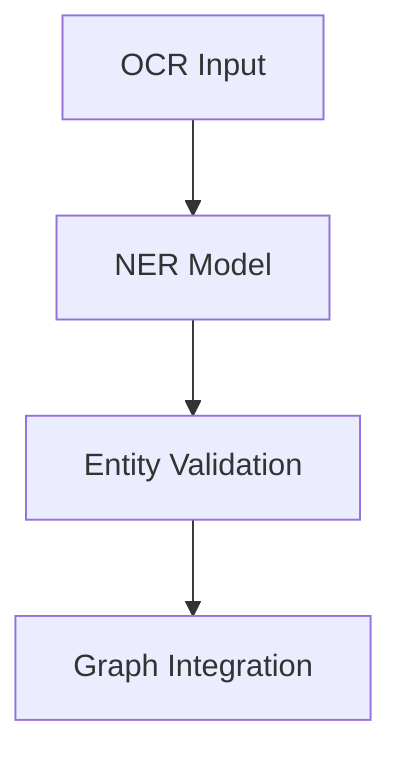

<div align="center">

# 🧪 **Kansas Frontier Matrix — Experiment Documentation Template**  
`docs/templates/experiment.md`

**Purpose:** Provide a standardized, machine-validated format for documenting **data, AI, and research experiments** within the Kansas Frontier Matrix (KFM).  
Aligned with **Master Coder Protocol (MCP-DL v6.3)**, **FAIR+CARE**, and **ISO 19115** for fully reproducible science and ethical transparency.

[](../README.md)
[](../../LICENSE)
[](../standards/faircare.md)
[]()

</div>

---

## 🧭 Overview

Use this template to document experiments for **ETL**, **AI/ML**, **validation**, or **governance** workflows.  
All experiments created from this template are: versioned, CI-validated, FAIR+CARE-audited, checksum-tracked, and registered to the Governance Ledger.

**Recommended location:**  
```
docs/experiments/
```

---

## 🧱 Metadata (YAML Front-Matter)

Each experiment must begin with a YAML header:

```yaml
---
title: "🧪 [Experiment Title]"
path: "docs/experiments/[filename].md"
version: "vX.Y.Z"
last_updated: "YYYY-MM-DD"
review_cycle: "Quarterly / Autonomous"
commit_sha: "<commit-hash>"
sbom_ref: "releases/vX.Y.Z/sbom.spdx.json"
manifest_ref: "releases/vX.Y.Z/manifest.zip"
telemetry_ref: "releases/vX.Y.Z/focus-telemetry.json"
telemetry_schema: "schemas/telemetry/docs-experiment-[vN].json"
governance_ref: "docs/standards/governance/ROOT-GOVERNANCE.md"
license: "CC-BY 4.0"
mcp_version: "MCP-DL v6.3"
---
```

---

## 🎯 Objective

State the purpose and expected outcomes.

**Example**  
> Evaluate OCR→NER accuracy on 19th-century Kansas newspapers using a spaCy v3.7 pipeline and measure FAIR+CARE accessibility impacts.

---

## 🔬 Methodology

Describe **data**, **procedures**, **tools**, and **runtime environment**.

| Component | Description |
|---|---|
| **Data Sources** | e.g., NOAA, USGS, KHS, NARA |
| **Processing Tools** | Python 3.11, GDAL 3.8, spaCy 3.7, PyTorch 2.4 |
| **Workflow** | Raw → ETL → Transform → Validate → Publish |
| **Environment** | Docker image digest, CPU/GPU specs, env vars |

**Example commands**
```bash
python src/pipelines/etl/noaa_ingest.py --source data/raw/noaa_1950_2025.csv
python src/ai/models/focus_transformer_v1/train.py --epochs 15 --lr 5e-4
```

---

## ⚙️ Configuration & Parameters

Document all tunables and critical settings.

| Parameter | Description | Value |
|---|---|---|
| `learning_rate` | Optimizer step size | `0.0005` |
| `epochs` | Training iterations | `20` |
| `ocr_model` | OCR engine/version | `tesseract-5.3.0` |
| `dataset_size` | Input records | `125000` |
| `spatial_extent` | Bounding box (WGS84) | `[-102.05, 37.00, -94.60, 40.00]` |

**Referenced manifests**  
```
data/sources/noaa_storms_1950_2025.json
data/checksums/manifest.json
```

---

## 📊 Results

Summarize findings with key metrics, tables, or figures.

| Metric | Description | Value |
|---|---|---|
| Accuracy | OCR→NER accuracy | 94.6% |
| Precision | NER precision | 92.8% |
| Recall | NER recall | 95.3% |
| F1 Score | Overall performance | 94.0% |

**Optional flowchart (Mermaid, quoted labels only)**


---

## 🧠 Discussion

Interpret results, note limitations, and propose future work.

**Example**  
> Performance degrades on low-contrast scans; consider transformer-OCR fine-tuning and adaptive thresholding for 1890s typography.

---

## 🧩 FAIR+CARE Validation

Record ethics and openness compliance.

| Principle | Evidence |
|---|---|
| **Findable** | STAC/DCAT entries minted; DOI/ARK linked |
| **Accessible** | Scripts/data released (MIT/CC-BY), alt text present |
| **Interoperable** | STAC 1.0 + GeoJSON/Parquet + ISO 19115 lineage |
| **Reusable** | Versioned artifacts, SPDX SBOM, manifest checksums |
| **CARE** | Cultural sensitivity reviewed; approvals logged |

**Attach related reports**
```
reports/fair/faircare_summary.json
reports/audit/github-workflows-ledger.json
```

---

## 🔁 Reproducibility Instructions

Provide exact steps to rerun.

```bash
# 1) Clone
git clone https://github.com/bartytime4life/Kansas-Frontier-Matrix.git
cd Kansas-Frontier-Matrix

# 2) Containerized env
docker compose up --build

# 3) Execute the experiment
make run-experiment EXPERIMENT=ocr_ner_1850s
```

> **Expected runtime:** ~1.5 hours on 8-core CPU / 32 GB RAM.

---

## 📁 Outputs & Storage

| Artifact | Location | Format |
|---|---|---|
| Experiment Logs | `reports/experiments/logs/` | JSON |
| Validation Reports | `reports/fair/` | JSON |
| Processed Data | `data/processed/experiments/` | CSV/GeoJSON |
| Telemetry | `releases/v10.0.0/focus-telemetry.json` | JSON |

---

## 🔍 CI / QA Integration

This document must pass the following:

| Workflow | Purpose |
|---|---|
| `docs-lint.yml` | Front-matter + structure validation |
| `faircare-validate.yml` | Ethics & accessibility audits |
| `telemetry-export.yml` | Contribution + energy/carbon logging |

Validation artifacts archived under:
```
reports/self-validation/experiments/
```

---

## 🕰️ Version History

| Version | Date | Author | Summary |
|---|---|---|---|
| v10.0.0 | 2025-11-10 | A. Barta | Upgraded to v10; telemetry schema v2; MCP/FAIR+CARE alignment. |
| v9.7.0 | 2025-11-05 | A. Barta | Standardized experiment documentation template. |
| v9.5.0 | 2025-10-20 | A. Barta | Added FAIR+CARE and telemetry hooks. |
| v9.0.0 | 2025-06-01 | KFM Core Team | Initial template creation. |

---

<div align="center">

**© 2025 Kansas Frontier Matrix — CC-BY 4.0**  
Maintained under **Master Coder Protocol v6.3** · FAIR+CARE Certified · **Diamond⁹ Ω / Crown∞Ω** Ultimate Certified  
[Back to Template Index](README.md) · [Governance Charter](../standards/governance/ROOT-GOVERNANCE.md)

</div>
