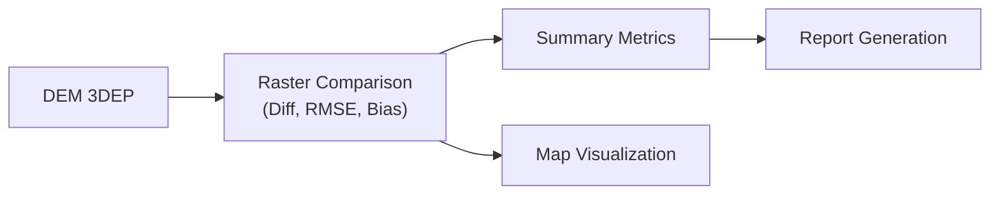

<div align="center">

# 🧪 Kansas Frontier Matrix — Experiment Template  
`docs/templates/experiment.md`

**Purpose:** Provide a **structured, reproducible template** for documenting any scientific, analytical, or data-driven experiment  
within the Kansas Frontier Matrix (KFM) — ensuring consistency, traceability, and compliance with the  
**Master Coder Protocol (MCP)** documentation-first standards.

[](../../docs/)
[](../../LICENSE)

</div>

---

## 🧭 Experiment Metadata

| Field | Description |
|:------|:-------------|
| **Experiment ID** | Unique identifier (e.g., `EXP-2025-001-TERRAIN`) |
| **Title** | Descriptive experiment name |
| **Author(s)** | Contributor(s) performing the experiment |
| **Date Created** | YYYY-MM-DD |
| **Last Updated** | YYYY-MM-DD |
| **Version** | v1.0, v1.1, etc. |
| **Domain** | Terrain / Hydrology / Climate / Hazards / Landcover / Tabular / Text |
| **Status** | Draft / In Review / Completed / Archived |
| **Associated Pipeline(s)** | Link to `src/pipelines/<domain>_pipeline.py` |
| **Related Dataset(s)** | List STAC Items or data paths (`data/processed/...`) |
| **License** | CC-BY 4.0 (data), MIT (code), or other |

---

## 🎯 Objective

Clearly define **the purpose and hypothesis** of this experiment.

> Example:  
> *To evaluate the accuracy and elevation consistency between USGS 3DEP 1m DEM and KS DASC LiDAR data for central Kansas.*

---

## 🧩 Background & Rationale

Provide context and justification for conducting this experiment.  
Include relevant literature, previous work, or historical observations.

> Example:  
> *Terrain datasets vary by acquisition method; this experiment tests consistency between DEM derivatives to support watershed delineation accuracy.*

---

## ⚙️ Methodology

### 1️⃣ Data Sources
List and describe all input datasets and metadata used.

| Source | Description | License | Location |
|:---------|:-------------|:----------|:------------|
| `usgs_3dep_dem` | 1m Digital Elevation Model | Public Domain | `data/raw/terrain/ks_3dep_2018_2020.tif` |
| `ks_dasc_lidar` | Kansas LiDAR Elevation Data | CC-BY 4.0 | `data/raw/terrain/ks_dasc_2018.tif` |

---

### 2️⃣ Tools & Environment
Specify the tools, software, and versions required for reproducibility.

| Tool / Library | Version | Purpose |
|:----------------|:-----------|:-----------|
| Python | 3.11 | Primary scripting environment |
| GDAL | 3.8 | Raster reprojection and analysis |
| Rasterio | 1.4 | DEM data manipulation |
| Pandas | 2.2 | Tabular data aggregation |
| Makefile | — | Task orchestration |
| GitHub Actions | — | CI/CD experiment validation |

---

### 3️⃣ Data Processing Workflow

Outline the steps used to execute this experiment.

```bash
# Example workflow
make terrain
python src/pipelines/terrain_pipeline.py --config configs/terrain_experiment.yaml
python scripts/analyze_dem_consistency.py
````

---

## 🧮 Analysis & Metrics

Describe how results are evaluated and what metrics are used.

| Metric                  | Description                                    | Formula / Tool                |
| :---------------------- | :--------------------------------------------- | :---------------------------- |
| **RMSE**                | Root Mean Square Error between DEM datasets    | GDAL diff + NumPy             |
| **Mean Elevation Bias** | Average offset per pixel                       | `np.mean(dem1 - dem2)`        |
| **Data Coverage (%)**   | Percentage of study area covered by valid data | Raster mask area / total area |
| **Checksum Match**      | Integrity verification of outputs              | SHA-256                       |

---

## 🧾 Results Summary

Summarize the findings, including visual or tabular results.

| Output                      | Description                   | Location                                |
| :-------------------------- | :---------------------------- | :-------------------------------------- |
| `dem_comparison_map.png`    | Visual comparison of DEMs     | `data/processed/terrain/thumbnails/`    |
| `elevation_bias_report.csv` | Elevation bias results        | `data/processed/tabular/`               |
| `validation.log`            | Process log of the experiment | `data/work/logs/terrain_experiment.log` |

---

### 📊 Example Visualization

Attach plots, maps, or charts that illustrate your results.



<!-- END OF MERMAID -->

---

## 🔍 Interpretation

Discuss what the results reveal in the context of KFM’s data and research goals.
Include insights, limitations, or anomalies discovered during testing.

> Example:
> *The comparison indicates <1.5 m RMSE difference between datasets,
> validating that DASC and 3DEP DEMs can be merged for watershed-level analysis.*

---

## 🧠 Conclusions

Summarize major findings and implications for future work or data integration.

* DEM consistency confirmed statewide within acceptable thresholds.
* Recommend annual validation as new LiDAR data is ingested.
* Integrate results into hydrology and landcover models.

---

## 🧾 Reproducibility Checklist (MCP)

| MCP Principle           | Verified Implementation                                 |
| :---------------------- | :------------------------------------------------------ |
| **Documentation-first** | Experiment documented before code execution.            |
| **Reproducibility**     | All inputs, code, and configurations versioned.         |
| **Open Standards**      | Data formats: GeoTIFF, CSV, JSON; Metadata: STAC 1.0.0. |
| **Provenance**          | Linked STAC metadata and checksums for all outputs.     |
| **Auditability**        | Logs and results stored under `data/work/logs/`.        |

---

## 📎 References

List external data providers, publications, or relevant documentation.

1. USGS 3DEP Program — [https://www.usgs.gov/3dep](https://www.usgs.gov/3dep)
2. Kansas Data Access & Support Center (DASC) — [https://www.kansasgis.org/](https://www.kansasgis.org/)
3. STAC Specification v1.0.0 — [https://stacspec.org](https://stacspec.org)

---

## 📅 Version History

| Version | Date       | Author             | Summary                                                  |
| :------ | :--------- | :----------------- | :------------------------------------------------------- |
| v1.0    | 2025-10-04 | Documentation Team | Initial experiment template for MCP-compliant workflows. |

---

<div align="center">

**Kansas Frontier Matrix** — *“Every Test Reproducible. Every Result Traceable.”*
📍 [`docs/templates/experiment.md`](.) · Template for standardized research experiment documentation.

</div>
