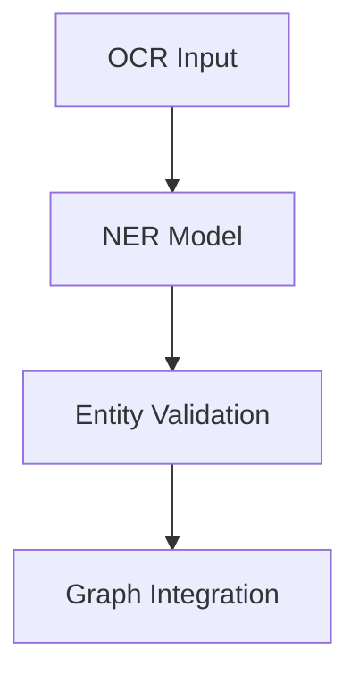

<div align="center">

# 🧪 **Kansas Frontier Matrix — Experiment Documentation Template**
`docs/templates/experiment.md`

**Purpose:** Provide a standardized format for documenting data, AI, or research experiments within the Kansas Frontier Matrix (KFM) framework.  
Ensures all experiments follow **Master Coder Protocol (MCP v6.3)**, **FAIR+CARE**, and **reproducible science** principles.

[](../README.md)
[](../../LICENSE)
[](../standards/faircare.md)
[]()

</div>

---

## 🧭 Overview

This template standardizes how experiments are described across the KFM ecosystem — whether testing new ETL processes, AI models, validation workflows, or FAIR+CARE compliance mechanisms.  
All experiments using this template are version-controlled, auditable, and compatible with CI/CD validation pipelines.

Use this format when creating new documentation files under:
```
docs/experiments/
```

---

## 🧱 Metadata (YAML Front-Matter)

Each experiment document must begin with a YAML header containing:

```yaml
---
title: "🧪 [Experiment Title]"
path: "docs/experiments/[filename].md"
version: "vX.Y.Z"
last_updated: "YYYY-MM-DD"
review_cycle: "Quarterly / Autonomous"
commit_sha: "<commit-hash>"
sbom_ref: "releases/vX.Y.Z/sbom.spdx.json"
manifest_ref: "releases/vX.Y.Z/manifest.zip"
telemetry_ref: "releases/vX.Y.Z/focus-telemetry.json"
governance_ref: "docs/standards/governance/ROOT-GOVERNANCE.md"
---
```

---

## 🎯 Objective

Clearly define the purpose of this experiment.

**Example:**
> To evaluate the accuracy of OCR-based entity extraction across 19th-century Kansas newspaper archives using the spaCy NER pipeline.

---

## 🔬 Methodology

Describe data sources, procedures, tools, and environments used.

| Component | Description |
|------------|-------------|
| **Data Source(s)** | e.g. NOAA, USGS, or Kansas Historical Society |
| **Processing Tools** | e.g. Python 3.11, spaCy v3.7, GDAL |
| **Workflow** | ETL → NLP → FAIR+CARE Validation |
| **Environment** | Docker image, compute specs, environment variables |

**Example Code Snippet:**
```bash
python src/pipelines/etl/noaa_ingest.py --source=data/raw/noaa_1950_2020.csv
python src/ai/models/focus_transformer_v1/train.py --epochs=15
```

---

## 📊 Data & Parameters

Document the datasets, configurations, and parameters used in the experiment.

| Parameter | Description | Value |
|------------|-------------|-------|
| `learning_rate` | Model training rate | `0.0005` |
| `epochs` | Training iterations | `20` |
| `ocr_model` | Text recognition model | `tesseract-v5.3.0` |
| `dataset_size` | Input record count | `125,000` |
| `spatial_extent` | Geographic coverage | `[-102.05, 37.0, -94.6, 40.0]` |

Attach relevant dataset manifest references:
```
data/sources/noaa_storms_1950_2025.json
```

---

## 🧮 Results

Summarize key findings and outputs.

| Metric | Description | Value |
|---------|-------------|-------|
| Accuracy | OCR entity extraction accuracy | 94.6% |
| Precision | Named entity precision | 92.8% |
| Recall | Named entity recall | 95.3% |
| F1 Score | Overall performance | 94.0% |

Provide charts, graphs, or tables where applicable (optional):


---

## 🧠 Discussion

Interpret the results and discuss implications.

**Example:**
> The OCR + NER pipeline performed consistently across diverse document formats. Errors occurred mainly in degraded scans or historic typography. Future models may use transformer-based OCR or domain fine-tuning to improve extraction quality.

---

## 🧩 FAIR+CARE Validation

Each experiment must document compliance with data ethics and reproducibility.

| Principle | Evaluation |
|------------|-------------|
| **Findable** | Dataset and code included in STAC/DCAT catalog. |
| **Accessible** | All scripts and data available under MIT / CC-BY. |
| **Interoperable** | Outputs adhere to STAC and GeoJSON standards. |
| **Reusable** | Experiment versioned and documented in MCP format. |
| **CARE** | Indigenous data layers reviewed and approved by governance council. |

Attach related governance documents:
```
reports/fair/faircare_summary.json  
reports/audit/github-workflows-ledger.json
```

---

## ⚙️ Reproducibility Instructions

Describe how other contributors can reproduce this experiment.

**Example:**
```bash
# 1. Clone repository
git clone https://github.com/bartytime4life/Kansas-Frontier-Matrix.git
cd Kansas-Frontier-Matrix

# 2. Launch Docker environment
docker-compose up --build

# 3. Run ETL + AI experiment
make run-experiment EXPERIMENT=ocr_ner_1850s
```

**Expected Runtime:** ~1.5 hours on 8-core CPU / 32GB RAM

---

## 📁 Outputs & Storage

List generated artifacts and their storage locations.

| Artifact | Location | Format |
|-----------|-----------|--------|
| Experiment Logs | `reports/experiments/logs/` | `.json` |
| Validation Reports | `reports/fair/` | `.json` |
| Processed Data | `data/processed/experiments/` | `.csv`, `.geojson` |
| Telemetry Metrics | `releases/v9.7.0/focus-telemetry.json` | `.json` |

---

## 🔍 Validation & CI Integration

All experiment documentation must pass the following CI workflows:

| Workflow | Purpose |
|-----------|----------|
| `docs-lint.yml` | Validates structure and front-matter. |
| `faircare-validate.yml` | Audits FAIR+CARE compliance. |
| `telemetry-export.yml` | Logs experiment metadata into telemetry. |

Validation artifacts will be archived in:
```
reports/self-validation/experiments/
```

---

## 🕰️ Version History

| Version | Date | Author | Summary |
|----------|------|---------|----------|
| v9.7.0 | 2025-11-05 | A. Barta | Created standardized experiment documentation template. |
| v9.5.0 | 2025-10-20 | A. Barta | Added FAIR+CARE integration and telemetry hooks. |
| v9.0.0 | 2025-06-01 | KFM Core Team | Initial template creation. |

---

<div align="center">

**© 2025 Kansas Frontier Matrix — CC-BY 4.0**  
Maintained under **Master Coder Protocol v6.3** · FAIR+CARE Certified · Diamond⁹ Ω / Crown∞Ω Ultimate Certified  
[Back to Template Index](README.md) · [Governance Charter](../standards/governance/ROOT-GOVERNANCE.md)

</div>
