```mermaid
flowchart LR
  A["Raw Datasets<br>USGS DEM · DASC LiDAR"] --> B["ETL Pipeline<br>Normalization & Reprojection"]
  B --> C["Comparison & Metrics<br>RMSE, Bias, Correlation"]
  C --> D["Outputs<br>CSV Reports · PNG Maps · Logs"]
  D --> E["STAC Item<br>Indexed Metadata + Provenance"]
```

<div align="center">

# 🧪 Kansas Frontier Matrix — **Experiment Documentation Template**

`docs/templates/experiment.md`

**Purpose:** Provide a **structured, reproducible MCP-compliant format** for documenting any analytical, computational, or scientific experiment within the
**Kansas Frontier Matrix (KFM)** — ensuring clarity, traceability, and transparency from hypothesis to result.

[](../../docs/)
[](../../.github/workflows/stac-validate.yml)
[](../../LICENSE)
[](../../docs/standards/reproducibility.md)

</div>

---

## 🧭 Experiment Metadata

| Field                      | Description                                                          |
| :------------------------- | :------------------------------------------------------------------- |
| **Experiment ID**          | Unique identifier (e.g., `EXP-2025-001-TERRAIN`)                     |
| **Title**                  | Descriptive title summarizing purpose                                |
| **Author(s)**              | Lead and contributing researchers                                    |
| **Affiliation(s)**         | Organization or project group                                        |
| **Date Created**           | YYYY-MM-DD                                                           |
| **Last Updated**           | YYYY-MM-DD                                                           |
| **Version**                | v1.0, v1.1, etc.                                                     |
| **Domain**                 | Terrain / Hydrology / Climate / Hazards / Landcover / Text / Tabular |
| **Status**                 | Draft / In Review / Completed / Archived                             |
| **Associated Pipeline(s)** | `src/pipelines/<domain>_pipeline.py`                                 |
| **Related Dataset(s)**     | Linked STAC items or paths (`data/processed/...`)                    |
| **Linked Issues / ADRs**   | Related design or experiment discussions                             |
| **License**                | CC-BY 4.0 (data), MIT (code), or specified otherwise                 |

---

## 🎯 Objective

> **Define the goal and hypothesis.**
> Clearly describe *what question this experiment addresses* and *what outcome you expect.*

**Example:**
*To evaluate vertical consistency between USGS 3DEP 1m DEM and Kansas DASC LiDAR data across Ellsworth County to validate hydrological modeling accuracy.*

---

## 🧩 Background & Rationale

Explain why this experiment is important in the context of KFM.
Provide any relevant **historical, scientific, or technical basis**.

> *Example:*
> *Previous terrain analyses revealed minor inconsistencies between LiDAR and 3DEP-derived DEMs. This experiment quantifies elevation offsets to improve cross-dataset hydrological integration.*

---

## ⚙️ Methodology

### 1️⃣ Data Sources

| Dataset         | Description                 | Source    | License       | Location                                 |
| :-------------- | :-------------------------- | :-------- | :------------ | :--------------------------------------- |
| `usgs_3dep_dem` | 1m Digital Elevation Model  | USGS 3DEP | Public Domain | `data/raw/terrain/ks_3dep_2018_2020.tif` |
| `ks_dasc_lidar` | Kansas LiDAR Elevation Data | DASC      | CC-BY 4.0     | `data/raw/terrain/ks_dasc_2018.tif`      |

> 🧾 Each dataset must have a corresponding **metadata file** under `data/sources/` with checksum and provenance.

---

### 2️⃣ Tools & Environment

| Tool / Library | Version | Purpose                           |
| :------------- | :------ | :-------------------------------- |
| Python         | 3.11    | Core scripting environment        |
| GDAL           | 3.8     | Raster reprojection & analysis    |
| Rasterio       | 1.4     | Raster manipulation               |
| Pandas         | 2.2     | Tabular analytics                 |
| Makefile       | —       | Pipeline orchestration            |
| GitHub Actions | —       | CI/CD validation (STAC, checksum) |

---

### 3️⃣ Data Processing Workflow

```bash
# Example workflow
make terrain
python src/pipelines/terrain_pipeline.py --config configs/terrain_experiment.yaml
python scripts/analyze_dem_consistency.py --metrics rmse,bias
```

> ✅ **Note:** All commands must be reproducible via `make <target>` or containerized execution.

---

<details>
<summary><b>📦 Input → Process → Output Diagram (click to expand)</b></summary>



</details>

---

## 🧮 Analysis & Metrics

Define **quantitative metrics** and formulas used to evaluate results.

| Metric                  | Description                             | Formula / Tool                    |
| :---------------------- | :-------------------------------------- | :-------------------------------- |
| **RMSE (m)**            | Root Mean Square Error between surfaces | `sqrt(mean((DEM1 - DEM2)^2))`     |
| **Mean Elevation Bias** | Average vertical offset                 | `np.mean(DEM1 - DEM2)`            |
| **Coverage (%)**        | % of valid elevation pixels             | `mask_valid / total_pixels * 100` |
| **Checksum Match**      | File integrity check                    | `sha256sum <filename>`            |

> 🧮 *Metrics should align with MCP’s reproducibility checklist and be automated where possible.*

---

## 🧾 Results Summary

| Output File                 | Description                          | Storage Path                            |
| :-------------------------- | :----------------------------------- | :-------------------------------------- |
| `dem_comparison_map.png`    | Hillshade and difference map overlay | `data/processed/terrain/thumbnails/`    |
| `elevation_bias_report.csv` | Quantitative comparison results      | `data/processed/tabular/`               |
| `validation.log`            | Full execution log                   | `data/work/logs/terrain_experiment.log` |

> 📊 *Include both visual and tabular evidence of findings.*

---

## 🔍 Interpretation

Explain what the results mean in KFM context.
Identify **anomalies, uncertainties, or implications**.

> Example:
> *The results confirm an RMSE of 1.4m between datasets, within expected tolerance. Notable localized bias in steep valleys suggests differences in acquisition date and vegetation modeling.*

---

## 🧠 Conclusions

Summarize findings and their **impact on future research or pipelines.**

* 3DEP and DASC datasets are spatially compatible statewide.
* Recommend automated bias correction for terrain fusion workflows.
* Integrate results into hydrology model calibration.

---

## 🧾 Reproducibility Checklist (MCP Compliance)

| MCP Principle           | Verified Implementation             |
| :---------------------- | :---------------------------------- |
| **Documentation-first** | Fully documented before execution   |
| **Reproducibility**     | All code & data version-controlled  |
| **Open Standards**      | GeoTIFF, CSV, JSON, STAC 1.0.0 used |
| **Provenance**          | Checksums and STAC metadata linked  |
| **Auditability**        | Logs stored under `data/work/logs/` |
| **Containerization**    | Reproducible via Docker or Makefile |

---

<details>
<summary><b>🧩 Extended MCP Integration (click to expand)</b></summary>

* ✅ **SHA256 verification** before and after each ETL step
* 🧱 **Data version control (DVC)** pointers tracked in Git for large files
* 🔁 **CI/CD validation** via `.github/workflows/stac-validate.yml`
* 📜 **Experiment lineage** automatically recorded in `data/stac/` items
* 📦 **Artifacts archived** with timestamps and configuration hashes

</details>

---

## 📎 References

1. [USGS 3DEP Program](https://www.usgs.gov/3dep)
2. [Kansas DASC GIS Portal](https://www.kansasgis.org/)
3. [STAC Specification v1.0.0](https://stacspec.org)
4. [CIDOC CRM Ontology](https://cidoc-crm.org/)
5. [Master Coder Protocol Standards](../../docs/standards/)

---

## 📅 Version History

| Version | Date       | Author             | Summary                                     |
| :------ | :--------- | :----------------- | :------------------------------------------ |
| v1.0    | 2025-10-04 | Documentation Team | Initial MCP experiment template release     |
| v1.1    | 2025-10-05 | KFM Engineering    | Enhanced structure & reproducibility schema |

---

<div align="center">

**Kansas Frontier Matrix** — *“Every Test Reproducible. Every Result Traceable.”*
📍 [`docs/templates/experiment.md`](.) · Standardized scientific documentation template for the Kansas Frontier Matrix.

</div>
