<div align="center">

# 🔬 Experiment Template — Kansas Frontier Matrix (MCP Standard)

**Mission:** Ensure **scientific rigor, transparency, and reproducibility** across all experiments  
(historical, cartographic, geological, environmental, or computational).  

[](../../.github/workflows/site.yml)  
[](../../.github/workflows/tests.yml)  
[](../../.github/workflows/stac-validate.yml)  
[](../../.github/workflows/stac-badges.yml)  

[](../../.github/workflows/codeql.yml)  
[](../../.github/workflows/trivy.yml)  
[](../../.github/workflows/secret-scanning.yml)  
[](../../.github/workflows/ossf-scorecard.yml)  

  
  
  

</div>

---

## 📘 Usage Notes

- Use glossary links like `[[Glossary:Hypothesis]]` to keep terminology consistent. See: [Glossary](../glossary.md).  
- Keep **raw data** separate and reference paths/IDs. Capture **provenance** and **checksums**.  
- Validate with CI hooks:  

```bash
make stac-validate
make config-validate || true
````

---

## 🔄 Experiment Lifecycle

```mermaid
flowchart TD
  A["Problem Statement"] --> B["Background & Hypothesis"]
  B --> C["Methodology & SOPs"]
  C --> D["Data Collection\n(lineage, provenance, checksums)"]
  D --> E["Run & Results\nmetrics · figures · reports"]
  E --> F["Analysis & Discussion"]
  F --> G["Conclusion & Next Steps"]
  G --> H["Roadmap Integration\nissues · milestones · markers"]
```



<!-- END OF MERMAID -->

---

## 🧾 Metadata

* **Experiment Title/ID**:
* **Date(s)**:
* **Researcher(s)**:
* **Version / Run ID**:
* **Related Repo Branch/Commit**:
* **Links**: PR/Issue, Notebook(s), Dashboard(s)

---

## ❓ Problem Statement

What question or knowledge gap is this experiment addressing?
State the **objective** (historical, environmental, geospatial, or computational).

---

## 📚 Background / Motivation

Why is this important? Provide context, theory, prior research, archival sources, or datasets.

---

## 🎯 Hypothesis

A testable prediction [[Glossary:Hypothesis]] framed as:

*If X (Independent Variable [[Glossary:Independent Variable]]) is changed, then Y (Dependent Variable [[Glossary:Dependent Variable]]) will result.*

---

## 🛠 Methodology / Procedure

* **Design & Approach**: step-by-step description
* **Tools & Equipment**: GIS [[Glossary:Cartography]], Python ETL, R spatial analysis, lab methods, etc.
* **Cross-disciplinary Roles** (if applicable):

  * Historian → archival/document analysis [[Glossary:Primary Source]]
  * Cartographer → georeferencing [[Glossary:Georeferencing]], GIS integration [[Glossary:STAC]]
  * Geologist → stratigraphy [[Glossary:Stratigraphy]], dating, paleo/environmental context [[Glossary:Paleoclimate Proxy]]

---

## 📊 Parameters and Variables

* **Independent Variables (IV)**: [[Glossary:Independent Variable]]
* **Dependent Variables (DV)**: [[Glossary:Dependent Variable]]
* **Control Variables**: [[Glossary:Control Variable]]
* **Configurations**: values, ranges, model settings
* **Assumptions / Constraints**: list data limits

---

## 📂 Data Collection & References

* **Sources**: archival docs [[Glossary:Archival Document]], USGS maps [[Glossary:Raster Data]], NOAA climate, KGS boreholes [[Glossary:Core Sample]]
* **Access Paths / IDs**: (`data/raw/...`, STAC item ID [[Glossary:STAC]], API, DOI)
* **Processing Scripts / Notebooks**: (`scripts/fetch.py`, `scripts/etl/*.py`, `notebooks/*.ipynb`)
* **Licenses & Terms**: note usage constraints
* **External References**: literature, archives, documentation

### Data Lineage

| Artifact          | Source/ID            | Transform(s)          | Output Path              | SHA-256 |
| ----------------- | -------------------- | --------------------- | ------------------------ | ------- |
| Raw map (GeoTIFF) | STAC: usgs_topo_1894 | —                     | `data/raw/...tif`        |         |
| COG               | gdal/rio-cogeo       | reproject → overviews | `data/cogs/...tif`       |         |
| Vector overlay    | ogr2ogr              | reproject → simplify  | `data/processed/...json` |         |

---

## 📈 Results / Observations

Objective reporting (no interpretation).

* Tables, charts, maps (attach artifacts or link images)
* Summaries of logs/outputs
* Notable anomalies

---

## 🔍 Analysis / Discussion

* Interpret results relative to the [[Glossary:Hypothesis]]
* Did outcomes support or contradict expectations?
* Identify trends, correlations, or sources of [[Glossary:Uncertainty]]
* Cross-validate perspectives (historical, cartographic, geological)
* Limitations & potential biases

---

## ✅ Conclusion

* Succinct findings summary
* State whether the [[Glossary:Hypothesis]] was supported
* Connect back to Problem Statement

---

## 🔮 Future Work / Next Steps

* Improvements, follow-ups, open questions
* Example: add new [[Glossary:Paleoclimate Proxy]] cores, expand GIS overlays, test symbolic reasoning

---

## 📚 References

* Cite all external data, software, and literature
* Include version/DOI/URL and access date

---

## 🔁 Reproducibility Notes

* **Environment Config**: (`configs/exp_ks_boundary.yaml`) with package pins & seeds
* **Runtime**: OS, CPU/GPU, memory, container image/tag
* **Checksums**: SHA-256 for raw/processed data (`scripts/gen_sha256.sh`) [[Glossary:Reproducibility]]
* **Logs**: `logs/experiments/<ID>/` (JSONL + Markdown run log)
* **STAC / Metadata**: link to catalog item(s) [[Glossary:STAC]]
* **Randomness**: seeds, # of trials, confidence intervals

---

## ✅ Checklists

**Pre-run**

* [ ] Hypothesis & variables defined
* [ ] Inputs located, licensed, checksummed
* [ ] Config committed & tagged
* [ ] Glossary terms referenced

**Post-run**

* [ ] Results artifacts saved (tables/charts/maps)
* [ ] Data lineage table completed
* [ ] Logs & hashes recorded
* [ ] Conclusions & next steps documented

---

## 📑 Roadmap Link

Attach roadmap marker for sync:

```markdown
<!-- roadmap:key=exp-template -->
```

---

## ✅ Summary

By following this template, each experiment becomes a **self-contained, reproducible research log** —
**consistent, auditable, and aligned with MCP + Kansas-Frontier-Matrix standards.**
