```mermaid
flowchart LR
  A["Raw Datasets<br>USGS DEM · DASC LiDAR"] --> B["ETL Pipeline<br>Normalization & Reprojection"]
  B --> C["Comparison & Metrics<br>RMSE · Bias · Correlation"]
  C --> D["Outputs<br>CSV Reports · PNG Maps · Logs"]
  D --> E["STAC Item<br>Indexed Metadata + Provenance"]
%% END OF MERMAID
```

<div align="center">

# 🧪 **Kansas Frontier Matrix — Experiment Documentation Template**  
`docs/templates/experiment.md`

**Purpose:** Provide a **structured, reproducible, MCP-compliant format** for documenting any analytical, computational, or scientific experiment within the  
**Kansas Frontier Matrix (KFM)** — ensuring clarity, traceability, security, and transparency from hypothesis to result.

[](../../docs/)
[](../../.github/workflows/docs-validate.yml)
[](../../.github/workflows/stac-validate.yml)
[](../../.github/workflows/policy-check.yml)
[](../../.github/workflows/)
[](../../.github/workflows/sbom.yml)
[](../../LICENSE)

</div>

---

```yaml
---
title: "Kansas Frontier Matrix — Experiment Template"
version: "v1.3.0"
last_updated: "2025-10-18"
owners: ["@kfm-data","@kfm-research","@kfm-architecture","@kfm-security"]
tags: ["experiment","reproducibility","mcp","stac","prov-o","etl","ci","fair","security","ethics","ai"]
status: "Template"
license: "CC-BY 4.0"
semantic_alignment:
  - MCP-DL v6.3
  - STAC 1.0
  - W3C PROV-O
  - JSON Schema
  - FAIR Principles
  - ISO 19115 / ISO 8601
  - GeoSPARQL
ci_required_checks:
  - docs-validate
  - stac-validate
  - pre-commit
  - codeql
  - trivy
  - gitleaks
  - policy-check
supply_chain:
  slsa_target: "Level 3"
  sbom_format: "SPDX 2.3 (JSON)"
---
```

---

## 🧭 Experiment Metadata

| Field                      | Description                                                          |
| :------------------------- | :------------------------------------------------------------------- |
| **Experiment ID**          | Unique identifier (e.g., `EXP-2025-001-TERRAIN`)                     |
| **Title**                  | Descriptive title summarizing purpose                                |
| **Author(s)**              | Lead and contributing researchers                                    |
| **Affiliation(s)**         | Organization or project group                                        |
| **Date Created**           | YYYY-MM-DD                                                           |
| **Last Updated**           | YYYY-MM-DD                                                           |
| **Version**                | v1.0, v1.1, etc. (SemVer)                                            |
| **Domain**                 | Terrain / Hydrology / Climate / Hazards / Landcover / Text / Tabular |
| **Status**                 | Draft / In Review / Completed / Archived                             |
| **Associated Pipeline(s)** | `src/pipelines/<domain>_pipeline.py`                                 |
| **Related Dataset(s)**     | Linked STAC items or paths (`data/processed/...`)                    |
| **Linked Issues / ADRs**   | Related design or experiment discussions                             |
| **License**                | CC-BY 4.0 (data), MIT (code), or specified otherwise                 |

---

## 🎯 Objective

> **Define the goal and hypothesis.**
> What question does this experiment address, and what outcome is expected?

**Example**  
*Evaluate vertical consistency between USGS 3DEP 1m DEM and Kansas DASC LiDAR across Ellsworth County to validate hydrologic modeling accuracy.*

---

## 🧩 Background & Rationale

Explain why this experiment is important in the KFM context.  
Provide relevant **historical/scientific/technical** basis, prior work, or validation gaps.

---

## ⚙️ Methodology

### 1️⃣ Data Sources

| Dataset         | Description                 | Source    | License       | Location                                 |
| :-------------- | :-------------------------- | :-------- | :------------ | :--------------------------------------- |
| `usgs_3dep_dem` | 1m Digital Elevation Model  | USGS 3DEP | Public Domain | `data/raw/terrain/ks_3dep_2018_2020.tif` |
| `ks_dasc_lidar` | Kansas LiDAR Elevation Data | DASC      | CC-BY 4.0     | `data/raw/terrain/ks_dasc_2018.tif`      |

> Each dataset must include a **source manifest** (`data/sources/**`), **checksum** (`*.sha256`), and **STAC item** (`data/stac/**`).

---

### 2️⃣ Tools & Environment

| Tool / Library | Version | Purpose                            |
| :------------- | :------ | :--------------------------------- |
| Python         | 3.11    | Core scripting environment         |
| GDAL           | 3.8     | Raster reprojection & analysis     |
| Rasterio       | 1.4     | Raster manipulation                |
| Pandas         | 2.2     | Tabular analytics                  |
| Makefile       | —       | Pipeline orchestration             |
| Docker/OCI     | —       | Reproducible containerized runtime |
| GitHub Actions | —       | CI/CD validation (STAC, checksums) |

**Record (required):** container image + digest, `environment.yml`/`requirements.txt`, Git commit SHA, **SBOM** path if applicable.

---

### 3️⃣ Data Processing Workflow

```bash
# Example workflow
make terrain
python src/pipelines/terrain_pipeline.py --config configs/terrain_experiment.yaml
python scripts/analyze_dem_consistency.py --metrics rmse,bias
```

> ✅ All commands must be reproducible via `make <target>` or containerized execution.

---

<details>
<summary><b>📦 Input → Process → Output Diagram (click to expand)</b></summary>



</details>

---

## 🧮 Analysis & Metrics

Define **quantitative metrics** and formulas used to evaluate results.

| Metric                  | Description                             | Formula / Tool                    |
| :---------------------- | :-------------------------------------- | :-------------------------------- |
| **RMSE (m)**            | Root Mean Square Error between surfaces | `sqrt(mean((DEM1 - DEM2)^2))`     |
| **Mean Elevation Bias** | Average vertical offset                 | `np.mean(DEM1 - DEM2)`            |
| **Coverage (%)**        | % of valid elevation pixels             | `mask_valid / total_pixels * 100` |
| **Checksum Match**      | File integrity check                    | `sha256sum <filename>`            |

> Include benchmark/thresholds when relevant and cite sources.

---

## 🧾 Results Summary

| Output File                 | Description                          | Storage Path                            |
| :-------------------------- | :----------------------------------- | :-------------------------------------- |
| `dem_comparison_map.png`    | Hillshade and difference map overlay | `data/processed/terrain/thumbnails/`    |
| `elevation_bias_report.csv` | Quantitative comparison results      | `data/processed/tabular/`               |
| `validation.log`            | Full execution log                   | `data/work/logs/terrain_experiment.log` |

> Include **visual** and **tabular** evidence of findings.

---

## 🔍 Interpretation

Explain what the results mean for KFM; identify **anomalies**, **uncertainties**, and **operational implications**.

---

## 🧠 Conclusions

Summarize findings and **impacts on future research/pipelines**.  
State next steps and any **recommended SOP updates**.

---

## 🔐 Risk, Ethics & Security

| Concern            | Mitigation                                                |
| :----------------- | :-------------------------------------------------------- |
| **PII exposure**   | Use only public/aggregated data; redact at source         |
| **Model bias**     | Compare metrics across regions/time; report uncertainty   |
| **Data licensing** | Confirm STAC `license` & `providers`; include attribution |
| **Security**       | Scan containers/deps (Trivy); secrets via OIDC            |

---

## 🧾 Reproducibility Checklist (MCP Compliance)

| MCP Principle           | Verified Implementation             |
| :---------------------- | :---------------------------------- |
| **Documentation-first** | Fully documented before execution   |
| **Reproducibility**     | Code & data version-controlled      |
| **Open Standards**      | GeoTIFF, CSV, JSON, STAC 1.0.0 used |
| **Provenance**          | Checksums and STAC metadata linked  |
| **Auditability**        | Logs stored under `data/work/logs/` |
| **Containerization**    | Docker/OCI image + digest recorded  |

<details>
<summary><b>🧩 Extended MCP Integration (click to expand)</b></summary>

* ✅ **SHA256 verification** before/after ETL steps  
* 🧱 **Data version control (DVC)** pointers in Git for large objects (if used)  
* 🔁 **CI/CD validation** via `.github/workflows/stac-validate.yml`  
* 📜 **Experiment lineage** written to `data/stac/` Items (PROV-O fields)  
* 📦 **Artifacts archived** with timestamps & configuration hashes  
* 🧪 **Golden tests** for reproducible metrics where applicable  
* 📑 **SBOM/SLSA artifacts** attached to releases (if experiment published)
</details>

---

## 📎 References

1. USGS 3DEP — <https://www.usgs.gov/3dep>  
2. Kansas DASC — <https://www.kansasgis.org/>  
3. STAC 1.0.0 — <https://stacspec.org>  
4. W3C PROV-O — <https://www.w3.org/TR/prov-o/>  
5. FAIR Principles — <https://www.go-fair.org/fair-principles/>  
6. KFM Standards — `../../docs/standards/`

---

## 📅 Version History

| Version | Date       | Author             | Summary                                                        |
| :------ | :--------- | :----------------- | :------------------------------------------------------------- |
| **v1.3.0** | 2025-10-18 | KFM Docs Team      | Added policy gates, SBOM/SLSA notes, golden tests, expanded MCP section |
| **v1.2.0** | 2025-10-17 | KFM Docs Team      | YAML header, risk/ethics, CI checks, containerization          |
| **v1.1.0** | 2025-10-05 | KFM Engineering    | Enhanced structure & reproducibility schema                    |
| **v1.0.0** | 2025-10-04 | Documentation Team | Initial MCP experiment template release                        |

---

<div align="center">

**Kansas Frontier Matrix** — *“Every Test Reproducible. Every Result Traceable.”*  
📍 `docs/templates/experiment.md` — MCP-compliant scientific documentation template for the Kansas Frontier Matrix.

</div>