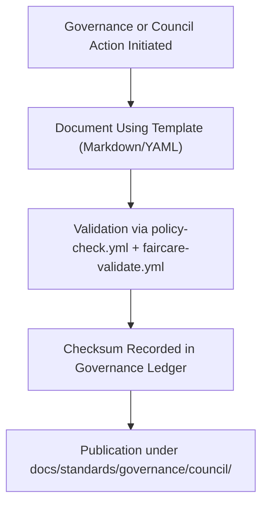

<div align="center">

# ⚖️ **Kansas Frontier Matrix — Governance Documentation Templates (v2.1.1 · Tier-Ω+∞ Certified)**  
`docs/templates/governance/README.md`

**Mission:** Provide standardized templates for documenting **governance activities, ethics audits, and compliance reviews**  
within the **Kansas Frontier Matrix (KFM)** — ensuring FAIR+CARE-aligned oversight and reproducibility in all governance records.

[](../../../docs/)
[](../../../docs/standards/faircare-validation.md)
[](../../../data/reports/audit/data_provenance_ledger.json)
[](../../../LICENSE)

</div>

---

## 📚 Overview

This directory hosts **governance-related documentation templates**, including:
- 🏛️ **Council Reports & Ethics Reviews**  
- 🧩 **Governance Ledger Entries & Sign-Offs**  
- 🧠 **FAIR+CARE Compliance Statements**  
- ⚙️ **Audit and Risk Assessment Templates**

These templates ensure all KFM governance artifacts are reproducible, auditable, and aligned  
with FAIR+CARE principles and Master Coder Protocol (MCP-DL v6.4.3) standards.

---

## 🗂️ Directory Layout

```bash
docs/templates/governance/
├── README.md                           # This file — governance documentation template index
├── governance-report-template.md        # Template for quarterly or annual governance council reports
├── faircare-compliance-template.md      # Template for FAIR+CARE audit certifications
├── governance-signoff-template.md       # Template for ledger-approved sign-off forms
└── risk-assessment-template.md          # Template for audit and ethical risk evaluations
```

---

## ⚙️ Governance Documentation Workflow


<!-- END OF MERMAID -->

---

## 🧱 Template Categories

| Template | Purpose | Maintained By | Validation Workflow |
|:--|:--|:--|:--|
| **governance-report-template.md** | Standardized council report for quarterly audits. | @kfm-governance | `policy-check.yml` |
| **faircare-compliance-template.md** | Certifies datasets and processes for FAIR+CARE ethics alignment. | @kfm-governance | `faircare-validate.yml` |
| **governance-signoff-template.md** | Documents checksum, ledger, and council approvals. | @kfm-docs | `governance-ledger.yml` |
| **risk-assessment-template.md** | Tracks potential compliance or ethical risks. | @kfm-security | `policy-check.yml` |

---

## 🧩 Governance Metadata Schema

All governance documents must begin with a YAML frontmatter block for CI/CD validation and ledger tracking.

```yaml
---
report_id: "2025_Q4_GOVERNANCE_REPORT"
authors: ["@kfm-governance","@kfm-docs"]
approved_by: ["@kfm-security","@kfm-architecture"]
review_cycle: "Quarterly"
checksum: "sha256:a9b83fbe4d18d1..."
ledger_reference: "data/reports/audit/data_provenance_ledger.json"
license: "CC-BY 4.0"
---
```

---

## 🧠 FAIR + CARE Alignment

| FAIR Principle | CARE Principle | Governance Integration |
|:--|:--|:--|
| **Findable** | **Collective Benefit** | All governance reports indexed in manifest and ledger. |
| **Accessible** | **Authority to Control** | Open data with transparent ethical governance. |
| **Interoperable** | **Responsibility** | Standardized YAML schemas for all governance docs. |
| **Reusable** | **Ethics** | Templates and records remain open and auditable. |

---

## 🧾 Validation Workflows

| Workflow | Function | Output |
|:--|:--|:--|
| `policy-check.yml` | Ensures required fields and metadata. | `reports/audit/policy_check.json` |
| `faircare-validate.yml` | Runs FAIR+CARE compliance validation. | `reports/fair/data_care_assessment.json` |
| `governance-ledger.yml` | Logs document checksum and council approvals. | `data/reports/audit/data_provenance_ledger.json` |
| `docs-validate.yml` | Confirms structure, links, and accessibility. | `reports/validation/docs_validation.json` |

---

## 🧾 Governance Metadata Example

```yaml
---
template_id: "gov_faircare_compliance_v2.1.1"
authors: ["@kfm-governance"]
checksum: "sha256:ee61a3b442b7a5..."
governance_ledger_entry: "data/reports/audit/data_provenance_ledger.json"
status: "Approved"
faircare_certification: "Tier-Ω+∞ Certified"
license: "CC-BY 4.0"
---
```

---

## 🧾 Version History

| Version | Date | Author | Summary |
|:--|:--|:--|:--|
| **v2.1.1** | 2025-11-16 | @kfm-governance | Added FAIR+CARE certification and risk assessment templates. |
| v2.0.0 | 2025-10-25 | @kfm-docs | Introduced governance metadata and validation integration. |
| v1.0.0 | 2025-10-04 | @kfm-architecture | Initial governance documentation template set. |

---

<div align="center">

**Kansas Frontier Matrix © 2025**  
*“Governance Without Transparency Is Incomplete.”*  
📍 `docs/templates/governance/README.md` — Governance documentation template index and standards guide for Kansas Frontier Matrix.

</div>

