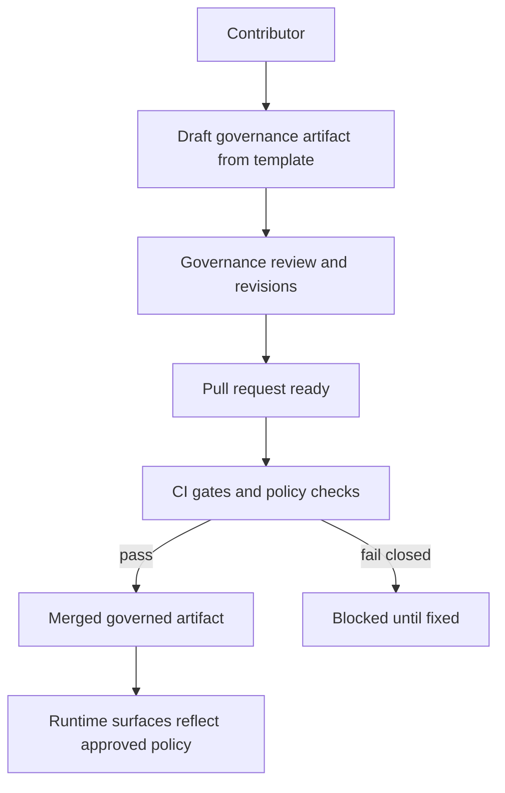

<!-- [KFM_META_BLOCK_V2]
doc_id: kfm://doc/5486db6a-06d5-4e3e-a232-b24267d3f2c6
title: Governance Templates
type: standard
version: v1
status: draft
owners: [TBD]
created: 2026-03-05
updated: 2026-03-05
policy_label: public
related: [
  docs/templates/README.md,
  docs/governance/ROOT_GOVERNANCE.md,
  docs/governance/ETHICS.md,
  docs/governance/SOVEREIGNTY.md
]
tags: [kfm, governance, templates]
notes: [
  "Directory README for governance-oriented templates. Template inventory is intentionally explicit about CONFIRMED vs PROPOSED artifacts."
]
[/KFM_META_BLOCK_V2] -->

# Governance Templates
Reusable, **fail-closed** scaffolds for KFM governance artifacts (policies, checklists, exceptions, sensitivity/redaction plans).

> **Status:** draft (template catalog)  
> **Owners:** TBD (Governance maintainers)  
> **Policy label:** public (templates only; do not store restricted content here)

<div align="center">

<!-- Badges: placeholders are OK; replace once repo metadata is wired -->


</div>

**Quick links:** [Scope](#scope) · [Where it fits](#where-it-fits) · [Template registry](#template-registry) · [Quickstart](#quickstart) · [Review gates](#review-gates) · [Add a template](#adding-a-new-template) · [FAQ](#faq)

---

## Scope

### In scope
- **Document templates** for governance artifacts (policy docs, review checklists, exception/waiver requests, sensitivity classifications, redaction plans).
- **Checklists** that make governance requirements executable in PR review (and later in CI).
- **Minimal examples** showing how to use the templates (synthetic, public-safe).

### Out of scope
- **Final, authoritative governance policy text** (belongs in `docs/governance/`).
- **Policy-as-code (OPA/Rego) and enforcement configs** (belongs in policy/tooling directories, not templates).
- **Real sensitive data** (locations, identities, access credentials, incident details).

> IMPORTANT: Templates should *force* authors to decide policy posture, sensitivity classification, and evidence, but templates must not include restricted examples.

[Back to top](#governance-templates)

---

## Where it fits

**CONFIRMED (invariants described in KFM blueprints):**
- KFM treats the governed API as the enforcement boundary; clients should not access storage/DB directly (“trust membrane”).  
- Policy is **fail-closed** (deny-by-default posture).  
- Focus/Story publishing is evidence-led: **cite-or-abstain** with audit references.  
- Sensitive data handling includes explicit **policy labels**, **derivative datasets** for redaction/generalization, and CI regression tests to prevent leakage.  

These templates exist to make those invariants easier to apply consistently in docs and review workflows.

**Upstream (inputs):**
- Governance decisions (what should be allowed)  
- Risk assessments, ethics/CARE considerations  
- Data-source onboarding and promotion design (RAW → WORK → PROCESSED → …)

**Downstream (outputs):**
- Governed docs in `docs/governance/`
- PR artifacts that reviewers can use to validate policy/safety
- Eventually: CI checks and policy-as-code that operationalize the same requirements

[Back to top](#governance-templates)

---

## Acceptable inputs

- Markdown templates: `TEMPLATE__*.md`
- Supporting checklist YAML (only if a consumer exists): `*.yml` (PROPOSED)
- Example snippets that are **synthetic** and labeled as such

---

## Exclusions

- Secrets, tokens, private URLs, credentials
- Personally identifying or vulnerable-location details
- Any “policy decision” content that belongs in `docs/governance/` (authoritative) rather than here (scaffold)

---

## Directory tree

```text
docs/templates/governance/
├── README.md                                 # CONFIRMED (this file)
├── TEMPLATE__GOVERNANCE_DECISION_RECORD.md   # PROPOSED
├── TEMPLATE__POLICY_EXCEPTION.md             # PROPOSED
├── TEMPLATE__SENSITIVITY_CLASSIFICATION.md   # PROPOSED
├── TEMPLATE__REDACTION_PLAN.md               # PROPOSED
└── TEMPLATE__REVIEW_CHECKLIST.md             # PROPOSED
```

> NOTE: Only `README.md` is guaranteed to exist when this file is first introduced. Add the PROPOSED templates as separate small PRs.

[Back to top](#governance-templates)

---

## Quickstart

1) **Pick the right template** from the registry below.  
2) **Copy it** into the governed location (usually `docs/governance/` or a dataset-specific folder).  
3) **Fill required fields** (policy label, sensitivity class, evidence links, reviewers).  
4) **Run checks** (lint + link check + any policy tests your repo supports).  
5) **Open a PR** and request the required reviewers.

```bash
# PSEUDOCODE: adapt to your repo commands and paths

# 1) Copy a template into a governed artifact location
cp docs/templates/governance/TEMPLATE__POLICY_EXCEPTION.md \
   docs/governance/exceptions/EXCEPTION__<short_name>.md

# 2) Run doc quality checks (if available)
make docs-lint
make docs-linkcheck

# 3) (Optional) run policy checks locally (if your repo supports it)
./tools/policy/run_conftest.sh
```

[Back to top](#governance-templates)

---

## Diagram


```mermaid
flowchart TD
  Contributor[Contributor] --> Draft[Draft governance artifact from template]
  Draft --> Review[Governance review and revisions]
  Review --> PR[Pull request ready]
  PR --> CI[CI gates and policy checks]
  CI -->|pass| Merge[Merged governed artifact]
  CI -->|fail closed| Block[Blocked until fixed]
  Merge --> Runtime[Runtime surfaces reflect approved policy]
```

---

## Template registry

> Status legend: **CONFIRMED** = present and in use; **PROPOSED** = intended but not yet present; **UNKNOWN** = needs verification in repo.

| Template file | Purpose | When to use | Key required fields | Status |
|---|---|---|---|---|
| `README.md` | Explains this directory | Always | n/a | **CONFIRMED** |
| `TEMPLATE__GOVERNANCE_DECISION_RECORD.md` | Record a governance decision (what, why, scope, rollback) | When policy posture changes or a new governance mechanism is adopted | decision, rationale, affected surfaces, test/CI gates, rollback | **PROPOSED** |
| `TEMPLATE__POLICY_EXCEPTION.md` | Request a time-bounded exception/waiver | When a gate can’t be met temporarily, but work must proceed safely | exception scope, expiry, mitigations, approvals | **PROPOSED** |
| `TEMPLATE__SENSITIVITY_CLASSIFICATION.md` | Classify dataset/fields and handling | When onboarding data, changing access, or publishing derived layers | policy_label, sensitivity_class, obligations, evidence | **PROPOSED** |
| `TEMPLATE__REDACTION_PLAN.md` | Specify redaction/generalization as a transformation | When producing public-safe derivatives from restricted/sensitive inputs | redaction method, thresholds, provenance notes, tests | **PROPOSED** |
| `TEMPLATE__REVIEW_CHECKLIST.md` | Checklist for enabling patterns in governed mode | Before promoting a dataset or enabling a new runtime surface | trust membrane, licensing, immutability, audit, sensitivity | **PROPOSED** |

[Back to top](#governance-templates)

---

## Template conventions

### Naming
- `TEMPLATE__<AREA>_<NAME>.md` (e.g., `TEMPLATE__REDACTION_PLAN.md`)
- Keep names stable; treat template name changes as breaking for downstream docs.

### Required metadata in every governed artifact created from these templates
At minimum, every artifact should clearly state:
- **Policy label** (e.g., public / restricted / sensitive-location / aggregate-only)
- **Sensitivity posture** (what must be redacted/generalized)
- **Evidence posture** (what sources support claims; “cite-or-abstain” if unsupported)
- **Review owners** (who must sign off)

> TIP: If your repo supports it, include a standard metadata block (MetaBlock or front matter) so validators can lint it.

### Truth labeling
Every significant claim in governed artifacts should be labeled as:
- **CONFIRMED** (linked evidence exists and is inspectable)
- **PROPOSED** (a recommended change, design, or plan)
- **UNKNOWN** (insufficient evidence; list the smallest verification steps)

This makes it easier for review and prevents “accidental authority.”

### Sensitivity classes
Use a small set of explicit classes and enforce them consistently:
- **Public** (safe to publish without redaction)
- **Restricted** (role-based access required)
- **Sensitive-location** (precise coordinates must be generalized/suppressed)
- **Aggregate-only** (publish only above thresholds; avoid small-count reidentification)

### Redaction as a transformation
If redaction/generalization happens:
- Treat it as a **first-class transformation**
- Keep raw immutable
- Publish redacted outputs as a **separate dataset/version**
- Record the transformation in provenance (what changed, why, and how it was tested)

[Back to top](#governance-templates)

---

## Review gates

Use these as minimum gates for any governance change or for introducing a pattern that affects policy/safety:

- **Trust membrane gate:** no direct client access to storage/DB/object store; all access through governed APIs.
- **Fail-closed gate:** missing evidence, missing policy context, or unverifiable citations must block publish.
- **Evidence gate:** any factual claims in Story/Focus/published docs must have resolvable evidence or abstain.
- **Sensitivity gate:** “sensitive-location” and “aggregate-only” must be checked for leakage risk and thresholds.
- **Audit gate:** governed operations should produce audit references (and those audit logs are themselves sensitive).

> WARNING: Avoid “ghost metadata” that reveals the existence of restricted sources unless policy explicitly allows it.

[Back to top](#governance-templates)

---

## Adding a new template

1) **Keep it small**: add one template per PR (reversible, easy to review).
2) **Explain consumers**: who uses it, and what downstream gate/workflow it supports.
3) **Include a minimal example** (synthetic, public-safe).
4) **Add it to the registry table** and the directory tree.
5) **Add a “DoD checklist” section** inside the template itself (what makes an instance valid).

```bash
# PSEUDOCODE: suggested minimal PR scope
git checkout -b templates/governance-add-redaction-plan
$EDITOR docs/templates/governance/TEMPLATE__REDACTION_PLAN.md
git add docs/templates/governance/TEMPLATE__REDACTION_PLAN.md docs/templates/governance/README.md
git commit -m "docs(templates): add governance redaction plan template"
```

---

## Definition of done checklist

- [ ] Template has a one-line purpose under the title
- [ ] Includes required metadata fields (policy label, sensitivity class, reviewers)
- [ ] Includes a section that forces “CONFIRMED / PROPOSED / UNKNOWN” labeling
- [ ] Includes a redaction/safety section (even if “not applicable”)
- [ ] Includes validation steps (lint/linkcheck/policy tests) as **pseudocode** if commands vary
- [ ] Added to directory tree + registry table
- [ ] No real sensitive examples included
- [ ] Review owners identified (or marked TBD with follow-up issue)

---

## FAQ

**Do templates belong here or in `docs/governance/`?**  
Templates belong here. Final, authoritative governance artifacts belong in `docs/governance/`.

**Can we store policy-as-code here?**  
No. Keep policy-as-code in dedicated policy/tooling locations; templates can *reference* it.

**What if a template needs restricted examples?**  
Don’t include them. Use synthetic examples and document how restricted material is handled via redaction/generalization.

---

## Appendix

<details>
<summary>Example skeleton (pseudocode) for a governance artifact</summary>

```markdown
<!-- [KFM_META_BLOCK_V2]
doc_id: kfm://doc/<uuid>
title: <Artifact title>
type: standard
version: v1
status: draft
owners: [<team>]
created: YYYY-MM-DD
updated: YYYY-MM-DD
policy_label: public|restricted|...
related: [<paths or kfm:// ids>]
tags: [kfm, governance]
notes: []
[/KFM_META_BLOCK_V2] -->

# <Artifact title>
One-line purpose.

## Decision
- **PROPOSED:** ...
- **CONFIRMED:** ... (link to evidence)
- **UNKNOWN:** ... (verification steps)

## Policy posture
- policy_label:
- obligations:

## Sensitivity and redaction
- sensitivity_class:
- redaction plan (if any):

## Evidence
- EvidenceRefs / links:
- If evidence is missing: abstain and record why

## Review and rollout
- reviewers:
- rollout plan:
- rollback plan:
- CI gates impacted:
```

</details>

[Back to top](#governance-templates)
