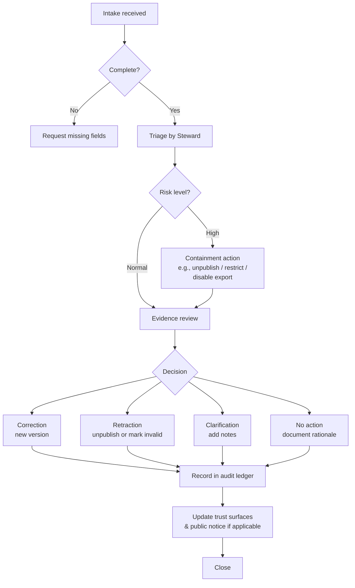

<!-- [KFM_META_BLOCK_V2]
doc_id: kfm://doc/04cde9e2-81b1-4fb9-9f5a-341a039c3eaa
title: TEMPLATE — Appeals and Corrections
type: standard
version: v1
status: draft
owners: <team or names>
created: 2026-03-05
updated: 2026-03-05
policy_label: restricted
related:
  - <kfm://story/<uuid>@v1 | kfm://dataset/<slug>@<version> | kfm://policy_decision/<id>>
tags:
  - kfm
  - governance
  - appeals
  - corrections
notes:
  - "Template for filing and resolving corrections/appeals across Story Nodes, datasets, and Focus Mode outputs."
[/KFM_META_BLOCK_V2] -->

# TEMPLATE: Appeals and Corrections
Standard record for reporting, reviewing, and resolving corrections/appeals in Kansas Frontier Matrix (KFM).

> **IMPACT**
> - **Status:** draft (template)
> - **Owners:** `<team or names>`
> - **Default policy label:** `restricted` (change to `public` only after removing personal data)
> - **Badges:**   <!-- TODO: replace placeholders -->
>
> **Quick nav:** [When to use](#when-to-use) · [Workflow](#workflow-overview) · [Fill-in record](#fill-in-record) · [Decision options](#decision-options) · [Closure checklist](#closure-checklist)

---

## Scope
This template covers **corrections** (fixing factual/structural errors) and **appeals** (requesting review of a governance/policy decision) for KFM artifacts:

- Story Nodes (published narratives + citations)
- Datasets and derived artifacts (catalogs, tiles, exports)
- Focus Mode outputs (answers that must be evidence-led)
- Policy decisions and obligations (access + sensitivity + rights)

## Where it fits
- **Path:** `docs/templates/governance/TEMPLATE__APPEALS_AND_CORRECTIONS.md`
- **Downstream use:** copy into a new governance record, ticket, or PR description; link it from the audit ledger entry and any public-facing correction notice.

## Acceptable inputs
- The **artifact identifier(s)** (e.g., `story_id`, `dataset_slug@dataset_version_id`)
- An **audit reference** (`audit_ref`) for the published item/run/decision being disputed
- A clear description of what is wrong and what “correct” should be, plus supporting evidence

## Exclusions
- **Security incidents** (use the security/incident response playbook instead)
- **Feature requests** (use product backlog / RFC)
- **General “how do I” support** (use support channels)

---

## When to use
Use this template when any of the following is true:

1. A user reports an error in a published Story Node or dataset.
2. A stakeholder disputes a policy label, rights classification, or publication decision.
3. A correction is required due to upstream updates (data corrections, rights changes, etc.).
4. A Focus Mode answer is demonstrably wrong, misleading, or missing critical citations.

---

## Workflow overview


---

## Fill-in record
> Copy this section into a new file/ticket and replace all `<...>` placeholders.

### 1) Intake summary
| Field | Value |
|---|---|
| Appeal / Correction ID | `kfm://appeal/<uuid>` |
| Received at | `<YYYY-MM-DD>` |
| Received via | `<email | form | issue | internal>` |
| Request type | `<correction | appeal>` |
| Scope | `<story | dataset | focus_answer | policy_decision | other>` |
| Urgency claimed by requester | `<low | medium | high>` |
| Steward owner | `<name/team>` |
| Reviewers | `<names/teams>` |
| Current status | `<intake | triage | investigating | decided | implementing | closed>` |

### 2) Requester (data minimization)
> **IMPORTANT:** collect only what you need. Prefer organization + role over personal details.

- Requester type: `<public | partner | internal>`
- Name/Org: `<...>`
- Contact: `<email or handle>` *(optional; remove before public release)*
- Relationship to artifact: `<author | subject matter expert | affected party | reader | other>`

### 3) Affected artifacts
List every affected artifact **with identifiers and versions**.

- Story Node(s):  
  - `story_id`: `<kfm://story/<uuid>@v?>`  
  - `audit_ref`: `<kfm://run/... | kfm://policy_decision/... | other>`
- Dataset(s):  
  - `dataset_slug`: `<slug>`  
  - `dataset_version_id`: `<YYYY-MM.hash>`  
  - `audit_ref`: `<...>`
- UI surface(s): `<Map Explorer layer id | Story Mode page | Focus Mode query id>`
- External references (if any): `<URL / citation>`

### 4) What is being contested?
#### 4.1 Summary
- Alleged issue: `<one sentence>`
- Requested outcome: `<one sentence>`

#### 4.2 Detailed description
<Describe the error/appeal in detail. Include what was observed, why it is wrong, and what correct looks like.>

#### 4.3 Disputed claims (cite-or-abstain discipline)
> Each claim must be labeled and tied to evidence.

| # | Claim text | Current status | What’s wrong? | Proposed corrected claim | Evidence refs |
|---:|---|---|---|---|---|
| 1 | `<...>` | `<CONFIRMED | PROPOSED | UNKNOWN>` | `<...>` | `<...>` | `<CITATION: doc://...>` |
| 2 | `<...>` | `<CONFIRMED | PROPOSED | UNKNOWN>` | `<...>` | `<...>` | `<CITATION: stac://...>` |

**If any claim is `UNKNOWN`, list the smallest verification steps to make it `CONFIRMED`:**
- `<step 1>`
- `<step 2>`

### 5) Evidence packet
Attach or link evidence that supports the correction/appeal.

**Primary sources**
- `<CITATION: doc://sha256:...#page=...>`
- `<CITATION: dcat://dataset@version>`
- `<CITATION: prov://kfm://run/...>`
- `<CITATION: stac://...>`

**Secondary sources (optional)**
- `<...>`

**Notes on evidence quality**
- Authority / provenance: `<...>`
- Reproducibility: `<...>`
- Conflicts / disagreement: `<...>`

---

## Triage
### 6) Risk and impact assessment (steward)
| Dimension | Assessment | Notes |
|---|---|---|
| Public credibility impact | `<low | medium | high>` | `<...>` |
| Safety / sensitive location risk | `<low | medium | high>` | `<...>` |
| Rights / licensing risk | `<low | medium | high>` | `<...>` |
| Policy / access control risk | `<low | medium | high>` | `<...>` |
| Blast radius (how many artifacts affected) | `<1 | few | many>` | `<...>` |

### 7) Immediate containment (if needed)
- [ ] No containment needed
- [ ] Temporarily unpublish Story Node(s)
- [ ] Temporarily restrict dataset/version (tighten `policy_label`)
- [ ] Disable exports / downloads for affected artifacts
- [ ] Add prominent “under review” notice in UI

Containment actions taken:
- `<action + timestamp + who + reference>`

---

## Decision options
> Select **one** outcome and document why.

### 8) Decision
- [ ] **Correction** (publish a **new version**)  
- [ ] **Retraction** (unpublish or mark invalid)  
- [ ] **Clarification** (add notes; no factual change)  
- [ ] **No action** (request denied; document rationale)

**Decision rationale**
- Why this outcome: `<...>`
- Evidence supporting decision: `<...>`
- Dissenting views / alternatives considered: `<...>`

### 9) Special governance checks (as applicable)
- **Contested topics (stories):**
  - [ ] Add “multiple sources” section
  - [ ] Add uncertainty notes
  - [ ] Consider publishing multiple perspectives as linked Story Nodes

- **Rights / licensing:**
  - [ ] Rights verified and recorded
  - [ ] If rights changed: publish new dataset/story versions and update dependent stories

- **Sensitive locations:**
  - [ ] Confirm classification (e.g., `restricted_sensitive_location`)
  - [ ] If public representation allowed: create dual outputs (restricted precise + public generalized)
  - [ ] Test that no precise coordinates leak
  - [ ] Add UI notice explaining generalization
  - [ ] Governance authority approval recorded

---

## Implementation plan
### 10) What will change?
| Item | Current | New | Notes |
|---|---|---|---|
| Story version | `<...>` | `<...>` | `<...>` |
| Dataset version | `<...>` | `<...>` | `<...>` |
| Policy label | `<...>` | `<...>` | `<...>` |
| UI notice | `<none | existing>` | `<text>` | `<...>` |

### 11) Steps (small, reversible, additive)
1. `<Step 1>`
2. `<Step 2>`
3. `<Step 3>`

### 12) Verification / gates
- [ ] Citations resolve (link-check / evidence resolver)
- [ ] Rights verified (if applicable)
- [ ] Sensitivity scan passed (if applicable)
- [ ] Interpretive claims labeled (Story Nodes)
- [ ] All actions logged to audit ledger (see below)
- [ ] UI updated with “last corrected” info (if public-facing)

---

## Communications
### 13) Public correction notice (if applicable)
- Publish notice? `<yes | no>`
- Where shown: `<Story page | Dataset page | Focus response | other>`
- Summary text (plain language): `<...>`
- Link to updated version(s): `<...>`

<details>
<summary>Optional: suggested notice format</summary>

**Correction posted:** `<YYYY-MM-DD>`  
**What changed:** `<1–3 bullets>`  
**Why it changed:** `<1–2 sentences>`  
**What to trust now:** `<new story/version id(s)>`  
**Evidence:** `<top 1–3 citations>`

</details>

---

## Audit & closure
### 14) Audit ledger entry
> Record a durable entry linking intake → decision → implementation.

- Audit ledger record id: `<kfm://audit/<uuid>>`
- Related `audit_ref`(s): `<...>`
- Decision id (if policy involved): `<kfm://policy_decision/<id>>`
- Implementation PR / change ref: `<PR link or commit>`
- Effective at: `<timestamp>`
- Steward sign-off: `<name + date>`
- Reviewer sign-off (if required): `<name + date>`

### 15) Closure checklist
- [ ] Intake complete (ids + audit_ref captured)
- [ ] Evidence packet complete
- [ ] Triage complete
- [ ] Decision recorded
- [ ] Implementation completed (or explicitly declined)
- [ ] Audit ledger updated
- [ ] UI “last corrected” updated (if applicable)
- [ ] Public notice published (if applicable)
- [ ] Retrospective notes captured (optional)

### 16) Retrospective (optional)
- Root cause category: `<upstream error | ingestion bug | citation drift | rights change | policy bug | narrative drift | other>`
- Prevent recurrence: `<test | validator | workflow update | training | other>`
- Follow-up tasks / ADRs: `<links>`

---

## Appendix
<details>
<summary>Optional machine-readable sidecar (PROPOSED)</summary>

```json
{
  "kfm_appeal_record_version": "v1",
  "appeal_id": "kfm://appeal/<uuid>",
  "received_at": "<YYYY-MM-DD>",
  "type": "<correction|appeal>",
  "requester": {
    "kind": "<public|partner|internal>",
    "org": "<...>",
    "contact": "<redact-before-public>"
  },
  "subjects": [
    {
      "kind": "<story|dataset|focus_answer|policy_decision>",
      "id": "<...>",
      "version": "<...>",
      "audit_ref": "<...>"
    }
  ],
  "claims": [
    {
      "claim": "<text>",
      "status": "<CONFIRMED|PROPOSED|UNKNOWN>",
      "evidence_refs": ["<doc://...>", "<dcat://...>"]
    }
  ],
  "triage": {
    "credibility_impact": "<low|medium|high>",
    "safety_risk": "<low|medium|high>",
    "rights_risk": "<low|medium|high>"
  },
  "decision": {
    "outcome": "<correction|retraction|clarification|no_action>",
    "rationale": "<...>"
  },
  "actions": [
    {
      "action": "<...>",
      "timestamp": "<...>",
      "actor": "<...>",
      "ref": "<PR|commit|run_id|policy_decision_id>"
    }
  ],
  "public_notice": {
    "publish": "<true|false>",
    "posted_at": "<YYYY-MM-DD>",
    "summary": "<...>"
  }
}
```

</details>

---

**Back to top:** [^](#template-appeals-and-corrections)
