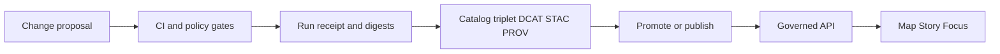

<!-- [KFM_META_BLOCK_V2]
doc_id: kfm://doc/<uuid>
title: TEMPLATE — Governance Review Checklist
type: standard
version: v1
status: draft
owners: [KFM Governance, Data Stewardship]
created: 2026-03-05
updated: 2026-03-05
policy_label: public
related: [docs/templates/governance, docs/standards/governance]
tags: [kfm, governance, checklist, template]
notes: ["Template: keep policy-safe. Reference artifacts by ID/digest/audit_ref; do not paste restricted raw data."]
[/KFM_META_BLOCK_V2] -->

> **Status:** experimental  
> **Owners:** @TODO-governance-owner @TODO-data-steward  
> **Badges:**     
> **Quick links:** [Scope](#scope) · [Review header](#review-header) · [Checklist](#checklist) · [Required artifacts](#required-artifacts) · [Decision](#decision) · [Appendix](#appendix)

# TEMPLATE — Governance Review Checklist
One-stop checklist to approve/deny governance-sensitive changes in KFM (datasets, pipelines, policy, governed API, Story Nodes, Focus Mode).

---

## Where this fits
**Path:** `docs/templates/governance/TEMPLATE__GOV_REVIEW_CHECKLIST.md`  
**Used by:** PR reviews, dataset promotions, release gates, Story publish reviews, and policy changes.

**Upstream inputs (typical):**
- PR / change request (code + docs)
- Run receipts + validation outputs (CI artifacts)
- Catalog triplet updates (DCAT/STAC/PROV), checksums/digests
- Policy bundle changes (OPA/Rego + tests)
- Risk register / ADRs (if material)

**Downstream outputs:**
- Decision record (approve/deny/conditions) with references (audit_ref, digests, dataset_version_id)
- Follow-up actions (issues / mitigation tasks / rollback plan)

### Trust and governance flow



---

## Acceptable inputs
Use **policy-safe references** only:
- `dataset_id`, `dataset_version_id`
- `audit_ref` / run ID
- artifact digests (sha256), file paths, and CI URLs
- EvidenceRefs / EvidenceBundle IDs (not raw restricted content)
- summarized findings that do **not** reveal restricted existence or precise sensitive locations

## Exclusions
Do **not** put these into this checklist doc:
- Restricted raw data, restricted coordinates, or “ghost metadata” about restricted datasets
- Secrets (tokens/keys), credentials, internal URLs requiring auth
- PII beyond what governance policy allows (default: none)
- Copy/pastes of large log blobs (attach as artifact and reference by path/digest instead)

> **WARNING:** This checklist becomes part of the repo history. Treat it as a public artifact unless clearly marked otherwise.

---

## How to use (reviewer workflow)
1. Copy this template to a new review file (or PR comment) and fill out **Review header**.
2. Mark **not applicable** where appropriate, but do not delete sections.
3. Attach or link **Required artifacts** (or cite their digests + locations).
4. Record a clear **Decision** and any **conditions**.
5. Create follow-up issues for unmet items; link them in **Decision**.

---

## Review header

### Review identity
| Field | Value |
|---|---|
| Review ID | `{{kfm_review_id}}` |
| Date | `{{YYYY-MM-DD}}` |
| Reviewer(s) | `{{names}}` |
| Requester / author | `{{names}}` |
| Review type | `{{Dataset promotion | Policy change | Governed API change | Focus Mode change | Story publish | Release}}` |
| PR / change link | `{{url-or-ref}}` |
| Run ID / audit_ref | `{{kfm://audit/...}}` |
| Primary dataset(s) | `{{dataset_id(s)}}` |
| Dataset version(s) | `{{dataset_version_id(s)}}` |
| Policy label target | `{{public | restricted | ...}}` |
| Environment | `{{sandbox | governed}}` |

### Scope summary (human)
- **What changed (1–3 bullets):**
  - {{...}}
  - {{...}}
- **Why (intent):**
  - {{...}}
- **What’s the user-visible impact?**
  - {{...}}

### Components touched (check all that apply)
- [ ] Data ingestion connector(s)
- [ ] Pipeline / orchestration
- [ ] Catalogs (DCAT/STAC/PROV) / metadata
- [ ] Policy bundle (OPA/Rego) / obligations
- [ ] Governed API endpoint(s)
- [ ] Evidence resolver / citation system
- [ ] UI (Map / Story / Focus)
- [ ] Indexes / projections (search / graph / tiles)
- [ ] Ops (SLOs, monitoring, retention)
- [ ] Docs / templates / runbooks

---

## Risk and sensitivity snapshot

| Dimension | Level | Notes (policy-safe) |
|---|---:|---|
| Confidentiality risk | `{{Low/Med/High}}` | {{...}} |
| Integrity risk | `{{Low/Med/High}}` | {{...}} |
| Availability risk | `{{Low/Med/High}}` | {{...}} |
| Licensing risk | `{{Low/Med/High}}` | {{...}} |
| Harm / CARE risk | `{{Low/Med/High}}` | {{...}} |
| Reversibility | `{{Easy/Moderate/Hard}}` | Rollback path: {{...}} |

---

## Checklist

### 0) Reviewer posture
- [ ] I will **cite or abstain**: every approval claim below is backed by an artifact link, digest, or audit_ref.
- [ ] I will not paste restricted content here; I will reference it by ID/digest/audit_ref.

---

### 1) Trust membrane and boundary enforcement
- [ ] No direct client access to DB/object storage was introduced (UI/external clients go through governed API only).
- [ ] Core logic respects repository/adapter boundary (no bypass to storage from UI/client codepaths).
- [ ] Any new endpoints apply policy checks **before** returning data (fail-closed posture).
- [ ] Error behavior is policy-safe (no “existence leakage” via different errors or timing).

**Notes / evidence:**
- {{links / artifacts / tests}}

---

### 2) Policy-as-code and fail-closed behavior
- [ ] Policy defaults to deny (explicit allow required).
- [ ] Policy outputs include stable reason codes/messages that are policy-safe.
- [ ] CI enforces policy results: **DENY fails the job** (no “warn-only” in governed mode).
- [ ] Policy regression tests updated (unit tests + fixtures) and passing.

**Notes / evidence:**
- {{conftest/opa outputs, logs, links}}

---

### 3) Dataset lifecycle and promotion gates
> Fill this section when *data assets* or *dataset versions* are added/changed/promoted.

#### 3.1 Zone declaration (RAW → WORK/QUAR → PROCESSED → PUBLISHED)
- [ ] Target zone(s) are explicitly declared: `{{RAW | WORK/QUAR | PROCESSED | PUBLISHED}}`
- [ ] Raw assets are treated as immutable (no silent overwrite).
- [ ] Any quarantine conditions are documented and block promotion until resolved.

#### 3.2 Identity, integrity, and determinism
- [ ] Stable identifiers exist (`dataset_id`, `dataset_version_id`).
- [ ] Checksums/digests exist for every asset in scope (or manifest references where required).
- [ ] Inputs are pinned/snapshotted enough to reproduce the build (or clearly marked as non-reproducible with mitigation).

#### 3.3 Catalog triplet and provenance
- [ ] DCAT, STAC, and PROV artifacts are generated/updated (cross-linked).
- [ ] Catalog validators pass (schema, linkcheck, integrity).
- [ ] Run receipt exists and references inputs/outputs by digest.
- [ ] License + attribution are captured in metadata (machine-readable).

**Notes / evidence:**
- {{catalog validator output, receipt path, digests manifest}}

---

### 4) Evidence resolver and citations
> Fill this section when the change affects Story publishing, Focus Mode, or anything that generates user-facing claims.

- [ ] Evidence is referenced via EvidenceRefs/EvidenceBundles (not raw URLs pasted into text).
- [ ] Citation verification is a **hard gate** (unresolvable citations cause abstain/re-scope).
- [ ] Responses/published artifacts include `audit_ref` and version identifiers.
- [ ] Abstention UX is policy-safe (explains “why” safely, suggests safe alternatives, avoids ghost metadata).

**Notes / evidence:**
- {{evidence resolver contract tests, demo screenshots, logs}}

---

### 5) Security, privacy, and sensitive data handling
- [ ] No secrets added to repo (tokens/keys/config credentials).
- [ ] Data classification and sensitivity posture are declared (public/restricted + obligations).
- [ ] Redaction/generalization obligations are implemented and tested where required.
- [ ] Audit logs and run receipts follow retention/redaction policy (or a ticket exists to implement it before release).

**Notes / evidence:**
- {{security scan reports, redaction tests, retention config}}

---

### 6) Reliability, operations, and rollback
- [ ] Change has an explicit rollback path (and it was tested, if high-risk).
- [ ] Monitoring/metrics/traces updated (or explicitly not applicable).
- [ ] Backfill / replay / idempotency is defined for pipeline changes.
- [ ] Performance impact assessed for large datasets/layers (benchmarks or reasoned justification).

**Notes / evidence:**
- {{runbook links, benchmark artifacts, ops notes}}

---

### 7) Documentation and governance hygiene
- [ ] Docs updated for behavior changes (contracts, runbooks, templates, READMEs).
- [ ] Any new governance requirement is encoded as CI/test (not tribal knowledge).
- [ ] Risk register updated for material changes (or issue created).

**Notes / evidence:**
- {{docs diffs, ADR links, risk register entry}}

---

## Required artifacts
Attach (or reference by path + digest + CI URL). Mark N/A only with rationale.

| Artifact | Required when | Where / reference | Status |
|---|---|---|---|
| Run receipt (`receipt.json` or equivalent) | Any governed run / promotion | {{path/url}} | [ ] Attached [ ] Linked [ ] N/A |
| Policy evaluation output (OPA/Conftest) | Any policy-gated change | {{path/url}} | [ ] Attached [ ] Linked [ ] N/A |
| Digests manifest (sha256 list) | Any promoted assets | {{path/url}} | [ ] Attached [ ] Linked [ ] N/A |
| DCAT dataset+distributions | Dataset change | {{path/url}} | [ ] Attached [ ] Linked [ ] N/A |
| STAC collection/item(s) | Geospatial assets | {{path/url}} | [ ] Attached [ ] Linked [ ] N/A |
| PROV bundle / lineage output | Dataset change / Focus Mode | {{path/url}} | [ ] Attached [ ] Linked [ ] N/A |
| Validation logs (schema/linkcheck) | Catalog updates | {{path/url}} | [ ] Attached [ ] Linked [ ] N/A |
| Threat model note | New exposed endpoint / auth change | {{path/url}} | [ ] Attached [ ] Linked [ ] N/A |
| SBOM + vuln scan | Release / dependency changes | {{path/url}} | [ ] Attached [ ] Linked [ ] N/A |
| Rollback plan | Medium/High risk changes | {{path/url}} | [ ] Attached [ ] Linked [ ] N/A |

---

## Decision

### Outcome
- [ ] ✅ APPROVE
- [ ] ✅ APPROVE WITH CONDITIONS
- [ ] 🟨 REQUEST CHANGES
- [ ] ❌ REJECT (fail closed)

### Rationale (policy-safe)
{{why this decision was made, keyed to artifacts and checks}}

### Conditions (if any)
- [ ] Condition 1: {{...}} (Owner: {{...}} · Due: {{YYYY-MM-DD}} · Tracking: {{issue/link}})
- [ ] Condition 2: {{...}} (Owner: {{...}} · Due: {{YYYY-MM-DD}} · Tracking: {{issue/link}})

### Audit / trace references
- **audit_ref:** `{{kfm://audit/...}}`
- **run_id(s):** `{{kfm://run/...}}`
- **artifact digest(s):** `sha256:{{...}}`

### Sign-off
| Role | Name | Date | Signature / ack |
|---|---|---:|---|
| Data Steward | {{...}} | {{YYYY-MM-DD}} | {{...}} |
| Policy Steward | {{...}} | {{YYYY-MM-DD}} | {{...}} |
| Security (if needed) | {{...}} | {{YYYY-MM-DD}} | {{...}} |
| Ops (if needed) | {{...}} | {{YYYY-MM-DD}} | {{...}} |

---

## Appendix

<details>
<summary><strong>Definitions (KFM terms)</strong></summary>

- **Trust membrane:** Architectural rule that clients never access storage/DB directly; all access crosses the governed API + policy boundary.
- **Fail closed:** If policy/evidence/validation cannot prove “allow,” the system returns deny/abstain.
- **EvidenceRef / EvidenceBundle:** Machine-resolvable citation reference; bundles include metadata + digests + audit references.
- **Catalog triplet:** DCAT + STAC + PROV artifacts that describe datasets, assets, and lineage.
- **audit_ref:** Pointer to an append-only audit entry for governed operations.

</details>

<details>
<summary><strong>Example snippets (pseudocode)</strong></summary>

### Policy default-deny (illustrative)

```rego
# PSEUDOCODE — replace with your repo's policy package and schema
package kfm.policy

default allow = false
```

### Receipt concept (illustrative)

```json
{
  "run_id": "kfm://run/<id>",
  "inputs": [{"ref": "kfm://source/<id>", "digest": "sha256:<...>"}],
  "outputs": [{"path": "catalog/dcat/dataset.json", "digest": "sha256:<...>"}],
  "policy": {"decision": "allow", "obligations_applied": ["redaction", "attribution"]}
}
```

</details>

---

[Back to top](#template--governance-review-checklist)
