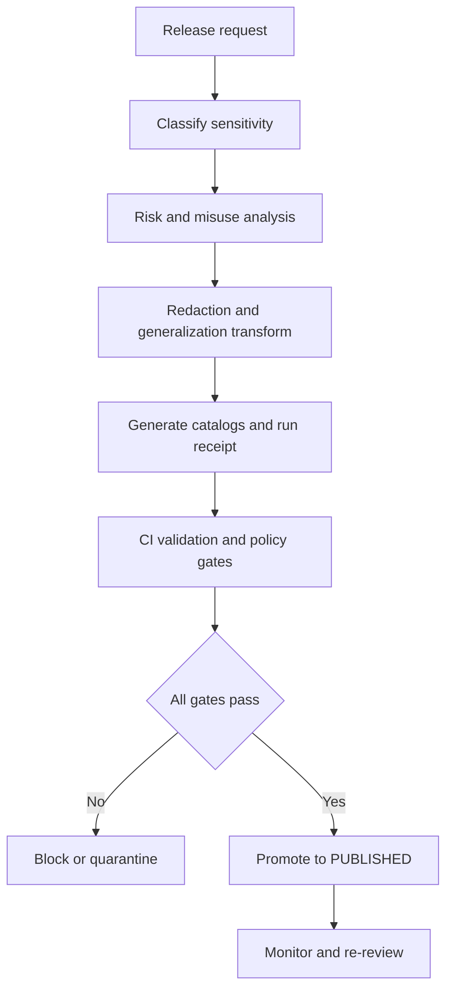

<!-- [KFM_META_BLOCK_V2]
doc_id: kfm://doc/0d6d6a12-5c8a-4b4a-9f9d-2d2a0d1c3a27
title: TEMPLATE — Sensitive Location Release
type: standard
version: v1
status: draft
owners: ["@kfm/governance", "@kfm/safety"]
created: 2026-03-05
updated: 2026-03-05
policy_label: public
related: [
  "docs/governance/ROOT_GOVERNANCE.md",
  "docs/governance/ETHICS.md",
  "docs/governance/SOVEREIGNTY.md",
  "docs/specs/qa/README.md",
  "policy/**",
  "tools/validation/**"
]
tags: [kfm, template, governance, safety, sensitivity, release]
notes: [
  "Template only — do not commit real sensitive locations or raw coordinates in this file.",
  "If in doubt: treat as Restricted and route to governance review."
]
[/KFM_META_BLOCK_V2] -->

---
title: "TEMPLATE — Sensitive Location Release"
path: "docs/templates/governance/TEMPLATE__SENSITIVE_LOCATION_RELEASE.md"
version: "v1.0.0"
status: "template"
last_updated: "2026-03-05"
owners:
  - "@kfm/governance"
  - "@kfm/safety"
policy_label: "public"
---

# TEMPLATE — Sensitive Location Release
Template to document, review, and approve **any** KFM release that contains **sensitive location signals** (direct or inferable), including map layers, Story Nodes, API endpoints, exports, or Focus Mode responses.

> **Status:** template (active)  
> **Owners:** @kfm/governance, @kfm/safety  
> **Badges:**    
> **Quick links:** [Scope](#scope) • [Risk review](#risk--misuse-analysis-care) • [Redaction plan](#redaction--generalization-plan) • [Decision record](#decision-record) • [Definition of done](#definition-of-done)

---

## Scope

Use this template when releasing *anything* that includes one or more of the following:

- Exact coordinates, precise geometries, or addresses for a **vulnerable target** (people, species, cultural sites, infrastructure).
- Location patterns that allow **re-identification** (e.g., repeated visits to a point, rare attribute combos).
- Data where even “open” licensing may still require **CARE** safeguards due to likely harm.

**Sensitive location** (working definition): a location that could enable harm if shared precisely (or with enough contextual clues to infer it).

---

## Where this fits in KFM

This template is an **approval wrapper** around KFM’s normal lifecycle:

- RAW → WORK/QUARANTINE → PROCESSED → CATALOG/TRIPLET → PUBLISHED (governed runtime)
- A sensitive-location release is **never** “just a publish”; it is a **policy decision + redaction transform + evidence record**.

---

## Acceptable inputs

Provide the following references (do not paste raw sensitive coordinates into this doc):

- Candidate artifact refs (dataset/layer/story) by **stable IDs** and **version refs**.
- Catalog triplet refs (DCAT/STAC/PROV) and run receipt refs.
- Redaction/generalization rule set ref + version/hash.
- A “before vs after” QA comparison summary (counts, extents, precision loss).

---

## Exclusions

Do **not** use this template to:

- Justify releasing raw location data to the public with “trust us” reasoning.
- Store or discuss precise sensitive coordinates. Put that information in a **restricted EvidenceBundle** or restricted ticket and reference it by ID only.
- Replace a formal legal/sovereignty process (this doc complements it; it doesn’t override it).

---

## How to use

1. Copy this file into the relevant release folder (or link it from the PR description).
2. Replace every `TBD` / `<...>` placeholder.
3. Attach required evidence artifacts (run receipts, catalogs, QA outputs, redaction receipts).
4. Get approvals in the **Decision record** section.

---

## Release flow diagram



---

## Release request metadata

> Keep this section “machine-readable first” so it can be ingested into governance tooling later.

```yaml
release:
  request_id: "TBD"              # e.g., RLS-2026-03-05-001
  requested_by: "TBD"            # GitHub handle / team
  requested_at: "2026-03-05"     # YYYY-MM-DD
  target_surface: "TBD"          # map | api | export | story | focus
  artifact_kind: "TBD"           # dataset | layer | story_node | endpoint
  candidate_refs:
    - "TBD"                      # dataset_version_id / story_node_id / etc.
  target_zone: "PUBLISHED"       # expected final zone
  intended_audience: "TBD"       # public | partners | internal | restricted_group:<id>
  review_cycle: "TBD"            # e.g., quarterly, annual, time-limited (date)
```

---

## Sensitivity classification

### Classification

Select **one** (default-deny if unknown):

- [ ] **Public** — no sensitive location risk (still must meet normal promotion gates)
- [ ] **Sensitive** — non-public; may be shareable with mitigations
- [ ] **Restricted** — controlled access only (named group, contractual, or sovereignty constraints)
- [ ] **Prohibited** — do not release (even internally) without exceptional governance action

```yaml
sensitivity:
  class: "TBD"                   # public | sensitive | restricted | prohibited
  policy_label: "TBD"            # policy label used by the policy engine
  rationale: "TBD"
  who_is_at_risk: ["TBD"]         # people | species | cultural sites | infrastructure | other
  harm_modes: ["TBD"]             # harassment | theft | poaching | vandalism | exploitation | etc.
```

### What exactly is sensitive?

- Sensitive entity type(s): `<TBD>`
- Sensitivity trigger(s): `<TBD>`
- “Inference risk” description (how someone could derive the location): `<TBD>`

---

## Evidence discipline

Every meaningful claim in the release rationale must be labeled:

- **CONFIRMED** — backed by an EvidenceBundle (or authoritative policy doc) and linked.
- **PROPOSED** — a design choice or mitigation plan (must include validation approach).
- **UNKNOWN** — not verified yet (must include the smallest verification steps to confirm).

Provide a minimal claim ledger:

| claim_id | claim | label | evidence_ref | verification_steps (if UNKNOWN) |
|---|---|---|---|---|
| C1 | TBD | CONFIRMED/PROPOSED/UNKNOWN | evidence:<id> | TBD |

---

## Risk & misuse analysis (CARE)

### Threat model summary

| vector | plausible misuse | impact | likelihood | mitigations | residual risk |
|---|---|---:|---:|---|---|
| Targeting | TBD | TBD | TBD | TBD | TBD |
| Re-identification | TBD | TBD | TBD | TBD | TBD |
| Harm amplification | TBD | TBD | TBD | TBD | TBD |

### CARE / community impacts

- Potential community harms (non-exhaustive): `<TBD>`
- Consultation required?  
  - [ ] Yes (who: `<TBD>`, method: `<TBD>`)  
  - [ ] No (why not: `<TBD>`)

### Decision posture

- [ ] **Default deny** until mitigations are proven effective.
- [ ] **Time-limited release** (expires on `<TBD>`).
- [ ] **Access-controlled only** (no public surface).

---

## Redaction & generalization plan

> Redaction is a **first-class transformation**: it must be reproducible, versioned, and evidenced.

### Geometry controls

Select one or more (prefer deterministic transforms):

- [ ] **Withhold** geometry entirely (no map display; counts only)
- [ ] **Aggregate** to admin boundary (county, tract, HUC, etc.)
- [ ] **Grid snap** to deterministic cells (document cell size)
- [ ] **Spatial generalization** (simplify lines/polygons to safe tolerance)
- [ ] **Uncertainty radius** returned (explicitly)

```yaml
redaction:
  profile: "TBD"                  # e.g., public_default, sensitive_grid_1km, restricted_raw
  method: "TBD"                   # withhold | aggregate | grid_snap | simplify | mixed
  parameters:
    grid_size_m: 1000             # example; adjust
    simplify_tolerance_m: null
    min_k_anonymity: 10           # example; adjust
  deterministic: true
  rule_set_ref: "TBD"             # policy/rules/<name>@<version-or-hash>
  outputs:
    uncertainty_radius_m: "TBD"   # if applicable
```

### Attribute controls

- [ ] Remove direct identifiers (names, IDs, addresses)
- [ ] Remove quasi-identifiers that can re-identify in combination
- [ ] Bucket/round sensitive numeric fields
- [ ] Suppress rare categories (below threshold)

```yaml
redaction_attributes:
  removed_fields: ["TBD"]
  bucketed_fields:
    - field: "TBD"
      method: "TBD"
  suppression_rules:
    - rule: "TBD"
      threshold: "TBD"
```

### Temporal controls

- [ ] Coarsen timestamps (hour → day, day → month, etc.)
- [ ] Delay publication (e.g., 30–180 days)
- [ ] Windowing (show only multi-week aggregates)

```yaml
redaction_time:
  coarsen_to: "TBD"              # none | hour | day | week | month
  publication_delay_days: "TBD"  # 0 if none
```

### UI and API guardrails

UI (Map/Story):

- [ ] Disable “identify” at sensitive zoom levels
- [ ] Cap maximum zoom to `<TBD>`
- [ ] Disable raw export/download from UI
- [ ] Add “generalized location” warning banner and rationale

API:

- [ ] Require authZ claims for restricted surfaces
- [ ] Return `access_level` and `uncertainty_radius_m`
- [ ] Enforce license + sensitivity + redaction obligations **fail-closed**

---

## Required artifacts and proof

### Must exist (release blocked if missing)

- [ ] Processed artifacts with checksums
- [ ] DCAT + STAC + PROV cross-linked catalogs
- [ ] Run receipt capturing inputs, tooling, hashes, policy decisions
- [ ] License / terms snapshot
- [ ] Redaction receipt (proof of transformation + parameters)
- [ ] Policy evaluation record (what was allowed/denied and why)

```yaml
evidence:
  catalogs:
    dcat_ref: "TBD"
    stac_ref: "TBD"
    prov_ref: "TBD"
  run_receipt_ref: "TBD"
  redaction_receipt_ref: "TBD"
  license_snapshot_ref: "TBD"
  policy_decision_ref: "TBD"
  signatures:
    artifact_signature_ref: "TBD"
    provenance_attestation_ref: "TBD"
```

### Before/after QA summary (minimum)

- Record counts (rows/features) before vs after
- Spatial extents before vs after
- Precision loss quantification (grid size / simplify tolerance)
- Re-identification test results (k-anonymity, uniqueness checks)

---

## Validation & CI gates

> Release should be blocked unless gates pass.

### Required checks (suggested)

- [ ] Catalog schema validation passes (DCAT/STAC/PROV)
- [ ] Link integrity passes (refs resolve; no guessing)
- [ ] Policy tests pass (default-deny; obligations satisfied)
- [ ] Redaction transform is reproducible (same input → same output)
- [ ] “No sensitive coordinates” scanners pass (if applicable)

Example (adjust to repo tooling):

```bash
# Validate catalogs
make validate.catalog

# Policy gate (Conftest / OPA)
conftest test <release_input.json> -p policy

# Verify no-raw-location leak (example placeholder)
make validate.no_sensitive_locations
```

---

## Decision record

### Outcome

- [ ] Approved
- [ ] Approved with conditions (list below)
- [ ] Rejected
- [ ] Deferred (needs more evidence)

### Conditions (if any)

- `<TBD>`
- `<TBD>`

### Approvals

| role | name/handle | decision | date | notes |
|---|---|---|---|---|
| Data steward | TBD | approve/reject | TBD | TBD |
| Safety reviewer | TBD | approve/reject | TBD | TBD |
| Legal/licensing | TBD | approve/reject | TBD | TBD |
| Community/sovereignty (if applicable) | TBD | approve/reject | TBD | TBD |

### Review expiry / revisit trigger

- Re-review date: `<TBD>`
- Automatic trigger(s): policy rule change, source status change, new harm report, new threat intel.

---

## Post-release monitoring & rollback

- Monitoring signals: `<TBD>` (downloads, access logs, unusual queries, social reports)
- Abuse reporting channel: `<TBD>`
- Rollback mechanism: `<TBD>` (e.g., unpublish dataset version; revoke policy label; rotate token)

---

## Definition of done

- [ ] Classification selected and justified (no TBDs)
- [ ] Redaction/generalization implemented and evidenced
- [ ] Catalog triplet validated and cross-linked
- [ ] Run receipt + redaction receipt attached
- [ ] Policy decision recorded and review approvals complete
- [ ] UI/API guardrails implemented (if relevant)
- [ ] Monitoring + rollback plan documented

---

## Appendix

<details>
<summary>Optional: Redaction receipt schema (example)</summary>

```json
{
  "redaction_receipt_version": "1.0.0",
  "rule_set_ref": "policy/rules/sensitive_location@v1.3",
  "inputs": [
    {"ref": "data/raw/<...>", "sha256": "<...>"}
  ],
  "outputs": [
    {"ref": "data/processed/<...>", "sha256": "<...>"}
  ],
  "parameters": {
    "grid_size_m": 1000,
    "min_k_anonymity": 10
  },
  "checks": {
    "no_exact_coords": true,
    "k_anonymity_pass": true
  },
  "created_at": "2026-03-05T00:00:00Z",
  "signatures": {
    "provenance_attestation_ref": "<...>"
  }
}
```

</details>

<details>
<summary>Optional: Policy snippet placeholder (do not paste real rules here)</summary>

```rego
package kfm.sensitive_location

default allow = false

# TODO: implement tier selection and withholding based on metadata flags
allow {
  input.sensitivity.class == "public"
}
```

</details>

---

### Back to top
[↑ Back to top](#template--sensitive-location-release)
