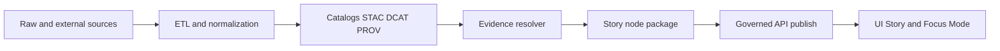

<!-- [KFM_META_BLOCK_V2]
doc_id: kfm://doc/272b10b8-b463-4913-b3c4-8b59aaa0e55b
title: TEMPLATE — Story Content Governance
type: standard
version: v1
status: draft
owners: <Docs team / Story team / FAIR+CARE Council>
created: 2026-03-05
updated: 2026-03-05
policy_label: public
related: [
  "docs/templates/TEMPLATE__STORY_NODE_V3.md",
  "docs/governance/ROOT_GOVERNANCE.md",
  "docs/governance/ETHICS.md",
  "docs/governance/SOVEREIGNTY.md",
  "docs/standards/KFM_MARKDOWN_WORK_PROTOCOL.md"
]
tags: [kfm, template, governance, story_nodes, evidence, fair, care]
notes: [
  "Copy this file next to a Story Node (or Story collection) and fill in all <placeholders>.",
  "Delete all 'TEMPLATE INSTRUCTIONS' blocks before publishing."
]
[/KFM_META_BLOCK_V2] -->

# TEMPLATE — Story Content Governance
One-file governance plan + publish gate checklist for Story Nodes and Story UI content.

---

## Impact
> **Status:** Template (draft)  
> **Owners:** `<ROLE_OR_TEAM>`  
> **Applies to:** `<PATH(S) TO STORY CONTENT>`  
> **Lifecycle:** Draft → Review → Published → Archived  
> **Last reviewed:** `<YYYY-MM-DD>`  
>
>     
>
> **Jump to:** [Scope](#scope) · [Where it fits](#where-it-fits) · [Inventory](#story-content-inventory) · [Policy labels](#policy-labels-and-obligations) · [Evidence](#evidence-and-citation-requirements) · [Sensitivity](#sensitivity-and-care-controls) · [Publishing gates](#publishing-gates-and-ci) · [Review](#review-workflow) · [Rollback](#rollback-and-incident-response) · [Appendix](#appendix)

---

## TEMPLATE INSTRUCTIONS
1. Copy this file alongside the story content it governs (recommended: `GOVERNANCE.md` in the story folder).
2. Replace **all** `<PLACEHOLDER>` fields.
3. If you do not know an answer, write `UNKNOWN` and complete the **Smallest verification steps** section.
4. Delete this **TEMPLATE INSTRUCTIONS** section before publishing.

---

## Claim status legend
KFM uses **Cite-or-Abstain**. For Story content, that means every user-visible statement must be *traceable*.

- **CONFIRMED** — Supported by at least one resolvable EvidenceRef (and policy allows it).
- **PROPOSED** — Interpretation, hypothesis, synthesis, or narrative framing; must be labeled as such.
- **UNKNOWN** — Not yet supported; must *not* ship as a “fact”. Add the smallest steps to verify.

> **Rule of thumb:** If it would surprise a careful reviewer, it needs an EvidenceRef *or* it must be labeled PROPOSED/UNKNOWN.

---

## Scope
**In scope**
- `<STORY_NODE_ID>` and its associated assets, maps, timelines, and citations.
- Any Story UI route or “publish action” that makes this story available to users.
- Any Focus Mode behavior that uses this story as context.

**Out of scope**
- Dataset ingestion/ETL implementation details (belongs in domain runbooks / pipelines).
- Raw source storage (governed by data lifecycle + catalog/provenance requirements).
- UI features not directly used by this story (document elsewhere).

---

## Where it fits
This governance file sits on the **truth path**: it bridges cataloged evidence (STAC/DCAT/PROV) to user-facing narrative.



### Repository placement
- **This template lives:** `docs/templates/governance/TEMPLATE__STORY_CONTENT_GOVERNANCE.md`
- **Governs story content (expected):** `docs/reports/story_nodes/<domain>/<story_slug>/...`
- **Story authoring format:** `docs/templates/TEMPLATE__STORY_NODE_V3.md`

> If your repo layout differs, document the actual paths in **Story content inventory**.

---

## Acceptable inputs
- Story Node markdown and sidecar metadata files (for citations, map state, and identifiers).
- Media assets (images, charts, PMTiles references, 3D scenes) **only if** they are licensed and citable.
- EvidenceRefs pointing to cataloged sources (STAC/DCAT/PROV and/or approved external references).

---

## Exclusions
- **Unsourced narrative** presented as fact.
- **Precise sensitive locations** (archaeology, species, sacred/cultural sites) in public content.
- **Unlicensed media** or assets with unclear usage terms.
- **Direct storage/DB access** from UI clients (all reads go through governed APIs).
- **Secrets** (API keys, tokens), or any personal data not required and not approved.

---

## Story content inventory
Fill this section first. It defines what this governance file covers.

### Inventory table

| Field | Value |
|---|---|
| Story Node ID | `<STORY_NODE_ID>` |
| Title | `<TITLE>` |
| Domain | `<DOMAIN>` |
| Location in repo | `<RELATIVE_PATH>` |
| Intended audience | `<public / internal / restricted>` |
| Policy label | `<public / restricted / ...>` |
| Primary owner | `<NAME or ROLE>` |
| Reviewers | `<STEWARDS / COUNCIL / EDITORS>` |
| Target publish date | `<YYYY-MM-DD>` |
| Current state | `<draft / in_review / published / archived>` |

### Expected story folder layout (edit to match reality)
```text
docs/reports/story_nodes/<domain>/<story_slug>/
  story_node.md
  story_node.meta.json
  GOVERNANCE.md
  assets/
    <media files...>
  evidence/
    evidence_manifest.json
    receipts/
      <run_receipt files...>
```

---

## Policy labels and obligations
> **TEMPLATE:** Your story must declare a `policy_label` and list the obligations that follow.

| Policy label | Audience | Allowed content | Obligations | Notes |
|---|---|---|---|---|
| `public` | anyone | non-sensitive, licensed | evidence resolvable without privileged access; no sensitive coords | `<notes>` |
| `restricted` | approved users | sensitive or permissioned | auth required; redaction obligations; explicit approvals logged | `<notes>` |
| `internal` | maintainers | working notes | not user-facing; may include UNKNOWN items | `<notes>` |
| `<custom>` | `<audience>` | `<allowed>` | `<obligations>` | `<notes>` |

**Policy decision record**
- Policy label chosen: `<policy_label>`
- Rationale: `<why this classification is correct>`
- Approver(s): `<names/roles>`
- Date: `<YYYY-MM-DD>`
- Linked issue/ADR: `<ref>`

---

## Governance controls
> **TEMPLATE:** Keep the labels (CONFIRMED/PROPOSED/UNKNOWN) and update any UNKNOWN items.

### Non-negotiables
- [CONFIRMED] **Evidence-first narrative:** no user-visible factual claims without evidence, and any AI assistance must be disclosed and constrained by evidence.
- [CONFIRMED] **Citations must resolve:** a “citation” is an EvidenceRef that resolves into an EvidenceBundle (metadata + artifacts + provenance) through the evidence resolver.
- [CONFIRMED] **Default-deny, fail-closed:** if policy cannot decide, or evidence cannot be resolved, publishing/serving must be denied (or the UI must abstain / reduce scope).
- [CONFIRMED] **Trust membrane:** UI clients do not access DB/object storage directly; all access crosses a governed API + policy boundary.
- [CONFIRMED] **Pipeline ordering:** story content must not cite or depend on data that has not been cataloged (STAC/DCAT/PROV) and promoted for use.

### Review triggers (automatic governance review)
- [CONFIRMED] Introduces culturally sensitive content or sovereignty/CARE concerns.
- [CONFIRMED] Introduces new AI-driven narrative behavior that could be perceived as factual.
- [CONFIRMED] Introduces new external data sources with unclear rights/provenance.

### Story-specific controls
- [PROPOSED] **Publish gating artifacts:** publish only after a run receipt exists and policy checks (OPA/Conftest) pass for sensitivity/CARE.
- [PROPOSED] **Signed artifacts for story publish:** store a content digest and optional signing/attestation reference for the story package (release or publish event).

---

## Evidence and citation requirements
### EvidenceRef policy
- [CONFIRMED] Every factual claim, quote, chart, map layer, or media asset referenced by the Story Node must have a corresponding EvidenceRef.
- [CONFIRMED] Every EvidenceRef must be resolvable at publish time; broken or policy-denied EvidenceRefs must block publishing (fail-closed).
- [CONFIRMED] External sources must be represented in catalogs (or an approved equivalent) so EvidenceRefs resolve (no bare URLs as “citations” in published stories).
- [PROPOSED] For public publishing, EvidenceRefs SHOULD resolve without requiring privileged credentials (or the story MUST be marked restricted).

### Evidence dependencies
List the datasets and evidence artifacts this story depends on.

| Dependency type | Identifier | Version / digest | Policy label | Used for | Notes |
|---|---|---|---|---|---|
| Dataset | `<dataset_id>` | `<dataset_version_id or digest>` | `<policy_label>` | `<map layer / table / quote>` | `<notes>` |
| STAC asset | `<stac_item_id>` | `<asset digest>` | `<policy_label>` | `<image / map>` | `<notes>` |
| PROV activity | `<prov_activity_id>` | `<run_receipt digest>` | `<policy_label>` | `<lineage>` | `<notes>` |
| `<other>` | `<id>` | `<version>` | `<policy>` | `<use>` | `<notes>` |

### Fact vs interpretation
Use the labels consistently in the story text:
- **CONFIRMED:** “The Kansas–Nebraska Act was signed in 1854.” (with EvidenceRef)
- **PROPOSED:** “This suggests political tension intensified.” (interpretive framing)
- **UNKNOWN:** “It is unclear whether X occurred on Y date.” (include verification steps)

### Evidence manifest
**Required:** Provide a machine-readable manifest of all EvidenceRefs used by this story.

- Manifest path: `<RELATIVE_PATH>/evidence/evidence_manifest.json`
- Manifest format: `<JSON schema ref or version>`
- Resolver test command (example): `<make test-evidence story=<STORY_NODE_ID>>`

---

## Sensitivity and CARE controls
### Sensitivity classification
| Category | Value |
|---|---|
| CARE review required | `<yes/no>` |
| Cultural sensitivity level | `<public / review / restricted / sacred>` |
| Contains archaeology site info | `<yes/no>` |
| Contains species at-risk locations | `<yes/no>` |
| Contains PII | `<yes/no>` |
| Notes | `<FREE TEXT>` |

### Controls (fill what applies)
- [CONFIRMED] If content is culturally sensitive, it requires explicit governance review before publication.
- [CONFIRMED] Public story outputs must not leak restricted coordinates or otherwise enable targeting of sensitive sites.
- [PROPOSED] Minimum generalization for sensitive features in public outputs: `<e.g., grid-based / H3 / >= 5 km>` (document exact method).

### Redaction and generalization plan
Describe exactly what is generalized/redacted and how you tested it.

- Inputs that contain sensitive details: `<list datasets / assets>`
- Generalization method: `<H3 / blur / omit / aggregate / bounding boxes>`
- Validation: `<tests, fixtures, screenshots, CI gates>`
- Residual risk: `<LOW/MED/HIGH>` + rationale

---

## Licensing, rights, and attribution
### Rights checklist
- [CONFIRMED] Every asset and quote has a recorded license or usage terms.
- [CONFIRMED] Story publishing must surface license/rights and dataset version information in the UI (evidence drawer).
- [PROPOSED] For any non-open asset: record rights holder, permission requirement, and a contact point.

### Attribution
- Primary authors: `<names>`
- Contributors: `<names>`
- Dataset providers: `<list + EvidenceRefs>`
- Suggested citation text (for external reuse): `<text>`

---

## Accessibility and user-facing trust UX
- [CONFIRMED] Evidence must be easy to inspect: citations should open an evidence drawer/panel that shows version + license + provenance.
- [PROPOSED] Accessibility requirements: `<WCAG level / keyboard nav / alt text policy>`.

---

## AI-assisted content governance
### Disclosure
- [CONFIRMED] Any AI-generated or AI-assisted text must be labeled as such in the story and must not introduce uncited factual claims.

### Treat AI outputs as evidence artifacts
- [CONFIRMED] If AI produced a dataset/layer (OCR corpus, predicted map layer, extracted entities), it must be treated as a first-class evidence artifact:
  - stored as processed data,
  - cataloged (STAC/DCAT),
  - traced (PROV lineage),
  - exposed only via governed APIs (no direct UI embedding).

### Focus Mode constraints for this story
- [CONFIRMED] Cite-or-abstain: if citations cannot be verified or policy denies evidence, Focus Mode must abstain or reduce scope.
- [PROPOSED] “Golden questions” evaluation set for this story: `<path to eval prompts + expected citations>`

---

## Publishing gates and CI
### Minimum publish gates (non-waivable)
- [CONFIRMED] Story schema validation passes (Story Node markdown + sidecar metadata).
- [CONFIRMED] All EvidenceRefs resolve and are policy-allowed.
- [CONFIRMED] Review state is captured (who reviewed, what they approved, when).

### Recommended additional gates (waivable only with recorded approval)
- [PROPOSED] Conftest/OPA sensitivity policy pack passes (default-deny).
- [PROPOSED] Signed run receipt exists for the publish event.
- [PROPOSED] Content digest and (optional) cosign attestation recorded for the story package.

### Gate outputs
| Output | Reference |
|---|---|
| CI workflow run | `<link or artifact ref>` |
| Evidence resolver report | `<artifact ref>` |
| Policy decision report | `<artifact ref>` |
| Publish run receipt | `<artifact ref>` |
| (Optional) Attestation | `<artifact ref>` |

---

## Publishing record
Record what exactly was published and how it can be reproduced.

| Field | Value |
|---|---|
| Publish event date | `<YYYY-MM-DD>` |
| Source control ref | `<commit hash / tag / PR>` |
| Story package digest | `<sha256:...>` |
| Evidence manifest digest | `<sha256:...>` |
| Resolver version | `<version>` |
| Policy pack version | `<version>` |
| Provenance receipt | `<path or URL>` |
| Attestation (optional) | `<path or URL>` |

---

## Review workflow
### Roles
- **Story author(s):** `<names>`
- **Domain steward:** `<name/role>`
- **Governance reviewer:** `<name/role>`
- **FAIR+CARE reviewer (if applicable):** `<name/role>`

### Review log
| Date | Reviewer | Decision | Notes | Evidence |
|---|---|---|---|---|
| `<YYYY-MM-DD>` | `<name>` | `<approve / request changes / deny>` | `<notes>` | `<links>` |

### Review checklist
- [ ] Story text distinguishes CONFIRMED vs PROPOSED vs UNKNOWN.
- [ ] Every CONFIRMED claim has at least one EvidenceRef.
- [ ] EvidenceRefs resolve via evidence resolver.
- [ ] Sensitive details are generalized/redacted as required.
- [ ] Rights/licensing is complete for every asset.
- [ ] Version history updated.
- [ ] Rollback plan documented.

---

## Risk controls
Track known risks and mitigations for this story.

| Risk | Likelihood | Impact | Mitigation | Residual risk |
|---|---:|---:|---|---|
| Licensing violation (unlicensed media mirrored) | `<L/M/H>` | `<L/M/H>` | Rights metadata complete; steward review; metadata-only mode if unclear | `<L/M/H>` |
| Sensitive location leakage | `<L/M/H>` | `<L/M/H>` | Restricted precise datasets; public generalized derivatives; redaction tests | `<L/M/H>` |
| Non-resolvable citations | `<L/M/H>` | `<L/M/H>` | Evidence resolver contract; citation linting in CI; publish gate | `<L/M/H>` |
| Focus Mode hallucination or restricted leakage | `<L/M/H>` | `<L/M/H>` | Hard citation verification; evaluation harness; policy pre-checks | `<L/M/H>` |

---

## Rollback and incident response
### Rollback triggers
- [CONFIRMED] A policy/CARE violation is detected.
- [CONFIRMED] Licensing or rights metadata is incomplete or incorrect.
- [CONFIRMED] EvidenceRefs become non-resolvable (broken links, removed artifacts, denied policy).

### Rollback plan (fill in)
1. Immediate action: `<unpublish story / mark archived / remove from public index>`
2. Containment: `<invalidate caches / revoke distribution>`
3. Audit: `<record incident, link to receipts and policy decision>`
4. Fix-forward: `<patch + re-run gates + re-publish with new version>`

---

## Smallest verification steps (for UNKNOWN items)
List every UNKNOWN item and the minimum steps to make it CONFIRMED.

| UNKNOWN item | Why unknown | Smallest steps to verify | Owner | Due date |
|---|---|---|---|---|
| `<example>` | `<reason>` | `<steps>` | `<name>` | `<YYYY-MM-DD>` |

---

## Version history

| Version | Date | Author | Summary | Approval |
|---:|---|---|---|---|
| v0.1 | `<YYYY-MM-DD>` | `<name>` | Initial draft | `<reviewer>` |
| v1.0 | `<YYYY-MM-DD>` | `<name>` | Published | `<governance approval record>` |

---

## Appendix
<details>
<summary>Examples (sidecars, receipts, manifests)</summary>

### Example: `story_node.meta.json` (illustrative)
```json
{
  "id": "<STORY_NODE_ID>",
  "title": "<TITLE>",
  "creators": [{ "name": "<ORG_OR_PERSON>", "type": "organization" }],
  "dcat:contactPoint": "<CONTACT_EMAIL_OR_URL>",
  "accessURL": "<CANONICAL_STORY_URL>",
  "license": "<LICENSE_OR_TERMS>",
  "keywords": ["<tag1>", "<tag2>"],
  "prov:run_receipt": "<URL_OR_PATH_TO_RUN_RECEIPT>",
  "cosign_attestation": "<URL_OR_PATH_TO_ATTESTATION>",
  "care": {
    "privacy_level": "<public / restricted>",
    "tribal_sensitivity": <true_or_false>
  }
}
```

### Example: publish run receipt (illustrative)
```json
{
  "spec_hash": "sha256:<JCS_SHA256>",
  "published_at": "<ISO_8601>",
  "story_node_id": "<STORY_NODE_ID>",
  "story_package_digest": "sha256:<artifact_sha256>",
  "evidence_manifest_digest": "sha256:<manifest_sha256>",
  "resolver_version": "<resolver_version>",
  "policy_pack_version": "<policy_version>",
  "signed_by": "<key_ref>",
  "signature": "<signature_or_attestation_ref>"
}
```

### Evidence manifest skeleton (illustrative)
```json
{
  "story_node_id": "<STORY_NODE_ID>",
  "evidence_refs": [
    "<EVIDENCE_REF_1>",
    "<EVIDENCE_REF_2>"
  ],
  "generated_at": "<ISO_8601>",
  "generated_by": "<tool_name_and_version>"
}
```

</details>

---

## Back to top
[↑ Back to top](#template--story-content-governance)
