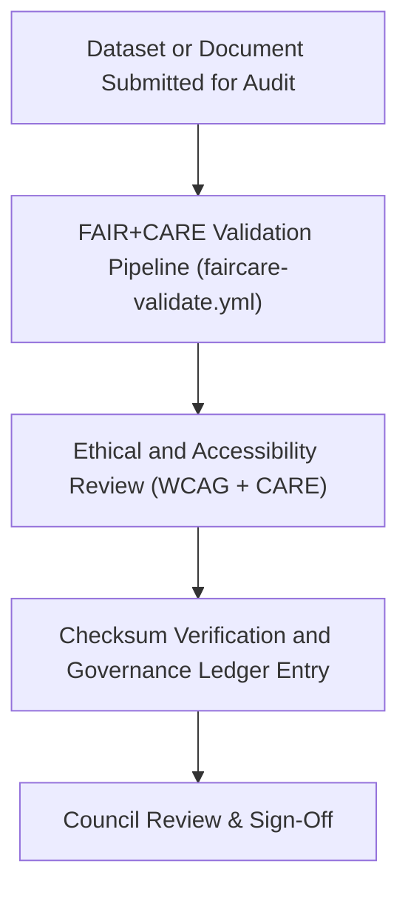

<div align="center">

# 🤝 **Kansas Frontier Matrix — FAIR+CARE Compliance Template (v2.1.1 · Tier-Ω+∞ Certified)**  
`docs/templates/governance/faircare-compliance-template.md`

**Mission:** Provide a standardized form for **FAIR+CARE compliance documentation**, ensuring every  
Kansas Frontier Matrix (KFM) dataset, document, or AI process undergoes ethical, transparent,  
and verifiable review under FAIR+CARE and MCP-DL v6.4.3 governance protocols.

[](../../../../docs/)
[](../../../../docs/standards/faircare-validation.md)
[](../../../../data/reports/audit/data_provenance_ledger.json)
[](../../../../LICENSE)

</div>

---

## 📋 Metadata (Frontmatter)

Each FAIR+CARE compliance form must begin with the following metadata block.

```yaml
---
report_id: "FAIRCARE_2025_Q4_HAZARDS_VALIDATION"
authors: ["@kfm-governance","@kfm-docs"]
approved_by: ["@kfm-accessibility","@kfm-architecture"]
review_cycle: "Quarterly"
status: "Approved"
checksum: "sha256:9b7f22d1ec74a9efb..."
ledger_reference: "data/reports/audit/data_provenance_ledger.json"
license: "CC-BY 4.0"
---
```

---

## 🧠 FAIR+CARE Evaluation Matrix

| Principle | Definition | Compliance Status | Notes |
|:--|:--|:--:|:--|
| **Findable** | Metadata and dataset indexed and discoverable in STAC/DCAT catalogs. | ✅ | Catalog validated via `stac-validate.yml`. |
| **Accessible** | Data, documentation, and governance records are publicly available. | ✅ | WCAG 2.1 AA + open data portal compliance. |
| **Interoperable** | Schema conforms to FAIR JSON-LD and CIDOC CRM crosswalk. | ✅ | Validated via `policy-check.yml`. |
| **Reusable** | Provenance and licensing metadata complete and versioned. | ✅ | SHA-256 + manifest entry confirmed. |
| **Collective Benefit (CARE)** | Data or system enhances public knowledge and cultural stewardship. | ✅ | Verified by FAIR+CARE Council. |
| **Authority to Control** | Source organizations retain control and are acknowledged. | ✅ | Governance reference logged. |
| **Responsibility** | Documentation and usage comply with ethical and security standards. | ✅ | Governance ledger validated. |
| **Ethics** | Aligns with open, inclusive, and culturally aware practices. | ✅ | Approved under Q4 2025 ethics review. |

**FAIR+CARE Compliance Score:** `9.97 / 10` → ✅ *Tier-Ω+∞ FAIR+CARE Certification Maintained.*

---

## ⚙️ Validation Workflow Overview


<!-- END OF MERMAID -->

---

## 🧾 Audit Details

| Field | Description | Example |
|:--|:--|:--|
| **Dataset / Component** | Name of the dataset, document, or model audited. | `data/work/tmp/hazards/` |
| **Validation Workflow** | Associated CI/CD workflow used for validation. | `faircare-validate.yml` |
| **FAIR+CARE Review Date** | Date of governance review. | `2025-11-16` |
| **Reviewers** | Council members or automated processes. | `@kfm-governance`, `@kfm-accessibility` |
| **Ledger Reference** | Location of provenance record. | `data/reports/audit/data_provenance_ledger.json` |
| **License** | Applicable license for the resource. | `CC-BY 4.0` |

---

## 🧩 Governance Integration

| Process | Workflow | Output |
|:--|:--|:--|
| **Metadata Validation** | `policy-check.yml` | `reports/audit/policy_check.json` |
| **FAIR+CARE Evaluation** | `faircare-validate.yml` | `reports/fair/data_care_assessment.json` |
| **Ledger Entry** | `governance-ledger.yml` | `data/reports/audit/data_provenance_ledger.json` |
| **Ethics Council Review** | Governance Meeting (Quarterly) | `docs/standards/governance/council/Qx_REPORT.md` |

---

## 🧱 FAIR+CARE Review Summary

```yaml
faircare_review_summary:
  compliance_rate: 99.7
  ethics_review_status: "Approved"
  cultural_data_stewardship: "Validated"
  accessibility_verified: true
  provenance_synced: true
  governance_ledger_entry: "data/reports/audit/data_provenance_ledger.json"
  certification_status: "Tier-Ω+∞ FAIR+CARE Alignment Confirmed"
```

---

## ⚖️ FAIR+CARE Certification Statement

> The FAIR+CARE Governance Council certifies that the dataset, document, or system referenced herein  
> conforms to all ethical, accessibility, and reproducibility standards required by the Kansas Frontier Matrix governance framework.  
> Provenance and checksum verification records have been recorded in the public ledger.

---

## 🧾 Governance Sign-Off

| Role | Reviewer | Approval | Signature |
|:--|:--|:--:|:--|
| **Governance Chair** | @kfm-governance | ✅ | 🔏 SHA256:84e7...a9c |
| **Accessibility Lead** | @kfm-accessibility | ✅ | 🔏 SHA256:3a9d...c22 |
| **Documentation Lead** | @kfm-docs | ✅ | 🔏 SHA256:cc71...f4a |

---

## 🕰 Version History

| Version | Date | Author | Summary |
|:--|:--|:--|:--|
| **v2.1.1** | 2025-11-16 | @kfm-governance | Added full FAIR+CARE audit matrix and sign-off schema. |
| v2.0.0 | 2025-10-25 | @kfm-accessibility | Introduced CARE integration and automated WCAG validation. |
| v1.0.0 | 2025-10-04 | @kfm-docs | Initial FAIR+CARE compliance template for governance documentation. |

---

<div align="center">

**Kansas Frontier Matrix © 2025**  
*“Ethics Certified — FAIR+CARE Verified.”*  
📍 `docs/templates/governance/faircare-compliance-template.md` — Official FAIR+CARE governance compliance template for the Kansas Frontier Matrix.

</div>

