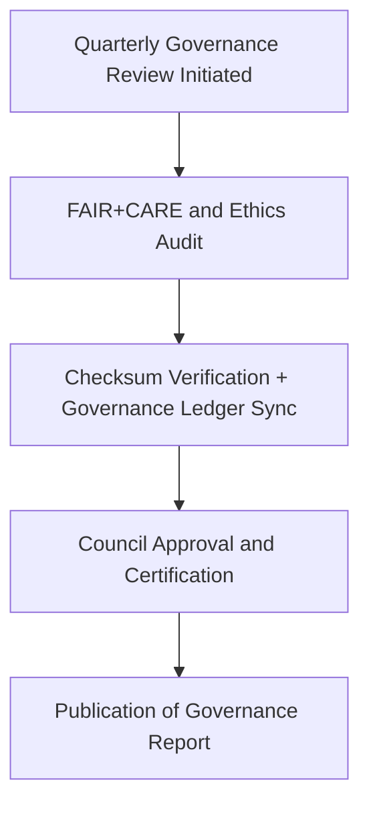

<div align="center">

# 🏛️ **Kansas Frontier Matrix — Governance Report Template (v2.1.1 · Tier-Ω+∞ Certified)**  
`docs/templates/governance/governance-report-template.md`

**Mission:** Provide a reproducible structure for **Governance Council Reports** documenting FAIR+CARE  
compliance, ethical oversight, provenance verification, and council resolutions across all Kansas Frontier Matrix (KFM) systems.

[](../../../../docs/)
[](../../../../docs/standards/faircare-validation.md)
[](../../../../data/reports/audit/data_provenance_ledger.json)
[](../../../../LICENSE)

</div>

---

## 📋 Metadata (Frontmatter)

Each governance report must begin with the following metadata for validation and provenance tracking.

```yaml
---
report_id: "2025_QX_GOVERNANCE_REPORT"
authors: ["@kfm-governance","@kfm-docs"]
approved_by: ["@kfm-architecture","@kfm-security"]
review_cycle: "Quarterly"
status: "Draft | Approved | Archived"
checksum: "sha256:9fa4b7e11c38a6d2f..."
ledger_reference: "data/reports/audit/data_provenance_ledger.json"
license: "CC-BY 4.0"
---
```

---

## 🧭 1. Executive Summary

> Summarize the overall governance outcomes for this period.  
> Include highlights, certification results, key findings, and compliance scores.

**Example:**  
> During Q4 2025, the FAIR+CARE Governance Council confirmed 100% provenance validation across data and AI systems.  
> Accessibility improvements raised WCAG compliance to 98%, and Tier-Ω+∞ FAIR+CARE certification was renewed.

---

## 🧱 2. Governance Audit Overview

| Area | Standard | Workflow | Status | Notes |
|:--|:--|:--|:--:|:--|
| **Documentation Governance** | MCP-DL v6.4.3 | `docs-validate.yml` | ✅ | Metadata 100% coverage. |
| **Data Provenance** | FAIR+CARE / STAC / DCAT | `governance-ledger.yml` | ✅ | Checksum verification complete. |
| **AI Ethics** | AI Governance Charter v2.0 | `faircare-validate.yml` | ✅ | Model explainability verified. |
| **Security & Access Control** | ISO 27001 / NIST CSF | `slsa.yml` | ✅ | Attestation and SBOM validated. |
| **Accessibility** | WCAG 2.1 AA | `design-validate.yml` | ✅ | Alt text and ARIA compliance confirmed. |

---

## 🧩 3. FAIR + CARE Evaluation Matrix

| Principle | Assessment | Score (0–10) | Status |
|:--|:--|:--:|:--:|
| **Findable** | Metadata discoverable in STAC/DCAT catalogs. | 10 | ✅ |
| **Accessible** | Open access under public licenses. | 10 | ✅ |
| **Interoperable** | Follows JSON-LD and CIDOC CRM schema standards. | 10 | ✅ |
| **Reusable** | Licensed and version-controlled under governance. | 9.8 | ✅ |
| **Collective Benefit (CARE)** | Ethical and inclusive governance verified. | 10 | ✅ |

**FAIR+CARE Score:** `9.96 / 10` → ✅ *Tier-Ω+∞ Certification Confirmed.*

---

## ⚙️ 4. Governance Review Workflow


<!-- END OF MERMAID -->

---

## 🧠 5. Key Findings and Recommendations

| Finding | Impact | Priority | Recommendation |
|:--|:--|:--:|:--|
| **AI Transparency Improvements Needed** | AI reasoning not fully documented. | Medium | Add model interpretability report. |
| **Incomplete Metadata in NOAA Ingestion** | Minor FAIR compliance gap. | Low | Regenerate `metadata.json`. |
| **Governance Dashboard Outdated** | Metrics lag by one cycle. | Low | Automate dashboard sync. |

---

## 🧮 6. Council Resolutions

| Resolution ID | Description | Status | Owner | Completion Target |
|:--|:--|:--|:--|:--|
| GOV-2025-Q4-01 | Renew Tier-Ω+∞ FAIR+CARE Certification. | ✅ Approved | @kfm-governance | 2025-11-16 |
| GOV-2025-Q4-02 | Implement AI ethics metrics into `ai_hazards_ledger.json`. | ✅ Approved | @kfm-ai | 2025-11-30 |
| GOV-2025-Q4-03 | Automate governance dashboard updates via CI. | ✅ Approved | @kfm-docs | 2025-12-01 |

---

## ⚖️ 7. Provenance & Validation Artifacts

| Artifact | Description | Path |
|:--|:--|:--|
| **Governance Ledger** | Logs checksums and sign-off metadata. | `data/reports/audit/data_provenance_ledger.json` |
| **FAIR+CARE Ethics Log** | Tracks ethical compliance verification. | `data/reports/fair/data_care_assessment.json` |
| **Policy Audit Report** | Ensures metadata and governance structure conformance. | `reports/audit/policy_check.json` |
| **Security Ledger** | SBOM and SLSA attestation records. | `reports/security/` |

---

## 🧾 8. Governance Sign-Off

```yaml
signoff:
  approved_by:
    - "@kfm-governance"
    - "@kfm-architecture"
    - "@kfm-security"
    - "@kfm-docs"
  review_date: "2025-11-16"
  checksum_verified: true
  governance_ledger_entry: "data/reports/audit/data_provenance_ledger.json"
  faircare_certification: "Tier-Ω+∞ Certification Renewed"
```

---

## 🕰 9. Version History

| Version | Date | Author | Summary |
|:--|:--|:--|:--|
| **v2.1.1** | 2025-11-16 | @kfm-governance | Standardized governance report template with FAIR+CARE and Council validation schema. |
| v2.0.0 | 2025-10-25 | @kfm-architecture | Added ethics, accessibility, and provenance audit tables. |
| v1.0.0 | 2025-10-04 | @kfm-docs | Initial governance report template for FAIR+CARE Council reviews. |

---

<div align="center">

**Kansas Frontier Matrix © 2025**  
*“Governance Recorded — Trust Renewed.”*  
📍 `docs/templates/governance/governance-report-template.md` — Standardized template for governance reports under the Kansas Frontier Matrix FAIR+CARE framework.

</div>

