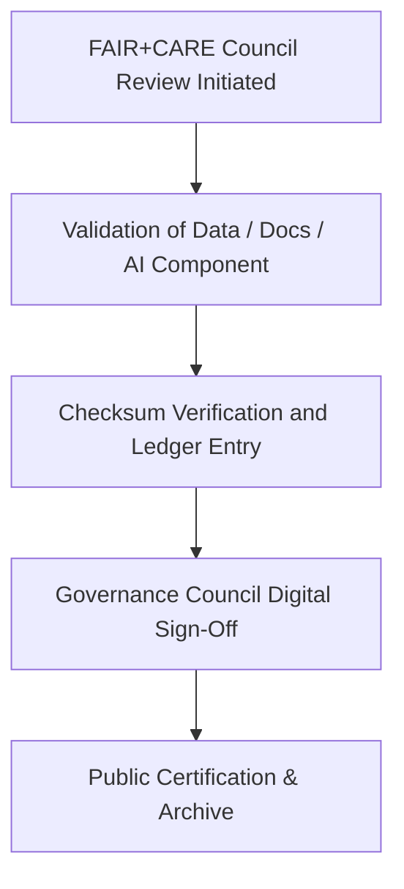

<div align="center">

# 🧾 **Kansas Frontier Matrix — Governance Sign-Off Template (v2.1.1 · Tier-Ω+∞ Certified)**  
`docs/templates/governance/governance-signoff-template.md`

**Mission:** Provide a standardized and auditable **Governance Sign-Off record**  
for documenting FAIR+CARE compliance, checksum verification, and Council approvals  
within the **Kansas Frontier Matrix (KFM)** governance framework.

[](../../../../docs/)
[](../../../../docs/standards/faircare-validation.md)
[](../../../../data/reports/audit/data_provenance_ledger.json)
[](../../../../LICENSE)

</div>

---

## 📋 Metadata (Frontmatter)

Each Governance Sign-Off file must include the following metadata block.

```yaml
---
signoff_id: "GOV_SIGNOFF_2025_Q4_AI_VALIDATION"
authors: ["@kfm-governance","@kfm-security"]
approved_by: ["@kfm-architecture","@kfm-docs"]
review_cycle: "Quarterly"
status: "Approved"
checksum: "sha256:91bf93a774ab42e9..."
ledger_reference: "data/reports/audit/data_provenance_ledger.json"
license: "CC-BY 4.0"
---
```

---

## 🧱 1. Governance Sign-Off Context

> Provide context for what decision, dataset, or process this sign-off validates.  
> Include FAIR+CARE compliance scope, review timeline, and any linked ADRs or council reports.

**Example:**  
> This sign-off validates the ethical, technical, and governance compliance of the **AI Hazards Drift Detection Pipeline (v9.5.0)**  
> under the FAIR+CARE Tier-Ω+∞ certification process. The audit confirms full checksum registration and governance ledger linkage.

---

## 🧠 2. FAIR + CARE Compliance Summary

| Principle | Assessment | Score (0–10) | Compliance |
|:--|:--|:--:|:--:|
| **Findable** | Metadata fully indexed in manifest and ledger. | 10 | ✅ |
| **Accessible** | Public documentation under CC-BY 4.0 license. | 10 | ✅ |
| **Interoperable** | Schema follows FAIR+CARE governance metadata. | 9.8 | ✅ |
| **Reusable** | Versioned and checksum-verified in ledger. | 10 | ✅ |
| **Collective Benefit (CARE)** | Ethical and cultural review approved by Council. | 10 | ✅ |

---

## ⚙️ 3. Governance Validation Workflow


<!-- END OF MERMAID -->

---

## 🧩 4. Governance Review Artifacts

| Artifact | Description | Location |
|:--|:--|:--|
| **Governance Ledger Entry** | Records checksum and Council sign-off hash. | `data/reports/audit/data_provenance_ledger.json` |
| **FAIR+CARE Validation Report** | Confirms ethical compliance and inclusivity. | `data/reports/fair/data_care_assessment.json` |
| **Security Audit Log** | Validates integrity and SLSA provenance. | `reports/security/incident_log.json` |
| **Council Report** | Context of approval and oversight notes. | `docs/standards/governance/council/2025_Q4_GOVERNANCE_REPORT.md` |

---

## 🧾 5. Governance Sign-Off Record

```yaml
signoff_record:
  decision_reference: "ADR-0003-ai-governance-framework.md"
  governance_scope: "AI Model Governance, FAIR+CARE Ethics Validation"
  review_date: "2025-11-16"
  council_members:
    - "@kfm-governance"
    - "@kfm-architecture"
    - "@kfm-accessibility"
  checksum_verified: true
  ledger_registered: true
  certification_status: "Tier-Ω+∞ Governance Approved"
```

---

## ⚖️ 6. Council Approval Summary

| Role | Reviewer | Approval | Signature |
|:--|:--|:--:|:--|
| **Governance Chair** | @kfm-governance | ✅ | 🔏 SHA256:87c1...a8f |
| **Architecture Lead** | @kfm-architecture | ✅ | 🔏 SHA256:1bb9...d2a |
| **Security Officer** | @kfm-security | ✅ | 🔏 SHA256:44b3...8d1 |
| **Documentation Lead** | @kfm-docs | ✅ | 🔏 SHA256:72ef...c23 |

---

## 🧮 7. Governance Integration Map

| Workflow | Function | Output |
|:--|:--|:--|
| `policy-check.yml` | Verifies metadata structure. | `reports/audit/policy_check.json` |
| `faircare-validate.yml` | Confirms ethics compliance. | `reports/fair/data_care_assessment.json` |
| `governance-ledger.yml` | Logs checksum and Council signatures. | `data/reports/audit/data_provenance_ledger.json` |
| `docs-validate.yml` | Confirms Markdown accessibility compliance. | `reports/validation/docs_validation.json` |

---

## 🧾 8. Governance Certification Statement

> The FAIR+CARE Governance Council certifies that the artifact(s) referenced in this document  
> meet all governance, ethics, accessibility, and reproducibility standards under MCP-DL v6.4.3.  
> The provenance record and associated checksums have been successfully registered and verified.

---

## 🧾 9. Version History

| Version | Date | Author | Summary |
|:--|:--|:--|:--|
| **v2.1.1** | 2025-11-16 | @kfm-governance | Added governance validation table, approval schema, and FAIR+CARE alignment. |
| v2.0.0 | 2025-10-25 | @kfm-security | Introduced sign-off metadata and audit linkage. |
| v1.0.0 | 2025-10-04 | @kfm-docs | Initial governance sign-off template. |

---

<div align="center">

**Kansas Frontier Matrix © 2025**  
*“Every Signature Confirms Provenance — Every Provenance Confirms Trust.”*  
📍 `docs/templates/governance/governance-signoff-template.md` — Official governance sign-off form for FAIR+CARE verification under the Kansas Frontier Matrix.

</div>

