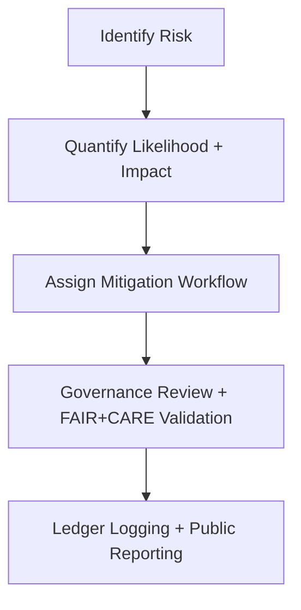

<div align="center">

# ⚠️ **Kansas Frontier Matrix — Governance Risk Assessment Template (v2.1.1 · Tier-Ω+∞ Certified)**  
`docs/templates/governance/risk-assessment-template.md`

**Mission:** Provide a standardized risk assessment structure for **FAIR+CARE governance**, **security**, and **ethical oversight**  
within the **Kansas Frontier Matrix (KFM)** — ensuring transparency, reproducibility, and continuous governance improvement.

[](../../../../docs/)
[](../../../../docs/standards/faircare-validation.md)
[](../../../../data/reports/audit/data_provenance_ledger.json)
[](../../../../LICENSE)

</div>

---

## 📋 Metadata (Frontmatter)

Each risk assessment report must begin with the following metadata:

```yaml
---
assessment_id: "RISK_ASSESSMENT_2025_Q4"
authors: ["@kfm-governance","@kfm-security"]
review_cycle: "Quarterly"
status: "Draft | Approved | Archived"
risk_domain: ["Data Integrity","AI Ethics","Access Control"]
checksum: "sha256:a74e3bc9f17a49c8d..."
ledger_reference: "data/reports/audit/data_provenance_ledger.json"
license: "CC-BY 4.0"
---
```

---

## 🧱 1. Risk Assessment Overview

> Provide a concise description of the assessment scope and governance focus.

**Example:**  
> The Q4 2025 risk assessment focuses on data lineage validation, AI explainability, and user access control mechanisms  
> within the KFM FAIR+CARE and MCP-DL workflows. All components were audited for reproducibility and ethical compliance.

---

## 🧠 2. Risk Matrix Summary

| Risk ID | Category | Description | Impact | Likelihood | Risk Level | Mitigation Strategy | Owner |
|:--|:--|:--|:--:|:--:|:--:|:--|:--|
| **R-001** | AI Ethics | Potential bias in Focus Mode AI model output. | High | Medium | 🔴 High | Retrain with balanced dataset and add SHAP explainability logs. | @kfm-ai |
| **R-002** | Data Provenance | Missing checksum for one NOAA dataset. | Medium | Low | 🟠 Medium | Regenerate checksum and update ledger entry. | @kfm-data |
| **R-003** | Access Control | CI token permissions overly broad. | Medium | Medium | 🟠 Medium | Apply least-privilege policy and reissue tokens. | @kfm-security |
| **R-004** | Documentation | Two files missing `license` field in frontmatter. | Low | Medium | 🟡 Low | Fix metadata and rerun `policy-check.yml`. | @kfm-docs |

> 🧩 **Rule:** Each identified risk must map to a governance policy and corresponding mitigation workflow.

---

## ⚙️ 3. Governance Risk Lifecycle


<!-- END OF MERMAID -->

---

## 🧩 4. FAIR + CARE Integration in Risk Review

| FAIR Principle | CARE Principle | Governance Action |
|:--|:--|:--|
| **Findable** | **Collective Benefit** | Publish all risk reports in open repository under CC-BY 4.0. |
| **Accessible** | **Authority to Control** | Provide community review access with proper data protections. |
| **Interoperable** | **Responsibility** | Use JSON/YAML for all risk metadata. |
| **Reusable** | **Ethics** | Version risk assessments with ledger-tracked changes. |

---

## 🧾 5. Risk Rating Scale

| Level | Symbol | Description | Response Priority |
|:--|:--|:--|:--|
| **Critical** | 🔴 | Immediate impact; ethical or data governance breach. | Urgent |
| **High** | 🟠 | Significant risk to compliance or reproducibility. | High |
| **Medium** | 🟡 | Minor governance issue requiring remediation. | Moderate |
| **Low** | 🟢 | No ethical or structural concern. | Routine |

---

## 🔍 6. Mitigation Tracking Log

| Mitigation ID | Risk Reference | Mitigation Strategy | Workflow | Status | Verified By |
|:--|:--|:--|:--|:--:|:--|
| M-001 | R-001 | Rebalanced AI training dataset with ethics audit. | `ai-model.yml` | ✅ | @kfm-ai |
| M-002 | R-002 | Added checksum validation to ingestion pipeline. | `governance-ledger.yml` | ✅ | @kfm-governance |
| M-003 | R-003 | Applied least-privilege OIDC roles in CI/CD. | `policy-check.yml` | ⚙️ | @kfm-security |
| M-004 | R-004 | Updated documentation metadata; reran validation. | `docs-validate.yml` | ✅ | @kfm-docs |

---

## 🧾 7. Governance Validation Workflows

| Workflow | Purpose | Output |
|:--|:--|:--|
| `policy-check.yml` | Ensures metadata compliance across documents. | `reports/audit/policy_check.json` |
| `faircare-validate.yml` | Audits ethical governance practices. | `reports/fair/data_care_assessment.json` |
| `governance-ledger.yml` | Records risk and mitigation events. | `data/reports/audit/data_provenance_ledger.json` |
| `incident-response.yml` | Logs and addresses active security incidents. | `reports/security/incident_log.json` |

---

## 🧾 8. Risk Assessment Summary

```yaml
summary:
  total_risks_identified: 4
  high_or_critical_risks: 1
  mitigations_completed: 3
  open_risks: 1
  overall_governance_status: "Compliant"
  ledger_entry: "data/reports/audit/data_provenance_ledger.json"
  checksum_verified: true
```

---

## ⚖️ 9. Governance Sign-Off

| Role | Reviewer | Approval | Signature |
|:--|:--|:--:|:--|
| **Governance Chair** | @kfm-governance | ✅ | 🔏 SHA256:4bd7...a32 |
| **Security Officer** | @kfm-security | ✅ | 🔏 SHA256:cf61...c92 |
| **Documentation Lead** | @kfm-docs | ✅ | 🔏 SHA256:ea93...b71 |

---

## 🕰 Version History

| Version | Date | Author | Summary |
|:--|:--|:--|:--|
| **v2.1.1** | 2025-11-16 | @kfm-governance | Finalized template with risk matrix, FAIR+CARE integration, and ledger linkage. |
| v2.0.0 | 2025-10-25 | @kfm-security | Added incident response tracking and mitigation log schema. |
| v1.0.0 | 2025-10-04 | @kfm-docs | Initial governance risk assessment template. |

---

<div align="center">

**Kansas Frontier Matrix © 2025**  
*“Governance Without Risk Assessment Is Governance Without Foresight.”*  
📍 `docs/templates/governance/risk-assessment-template.md` — Official FAIR+CARE-aligned governance risk assessment template for the Kansas Frontier Matrix.

</div>

