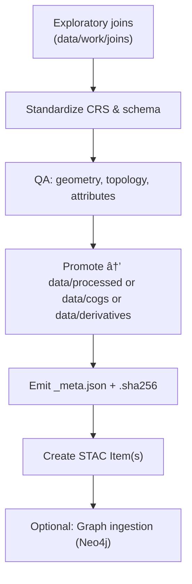

# 🔗 Joins SOP — Reproducible Merges/Overlays (`docs/templates/joins.sop.md`)

**Scope:** Define a **reproducible procedure** for exploratory joins in `data/work/joins/` → promotion into canonical directories with **validation, provenance, and STAC registration**, and optional **graph ingestion**.

**Audience:** Contributors performing spatial joins, overlays, dissolves, or schema merges across layers (e.g., treaties × counties, flood rasters × landcover, OCR entities × features).

---

## ✅ Outcomes

* Clean, standardized join artifacts promoted to:

  * `data/processed/` (vectors/rasters ready for analysis)
  * `data/cogs/` (COGs for rasters)
  * `data/derivatives/` (final composites/indices)
* STAC 1.0.0 Items created/updated
* Provenance + checksums emitted
* (Optional) Neo4j ingestion: entities/relationships materialized

---

## 🧭 Flow (at a glance)



---

## 0) Prereqs

* **CRS standard:** EPSG:4326 (WGS84); reproject all vector layers before joining.
* **Geometry types:** homogeneous per output (e.g., `MultiPolygon` or `MultiLineString`).
* **Attribute schema:** snake_case; ASCII-only column names.
* **No PII**, licenses respected, metadata available.

---

## 1) Naming & Layout

**Join trial (working):**

```
data/work/joins/<slug>_trial.geojson
data/work/joins/<slug>_trial.tif
```

**Promoted (final):**

```
data/processed/<theme>/<slug>.geojson
data/cogs/<theme>/<slug>.tif
data/derivatives/<theme>/<slug>.{geojson|tif}
```

**Metadata & checksums:**

```
data/processed/<theme>/<slug>/_meta.json
data/processed/<theme>/<slug>/<artifact>.<ext>.sha256
```

**Slug pattern:**
`<lhs>_x_<rhs>[_clip|_union|_dissolve][_YYYY|YYYY-YYYY]`

**Examples:**

* `treaties_x_counties_1854.geojson`
* `floods_union_1990-2000.tif`
* `treaty1854_x_ocr_entities.geojson`

---

## 2) Reprojection (to EPSG:4326)

```bash
# Vector
ogr2ogr -t_srs EPSG:4326 data/work/joins/counties_4326.geojson data/raw/counties/counties.shp

# Raster (warp)
gdalwarp -t_srs EPSG:4326 data/raw/floods/flood_1993.tif data/work/joins/flood_1993_4326.tif
```

---

## 3) Run the Join / Overlay

### 3.1 SQL-style overlay (OGR Virtual SQL; requires GPKG/SQLite or PG)

```bash
ogr2ogr -f GeoJSON data/work/joins/treaties_x_counties_trial.geojson \
  counties_4326.gpkg \
  -dialect SQLITE \
  -sql "SELECT t.id AS treaty_id, c.name AS county, ST_Intersection(t.geometry, c.geometry) AS geometry
        FROM treaties_4326 t
        JOIN counties_4326 c
        ON ST_Intersects(t.geometry, c.geometry)"
```

### 3.2 Attribute join (CSV → vector)

```bash
# Add attributes from CSV using GDAL/OGR layer creation option
ogr2ogr -f GeoJSON data/work/joins/railroads_x_attrs_trial.geojson \
  data/raw/railroads/railroads_4326.geojson \
  -sql "SELECT r.*, a.speed_limit
        FROM 'railroads_4326' r
        LEFT JOIN 'railroads_attrs'.'attrs.csv' a
        ON r.segment_id = a.segment_id"
```

### 3.3 Raster merge (trial)

```bash
gdal_merge.py -o data/work/joins/floods_union_trial.tif data/raw/floods/*_4326.tif
```

---

## 4) Schema Standardization

* **Columns:** `snake_case`, deterministic ordering, minimal set of **documented** attributes
* **Examples:**

  * `treaty_id, county, overlap_area_km2, overlap_pct, source_lhs, source_rhs, period, license, confidence`
* **Compute derived fields** (area, length, % overlap) post-join:

```bash
# Example: compute area in km² (requires PostGIS/SQLite or geopandas in a Python step)
python scripts/add_area_km2.py data/work/joins/treaties_x_counties_trial.geojson
```

---

## 5) QA / Validation

### 5.1 Geometry & topology

```bash
# Fix invalids
ogr2ogr -f GeoJSON data/work/joins/<slug>_fixed.geojson data/work/joins/<slug>_trial.geojson -makevalid

# Remove empties & null geom
ogrinfo data/work/joins/<slug>_fixed.geojson -al -so
```

### 5.2 Attribute checks

* Ensure no duplicate keys
* No unexpected nulls in key join columns
* Enforce enumerations if applicable

### 5.3 CRS and extent sanity

```bash
ogrinfo data/work/joins/<slug>_fixed.geojson -al -so | grep "EPSG:4326"
```

---

## 6) Promote (Directory & Files)

Pick the correct destination:

* **Vector analysis-ready:** `data/processed/<theme>/<slug>.geojson`
* **Raster optimized:** convert to **COG** and put in `data/cogs/<theme>/<slug>.tif`
* **Final composites/indices:** `data/derivatives/<theme>/<slug>.*`

**COG conversion:**

```bash
rio cogeo create data/work/joins/floods_union_trial.tif data/cogs/hazards/floods_union_1990-2000.tif \
  --overview-level=5 --web-optimized
```

**Move vector:**

```bash
mkdir -p data/processed/land/treaties_x_counties_1854
mv data/work/joins/treaties_x_counties_trial_fixed.geojson \
   data/processed/land/treaties_x_counties_1854/treaties_x_counties_1854.geojson
```

---

## 7) Provenance & Checksums

**Provenance (`_meta.json`)**

```json
{
  "id": "treaties_x_counties_1854",
  "title": "Treaties × Counties (1854) — Overlaps",
  "source_lhs": "data/raw/treaties/treaties_1854.geojson",
  "source_rhs": "data/raw/counties/counties.gpkg",
  "commands": [
    "ogr2ogr -t_srs EPSG:4326 ...",
    "ogr2ogr -dialect SQLITE -sql 'SELECT ... ST_Intersection ...'"
  ],
  "crs": "EPSG:4326",
  "created": "2025-10-01T19:00:00Z",
  "stats": {
    "features": 312,
    "total_overlap_km2": 12437.12
  },
  "versions": {
    "gdal": "3.8.x",
    "ogr": "3.8.x",
    "python": "3.11"
  },
  "confidence": 0.92,
  "license": "Public Domain",
  "notes": "Exploratory overlay promoted after QA; no invalid geometry."
}
```

**Checksums**

```bash
# per artifact
shasum -a 256 data/processed/land/treaties_x_counties_1854/treaties_x_counties_1854.geojson \
  > data/processed/land/treaties_x_counties_1854/treaties_x_counties_1854.geojson.sha256
```

---

## 8) STAC Item

**Item path:** `stac/items/<collection>/<id>.json`

**Minimal template:**

```json
{
  "type": "Feature",
  "stac_version": "1.0.0",
  "id": "treaties_x_counties_1854",
  "properties": {
    "datetime": "1854-01-01T00:00:00Z",
    "start_datetime": "1854-01-01T00:00:00Z",
    "end_datetime": "1854-12-31T23:59:59Z",
    "kfm:confidence": 0.92,
    "kfm:source_lhs": "treaties_1854",
    "kfm:source_rhs": "counties"
  },
  "geometry": { "type": "Polygon", "coordinates": [/* bbox or union */] },
  "bbox": [ -102.05, 36.99, -94.59, 40.00 ],
  "assets": {
    "data": {
      "href": "../../data/processed/land/treaties_x_counties_1854/treaties_x_counties_1854.geojson",
      "type": "application/geo+json",
      "roles": ["data"]
    },
    "provenance": {
      "href": "../../data/processed/land/treaties_x_counties_1854/_meta.json",
      "type": "application/json",
      "roles": ["metadata"]
    }
  },
  "links": [],
  "collection": "land"
}
```

**Validation:**

```bash
make stac-validate
```

---

## 9) Optional: Graph Ingestion (Neo4j)

**Goal:** Attach relationships derived from the join to the knowledge graph (e.g., treaty overlaps county → `AFFECTS` / `WITHIN`).

**Cypher sketch:**

```cypher
// Upsert Places (counties) and Treaties (events/documents)
UNWIND $records AS r
MERGE (c:Place {name: r.county, type: "county"})
MERGE (t:Treaty {id: r.treaty_id})
MERGE (t)-[rel:AFFECTS {year: 1854}]->(c)
SET rel.overlap_km2 = r.overlap_km2,
    rel.overlap_pct = r.overlap_pct,
    rel.confidence = r.confidence;
```

**Notes:**

* Ensure a deterministic key on both sides (`treaty_id`, `county`).
* Attach provenance URIs to nodes/edges as properties.

---

## 10) Makefile Targets (suggested)

```makefile
# Standardize
joins-standardize:
	ogr2ogr -t_srs EPSG:4326 data/work/joins/$(LHS)_4326.$(LEXT) data/raw/$(LHS).$(LEXT)
	ogr2ogr -t_srs EPSG:4326 data/work/joins/$(RHS)_4326.$(REXT) data/raw/$(RHS).$(REXT)

# Run join (user-supplied SQL via $(SQL))
joins-run:
	ogr2ogr -f GeoJSON data/work/joins/$(SLUG)_trial.geojson data/work/joins/ \
	  -dialect SQLITE -sql "$(SQL)"

# QA
joins-qa:
	ogr2ogr -f GeoJSON data/work/joins/$(SLUG)_fixed.geojson data/work/joins/$(SLUG)_trial.geojson -makevalid

# Promote
joins-promote:
	mkdir -p data/processed/$(THEME)/$(SLUG)
	mv data/work/joins/$(SLUG)_fixed.geojson data/processed/$(THEME)/$(SLUG)/$(SLUG).geojson

# Provenance & checksum
joins-prov:
	python scripts/write_meta.py data/processed/$(THEME)/$(SLUG) $(SLUG)
	shasum -a 256 data/processed/$(THEME)/$(SLUG)/$(SLUG).geojson \
	  > data/processed/$(THEME)/$(SLUG)/$(SLUG).geojson.sha256

# STAC
joins-stac:
	python scripts/write_stac_item.py $(SLUG) $(THEME)

# Clean
clean-joins:
	rm -rf data/work/joins/*
```

---

## 11) CI Integration

* Lint `*.geojson` (JSON syntax)
* Validate STAC
* Enforce checksum presence
* Fail on missing `_meta.json` for promoted artifacts
* Optional: run `ogrinfo -al -so` sanity checks

---

## 12) Rollback

* Revert commit touching promoted artifacts + STAC
* Re-run `clean-joins`
* Restore last-known-good from Git history or STAC state
* Record rollback note in `_meta.json` (append `rollback_of` and reason)

---

## 13) Checklist (MCP)

* [ ] Inputs reprojected to EPSG:4326
* [ ] Join performed via documented commands (copied to `_meta.json`)
* [ ] Geometry valid; no empties; attributes standardized
* [ ] Promoted to correct directory
* [ ] `_meta.json` written with commands/versions
* [ ] `.sha256` created for each artifact
* [ ] STAC Item created/updated → passes validation
* [ ] (Optional) Graph edges/nodes ingested
* [ ] Cleaned `data/work/joins/`

---

## 14) Examples

**Treaties × Counties (1854)**

* Output: `data/processed/land/treaties_x_counties_1854/treaties_x_counties_1854.geojson`
* Fields: `treaty_id, county, overlap_km2, overlap_pct, confidence`
* Confidence mapping: `>0.9 high`, `0.7–0.9 medium`, `<0.7 low`

**Floods union (1990–2000)**

* Output COG: `data/cogs/hazards/floods_union_1990-2000.tif`
* `_meta.json` includes list of input rasters and merge operation

---

**End of SOP** 🚀
