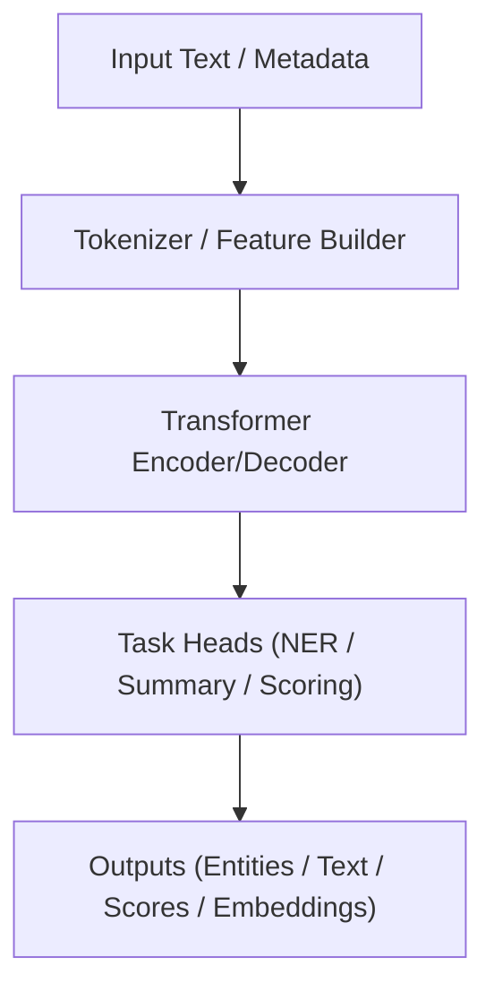

<div align="center">

# 🤖 **Kansas Frontier Matrix — AI/ML Model Card Template**  
`docs/templates/model_card.md`

**Purpose:**  
Standardize how KFM documents AI/ML models for **reproducibility, explainability, and FAIR+CARE governance**.  
Every model card is machine-validated in CI and registered to the Governance Ledger with checksum lineage and telemetry.

[](../README.md)
[](../../LICENSE)
[](../standards/faircare.md)
[]()

</div>

---

## 🧭 Overview

A **Model Card** describes the model’s **purpose, data, architecture, performance, risks, and ethics**.  
All KFM models (e.g., Focus Mode inference, entity extraction, summarization) **must** include a `model_card.md` using this template.

Validated automatically by:

- `docs-lint.yml` — front-matter, headings, links, Mermaid guardrails  
- `faircare-validate.yml` — ethics, CARE tags, PII/sensitivity checks  
- `telemetry-export.yml` — build + energy/carbon + governance metrics

---

## 🧱 Metadata (YAML Front-Matter — Required)

Each model card begins with:

```yaml
---
title: "🤖 [Model Name]"
path: "src/ai/models/[model_name]/model_card.md"
version: "vX.Y.Z"
last_updated: "YYYY-MM-DD"
review_cycle: "Quarterly / Autonomous"
commit_sha: "<commit-hash>"
sbom_ref: "releases/vX.Y.Z/sbom.spdx.json"
manifest_ref: "releases/vX.Y.Z/manifest.zip"
telemetry_ref: "releases/vX.Y.Z/focus-telemetry.json"
telemetry_schema: "schemas/telemetry/docs-modelcard-template-v2.json"
governance_ref: "docs/standards/governance/ROOT-GOVERNANCE.md"
license: "CC-BY 4.0"
mcp_version: "MCP-DL v6.3"
---
```

> All keys are required and must pass `docs-lint.yml` + schema validation.

---

## 🧩 Model Overview

| Field | Description |
|---|---|
| **Model Name** | Human-readable name + short ID. |
| **Version** | SemVer (e.g., `v1.0.0`). |
| **Author(s)** | Names + affiliations/contact. |
| **Date Created** | ISO 8601 (`YYYY-MM-DD`). |
| **License** | MIT/Apache-2.0/CC-BY-4.0 (match repo policy). |
| **Repository Path** | e.g., `src/ai/models/focus_transformer_v2_1/`. |

**Example**  
> *Focus Transformer v2.1* — contextual summarizer and entity linker for Focus Mode.  
> Optimized for Kansas historical documents, ecologic/hazards narratives, and geospatial context.

---

## 🎯 Intended Use

| Aspect | Details |
|---|---|
| **Primary Task(s)** | e.g., NER, summarization, embedding search, risk scoring. |
| **Intended Domain** | Historic texts, geospatial docs, environmental/hazards reports. |
| **Intended Users** | Researchers, developers, curators, educators, policy analysts. |
| **Not Intended For** | Autonomous high-stakes decision-making, law enforcement, medical triage, or culturally sensitive data use without explicit Council approval. |

> Clearly list **non-approved** use-cases to meet FAIR+CARE expectations.

---

## 🧠 Model Architecture

| Component | Description |
|---|---|
| **Base Architecture** | e.g., Encoder-only, Encoder-Decoder, LLM. |
| **Backbone / Checkpoint** | e.g., `bert-base-uncased`, `longformer-base-4096`. |
| **Inputs** | Text, optional metadata (time, location, CARE tags). |
| **Outputs** | Entities, summaries, scores, embeddings, etc. |
| **Parameter Count** | Total parameters; approximate model size. |
| **Frameworks** | PyTorch/TF/spaCy versions. |
| **Dependencies** | Major libs, external services, or embeddings. |

**Optional Architecture Diagram**


---

## 🧪 Training Data & Methodology

Describe the **data and training pipeline** with enough detail for reproduction.

| Field | Description |
|---|---|
| **Training Dataset(s)** | Source names, DOIs/URLs, licenses. |
| **Preprocessing** | Cleaning, OCR normalization, tokenization, filters. |
| **Sampling Strategy** | Random/stratified/balanced; rationale. |
| **Hyperparameters** | LR, batch size, epochs, optimizer, regularization. |
| **Hardware/Env** | GPU model, CPU, RAM, Docker image digest, seeds. |

**Example command**
```bash
python src/ai/models/focus_transformer_v2_1/train.py \
  --config configs/ai/focus_v2_1.yaml \
  --epochs 15 \
  --learning-rate 3e-5 \
  --seed 42
```

---

## 📊 Evaluation Metrics

Summarize evaluation metrics and datasets.

| Metric | Description | Value |
|---|---|---|
| Accuracy | Overall correctness on test set | 0.94 |
| Precision | Positive predictive value | 0.92 |
| Recall | Sensitivity / coverage | 0.95 |
| F1 Score | Harmonic mean | 0.935 |
| Task-Specific | e.g., ROUGE-L for summaries | 0.78 |

> Specify **evaluation dataset(s)**, splits, and any **held-out** or OOD sets used.

---

## 🔍 Explainability, Safety & Bias

| Category | Notes |
|---|---|
| **Explainability Tools** | SHAP, LIME, Integrated Gradients, attention inspection. |
| **Feature Importance** | Key features (tokens, fields) that drive predictions. |
| **Bias Detection** | Groups/segments evaluated; disparity metrics. |
| **Mitigation Steps** | Reweighting, data augmentation, thresholding, human review. |
| **Known Limitations** | Failures (e.g., low contrast scans, dialect variation, languages). |
| **Safety** | Guardrails (rate limits, max output length, content filters). |

**Example Insight**  
> Entity recall drops for tribal names in OCR-degraded sources; mitigation added via targeted augmentation and manual annotation of tribal name lexicons.

---

## ⚖️ FAIR+CARE Compliance

| Principle | Implementation |
|---|---|
| **Findable** | Model version + metadata referenced in STAC/DCAT; optional DOI/ARK. |
| **Accessible** | Model card + code under open licenses; clear usage docs. |
| **Interoperable** | Output semantics align with KFM schemas (STAC Items, graph nodes). |
| **Reusable** | Checkpoints, config, SBOM, and manifest provide full lineage. |
| **CARE** | CARE tags respected, sensitive domains blocked, community review documented. |

Attach relevant governance files:

```
reports/fair/faircare_summary.json
reports/audit/ai_models.json
```

---

## 🧾 Deployment & Integration

Describe how the model is used in KFM.

| Component | Function |
|---|---|
| **Service/API** | e.g., `/api/focus/summary`, `/api/ai/ner`. |
| **Integration Points** | Web UI, Focus Mode, batch pipelines. |
| **Runtime Constraints** | Memory, latency targets, concurrency. |
| **Fallbacks** | What happens on error / drift / low confidence. |

---

## 🧮 Reproducibility Checklist

Tick all boxes before merging a model card.

- [ ] Dataset(s) documented with licenses and access links  
- [ ] Hyperparameters and seeds recorded  
- [ ] Training and evaluation scripts available  
- [ ] SBOM (`sbom.spdx.json`) and manifest (`manifest.zip`) generated  
- [ ] FAIR+CARE audit run and logged  
- [ ] Model registered in `ai_models` ledger  

**Example commands**
```bash
make train-model MODEL=focus_transformer_v2_1
make eval-model  MODEL=focus_transformer_v2_1
make package-model MODEL=focus_transformer_v2_1
```

---

## 🧭 Governance & Ethics Notes

Summarize relevant governance decisions.

- **Council Reviewers:** Names / teams  
- **Decision:** ☑ Approved / ☐ Pending / ☒ Changes Required  
- **Key Concerns:** Bias, domain limitations, misuse risks  
- **Follow-ups:** Monitoring plans, retraining schedule, sunset criteria  

Reference:

```
reports/audit/github-workflows-ledger.json
```

---

## 🕰️ Version History

| Version | Date | Author | Summary |
|---|---|---|---|
| v10.2.2 | 2025-11-12 | A. Barta | Aligned refs to v10.2.0; integrated with telemetry v2; clarified governance & reproducibility gates. |
| v10.0.0 | 2025-11-10 | A. Barta | Telemetry schema v2; tightened safety/bias documentation requirements. |
| v9.7.0 | 2025-11-05 | A. Barta | Standardized model card for governance and reproducibility. |
| v9.5.0 | 2025-10-20 | A. Barta | Added FAIR+CARE & explainability sections. |
| v9.0.0 | 2025-06-01 | KFM Core Team | Initial template creation. |

---

<div align="center">

**© 2025 Kansas Frontier Matrix — CC-BY 4.0**  
Maintained under **Master Coder Protocol v6.3** · FAIR+CARE Certified · **Diamond⁹ Ω / Crown∞Ω** Ultimate Certified  
[Back to Template Index](README.md) · [Governance Charter](../standards/governance/ROOT-GOVERNANCE.md)

</div>