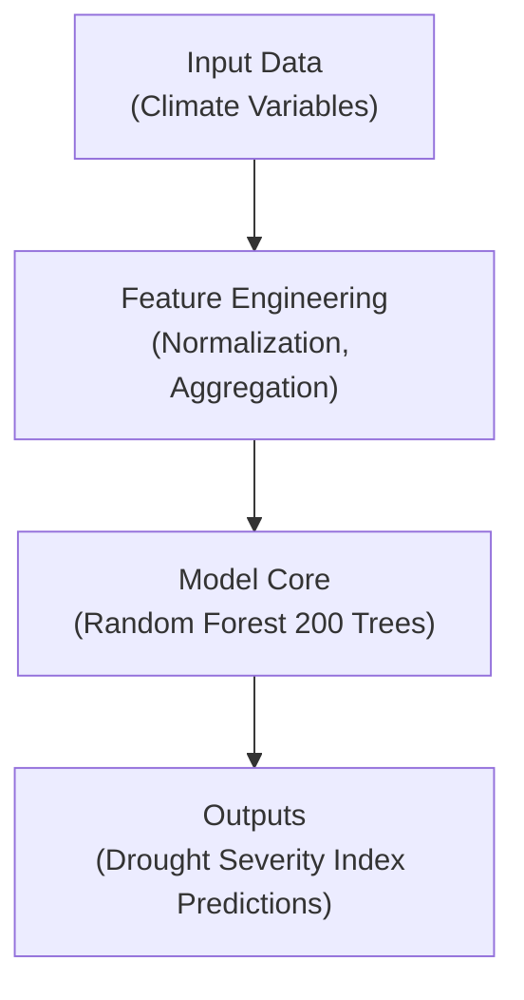

# 🧮 Kansas Frontier Matrix — **Model Card Template**

`docs/templates/model_card.md`

**Purpose:** Provide a **reproducible, transparent, and FAIR-compliant template** for documenting any analytical, predictive, or AI/ML model within the
**Kansas Frontier Matrix (KFM)** — ensuring **traceability**, **accountability**, and **Master Coder Protocol (MCP)** alignment across all computational models.

---

## 🧭 Model Metadata

| Field                        | Description                                                |
| :--------------------------- | :--------------------------------------------------------- |
| **Model ID**                 | Unique identifier (e.g., `MODEL-2025-001-CLIMATE`)         |
| **Model Name**               | Descriptive title                                          |
| **Author(s)**                | Developer(s) or team responsible                           |
| **Affiliation**              | Research group / institution                               |
| **Date Created / Updated**   | YYYY-MM-DD / YYYY-MM-DD                                    |
| **Version**                  | v1.0 · v1.1 · etc.                                         |
| **Domain**                   | Terrain / Hydrology / Climate / Hazards / Landcover / Text |
| **Status**                   | Development / Validated / Production / Deprecated          |
| **Associated Experiment(s)** | Reference `docs/templates/experiment.md` ID(s)             |
| **License**                  | CC-BY 4.0 (outputs) · MIT (code) · other                   |
| **Repository / Script Path** | e.g. `src/models/climate_trend_model.py`                   |
| **Model Card DOI**           | (if published)                                             |

---

## 🎯 Model Purpose

Clearly state the model’s **goal**, **application domain**, and **intended audience**.

> *Example:*
> *Predict drought severity across Kansas based on precipitation anomalies, temperature indices, and historical hydrologic drought events to assist resource-management planning.*

---

## 🧩 Model Overview

| Category                  | Description                                          |
| :------------------------ | :--------------------------------------------------- |
| **Type**                  | Statistical / Machine Learning / Simulation / Hybrid |
| **Algorithm / Framework** | Random Forest · XGBoost · CNN · ARIMA                |
| **Language / Library**    | Python · TensorFlow · Scikit-learn · R               |
| **Training Method**       | Supervised / Unsupervised / Reinforcement            |
| **Input Features**        | List variables or source datasets                    |
| **Output Targets**        | Describe predictions or derived parameters           |

---

## ⚙️ Data Inputs & Dependencies

| Dataset                         | Description        | License       | Location                    |
| :------------------------------ | :----------------- | :------------ | :-------------------------- |
| `daymet_1980_2024.nc`           | Daily climate data | Public Domain | `data/processed/climate/`   |
| `usgs_streamflow_1900_2025.csv` | Streamflow records | USGS          | `data/processed/hydrology/` |

**Each dataset →**

* `data/sources/<domain>/*.json` manifest
* `data/checksums/<domain>/*.sha256`
* `data/stac/<domain>/*.json` metadata

---

## 🧮 Model Architecture

> Architecture diagrams should also be exported to `docs/architecture/diagrams/`.

---

## 🧠 Training Configuration

| Parameter             | Value                             | Description                               |
| :-------------------- | :-------------------------------- | :---------------------------------------- |
| **Training Period**   | 1980 – 2020                       | Historical data range                     |
| **Validation Period** | 2021 – 2024                       | Independent testing                       |
| **Split Ratio**       | 80 / 20                           | Train vs test proportion                  |
| **Random Seed**       | 42                                | Reproducibility                           |
| **Hardware**          | 16 GB RAM · NVIDIA T4 GPU         | Compute environment                       |
| **Software Env**      | Python 3.11 · Conda env `kfm_env` | Dependencies locked via `environment.yml` |

---

## 📊 Performance Metrics

| Metric                 | Description                  | Value       | Evaluation Method |
| :--------------------- | :--------------------------- | :---------- | :---------------- |
| **RMSE (m)**           | Root Mean Square Error       | 1.23        | Cross-validation  |
| **R²**                 | Coefficient of Determination | 0.94        | vs Observed Data  |
| **Precision / Recall** | Classification accuracy      | 0.89 / 0.91 | Confusion Matrix  |
| **AUC**                | Area under ROC Curve         | 0.92        | Scikit-learn      |
| **Checksum Match**     | Model artifact integrity     | ✅           | SHA-256 verified  |

---

## 🔍 Validation & Reproducibility

| Validation Type         | Description                       | Method / Tool                  |
| :---------------------- | :-------------------------------- | :----------------------------- |
| **Checksum Validation** | Ensure data and weights integrity | `make checksums`               |
| **Cross-Validation**    | Multi-fold statistical validation | k = 5 folds                    |
| **STAC Compliance**     | Metadata schema validation        | `make stac-validate`           |
| **CI/CD Automation**    | Continuous testing pipeline       | `.github/workflows/codeql.yml` |
| **Peer Review**         | Independent replication check     | GitHub PR review workflow      |

📁 Logs stored under `data/work/logs/models/<model_id>_validation.log`

---

## ⚖️ Limitations & Assumptions

> * Accuracy decreases for years with sparse precipitation data.
> * Model excludes anthropogenic controls (e.g., irrigation).
> * Annual resolution may mask seasonal variability.

---

## 🔎 Interpretability & Explainability

| Feature               | Importance (%) | Explanation               |
| :-------------------- | :------------- | :------------------------ |
| Precipitation Anomaly | 45             | Primary drought predictor |
| Soil Moisture         | 30             | Persistence of deficit    |
| Temperature           | 15             | Seasonal variability      |
| Vegetation Index      | 10             | Surface response proxy    |

> Use `SHAP`, `LIME`, or permutation importance plots to support interpretability.

---

## 🧾 Model Outputs

| Output               | Format          | Location                   | Description                   |
| :------------------- | :-------------- | :------------------------- | :---------------------------- |
| **Weights / Binary** | `.pkl` / `.h5`  | `models/<domain>/`         | Trained model artifact        |
| **Predictions**      | `.csv` / `.tif` | `data/processed/<domain>/` | Model results                 |
| **Metadata**         | `.json`         | `data/stac/<domain>/`      | STAC-compliant descriptor     |
| **Logs**             | `.log`          | `data/work/logs/models/`   | Training & validation records |

---

## 🔐 Ethical & Licensing Considerations

* ✅ Data under public domain or CC-BY 4.0 license
* ✅ Code under MIT license for reuse
* 🚫 No personal or sensitive data included
* 🧭 Bias and fairness evaluation recommended for predictive models
* 📜 Attribution required for derivative use

---

## 🧩 MCP Compliance Summary

| MCP Principle           | Implementation                        |
| :---------------------- | :------------------------------------ |
| **Documentation-first** | Complete model card before deployment |
| **Reproducibility**     | Versioned datasets & configurations   |
| **Open Standards**      | STAC · JSON · CSV · COG formats       |
| **Provenance**          | Linked source manifests + checksums   |
| **Auditability**        | CI/CD logs enable verifiable re-runs  |

---

## 📎 Related Documentation

| File                                   | Purpose                                  |
| :------------------------------------- | :--------------------------------------- |
| `docs/templates/experiment.md`         | Training / evaluation experiment records |
| `docs/templates/sop.md`                | Deployment and validation procedures     |
| `docs/architecture/pipelines.md`       | ETL and model integration overview       |
| `docs/architecture/knowledge-graph.md` | Semantic linking of model outputs        |
| `.github/workflows/codeql.yml`         | Static analysis and security workflow    |

---

## 📚 References

1. **STAC Specification v1.0.0** — [stacspec.org](https://stacspec.org)
2. **Master Coder Protocol (MCP)** — KFM Documentation Framework
3. **Model Cards for Model Reporting** — Google Research (2019)
4. **FAIR Principles** — Wilkinson et al., 2016 (Findable · Accessible · Interoperable · Reusable)

---

## 📅 Version History

| Version | Date       | Author                 | Summary                       |
| :------ | :--------- | :--------------------- | :---------------------------- |
| v1.0    | 2025-10-04 | KFM Documentation Team | Initial template release      |
| v1.1    | 2025-10-05 | KFM Engineering        | Enhanced FAIR / MCP alignment |

---

**Kansas Frontier Matrix** — *“Every Model Transparent. Every Prediction Proven.”*
📍 [`docs/templates/model_card.md`](.) · Standardized model documentation template for Kansas Frontier Matrix (MCP Compliant)

