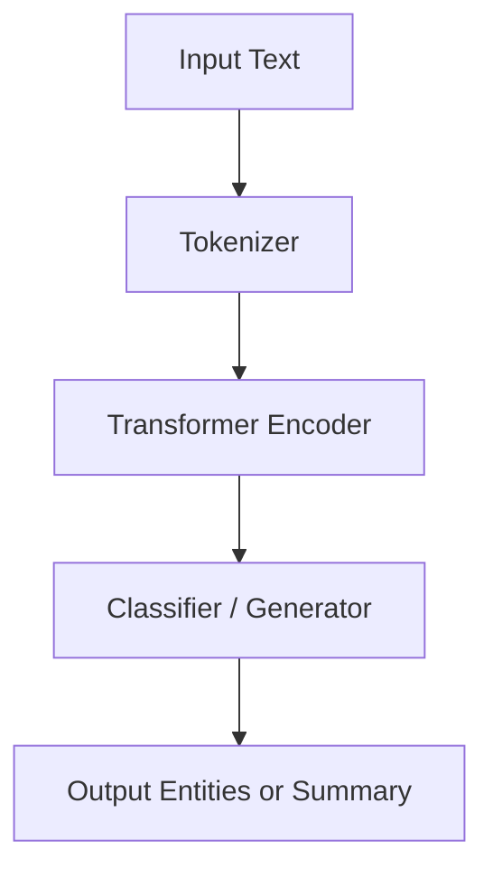

<div align="center">

# 🤖 **Kansas Frontier Matrix — AI/ML Model Card Template**
`docs/templates/model_card.md`

**Purpose:** Provide a standardized template for documenting AI and machine learning models within the Kansas Frontier Matrix (KFM) framework.  
Each model card captures metadata, ethical context, explainability details, and reproducibility criteria, aligned with **Master Coder Protocol (MCP v6.3)** and **FAIR+CARE** standards.

[](../README.md)
[](../../LICENSE)
[](../standards/faircare.md)
[]()

</div>

---

## 🧭 Overview

A **Model Card** is a structured documentation artifact describing the purpose, architecture, performance, and ethical considerations of a machine learning model.  
All KFM models (e.g., entity recognition, summarization, Focus Mode inference) must include a corresponding `model_card.md` file to ensure reproducibility, transparency, and ethical governance.

Each card is versioned and validated automatically by:
- `faircare-validate.yml` (ethical governance check)
- `docs-lint.yml` (schema and style validation)
- `telemetry-export.yml` (build and metadata tracking)

---

## 🧱 Metadata (YAML Front-Matter)

Every `model_card.md` must include a YAML header with essential metadata:

```yaml
---
title: "🤖 [Model Name]"
path: "src/ai/models/[model_name]/model_card.md"
version: "vX.Y.Z"
last_updated: "YYYY-MM-DD"
review_cycle: "Quarterly / Autonomous"
commit_sha: "<commit-hash>"
sbom_ref: "releases/vX.Y.Z/sbom.spdx.json"
manifest_ref: "releases/vX.Y.Z/manifest.zip"
telemetry_ref: "releases/vX.Y.Z/focus-telemetry.json"
governance_ref: "docs/standards/governance/ROOT-GOVERNANCE.md"
---
```

---

## 🧩 Model Overview

| Field | Description |
|-------|-------------|
| **Model Name** | Full name and short identifier. |
| **Version** | Semantic version tag (e.g. v1.0.0). |
| **Author(s)** | Name(s) and affiliation(s) of model developers. |
| **Date Created** | Model creation date. |
| **License** | License type (MIT, Apache 2.0, CC-BY 4.0). |
| **Repository Path** | Example: `src/ai/models/focus_transformer_v1/`. |

**Example:**
> Focus Transformer v1 — a contextual summarization and entity-linking model for KFM Focus Mode.  
> Developed by the Kansas Frontier Matrix AI team using transformer-based sentence embeddings.

---

## 🎯 Intended Use

Clearly describe the model’s purpose and scope.

| Aspect | Details |
|--------|----------|
| **Primary Task** | e.g., Named Entity Recognition (NER), Summarization, Embedding Search |
| **Intended Domain** | e.g., Historical text archives, geospatial documents |
| **Intended Users** | Developers, researchers, historians, and educators |
| **Not Intended For** | Automated decision-making, sensitive cultural datasets without governance approval |

---

## 🧠 Model Architecture

| Component | Description |
|------------|-------------|
| **Base Architecture** | e.g., BERT, DistilBERT, Transformer Encoder-Decoder |
| **Input Type** | e.g., tokenized text, GeoJSON feature properties |
| **Output Type** | e.g., labeled entities, summary text |
| **Parameters** | Total parameter count or size |
| **Frameworks** | e.g., PyTorch 2.0, TensorFlow 2.14, spaCy 3.7 |
| **Dependencies** | List of major libraries and models used |

**Example Diagram (optional):**


---

## 🧪 Training Data & Methodology

| Field | Description |
|-------|-------------|
| **Training Dataset(s)** | List dataset sources with citations and licenses. |
| **Preprocessing** | Describe text cleaning, tokenization, or normalization. |
| **Sampling Strategy** | e.g., stratified, balanced by category. |
| **Training Parameters** | Learning rate, batch size, epochs, optimizer, etc. |
| **Hardware / Environment** | CPU/GPU details, Docker image used. |

**Example Code:**
```bash
python src/ai/models/focus_transformer_v1/train.py --epochs=15 --lr=3e-5
```

---

## 📊 Evaluation Metrics

Summarize how the model’s performance was measured.

| Metric | Description | Value |
|---------|-------------|-------|
| Accuracy | General model accuracy | 0.94 |
| Precision | True positive rate | 0.92 |
| Recall | Completeness of detection | 0.95 |
| F1 Score | Harmonic mean of precision/recall | 0.935 |
| BLEU / ROUGE | For summarization models | ROUGE-L = 0.78 |

Include validation dataset or cross-validation method if applicable:
> Evaluation conducted on 10% held-out Kansas treaty corpus using stratified sampling.

---

## 🔍 Explainability & Bias

Discuss transparency, fairness, and ethical implications.

| Category | Notes |
|-----------|-------|
| **Explainability Tools** | e.g., SHAP, LIME, Captum |
| **Feature Importance Analysis** | Identify top influential input features. |
| **Bias Detection** | Describe datasets or attributes evaluated for bias. |
| **Mitigation Strategies** | Methods to reduce bias or overfitting. |
| **Limitations** | Known constraints, edge cases, or ethical boundaries. |

**Example Insight:**
> Model exhibits lower confidence when interpreting archaic or non-English text; mitigated by fine-tuning on domain-specific vocabulary.

---

## ⚖️ FAIR+CARE Compliance

| Principle | Implementation |
|------------|----------------|
| **Findable** | Model metadata and version logged under STAC/DCAT catalog. |
| **Accessible** | Source code open under MIT License; datasets open under CC-BY. |
| **Interoperable** | Outputs conform to STAC 1.0.0 and GeoJSON schemas. |
| **Reusable** | Model card and checkpoints versioned in `releases/v9.7.0/`. |
| **CARE** | Indigenous and cultural datasets reviewed by governance council prior to use. |

Attach validation artifacts:
```
reports/fair/faircare_summary.json
reports/audit/ai_models.json
```

---

## 🧾 Deployment & Integration

Describe how the model integrates into KFM workflows.

| Component | Function |
|------------|-----------|
| **API Endpoint** | `/api/ai/focus/` |
| **Dependency Path** | `src/ai/models/focus_transformer_v1/` |
| **Integration Layer** | AI → Graph Database → Web Client |
| **Deployment Target** | Docker container, FastAPI service |

---

## 🧮 Reproducibility Checklist

- [x] All training datasets cited with license and DOI.  
- [x] Model hyperparameters listed and versioned.  
- [x] Results reproducible with scripts in repository.  
- [x] Model card validated under `docs-lint.yml`.  
- [x] FAIR+CARE audit passed.  

**Example Reproduction Command:**
```bash
make train-model MODEL=focus_transformer_v1
make evaluate-model MODEL=focus_transformer_v1
```

---

## 🧭 Governance & Ethics Notes

Summarize governance considerations and review results.

**Governance Council Review:**
- Reviewed by: FAIR+CARE Council (Oct 2025)
- Status: ✅ Approved for open use
- Notes: No sensitive tribal or culturally restricted data detected.

Governance log entry recorded in:
```
reports/audit/github-workflows-ledger.json
```

---

## 🕰️ Version History

| Version | Date | Author | Summary |
|----------|------|---------|----------|
| v9.7.0 | 2025-11-05 | A. Barta | Added standardized AI/ML model card template for governance and reproducibility. |
| v9.5.0 | 2025-10-20 | A. Barta | Integrated FAIR+CARE and explainability section updates. |
| v9.0.0 | 2025-06-01 | KFM Core Team | Initial template creation. |

---

<div align="center">

**© 2025 Kansas Frontier Matrix — CC-BY 4.0**  
Maintained under **Master Coder Protocol v6.3** · FAIR+CARE Certified · Diamond⁹ Ω / Crown∞Ω Ultimate Certified  
[Back to Template Index](README.md) · [Governance Charter](../standards/governance/ROOT-GOVERNANCE.md)

</div>
