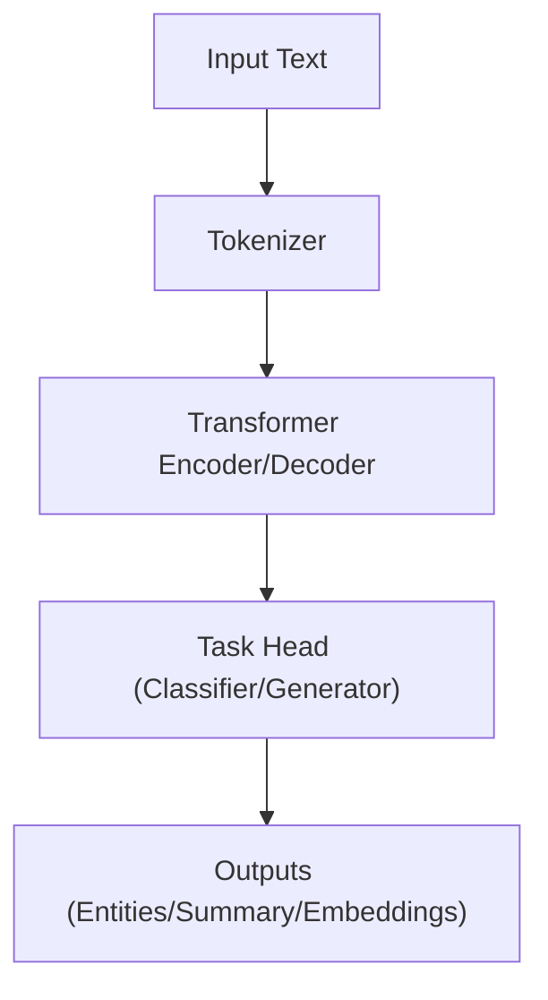

<div align="center">

# 🤖 **Kansas Frontier Matrix — AI/ML Model Card Template**  
`docs/templates/model_card.md`

**Purpose:** Standardize how KFM documents AI/ML models for **reproducibility, explainability, and FAIR+CARE governance**.  
Every model card is machine-validated in CI and registered to the Governance Ledger with checksum lineage and telemetry.

[](../README.md)
[](../../LICENSE)
[](../standards/faircare.md)
[]()

</div>

---

## 🧭 Overview

A **Model Card** describes the model’s **purpose, data, architecture, performance, risks, and ethics**.  
All KFM models (e.g., Focus Mode inference, entity extraction, summarization) **must** include a `model_card.md` using this template.

Validated automatically by:
- `faircare-validate.yml` (ethics/accessibility)
- `docs-lint.yml` (front-matter/format)
- `telemetry-export.yml` (build + energy/carbon logging)

---

## 🧱 Metadata (YAML Front-Matter)

Each model card begins with:

```yaml
---
title: "🤖 [Model Name]"
path: "src/ai/models/[model_name]/model_card.md"
version: "vX.Y.Z"
last_updated: "YYYY-MM-DD"
review_cycle: "Quarterly / Autonomous"
commit_sha: "<commit-hash>"
sbom_ref: "releases/vX.Y.Z/sbom.spdx.json"
manifest_ref: "releases/vX.Y.Z/manifest.zip"
telemetry_ref: "releases/vX.Y.Z/focus-telemetry.json"
telemetry_schema: "schemas/telemetry/docs-modelcard-[vN].json"
governance_ref: "docs/standards/governance/ROOT-GOVERNANCE.md"
license: "CC-BY 4.0"
mcp_version: "MCP-DL v6.3"
---
```

---

## 🧩 Model Overview

| Field | Description |
|---|---|
| **Model Name** | Human-readable name + short ID. |
| **Version** | SemVer (e.g., v1.0.0). |
| **Author(s)** | Names + affiliations. |
| **Date Created** | ISO 8601 date. |
| **License** | MIT/Apache-2.0/CC-BY-4.0 (match repo policy). |
| **Repository Path** | e.g., `src/ai/models/focus_transformer_v1/`. |

**Example**  
> *Focus Transformer v2* — contextual summarizer + entity linker for KFM Focus Mode.  
> Trained with transformer embeddings; optimized for archival text and geospatial context.

---

## 🎯 Intended Use

| Aspect | Details |
|---|---|
| **Primary Task** | NER, summarization, embedding search, risk scoring, etc. |
| **Intended Domain** | Historic texts, geospatial docs, environmental records. |
| **Intended Users** | Researchers, developers, curators, educators. |
| **Not Intended For** | Automated high-stakes decisions; culturally sensitive data without explicit governance approval. |

---

## 🧠 Model Architecture

| Component | Description |
|---|---|
| **Base Architecture** | BERT/Longformer/Encoder-Decoder, etc. |
| **Inputs** | Tokenized text; optional structured/geo attrs. |
| **Outputs** | Labeled entities, summaries, embeddings, scores. |
| **Parameter Count** | Total params / size. |
| **Frameworks** | PyTorch/TF/spaCy versions. |
| **Dependencies** | Major libs + pre-trained checkpoints. |

**Optional Diagram**


---

## 🧪 Training Data & Methodology

| Field | Description |
|---|---|
| **Training Dataset(s)** | Sources, citations, licenses (DOIs if applicable). |
| **Preprocessing** | Cleaning, normalization, tokenization. |
| **Sampling Strategy** | Random/stratified/balanced rationale. |
| **Hyperparameters** | LR, batch size, epochs, optimizer, schedulers. |
| **Hardware/Env** | CPU/GPU, Docker image digest, seed control. |

**Example**
```bash
python src/ai/models/focus_transformer_v2/train.py --epochs 15 --lr 3e-5 --seed 42
```

---

## 📊 Evaluation Metrics

| Metric | Description | Value |
|---|---|---|
| Accuracy | Overall correctness | 0.94 |
| Precision | Positive predictive value | 0.92 |
| Recall | Sensitivity | 0.95 |
| F1 Score | Harmonic mean | 0.935 |
| ROUGE/BLEU | For generation tasks | ROUGE-L = 0.78 |

> Evaluated on a 10% held-out Kansas treaty corpus (stratified by decade + source).

---

## 🔍 Explainability, Safety & Bias

| Category | Notes |
|---|---|
| **Explainability Tools** | SHAP/LIME/Integrated Gradients; attach plots/JSON. |
| **Feature Importance** | Top factors influencing outputs. |
| **Bias Detection** | Groups/features tested; disparity metrics. |
| **Mitigation** | Reweighting, augmentation, thresholds, human-in-the-loop. |
| **Limitations** | Known failure modes, data gaps, OOD behavior. |
| **Safety Considerations** | Guardrails, rate limits, error handling. |

**Insight Example**  
> Confidence drops on non-Latin glyphs and degraded scans; mitigated with domain fine-tuning + OCR normalization.

---

## ⚖️ FAIR+CARE Compliance

| Principle | Implementation |
|---|---|
| **Findable** | Model metadata/version in STAC/DCAT registry; DOI/ARK optional. |
| **Accessible** | Code MIT; datasets CC-BY; alt-text + clear licenses. |
| **Interoperable** | Outputs align with STAC 1.0/GeoJSON; ISO 19115 lineage. |
| **Reusable** | Versioned checkpoints + SBOM + checksum manifest. |
| **CARE** | Cultural sensitivity review + approvals logged; opt-out honored. |

Attach artifacts:
```
reports/fair/faircare_summary.json
reports/audit/ai_models.json
```

---

## 🧾 Deployment & Integration

| Component | Function |
|---|---|
| **API Endpoint** | e.g., `/api/ai/focus/` |
| **Dependency Path** | `src/ai/models/[model_name]/` |
| **Integration Flow** | AI → Governance → Graph → Web |
| **Deployment Target** | Docker/FastAPI/Batch jobs |

---

## 🧮 Reproducibility Checklist

- [ ] Datasets cited with license + DOI/URL  
- [ ] Hyperparameters, seeds, and env pinned  
- [ ] Training + eval scripts provided  
- [ ] SBOM + manifest + checksums published  
- [ ] FAIR+CARE audit passed; governance entry created

**Example**
```bash
make train-model MODEL=focus_transformer_v2
make evaluate-model MODEL=focus_transformer_v2
make package-model MODEL=focus_transformer_v2
```

---

## 🧭 Governance & Ethics Notes

**Council Review**  
- Reviewed by: FAIR+CARE Council (YYYY-MM)  
- Status: ☐ Pending / ☑ Approved / ☒ Changes Required  
- Notes: Summary of ethical considerations and decisions.

Log reference:
```
reports/audit/github-workflows-ledger.json
```

---

## 🕰️ Version History

| Version | Date | Author | Summary |
|---|---|---|---|
| v10.0.0 | 2025-11-10 | A. Barta | Upgraded to v10; telemetry schema v2; clarified safety/bias + reproducibility gates. |
| v9.7.0 | 2025-11-05 | A. Barta | Initial standardized model card for governance and reproducibility. |
| v9.5.0 | 2025-10-20 | A. Barta | Added FAIR+CARE + explainability sections. |
| v9.0.0 | 2025-06-01 | KFM Core Team | Initial template creation. |

---

<div align="center">

**© 2025 Kansas Frontier Matrix — CC-BY 4.0**  
Maintained under **Master Coder Protocol v6.3** · FAIR+CARE Certified · **Diamond⁹ Ω / Crown∞Ω** Ultimate Certified  
[Back to Template Index](README.md) · [Governance Charter](../standards/governance/ROOT-GOVERNANCE.md)

</div>
