<div align="center">

# 🧮 **Kansas Frontier Matrix — Model Card Template**  
`docs/templates/model_card.md`

**Purpose:** Provide a **reproducible, transparent, and FAIR-compliant template** for documenting any analytical, predictive, or AI/ML model within the  
**Kansas Frontier Matrix (KFM)** — ensuring **traceability**, **accountability**, and **Master Coder Protocol (MCP)** alignment across all computational models.

[](../../docs/)
[](../../docs/standards/reproducibility.md)
[](https://www.go-fair.org/fair-principles/)
[](../../LICENSE)

</div>

---

```yaml
---
title: "Kansas Frontier Matrix — Model Card Template"
version: "v1.2.0"
last_updated: "2025-10-17"
owners: ["@kfm-data","@kfm-ml","@kfm-architecture"]
tags: ["model-card","ml","ai","reproducibility","fair","mcp","stac","security","slsa"]
status: "Template"
license: "CC-BY 4.0 (docs) · MIT (code)"
semantic_alignment:
  - MCP-DL v6.3
  - STAC 1.0
  - JSON Schema
  - FAIR Principles
  - CIDOC CRM (provenance links)
  - DCAT 2.0 (dataset cataloging)
supply_chain:
  slsa_target: "Level 3"
  sbom_format: "SPDX 2.3 (JSON)"
ci_required_checks:
  - unit-tests
  - docs-validate
  - codeql
  - trivy
  - stac-validate
---
````

---

## 🧭 Model Metadata

| Field                        | Description                                                |
| :--------------------------- | :--------------------------------------------------------- |
| **Model ID**                 | Unique ID (e.g., `MODEL-2025-001-CLIMATE`)                 |
| **Model Name**               | Descriptive title                                          |
| **Author(s)**                | Developer or team name(s)                                  |
| **Affiliation**              | Research group / institution                               |
| **Date Created / Updated**   | YYYY-MM-DD / YYYY-MM-DD                                    |
| **Version**                  | vX.Y.Z (SemVer)                                            |
| **Domain**                   | Terrain / Hydrology / Climate / Hazards / Landcover / Text |
| **Status**                   | Development / Validated / Production / Deprecated          |
| **Associated Experiment(s)** | IDs in `docs/templates/experiment.md`                      |
| **License**                  | CC-BY 4.0 (outputs) · MIT (code) · other                   |
| **Repository / Script Path** | e.g., `src/models/climate_trend_model.py`                  |
| **Model Card DOI**           | (if published)                                             |

---

## 🎯 Model Purpose

State the **goal**, **application domain**, **intended audience**, and **decision horizon** (daily/seasonal/annual).

> *Example:* Predict drought severity across Kansas using precipitation anomalies, temperature indices, and streamflow indicators for county-level resource planning.

---

## 🧩 Model Overview

| Category                  | Description                                                 |
| :------------------------ | :---------------------------------------------------------- |
| **Type**                  | Statistical / Machine Learning / Simulation / Hybrid        |
| **Algorithm / Framework** | Random Forest · XGBoost · LSTM · ARIMA · Prophet · CNN/GNN  |
| **Language / Library**    | Python · Scikit-learn · TensorFlow · PyTorch · R            |
| **Training Method**       | Supervised / Unsupervised / Self-Supervised / Reinforcement |
| **Input Features**        | Variables / indices / engineered terms (list with units)    |
| **Output Targets**        | Prediction target(s) and spatial/temporal resolution        |
| **Intended Use**          | Operational/Advisory/Research · UI/Service/API consumer     |
| **Out-of-Scope Use**      | Known misuses or data regimes where reliability degrades    |

---

## ⚙️ Data Inputs & Dependencies

| Dataset                         | Description             | License       | Location/Ref                       |
| :------------------------------ | :---------------------- | :------------ | :--------------------------------- |
| `daymet_1980_2024.nc`           | Daily climate variables | Public Domain | `data/processed/climate/` + STAC   |
| `usgs_streamflow_1900_2025.csv` | River discharge         | USGS          | `data/processed/hydrology/` + STAC |
| `noaa_storms_1950_2025.csv`     | Hazards & events        | Public Domain | `data/processed/hazards/` + STAC   |

**Each dataset must include:**

* `data/sources/<domain>/*.json` (source manifest)
* `data/checksums/<domain>/*.sha256` (integrity)
* `data/stac/<domain>/*.json` (metadata & lineage)

---

## 🧮 Model Architecture

```mermaid
graph TD
  A["Input Data<br/>(Climate · Hydrology · Hazards)"] --> B["Feature Engineering<br/>(Normalization · Aggregation · Lagged Features)"]
  B --> C["Model Core<br/>(e.g., Random Forest · 200 Trees)"]
  C --> D["Calibration & Post-Processing<br/>(Bias correction · Thresholding)"]
  D --> E["Outputs<br/>(Predictions · Uncertainty · Explanations)"]
```



> Save source `.mmd` + exported `svg/png` to `docs/architecture/diagrams/`.

---

## 🧠 Training Configuration

| Parameter             | Value                                     | Description                |
| :-------------------- | :---------------------------------------- | :------------------------- |
| **Training Period**   | 1980–2020                                 | Historical window          |
| **Validation Period** | 2021–2024                                 | Holdout years              |
| **Split Strategy**    | Random/Temporal/Spatial K-fold (k=5)      | CV method                  |
| **Random Seed**       | 42                                        | Reproducibility            |
| **Hardware**          | 16 GB RAM · NVIDIA T4 GPU (if applicable) | Compute env                |
| **Software Env**      | Python 3.11 · Conda env `kfm_env`         | `environment.yml` pinned   |
| **Container**         | `ghcr.io/org/kfm:models-1.0@sha256:…`     | Digest for SLSA provenance |

---

## 📊 Performance Metrics

| Metric                 | Description                      | Value | Evaluation Method          |
| :--------------------- | :------------------------------- | :---- | :------------------------- |
| **RMSE**               | Root Mean Square Error           | —     | K-fold CV                  |
| **R²**                 | Coefficient of Determination     | —     | vs Observed                |
| **Precision / Recall** | Classification accuracy metrics  | — / — | Confusion Matrix           |
| **AUC**                | Area under ROC Curve             | —     | Scikit-learn               |
| **CRPS / NSE**         | Probabilistic / Hydrology metric | —     | Domain-specific evaluation |
| **Checksum Match**     | Model artifact integrity         | ✅     | SHA-256 verified           |

> Include uncertainty bounds and calibration curves when applicable.

---

## 🔍 Validation & Reproducibility

| Validation Type         | Description                       | Method / Tool                 |
| :---------------------- | :-------------------------------- | :---------------------------- |
| **Checksum Validation** | Data & weights integrity          | `make checksums`              |
| **Cross-Validation**    | Multi-fold statistical validation | Temporal/Spatial K-fold       |
| **STAC Compliance**     | Metadata/schema validation        | `make stac-validate`          |
| **CI/CD Automation**    | Continuous testing pipeline       | `.github/workflows/tests.yml` |
| **Security Scans**      | Static/code & dependency scanning | CodeQL + Trivy                |
| **Peer Review**         | Independent replication           | GitHub PR review & sign-off   |

📁 Logs: `data/work/logs/models/<model_id>_validation.log`

---

## 🧩 Hyperparameters & Training Log

| Hyperparameter  | Value | Notes          |
| :-------------- | :---- | :------------- |
| `n_estimators`  | 200   | Example for RF |
| `max_depth`     | —     | —              |
| `learning_rate` | —     | —              |

**Training manifest** (`models/<model_id>/train_manifest.json`) must record:

* data snapshot hashes, seeds, git commit, container digest, hardware profile, wall-clock time.

---

## 🔎 Interpretability & Explainability

| Feature               | Importance (%) | Notes                  |
| :-------------------- | :------------- | :--------------------- |
| Precipitation Anomaly | —              | Primary predictor      |
| Soil Moisture         | —              | Persistence of deficit |
| Temperature           | —              | Seasonal variability   |
| Vegetation Index      | —              | Surface response proxy |

> Provide SHAP/LIME plots; include saliency maps for deep models.

---

## ⚖️ Limitations & Assumptions

* Accuracy decreases in regions with sparse observations.
* Model assumes stationarity for climate covariates (state explicitly).
* Excludes anthropogenic controls unless listed in features.
* Resolution may mask local extremes; note spatial bias.

---

## 🧾 Model Outputs

| Output               | Format                 | Location                   | Description                   |
| :------------------- | :--------------------- | :------------------------- | :---------------------------- |
| **Weights / Binary** | `.pkl` / `.pt` / `.h5` | `models/<domain>/`         | Trained artifact              |
| **Predictions**      | `.csv` / `.tif`        | `data/processed/<domain>/` | Model results                 |
| **Metadata (STAC)**  | `.json`                | `data/stac/<domain>/`      | STAC-compliant descriptor     |
| **Logs**             | `.log`                 | `data/work/logs/models/`   | Training & validation records |
| **SBOM**             | `.spdx.json`           | `data/work/logs/models/`   | Software bill of materials    |

---

## 🧑‍⚖️ Ethical, Risk & Licensing Considerations

* ✅ Data under public domain or CC-BY 4.0; code under MIT (unless specified).
* 🚫 No PII or sensitive attributes; if present, document minimization & consent.
* 🧭 Evaluate bias/fairness (geographic, temporal, demographic where applicable).
* 📝 Attribution required for derivative use per license.
* 🧯 Risk controls: thresholds, abstention policy, uncertainty reporting.

---

## 🚀 Deployment & Integration

| Target    | Interface                     | Contract                         |
| :-------- | :---------------------------- | :------------------------------- |
| **API**   | `/api/v1/models/{id}/predict` | JSON in/out; ISO-8601 timestamps |
| **Batch** | `make model-predict`          | CSV/GeoTIFF outputs              |
| **Web**   | MapLibre overlay              | Tile endpoint / static layer     |

**Monitoring**: latency, error rate, drift metrics (`population stability index`, residual trends).
**Rollback**: pin previous weights; blue/green switch via config.

---

## 🧰 Reproducibility Quickstart

```bash
# 1) Prepare environment & container
make setup && docker pull ghcr.io/org/kfm:models-1.0

# 2) Train model (with seeds and logs)
make train MODEL_ID=MODEL-2025-001-CLIMATE

# 3) Validate + export metrics
make validate MODEL_ID=MODEL-2025-001-CLIMATE

# 4) Package artifacts (weights, STAC, SBOM)
make package MODEL_ID=MODEL-2025-001-CLIMATE
```

> All commands must emit checksums and STAC metadata; artifacts must include `train_manifest.json`.

---

## 🧩 MCP Compliance Summary

| MCP Principle           | Implementation                                   |
| :---------------------- | :----------------------------------------------- |
| **Documentation-first** | Complete model card prior to deployment          |
| **Reproducibility**     | Versioned data & env; seeds & manifests recorded |
| **Open Standards**      | STAC · JSON · CSV · GeoTIFF (COG)                |
| **Provenance**          | Linked source manifests + checksums + commits    |
| **Auditability**        | CI logs & artifacts enable verifiable re-runs    |

---

## 📎 Related Documentation

| File                                   | Purpose                                |
| :------------------------------------- | :------------------------------------- |
| `docs/templates/experiment.md`         | Training/evaluation experiment records |
| `docs/templates/sop.md`                | Deployment & validation SOP            |
| `docs/architecture/pipelines.md`       | ETL & model integration overview       |
| `docs/architecture/knowledge-graph.md` | Semantic linking of model outputs      |
| `.github/workflows/tests.yml`          | Unit/integration tests                 |
| `.github/workflows/codeql.yml`         | Static analysis                        |
| `.github/workflows/trivy.yml`          | Dependency & container scanning        |

---

## 📚 References

1. **STAC v1.0.0** — [https://stacspec.org](https://stacspec.org)
2. **Master Coder Protocol (MCP)** — KFM Documentation Framework
3. **Model Cards for Model Reporting** — Mitchell et al., Google Research (2019)
4. **FAIR Principles** — Wilkinson et al., 2016
5. **SPDX** — [https://spdx.dev](https://spdx.dev) (SBOM format)

---

## 📅 Version History

| Version | Date       | Author            | Summary                                                           |
| :------ | :--------- | :---------------- | :---------------------------------------------------------------- |
| v1.2.0  | 2025-10-17 | KFM Docs Team     | Added deployment/monitoring, SBOM/SLSA, bias/fairness, quickstart |
| v1.1.0  | 2025-10-05 | KFM Engineering   | Enhanced FAIR/MCP alignment; expanded metrics                     |
| v1.0.0  | 2025-10-04 | KFM Documentation | Initial template release                                          |

---

<div align="center">

**Kansas Frontier Matrix** — *“Every Model Transparent. Every Prediction Proven.”*
📍 `docs/templates/model_card.md` · Standardized model documentation template for KFM (MCP Compliant)

</div>
