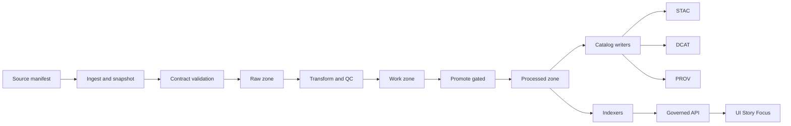

<!-- [KFM_META_BLOCK_V2]
doc_id: kfm://doc/4b52fd8f-7b7e-4a62-a671-9dc665c7c1aa
title: Pipeline Templates
type: standard
version: v1
status: draft
owners: KFM Core Engineering
created: 2026-03-05
updated: 2026-03-05
policy_label: public
related: [docs/templates/, docs/, configs/, data/, policy/, .github/workflows/]
tags: [kfm, pipeline, templates, governance]
notes: [Scaffolds for deterministic KFM pipelines: manifests, contracts, catalogs, receipts, CI gates]
[/KFM_META_BLOCK_V2] -->

<div align="center">

# Pipeline templates
Reusable scaffolds for **deterministic, governed** KFM pipelines: manifests, contracts, catalogs, receipts, and CI gate checklists.

<!-- Badges: replace TODO placeholders as these become real in-repo -->


</div>

---

## Impact
- **Status:** active
- **Owners:** `KFM Core Engineering` (TODO: confirm CODEOWNERS / team)
- **Policy:** fail-closed by default
- **Primary use:** bootstrap a new pipeline so it passes **promotion gates** and emits **auditable lineage**

Quick links:
- [Scope](#scope)
- [Where it fits](#where-it-fits)
- [Inputs](#inputs)
- [Exclusions](#exclusions)
- [Directory layout](#directory-layout)
- [Quickstart](#quickstart)
- [How to use these templates](#how-to-use-these-templates)
- [Architecture diagram](#architecture-diagram)
- [Template registry](#template-registry)
- [Gate checklist](#gate-checklist)
- [FAQ](#faq)
- [Appendix](#appendix)

---

## Scope
These templates are for building pipelines that:
- **CONFIRMED:** run deterministically (same inputs + config → identical outputs per partition)
- **CONFIRMED:** are contract-first (schema/units/CRS/temporal rules are validated as a gate)
- **CONFIRMED:** always emit provenance/receipts (including on failures)
- **CONFIRMED:** can be promoted across **RAW → WORK → PROCESSED** only after passing catalog + checksum gates

This folder is intentionally “docs-first”: it is meant to be copy/paste scaffolding that teams can use to implement pipeline code in the appropriate modules (for example ingestion or catalog packages) without reinventing governance every time.

[Back to top](#pipeline-templates)

---

## Where it fits
**CONFIRMED (design constraint):** KFM is organized into modular layers (docs, contracts, policy, data zones, apps, packages, configs, CI). Pipelines and their governance artifacts cross-cut these layers, but **clients must only read through governed APIs**.  

**Downstream:** STAC/DCAT/PROV catalogs, indexes, governed APIs, UI/Story Nodes/Focus Mode  
**Upstream:** source registry entries, pipeline configs, contracts/schemas, policy rules, CI workflows

> **UNKNOWN:** Exact directory names and ownership may vary by branch/release.
> **Verify:** `ls docs/templates/pipeline/` and check `.github/CODEOWNERS` in your working tree.

[Back to top](#pipeline-templates)

---

## Inputs
Acceptable inputs for this directory:
- **Template files** used to scaffold pipeline artifacts (YAML/JSON/JSON-LD/Markdown)
- **Checklists** for CI gates and promotion gates
- **Example snippets** that demonstrate the required shape of manifests, receipts, and catalogs
- **Runbook templates** for operating a pipeline safely (replay, rollback, DLQ, reprocessing)

---

## Exclusions
What must *not* go in this directory:
- **No raw datasets** (belongs in the `data/` zones)
- **No secrets or credentials** (use environment + secret manager; never commit tokens)
- **No production pipeline code** (belongs in pipeline implementation packages/services)
- **No sensitive location disclosure** (if you need examples involving sensitive/Indigenous content, use generalized or synthetic fixtures and route through governance review)

[Back to top](#pipeline-templates)

---

## Directory layout
**PROPOSED (template pack layout):** this directory typically contains templates like these.

```text
docs/templates/pipeline/
├── README.md
├── TEMPLATE__pipeline_doc_header.yml
├── TEMPLATE__ingest_manifest.yml
├── TEMPLATE__pipeline_contract.yml
├── TEMPLATE__catalog_stac_item.json
├── TEMPLATE__catalog_dcat_dataset.jsonld
├── TEMPLATE__catalog_prov_bundle.jsonld
├── TEMPLATE__run_receipt.json
├── TEMPLATE__ci_job_matrix.md
└── TEMPLATE__promotion_gate_checklist.md
```

> **UNKNOWN:** Which of the above templates already exist.
> **Verify:** list the directory contents and compare against the “Template registry” section below.

[Back to top](#pipeline-templates)

---

## Quickstart
### Create a new pipeline package using templates
Use this when starting a new data source ingestion + processing pipeline.

```bash
# PSEUDOCODE — paths depend on your repo conventions

# 1) Create your pipeline working area
mkdir -p data/pipelines/<domain>/<dataset>/

# 2) Copy the manifest + contract + receipt scaffolds
cp docs/templates/pipeline/TEMPLATE__ingest_manifest.yml \
   data/pipelines/<domain>/<dataset>/manifests/ingest.yml

cp docs/templates/pipeline/TEMPLATE__pipeline_contract.yml \
   data/pipelines/<domain>/<dataset>/contracts/pipeline_contract.yml

cp docs/templates/pipeline/TEMPLATE__run_receipt.json \
   data/pipelines/<domain>/<dataset>/receipts/TEMPLATE__run_receipt.json

# 3) Fill in required fields: license, sensitivity, extents, checksums, outputs
$EDITOR data/pipelines/<domain>/<dataset>/manifests/ingest.yml
```

### Wire validation in CI
```bash
# PSEUDOCODE — your repo may use Make, just, or direct scripts

# Validate configs/schemas
make schema-lint

# Validate pipeline manifests + contracts
make ingest-contract-validate

# Validate STAC/DCAT/PROV outputs (after a local run)
make catalogs-validate
```

[Back to top](#pipeline-templates)

---

## How to use these templates
### 1) Start from governance requirements
**CONFIRMED requirements to encode in every pipeline:**
- Trust membrane: UI/external clients do not access databases directly; access crosses governed APIs and policy boundary
- Fail-closed policy checks
- Promotion gates RAW → WORK → PROCESSED, requiring checksums and STAC/DCAT/PROV catalogs
- Focus Mode “cite or abstain” expectations for downstream answering and audits

### 2) Author the ingest manifest
Your ingest manifest should declare:
- source URL(s) and acquisition approach (feed, webhook, crawler, manual)
- licensing (SPDX)
- freshness strategy (ETag/Last-Modified if applicable)
- target directory conventions + content addressing
- contract profile + enabled rulesets
- output catalog locations (STAC/DCAT/PROV)
- attestation requirements (SLSA, signing verification)

### 3) Define the pipeline contract
Contracts should include (typical KFM rulesets):
- Schema validation (columns, types, nullability)
- Spatial validation (CRS, bbox, datum transforms)
- Temporal validation (coverage, monotonicity, gaps)
- Domain validation (method IDs, correction recipes, constraint rules)
- Licensing + reproducibility requirements

### 4) Ensure every run emits receipts
**CONFIRMED pattern:** run receipts should be immutable, include lineage events, attestations, and policy decisions; missing/unverifiable artifacts should deny promotion.

### 5) Produce catalog triple for every dataset version
**CONFIRMED expectation:** pipelines must output a catalog triplet per dataset version:
- STAC (items/collections)
- DCAT (dataset record)
- PROV-O (lineage document)

[Back to top](#pipeline-templates)

---

## Architecture diagram


[Back to top](#pipeline-templates)

---

## Template registry
| Template | Purpose | Must include | Status |
|---|---|---|---|
| `TEMPLATE__pipeline_doc_header.yml` | Standard header fields: versions, governance refs, profiles | protocol versions, catalog profiles, governance refs | PROPOSED |
| `TEMPLATE__ingest_manifest.yml` | Source acquisition + outputs contract | URL, license SPDX, freshness, targets, outputs | PROPOSED |
| `TEMPLATE__pipeline_contract.yml` | Data + metadata validation contract | schema/spatial/temporal/domain rules, reproducibility | PROPOSED |
| `TEMPLATE__run_receipt.json` | Run-level audit bundle | run id, inputs digests, outputs digests, policy decision | PROPOSED |
| `TEMPLATE__catalog_stac_item.json` | STAC Item scaffold | id, geometry, bbox, links, assets, extensions | PROPOSED |
| `TEMPLATE__catalog_dcat_dataset.jsonld` | DCAT dataset scaffold | license, spatial/temporal, distributions, themes | PROPOSED |
| `TEMPLATE__catalog_prov_bundle.jsonld` | PROV bundle scaffold | Entity, Activity, Agent + relationships | PROPOSED |
| `TEMPLATE__ci_job_matrix.md` | Canonical CI job list for pipelines | gate ordering + artifact outputs | PROPOSED |
| `TEMPLATE__promotion_gate_checklist.md` | Raw→Work→Processed checklist | checksums, catalogs, provenance, attestations | PROPOSED |

> **UNKNOWN:** which templates are already present in this directory.
> **Verify:** confirm actual filenames and update the table to `CONFIRMED`.

[Back to top](#pipeline-templates)

---

## Gate checklist
### Promotion gates
| Gate | Blocks promotion if missing | Typical evidence produced |
|---|---|---|
| Checksums | Yes | sha256 digests for inputs + outputs |
| Catalog completeness | Yes | STAC collection/item, DCAT dataset, PROV doc |
| Contract validation | Yes | contract validation report + pass/fail |
| License and rights | Yes | SPDX license id + compatibility proof where needed |
| Attestations | Yes | SLSA provenance, signature verification bundle |
| Policy decision | Yes | explicit allow/deny decision artifact |

### CI jobs
| Job | Goal | Output artifacts |
|---|---|---|
| `ingest:fetch` | acquire data reproducibly | digests, size, license capture |
| `ingest:contract-validate` | enforce PPC/contract rules | validation reports |
| `ingest:stac-dcat-validate` | validate catalogs | schema/link checks |
| `ingest:prov-emit` | emit lineage | PROV JSON-LD bundle |
| `ingest:attest` | supply-chain evidence | in-toto statement, signing bundles |
| `security:scan` | dependency and license checks | scan reports |
| `telemetry:emit` | observability | traces/metrics snapshots |
| `gate:require` | fail closed | merge/promotion blocked until green |

[Back to top](#pipeline-templates)

---

## Task list
Definition of done for adding a new pipeline using these templates:

- [ ] Manifest created and includes SPDX license + freshness strategy
- [ ] Pipeline contract exists and validation is CI-enforced
- [ ] Pipeline produces checksummed outputs per partition
- [ ] STAC/DCAT/PROV are emitted for every dataset version
- [ ] Run receipts include lineage + attestations + policy decision
- [ ] Promotion gate fails closed when any required artifact is missing
- [ ] Governed API is the only access path for clients
- [ ] Documentation updated: runbook, rollback plan, replay plan
- [ ] Sensitivity classification recorded; governance review completed if required

[Back to top](#pipeline-templates)

---

## FAQ
### Do I put pipeline code here
No. This directory is for *templates* and checklists. Put pipeline implementation in the repo’s pipeline/ingest/catalog modules and reference these templates.

### Where do pipeline configs live
**CONFIRMED (design intent):** pipeline configs are expected to live under a configuration area (often `configs/`) alongside environment and UI templates.

### What is the minimum artifact set for promotion
At minimum: checksums, contract validation proof, STAC/DCAT/PROV catalogs, and an explicit allow policy decision.

### What happens when validation fails
**CONFIRMED:** promotion is blocked, but lineage should still be emitted so the failure is auditable.

[Back to top](#pipeline-templates)

---

## Appendix
<details>
<summary><strong>Example pipeline doc header snippet</strong></summary>

```yaml
# TEMPLATE__pipeline_doc_header.yml
mcp_version: "MCP-DL v6.3"
markdown_protocol_version: "KFM-MDP v11.x"
ontology_protocol_version: "KFM-OP v11"
pipeline_contract_version: "KFM-PDC v11"
stac_profile: "KFM-STAC v11"
dcat_profile: "KFM-DCAT v11"
prov_profile: "KFM-PROV v11"
```
</details>

<details>
<summary><strong>Example ingest manifest snippet</strong></summary>

```yaml
# TEMPLATE__ingest_manifest.yml (example shape)
source:
  url: https://example.org/data.csv
  format: csv
  license_spdx: CC-BY-4.0
  freshness:
    etag: true
    last_modified: true

discovery:
  mode: feed
  schedule: "cron(0 */6 * * *)"

artifacts:
  target_dir: data/<domain>/<dataset>/raw/
  content_addressing: sha256

contracts:
  profile: kfm-ppc-v11.0.0
  rulesets: [schema, spatial, temporal, domain]

outputs:
  stac: data/<domain>/<dataset>/stac/
  dcat: data/<domain>/<dataset>/dcat/
  prov: data/<domain>/<dataset>/prov/

attestations:
  slsa: required
  cosign_verify_on_gate: true
```
</details>

<details>
<summary><strong>Suggested run receipts structure</strong></summary>

```text
receipts/
└── runs/<date>/<job>/<run_id>/
    ├── openlineage.json
    ├── prov.jsonld
    ├── attestation.intoto.jsonl
    ├── cosign.bundle.json
    ├── policy_decision.json
    └── checksums.sha256
```
</details>

---

### Governance references
- `docs/standards/governance/ROOT-GOVERNANCE.md` (TODO: confirm path)
- `docs/standards/faircare/FAIRCARE-GUIDE.md` (TODO: confirm path)
- `docs/standards/sovereignty/INDIGENOUS-DATA-PROTECTION.md` (TODO: confirm path)

[Back to top](#pipeline-templates)
