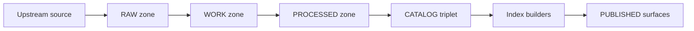

<!-- [KFM_META_BLOCK_V2]
doc_id: kfm://doc/03cbcb4b-a35d-4ce2-a30b-641197bff06b
title: TEMPLATE — Backfill Plan
type: standard
version: v1
status: draft
owners: <team-or-names>
created: 2026-03-05
updated: 2026-03-05
policy_label: public
related:
  - <link: dataset spec / connector spec>
  - <link: promotion contract / policy pack>
tags: [kfm, template, pipeline, backfill]
notes:
  - "Copy this template into a dated plan doc before executing a backfill."
  - "Fail-closed: do not promote outputs unless all gates in this plan are satisfied."
[/KFM_META_BLOCK_V2] -->

# TEMPLATE — Backfill Plan
One-line purpose: Plan and govern a historical (re)ingestion run for one or more datasets, including validation, evidence, and promotion gates.

> **How to use**
> 1) Copy this file to `docs/pipeline/backfills/YYYY-MM-DD__<dataset_id>__backfill_plan.md` (recommended).
> 2) Replace **all** `<placeholders>` (search for `<`).
> 3) Keep the plan + all run receipts as part of the dataset’s evidence trail.

---

## Impact
- **Status:** draft | review | approved | executed | superseded
- **Owners:** <primary-owner> (steward), <secondary-owner> (engineer)
- **Reviewers:** <policy>, <data-steward>, <security>, <domain>
- **Target dataset(s):** `<dataset_id>` (one per line below)
- **Target zones:** RAW → WORK → PROCESSED → PUBLISHED
- **Change risk:** low | medium | high
- **Rollback difficulty:** low | medium | high

**Badges (fill or delete):**
- 
- 
- 

**Quick nav:** [Scope](#scope) · [Backfill strategy](#backfill-strategy) · [Gates](#validation--promotion-gates) · [Run log](#run-log) · [Definition of done](#definition-of-done)

---

## Where this fits
- **Path (this file):** `docs/templates/pipeline/TEMPLATE__BACKFILL_PLAN.md`
- **Typical plan location (recommended):** `docs/pipeline/backfills/`
- **Upstream/Downstream**
  - Upstream: connector specs, dataset contracts, policy bundle, upstream provider docs
  - Downstream: catalogs (DCAT/STAC/PROV), indexes, governed API, UI layers, Story Nodes, Focus Mode

---

## Scope

### In scope
- Historical ingestion / reprocessing for `<dataset_id>` over `<time_range>` and/or `<spatial_extent>`.
- Validation, policy checks, redaction/generalization steps, catalog emission, and promotion.

### Out of scope
- Ad-hoc manual edits to promoted datasets (changes must flow through pipeline).
- Bypassing governance (no direct writes from UI/clients into storage/indexes).
- Sensitive-location inference or deanonymization. If unsure: **stop** and request governance review.

### Backfill intent
- **Reason for backfill:** <e.g., new connector, fixed bug, new policy, updated mapping, corrupted prior run>
- **Expected user-visible impact:** <e.g., new years added, geometry fix, attribute normalization, no visible change>
- **Non-goals:** <what you are explicitly not trying to change>

---

## Dataset inventory

### Dataset list
Provide one row per dataset versioned/updated by this backfill.

| dataset_id | dataset_name | primary domain | update cadence | policy_label target | planned version tag |
|---|---|---|---|---|---|
| `<dataset_id>` | `<name>` | `<domain>` | `<cadence>` | `<public|restricted|sensitive-location>` | `<vYYYYMMDD or content-hash>` |

### Required metadata (promotion prerequisite)
Fill these before running anything.

| Field | Value | Claim status (CONFIRMED/PROPOSED/UNKNOWN) | Evidence pointer |
|---|---|---|---|
| Upstream publisher | `<org>` | `<...>` | `<url or doc_id>` |
| License / rights (SPDX) | `<SPDX>` | `<...>` | `<terms snapshot path>` |
| Sensitive fields present? | `<yes/no>` | `<...>` | `<policy issue/decision>` |
| Spatial extent | `<bbox/admin units>` | `<...>` | `<catalog or source doc>` |
| Temporal extent | `<start/end>` | `<...>` | `<catalog or source doc>` |
| Access constraints | `<none / redaction / group>` | `<none / redaction / group>` | `<policy decision ref>` |

---

## Assumptions and open questions

### Assumptions (must be testable)
| Assumption | Claim status (CONFIRMED/PROPOSED/UNKNOWN) | Verification step (to make CONFIRMED) | Owner |
|---|---|---|---|
| `<assumption>` | `<...>` | `<smallest step>` | `<name>` |

### Open questions
| Question | Why it matters | Owner | Target date |
|---|---|---|---|
| `<question>` | `<impact>` | `<name>` | `<YYYY-MM-DD>` |

---

## Architecture invariants (must not be violated)
Mark each invariant as CONFIRMED/UNKNOWN for the current backfill.

| Invariant | Status | Notes / evidence |
|---|---|---|
| UI/clients do not directly access databases or storage; all access crosses governed APIs + policy boundary. | `<CONFIRMED|UNKNOWN>` | `<link to governing doc>` |
| Promotion is fail-closed: if rights/policy/citations are unclear, do not publish. | `<CONFIRMED|UNKNOWN>` | `<link to policy/gate>` |
| RAW is append-only (supersede via new acquisition; do not edit old RAW). | `<CONFIRMED|UNKNOWN>` | `<link>` |
| Every promoted artifact has deterministic checksums + provenance chain. | `<CONFIRMED|UNKNOWN>` | `<link>` |

---

## Backfill strategy

### Strategy type
Choose one and justify:

- [ ] **Snapshot**: full history / full refresh (rebuild from scratch)
- [ ] **Incremental historical**: walk a time window in partitions (e.g., year-by-year)
- [ ] **Replay from RAW**: re-run transforms only (RAW unchanged)
- [ ] **Selective recompute**: recompute a derived artifact set (e.g., tiles, indexes) from PROCESSED

**Chosen strategy:** `<one of the above>`

### Time and partition plan
- **Temporal range:** `<YYYY-MM-DD> → <YYYY-MM-DD>` (inclusive/exclusive: clarify)
- **Spatial range:** `<bbox/admin units/tile grid>` (optional)
- **Partition key(s):** `<year | month | tile | id-range | other>`
- **Partition count estimate:** `<N>`
- **Idempotency key:** `<e.g., dataset_version_id + partition + spec_hash>`

### Expected size and runtime
| Metric | Estimate | Claim status (CONFIRMED/PROPOSED/UNKNOWN) | How measured |
|---|---:|---|---|
| Raw bytes fetched | `<...>` | `<...>` | `<query/log/sample>` |
| Records/features/items | `<...>` | `<...>` | `<query/log/sample>` |
| Processed artifact bytes | `<...>` | `<...>` | `<query/log/sample>` |
| Total wall clock | `<...>` | `<...>` | `<benchmark/dry-run>` |
| Peak CPU/RAM | `<...>` | `<...>` | `<benchmark/dry-run>` |

### Rate limits and retries
- **Upstream limits:** `<requests/sec or docs>`
- **Backoff policy:** `<exponential + jitter>`
- **Max retries per partition:** `<N>`
- **Checkpointing:** `<where checkpoints live; how resumed>`
- **Permanent failure criteria:** `<e.g., 403 license, schema drift, policy DENY>`

---

## Execution plan

### Pre-flight checklist (must pass before running)
- [ ] Connector spec exists and is pinned (container/image digest or version).
- [ ] Policy bundle version is pinned; default-deny tests pass.
- [ ] Dataset contract/schema is pinned; mapping reviewed.
- [ ] License/terms snapshot recorded in RAW metadata.
- [ ] A small dry-run slice has been executed end-to-end (RAW→WORK→PROCESSED) with stable checksums.

### Orchestration
- **Orchestrator:** `<dagster | prefect | airflow | github-actions | other>`
- **Run mode:** `<local | CI | batch runners | k8s>`
- **Concurrency:** `<N partitions in parallel>`
- **Secrets:** `<vault path names only; no credentials here>`

### Pipeline steps (edit as needed)
| Step | Input zone | Output zone | Tool / job name | Deterministic outputs? | Receipt emitted? |
|---|---|---|---|---|---|
| Discover | n/a | n/a | `<...>` | `<yes/no>` | `<yes/no>` |
| Acquire | RAW | RAW | `<...>` | `<yes/no>` | `<yes/no>` |
| Normalize | RAW | WORK | `<...>` | `<yes/no>` | `<yes/no>` |
| Validate | WORK | WORK/QUARANTINE | `<...>` | `<yes/no>` | `<yes/no>` |
| Redact/Generalize | WORK | WORK | `<...>` | `<yes/no>` | `<yes/no>` |
| Publish artifacts | WORK | PROCESSED | `<...>` | `<yes/no>` | `<yes/no>` |
| Emit catalogs | PROCESSED | CATALOG | `<emit_dcat/stac/prov>` | `<yes/no>` | `<yes/no>` |
| Promote | CATALOG | PUBLISHED | `<promotion job>` | `<yes/no>` | `<yes/no>` |

### Data lifecycle diagram


> Note: Indexes are rebuildable projections. The source-of-truth is the promoted artifacts + catalogs.

---

## Validation and promotion gates
This section is **the contract** for whether a backfill may promote/publish.

### Gate table (minimum)
| Gate | What must be true | How verified (tool/test) | Pass criteria | Fail action |
|---|---|---|---|---|
| Identity + versioning | dataset_id + dataset_version_id are deterministic; spec_hash stable | `<unit tests + golden spec_hash>` | `<...>` | block promotion |
| Rights | SPDX license recorded; terms snapshot stored | `<license checker>` | `<...>` | quarantine |
| Sensitivity | policy_label assigned; redaction obligations satisfied | `<OPA policy tests>` | `<...>` | block promotion |
| Artifacts | every output artifact has a checksum; manifest complete | `<digest verifier>` | `<...>` | block promotion |
| Catalog triplet | DCAT/STAC/PROV validate and cross-link | `<validators + linkcheck>` | `<...>` | block promotion |
| Provenance | PROV chain links RAW→WORK→PROCESSED for this version | `<prov validator>` | `<...>` | block promotion |
| QA thresholds | dataset-specific thresholds met | `<qa report>` | `<...>` | quarantine |
| Receipts + attestations | run receipts exist; attestations verifiable (if enabled) | `<schema + cosign verify>` | `<...>` | block promotion |
| API contract | representative API query passes and is policy-safe | `<contract tests>` | `<...>` | block promotion |

### Evidence outputs (required)
List the evidence artifacts the run must produce.

| Artifact | Required? | Path pattern | Notes |
|---|---:|---|---|
| Raw acquisition manifest | yes | `data/raw/<dataset_id>/<run_id>/manifest.json` | includes upstream URL(s), validators, rights snapshot |
| Checksums | yes | `.../checksums.sha256` | sha256 per file |
| QA report | yes | `data/work/<dataset_id>/<run_id>/qa/` | schema + spatial + temporal checks |
| Processed artifacts | yes | `data/processed/<dataset_id>/<dataset_version_id>/...` | digest-addressed |
| DCAT | yes | `data/catalog/dcat/<dataset_id>/<dataset_version_id>.json` | validated |
| STAC (if spatial) | conditional | `data/stac/<dataset_id>/collection.json` and `items/...` | validated |
| PROV | yes | `data/prov/<dataset_id>/<dataset_version_id>.jsonld` | links entities/activities/agents |
| Run receipt | yes | `receipts/<run_id>/<node_id>.json` | JCS canonical; includes spec_hash + artifact digests |
| in-toto statement | recommended | `receipts/<run_id>/<node_id>.intoto.json` | predicate for SLSA provenance |
| Cosign bundle | recommended | `evidence/<run_id>/bundle.json` or OCI ref | verify signature + bundle_digest |

---

## Safety, ethics, and sensitivity handling

### Sensitivity classification
- **policy_label:** `<public | restricted | sensitive-location>`
- **CARE considerations (if applicable):** `<authority/benefit/responsibility/ethics notes>`
- **Redaction/generalization required?** `<yes/no>`
- **Redaction approach:** `<remove fields | aggregate | snap-to-grid | withhold | other>`
- **Reviewer sign-off required?** `<who>`

### Prohibited actions
- Do not add secrets to repo.
- Do not publish precise sensitive locations when policy_label requires generalization/withholding.
- Do not “fix” data in PUBLISHED directly; supersede via new dataset version.

---

## Rollback and recovery

### Rollback strategy
Choose one:
- [ ] **Version rollback**: mark new dataset version as superseded; keep old version as default.
- [ ] **Unpublish**: keep artifacts/cats but remove from runtime surfaces.
- [ ] **Quarantine**: move outputs to QUARANTINE, do not promote.

**Rollback trigger conditions:**
- `<e.g., QA regression beyond threshold, policy issue, broken links, user-reported bug>`

### Recovery procedures
- **Resume from checkpoint:** `<how>`
- **Re-run partition:** `<how>`
- **Rebuild indexes:** `<how>`

---

## Communications
- **Announcement plan:** `<who needs to know; when>`
- **User-facing release note location:** `<path>`
- **Escalation channel:** `<issue/discussion link>`

---

## Run log
Append one row per executed run (keep history).

| run_id | date | git_sha | spec_hash | range/partitions | result | receipt/evidence ref |
|---|---|---|---|---|---|---|
| `<run_id>` | `<YYYY-MM-DD>` | `<sha>` | `<jcs:sha256:...>` | `<...>` | `<PASS/FAIL>` | `<link>` |

---

## Definition of done
This plan is “done” only when:

- [ ] All placeholders are filled.
- [ ] Backfill strategy (ranges + expected runtime) is documented.
- [ ] Pre-flight checklist passed (dry-run evidence attached).
- [ ] All gates in **Validation and promotion gates** are automated and passing (CI or equivalent).
- [ ] Receipts exist for all executed nodes/steps; digests verify; attestations (if enabled) verify.
- [ ] Catalog triplet validates and is link-check clean.
- [ ] Policy_label and redaction obligations are documented and (if needed) approved by stewards.
- [ ] Run log updated with final run_id + evidence refs.
- [ ] Rollback plan tested or simulated.

---

## Appendix

<details>
<summary>Appendix A — Example receipt fields (adapt)</summary>

```json
{
  "spec_version": "kfm.run-receipt/v1",
  "run_id": "<run_id>",
  "node_id": "<node_id>",
  "tool": "<tool_name>",
  "inputs": { "dataset_id": "<dataset_id>", "partition": "<partition_id>" },
  "outputs": { "artifacts": ["<path>"] },
  "started_at": "2026-03-05T00:00:00Z",
  "ended_at": "2026-03-05T00:10:00Z",
  "spec_hash": "jcs:sha256:<hex>",
  "artifact_digests": ["sha256:<hex>"],
  "audit_ref": "<kfm audit ref>"
}
```

</details>

<details>
<summary>Appendix B — Minimal commands (pseudocode)</summary>

```bash
# 0) Validate policy + schemas (fail closed)
conftest test receipts/ -p policy/opa

# 1) Execute backfill (partitioned)
kfm run --spec "<spec_uri>" --range "<YYYY-MM-DD:YYYY-MM-DD>" --out "<workdir>"

# 2) Verify digests and emit catalogs
kfm verify --receipt "<receipt_path>"
kfm emit-catalogs --receipt "<receipt_path>" --out data/catalog/

# 3) (Optional) Attest
cosign attest --predicate "<predicate.json>" --type kfm.run.receipt "<target>"
```

</details>

---

[Back to top](#template--backfill-plan)
