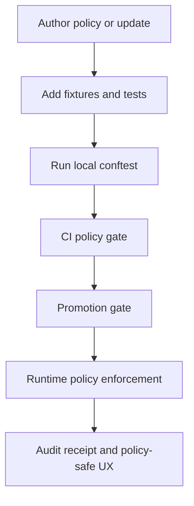

<!-- [KFM_META_BLOCK_V2]
doc_id: kfm://doc/b6a639e6-4087-42e9-a706-43931ed4f4dc
title: Policy Templates
type: standard
version: v1
status: draft
owners: kfm://team/core
created: 2026-03-05
updated: 2026-03-05
policy_label: public
related: [
  "docs/templates/",
  "policy/",
  "tools/validation/policy/",
  "schemas/"
]
tags: [kfm]
notes: [
  "Templates and conventions for KFM policy-as-code (OPA/Rego + Conftest) and policy docs."
]
[/KFM_META_BLOCK_V2] -->

<div align="center">

# 🛡️ Policy Templates

**Purpose:** templates + conventions for **policy-as-code** (OPA/Rego + Conftest) and **policy documentation** in KFM.

<!-- Status/Owners/Badges -->
**Status:** experimental · **Owners:** `kfm://team/core` · **Scope:** templates only (not authoritative policy)

  

[Quickstart](#quickstart) · [Where it fits](#where-it-fits) · [Template inventory](#template-inventory) · [Policy surfaces](#policy-surfaces) · [Definition of done](#definition-of-done) · [FAQ](#faq)

</div>

---

## Scope

This directory (`docs/templates/policy/`) provides **copy/paste-ready** building blocks for:

- Authoring **OPA/Rego** policies that are **default-deny** and explainable.
- Running the same policy logic in **CI** (via Conftest) and at **runtime** (via a PDP/PEP pattern).
- Standardizing **policy metadata**, **inputs**, and **fixtures** so policy changes are reviewable and testable.

### Claim labeling legend

This repo uses explicit claim labels when stating facts about KFM’s governance posture:

- **CONFIRMED**: required invariant stated in an authoritative KFM blueprint/guide.
- **PROPOSED**: recommended pattern that may change as implementation evolves.
- **UNKNOWN**: depends on repo state/tooling that must be verified.

---

## Where it fits

**CONFIRMED:** KFM treats policy as a first-class enforcement boundary: CI and runtime must share the same semantics (or at least fixtures + outcomes), otherwise CI guarantees are meaningless.

- **Upstream (inputs):**
  - Governance standards and rubrics (licensing, sensitivity, FAIR/CARE).
  - Schema contracts (run receipts, catalogs, Story Nodes, etc.).
  - Domain playbooks defining what is “material” vs “trivial.”

- **Downstream (consumers):**
  - CI “policy gate” jobs that block merges on policy DENY.
  - API policy enforcement points (PEPs) before serving data, tiles, evidence bundles, story nodes, and Focus Mode answers.
  - Evidence resolver that applies policy before resolving/citing.

> NOTE: This directory contains **templates**. The **authoritative** policy bundles should live under a dedicated runtime/CI policy folder (commonly `policy/`), and are versioned/reviewed like code.

---

## Acceptable inputs

Put these here:

- Template `.rego` files (helpers, catalog rules, license rules, sensitivity/redaction rules).
- Template CI snippets (GitHub Actions YAML examples).
- Sample JSON inputs for policy evaluation (fixtures).
- Short template docs describing policy intent, inputs, outputs, and failure messages.

---

## Exclusions

Do **not** put these here:

- **Secrets** (API keys, tokens, registry creds).
- **Environment-specific** policy decisions (those belong in deployment config or a governed override layer).
- **Live** policy bundles used in production/CI (place them under the authoritative policy directory, not `docs/templates/`).
- Any content that would reveal restricted datasets, sensitive locations, or “ghost metadata” in public docs.

---

## Directory tree

> **PROPOSED** layout (this README documents intent; add missing files as needed).

```text
docs/templates/policy/
├─ README.md
├─ rego/
│  ├─ policy_skeleton.rego.tmpl
│  ├─ common_helpers.rego.tmpl
│  ├─ license_allowlist.rego.tmpl
│  └─ catalogs/
│     ├─ stac_required.rego.tmpl
│     ├─ dcat_required.rego.tmpl
│     └─ prov_required.rego.tmpl
├─ fixtures/
│  ├─ input_minimal.json
│  ├─ input_invalid.json
│  └─ README.md
└─ ci/
   └─ github_policy_gate.yml.tmpl
```

---

## Quickstart

### 1) Create a new policy bundle from templates

```bash
# Example: create an authoritative policy folder (if not already present)
mkdir -p policy/rego policy/tests policy/tests/samples

# Copy templates into place (adjust filenames to match your repo conventions)
cp docs/templates/policy/rego/policy_skeleton.rego.tmpl policy/rego/my_policy.rego
cp docs/templates/policy/fixtures/input_minimal.json policy/tests/samples/input_minimal.json
```

### 2) Run policy locally with Conftest (CI parity)

```bash
# Run policy checks against a single input JSON
conftest test \
  --policy policy/rego \
  policy/tests/samples/input_minimal.json
```

### 3) Run policy locally with OPA (developer debugging)

```bash
# Evaluate a specific decision (example path; match your package name)
opa eval -i policy/tests/samples/input_minimal.json \
  -d policy/rego \
  'data.kfm.allow'
```

> IMPORTANT: For KFM, “default allow” is not acceptable. Always use **default-deny**, and require explicit allow conditions.

---

## Policy surfaces

**CONFIRMED:** KFM policy should be enforced consistently across CI and runtime.

| Surface | What it blocks/allows | Inputs (typical) | Output contract |
|---|---|---|---|
| CI PR Gate | Merge if policy denies | changed files, receipts, catalogs, schemas | human-readable deny messages + machine result |
| Dataset Promotion Gate | RAW→WORK→PROCESSED→PUBLISHED | checksums, STAC/DCAT/PROV, provenance | deny on missing license/rights/prov |
| Runtime API PEP | responses for data/tiles/evidence/story/focus | principal role + requested resource | policy-safe errors + audit reference |
| Evidence Resolver | access to EvidenceBundles | EvidenceRef + principal | returns bundle digest + decision + obligations |
| UI (display only) | **never decides** policy | policy badge data from API | renders allow/deny/abstain safely |

---

## Template inventory

> **PROPOSED**: keep templates small, explainable, and version-pinnable.

| Template | Type | Use when | What it standardizes |
|---|---|---|---|
| `policy_skeleton.rego.tmpl` | Rego | starting any new policy | default-deny, deny messages, allow rule |
| `catalogs/stac_required.rego.tmpl` | Rego | gating promoted spatial assets | required STAC fields + links |
| `catalogs/dcat_required.rego.tmpl` | Rego | gating any published dataset | license/rights/publisher/distributions |
| `catalogs/prov_required.rego.tmpl` | Rego | gating reproducibility | run receipt/provenance minimums |
| `license_allowlist.rego.tmpl` | Rego | dependency or dataset license gates | SPDX allowlist + messages |
| `fixtures/input_minimal.json` | JSON | building a new policy | canonical minimal input shape |
| `github_policy_gate.yml.tmpl` | CI | enabling merge-blocking checks | pinned tool versions + fail-closed |

---

## Conventions

### Rego conventions (KFM-style)

- **default deny**: `default allow = false`
- Prefer `deny[msg]` rules with **actionable**, **non-leaky** messages.
- Keep policies “explainable”: the deny message should identify:
  - the missing field / violated constraint,
  - the expected value shape,
  - and the remediation step.

### CI conventions (KFM-style)

- Treat policy toolchain updates as **governed changes**:
  - pin tool versions,
  - keep fixtures + expected outcomes,
  - require review for changes to thresholds or allowlists.

### Inputs should be “policy-ready”

- Inputs to policy should already be shaped into a stable JSON form:
  - diffs summarized into metrics,
  - dataset metadata normalized,
  - references expressed as digests/IDs when possible.

---

## Diagram



---

## Definition of done

Before a policy template (or a new policy derived from it) is considered “merge-ready”:

- [ ] Policy is **default-deny** and has clear `deny[msg]` reasons.
- [ ] At least **one allow fixture** and **one deny fixture** exist.
- [ ] CI runs Conftest against fixtures and **fails closed** on deny.
- [ ] Runtime and CI share the same decision surface (same inputs/outcomes), or a documented exception exists.
- [ ] Deny messages are **policy-safe** (no restricted dataset existence leaks).
- [ ] If policy affects sensitive data, redaction/generalization obligations are explicit and test-covered.
- [ ] Tool versions are pinned (OPA/Conftest), and updates are tracked.

---

## FAQ

### Why templates in `docs/templates/` instead of placing everything in `policy/`?

Templates are for **standardization** and **onboarding**; authoritative policies belong in the runtime/CI policy folder so they can be versioned, tested, and enforced.

### How do we keep CI and runtime semantics aligned?

**CONFIRMED:** use the same Rego bundle and the same fixtures (or at least require equivalent outcomes). If runtime diverges, CI guarantees become “paper gates.”

### Where should sensitive policy documentation live?

If a policy document could reveal attack surface, sensitive dataset existence, or restricted locations, keep it in a restricted documentation area and link to a public-safe stub here.

---

## Appendix

<details>
<summary><strong>Template skeletons (copy/paste)</strong></summary>

### Rego policy skeleton (template)

```rego
package kfm

# Default-deny (required)
default allow = false

# Collect deny reasons as human-readable messages.
deny[msg] {
  # Example: required field missing
  not input.request_id
  msg := "missing required field: request_id"
}

deny[msg] {
  # Example: policy label must be one of the known values
  not input.policy_label in {"public", "restricted", "sensitive-location"}
  msg := sprintf("invalid policy_label: %v", [input.policy_label])
}

# Allow only if there are zero deny messages.
allow {
  count(deny) == 0
}
```

### Minimal input JSON (template)

```json
{
  "request_id": "req-123",
  "principal": { "role": "public" },
  "policy_label": "public",
  "resource": { "kind": "dataset_version", "id": "dv:example@sha256:..." }
}
```

### GitHub Actions policy gate (template)

```yaml
name: kfm-policy-gate
on:
  pull_request:
    types: [opened, synchronize, reopened]

permissions:
  contents: read

jobs:
  policy:
    runs-on: ubuntu-latest
    steps:
      - uses: actions/checkout@v4

      # PROPOSED: install conftest via pinned version or a composite action
      - name: Install conftest (pinned)
        run: |
          set -euo pipefail
          v="0.56.0"
          curl -sSL -o conftest.tar.gz \
            https://github.com/open-policy-agent/conftest/releases/download/v${v}/conftest_${v}_Linux_x86_64.tar.gz
          tar -xzf conftest.tar.gz
          sudo mv conftest /usr/local/bin/conftest

      - name: Run policy checks (fail-closed)
        run: |
          set -euo pipefail
          conftest test -p policy/rego policy/tests/samples
```

</details>

---

<p align="right"><a href="#-policy-templates">Back to top</a></p>
