<!-- [KFM_META_BLOCK_V2]
doc_id: kfm://doc/5e6e2e31-3f0c-4d4e-9a8f-1c6d2a4e5b6f
title: TEMPLATE — Data Classification Policy
type: standard
version: v1
status: draft
owners: kfm:team:data-governance
created: 2026-03-05
updated: 2026-03-05
policy_label: public
related: [
  "kfm://doc/TODO-ROOT-GOVERNANCE",
  "kfm://doc/TODO-ETHICS",
  "kfm://doc/TODO-SOVEREIGNTY",
  "kfm://doc/TODO-POLICY-AS-CODE"
]
tags: [kfm, policy, data-classification, sensitivity, governance]
notes: [
  "Template: copy into dataset-specific policy docs and fill placeholders.",
  "Do not paste restricted data here; store references/hashes only."
]
[/KFM_META_BLOCK_V2] -->

<a id="top"></a>

# TEMPLATE — Data Classification Policy
One-line purpose: classify a dataset (and/or dataset version) into a **sensitivity class** and **policy label**, define **obligations** (redaction/generalization/aggregation), and record the evidence + approvals needed for KFM’s governed APIs and promotion gates.

> **Status:** draft (template) · **Owners:** `kfm:team:data-governance` (update per dataset) · **Last updated:** 2026-03-05  
> **Applies to:** dataset intake, dataset_version promotion, API enforcement, Story/Focus surfaces  
> **Badges (TODO):**  
>     
> **Quick links:** [Scope](#scope) · [Quickstart](#quickstart) · [Classification record](#classification-record-fill-this-in) · [Matrix](#sensitivity-classes-and-policy-labels) · [DoD checklist](#definition-of-done-checklist)

---

## Scope
This template is for **dataset stewards**, **integrators**, and **reviewers** who must make data access and publishing decisions **explicit, auditable, and enforceable**.

Use it when you:
- onboard a new dataset,
- publish a new dataset_version,
- change sensitivity or rights,
- introduce new derived/public-safe outputs (generalized/aggregated).

---

## Where it fits in the repo
**Path:** `docs/templates/policy/TEMPLATE__DATA_CLASSIFICATION.md`

**Upstream (inputs):**
- Source intake notes (provenance, rights, licensing, access conditions)
- Field inventory and sample schema
- Spatial/temporal extents (even if coarse)
- Known risks (sensitive locations, small counts, ownership info, PII)

**Downstream (outputs/consumers):**
- Policy-as-code (OPA/Conftest) fixtures and gates
- DCAT/STAC/PROV records (catalog contract)
- Governed APIs (authZ + obligations)
- Story Nodes / Focus Mode (policy-safe surfaces)

---

## Acceptable inputs
You may include:
- **metadata and summaries**
- **field names** and types
- **hashes/digests** of example files or run receipts
- **references** to catalog records, tickets, approvals, or evidence bundles

You must **not** include:
- raw restricted records
- precise sensitive coordinates
- personal identifying info
- secrets, tokens, credentials

---

## Exclusions
This template:
- is **not** legal advice,
- does **not** replace a rights holder agreement,
- does **not** define new policy labels without governance approval,
- must **not** be used to publish precise sensitive locations (always route through policy + obligations).

---

## Quickstart
1) Copy this template to a dataset-specific policy doc:
```bash
# Adjust destination path to your repo conventions
cp docs/templates/policy/TEMPLATE__DATA_CLASSIFICATION.md \
   docs/policy/datasets/{{dataset_slug}}__DATA_CLASSIFICATION.md
```

2) Fill every `{{PLACEHOLDER}}`.

3) Create/Update:
- DCAT/STAC/PROV metadata for the dataset_version
- policy fixtures/tests for allow/deny + obligations
- redaction/generalization derivative dataset_version (if needed)

4) Run required checks (examples; adapt to your repo):
```bash
make lint test
conftest test receipts/run_receipt.json -p policy/opa
```

---

## Data classification model

### Key terms
- **Sensitivity class**: human-readable risk bucket (e.g., *Sensitive-location*).
- **Policy label**: the primary machine-enforced classification input (e.g., `restricted_sensitive_location`).
- **Obligations**: required transformations or UI notices returned by policy evaluation (e.g., generalize geometry).
- **Zones**: KFM artifact lifecycle areas (example vocabulary: `raw`, `work`, `processed`, `catalog`, `published`).

### Diagram

```mermaid
flowchart LR
  A[Intake packet] --> B[Draft classification]
  B --> C[Select sensitivity class]
  C --> D[Assign policy label]
  D --> E[Define obligations]
  E --> F[Derive public safe outputs]
  F --> G[Catalog and provenance]
  G --> H[Policy tests in CI]
  H --> I[Promotion decision]
  I --> J[Governed API surfaces]
```


---

## Sensitivity classes and policy labels

> **Rule of thumb:** sensitivity class helps humans reason; **policy_label** is what the system enforces.

### Sensitivity class matrix
Fill in the “Selected” column and add dataset-specific obligations.

| Sensitivity class | Selected | What it means | Typical obligations | Typical policy_label(s) |
|---|:--:|---|---|---|
| **Public** | ☐ | Safe to publish without redaction | None (or minimal UI notice) | `public` |
| **Restricted** | ☐ | Requires role-based access (e.g., ownership/parcel info) | AuthZ gate; may redact fields on export | `restricted` / `internal` |
| **Sensitive-location** | ☐ | Coordinates must be generalized or suppressed (e.g., archaeology, sensitive species) | Generalize geometry; suppress exact coords; provide generalized derivative | `restricted_sensitive_location` + `public_generalized` (derivative) |
| **Aggregate-only** | ☐ | Only publish above thresholds (e.g., small health/crime counts) | Suppress small cells; rounding; minimum group size | `public_generalized` (aggregated) / `restricted` (raw) |

### Policy label vocabulary
> Starter vocabulary (update only via governance):  
- `public`  
- `public_generalized`  
- `restricted`  
- `restricted_sensitive_location`  
- `internal`  
- `embargoed`  
- `quarantine`

---

<a id="classification-record-fill-this-in"></a>

## Classification record (fill this in)

### 1) Dataset identity
| Field | Value |
|---|---|
| Dataset name | `{{dataset_name}}` |
| Dataset ID | `{{dataset_id}}` (e.g., `kfm:ds:...`) |
| Dataset version ID | `{{dataset_version_id}}` (deterministic if applicable) |
| Source system(s) | `{{source_systems}}` |
| Steward team | `{{steward_team}}` |
| Owners (people/roles) | `{{owners}}` |
| Intended KFM uses | `{{intended_uses}}` |
| Prohibited uses | `{{prohibited_uses}}` |

---

### 2) Summary (what is this dataset?)
**Description:**  
`{{short_description}}`

**Spatial coverage (coarse is ok):**  
`{{spatial_coverage}}`

**Temporal coverage:**  
`{{temporal_coverage}}`

**Update cadence / freshness expectation:**  
`{{cadence}}`

---

### 3) Rights, license, and reuse constraints
> Do not guess. If unclear, mark **UNKNOWN** and block publication until resolved.

| Item | Status (CONFIRMED/PROPOSED/UNKNOWN) | Details | Evidence refs |
|---|---|---|---|
| License (SPDX) | `{{status_license}}` | `{{license_spdx}}` | `{{evidence_license}}` |
| Rights holder | `{{status_rights_holder}}` | `{{rights_holder}}` | `{{evidence_rights_holder}}` |
| Allowed redistribution | `{{status_redistribution}}` | `{{redistribution_terms}}` | `{{evidence_redistribution}}` |
| Required attribution | `{{status_attribution}}` | `{{attribution_text}}` | `{{evidence_attribution}}` |
| Takedown / revocation | `{{status_takedown}}` | `{{takedown_process}}` | `{{evidence_takedown}}` |

---

### 4) Sensitivity classification decision
**Selected sensitivity class:** `{{sensitivity_class}}`  
**Selected policy label:** `{{policy_label}}`  
**Default posture:** deny-by-default unless policy explicitly allows.

**Rationale (2–6 bullets):**
- `{{rationale_1}}`
- `{{rationale_2}}`
- `{{rationale_3}}`

**Evidence discipline table (required):**

| Decision / claim | Status (CONFIRMED/PROPOSED/UNKNOWN) | Evidence refs (no restricted content) | Notes |
|---|---|---|---|
| This dataset contains sensitive locations | `{{status_sensitive_locations}}` | `{{evidence_sensitive_locations}}` | `{{notes_sensitive_locations}}` |
| This dataset contains ownership/PII | `{{status_pii}}` | `{{evidence_pii}}` | `{{notes_pii}}` |
| Public representation is allowed | `{{status_public_rep}}` | `{{evidence_public_rep}}` | `{{notes_public_rep}}` |
| Required obligations are defined and testable | `{{status_obligations}}` | `{{evidence_obligations}}` | `{{notes_obligations}}` |

---

### 5) Field-level and record-level sensitivity inventory
List sensitive fields and how they must be handled.

| Field / attribute | Type | Sensitivity | Action (keep/remove/generalize/aggregate) | Notes |
|---|---|---|---|---|
| `{{field_1}}` | `{{type_1}}` | `{{sens_1}}` | `{{action_1}}` | `{{notes_1}}` |
| `{{field_2}}` | `{{type_2}}` | `{{sens_2}}` | `{{action_2}}` | `{{notes_2}}` |

**Geometry/coordinate handling (if geospatial):**
- Geometry present: `{{yes_no}}`
- Max allowed precision for public surfaces: `{{public_geom_precision_rule}}`
- Required generalization method/profile: `{{redaction_profile_id}}`

---

### 6) Obligations and redaction/generalization plan
> Redaction/generalization is a first-class transformation: the **raw** dataset remains immutable; the **redacted derivative** is a separate dataset_version with its own policy label and provenance.

**Obligations (must be enforceable by policy + testable):**
- `{{obligation_1}}`
- `{{obligation_2}}`

**Derived dataset(s) (if any):**
| Derivative dataset_version | policy_label | Transform summary | PROV/run receipt ref |
|---|---|---|---|
| `{{derived_version_1}}` | `{{derived_label_1}}` | `{{derived_transform_1}}` | `{{prov_ref_1}}` |

**Aggregate-only thresholds (if applicable):**
- Minimum group size (k): `{{min_group_size}}`
- Suppression rule: `{{suppression_rule}}`
- Rounding rule: `{{rounding_rule}}`

---

### 7) Access control rules (human-readable)
Define who may do what, and where.

| Role / group | Read raw | Read processed | Read published | Export | Notes |
|---|:--:|:--:|:--:|:--:|---|
| public | ☐ | ☐ | ☐ | ☐ | `{{notes_public}}` |
| collaborator | ☐ | ☐ | ☐ | ☐ | `{{notes_collab}}` |
| steward | ☐ | ☐ | ☐ | ☐ | `{{notes_steward}}` |
| admin | ☐ | ☐ | ☐ | ☐ | `{{notes_admin}}` |
| owner_group `{{owner_group_id}}` | ☐ | ☐ | ☐ | ☐ | `{{notes_owner_group}}` |

---

### 8) Sovereignty / Authority to Control (if applicable)
If a community/partner controls access:
- Owner group ID: `{{owner_group_id}}`
- Allowed user groups: `{{allowed_groups}}`
- Consent required: `{{consent_required_yes_no}}`
- Withdrawal/takedown procedure: `{{withdrawal_procedure}}`

---

### 9) API + UI handling notes (trust and leakage prevention)
- Deny responses must not leak restricted metadata (no “confirming” existence via errors).
- Story Nodes / Focus outputs must not embed precise sensitive coordinates unless policy explicitly allows.
- API responses should include audit references and evidence bundle hashes where required.

---

## Required artifacts and cross-links (promotion readiness)

### Catalog triplet (DCAT + STAC + PROV)
**DCAT (dataset record)**
- `dct:title`, `dct:description`, `dct:publisher`
- `dct:license` / rights
- `dcat:distribution` entries for artifacts
- `kfm:policy_label`, `kfm:dataset_id`, `kfm:dataset_version_id`
- link to PROV activity/run receipt

**STAC (collection/items)**
- Collection: id/title/description; extent; license; link to DCAT; policy label + dataset_version
- Item: geometry/bbox consistent with policy label; datetime; assets with href + checksum + media_type; links to PROV/run receipt + DCAT distribution

**PROV**
- prov:Activity per run; prov:Entity per artifact; prov:Agent for pipeline + approvals
- policy decision refs and obligations; environment capture (container digest, git commit, params)

### CI policy regression suite (minimum)
- Golden queries that previously leaked restricted fields must never regress.
- Negative tests: unauthorized roles must not retrieve sensitive-location data at high precision.
- Field-level tests: verify restricted fields (owner names, small counts, exact coords) are redacted/suppressed.
- Audit integrity tests: responses include audit references where required.

---

## Definition of done checklist
- [ ] Dataset identity and ownership fields are filled and reviewed.
- [ ] License and rights holder are **CONFIRMED** (or dataset is blocked from publish).
- [ ] Sensitivity class + policy_label are selected and justified with evidence refs.
- [ ] Field-level sensitivity inventory completed.
- [ ] Obligations are explicit, implementable, and testable.
- [ ] If public output is allowed for sensitive-location data: a `public_generalized` derivative exists.
- [ ] DCAT/STAC/PROV records exist, validate, and cross-link correctly.
- [ ] Policy-as-code fixtures/tests exist for allow/deny + obligations, run in CI, fail-closed.
- [ ] API/UI handling notes reviewed (no metadata leakage, no precise coords in Story/Focus).
- [ ] Steward approval recorded (and owner_group approval if applicable).
- [ ] Version history updated.

---

## FAQ
**Q: Can we publish “some” of a restricted dataset?**  
A: Only via an explicitly derived dataset_version with a policy label that reflects the transformation (e.g., generalized/aggregated), plus PROV lineage and policy tests.

**Q: What if rights are unclear?**  
A: Mark rights as **UNKNOWN** and block publish/export until resolved. “Online availability” does not imply reuse permission.

---

## Version history
| Version | Date | Author | Summary |
|---:|---|---|---|
| v1 | 2026-03-05 | `{{author}}` | Initial template created. |

---

<details>
<summary><strong>Appendix — Example policy decision record (template)</strong></summary>

> Use as a shape reference only. Store the real decision in your policy ledger/run receipts.

```json
{
  "decision_id": "kfm://policy_decision/{{id}}",
  "policy_label": "{{policy_label}}",
  "decision": "allow",
  "reason_codes": ["{{REASON_CODE_1}}"],
  "obligations": [
    {"type": "generalize_geometry", "min_cell_size_m": {{min_cell_size_m}}},
    {"type": "remove_attributes", "fields": ["{{field_name_1}}", "{{field_name_2}}"]}
  ],
  "evaluated_at": "{{iso_timestamp}}",
  "rule_id": "{{policy_rule_id}}"
}
```

</details>

---

[Back to top](#top)
