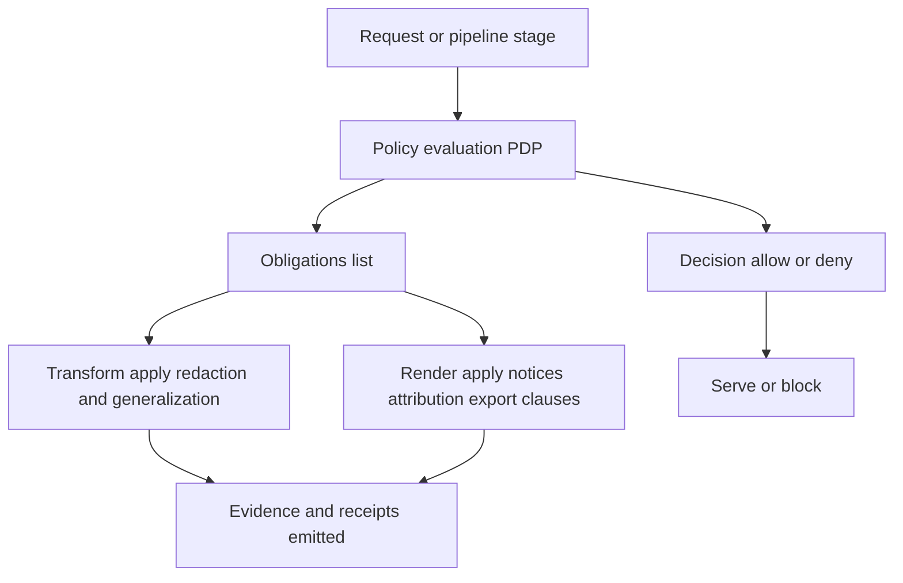

<!-- [KFM_META_BLOCK_V2]
doc_id: kfm://doc/<uuid>
title: TEMPLATE — Obligation Handling
type: standard
version: v1
status: draft
owners: <team-or-names>
created: 2026-03-05
updated: 2026-03-05
policy_label: public
related: [
  docs/governance/README.md,
  docs/policy/README.md,
  docs/specs/*,
  docs/templates/policy/TEMPLATE__POLICY_DECISION.md
]
tags: [kfm, template, policy, obligations, governance]
notes: [
  "Template file — copy to a real doc and replace ALL placeholders before publishing."
]
[/KFM_META_BLOCK_V2] -->

# TEMPLATE — Obligation Handling
One-line purpose: define, encode, enforce, and audit **obligations** (license, attribution, redaction, consent, retention, etc.) across KFM pipelines and governed runtime surfaces.

> **Status:** template (draft)  
> **Owners:** `<team-or-names>`  
> **Applies to:** `<dataset_id | service | pipeline>`  
> **Last updated:** `2026-03-05`  
> **Badges (placeholders):**   

**Quick links:**  
- [Scope](#scope) · [Where it fits](#where-it-fits) · [Inputs](#inputs) · [Exclusions](#exclusions)  
- [Obligation taxonomy](#obligation-taxonomy) · [Obligation register](#obligation-register)  
- [Policy decision contract](#policy-decision-contract) · [Enforcement points](#enforcement-points)  
- [Evidence & audit](#evidence--audit) · [CI and promotion gates](#ci-and-promotion-gates) · [Definition of done](#definition-of-done)

---

## Scope

### What this document covers
This template defines how to:
- identify obligations for a dataset/service
- represent obligations in **machine-readable** form
- enforce obligations at the correct **Policy Enforcement Points (PEPs)**
- preserve **evidence** that obligations were satisfied
- make obligation outcomes visible in the UI (not hidden)

### What “obligation” means in KFM (working definition)
An **obligation** is a required action (or prohibition) attached to a resource, triggered by an operation, and enforceable by policy and/or transformations.

Examples:
- “Must show attribution text in UI and exports”
- “Must generalize geometry to ≥ 5km cells for public users”
- “Must remove fields: `owner_name`, `exact_location`”
- “Must block export for role=public”
- “Must retain audit logs for 365 days; redact PII from logs”

### Evidence discipline for this doc
Every obligation **MUST** include:
- **Status:** `CONFIRMED | PROPOSED | UNKNOWN`
- **EvidenceRef(s)** (or the **minimum verification step** to get EvidenceRef)

---

## Where it fits

KFM’s architecture requires that **UI/clients do not access storage directly**. All access crosses the governed API + policy boundary.

Obligations must be handled end-to-end across:
- **Pipelines** (RAW → WORK/QUARANTINE → PROCESSED → CATALOG/TRIPLET)
- **Governed runtime** (API / Evidence resolver / Focus Mode / Story publishing)
- **Exports** (tiles, downloads, reports, Story bundles)

### Conceptual flow



---

## Inputs

### Required inputs (minimum)
- **Resource identity**
  - `dataset_id`
  - `dataset_version_id` (or equivalent immutable version)
- **Classification**
  - `policy_label`
  - optional `sensitivity` (if used separately)
- **Rights**
  - license identifier (SPDX where applicable)
  - rights holder / publisher
  - snapshot of upstream terms (or EvidenceRef to it)
- **Operational context**
  - actor role (public, steward, internal, etc.)
  - action (read, export, publish_story, focus_ask, etc.)
  - requested output type (vector/tiles/table/markdown/story bundle)

### Optional inputs (recommended)
- purpose / use-case claims (e.g., “research-noncommercial”)
- consent status + consent EvidenceRef (CARE/sovereignty)
- retention policy class

---

## Exclusions

This template is **not**:
- legal advice or a license interpretation memo (route to governance/legal)
- a place to store restricted raw content (store as governed artifacts; link by EvidenceRef)
- a mechanism to weaken policy by “documenting an exception” without governance review
- an excuse to ship “best effort” controls (obligations must be enforceable or fail-closed)

---

## Obligation taxonomy

> Replace / extend this list with your project’s controlled vocabulary.  
> Every new obligation type MUST be versioned and have tests.

### Core obligation types (starter)

| Type | Meaning | Typical triggers | Enforcement style |
|---|---|---:|---|
| `generalize_geometry` | Reduce spatial precision | read, focus_ask, publish_story, export | transformation (preflight) |
| `remove_attributes` | Drop fields / columns | read, export, publish_story | transformation |
| `mask_values` | Mask within-field values | read, export | transformation |
| `min_k_anonymity` | Aggregate-only or thresholding | read, focus_ask, export | query shaping + transformation |
| `show_notice` | UI banner / disclosure text | read, focus_ask, publish_story | render-time |
| `require_attribution` | Attribution in UI and exports | read, export, publish_story | render-time + export-time |
| `restrict_export` | Block exports for some roles | export | policy deny or obligation-guarded |
| `require_review` | Requires steward/community approval | publish_story, promote | workflow gate |
| `retention` | Log/data retention requirements | any governed op | ops + audit tooling |
| `no_mirroring` | Catalog metadata only; do not mirror artifacts | ingest/promote | pipeline gate |

---

## Obligation register

> Copy rows until complete. Every obligation must be specific enough to test.

**Applies to:** `<dataset_id / dataset_version_id / service>`  
**Effective date:** `<YYYY-MM-DD>`  
**Review cadence:** `<e.g., quarterly or on upstream TOS change>`

### Register table

| Obligation ID | Status | Trigger(s) | Type | Requirement (human) | Requirement (machine) | Enforced at (PEP) | Evidence / Verification |
|---|---|---:|---|---|---|---|---|
| `obl-001` | `CONFIRMED` | read, export | `require_attribution` | Show attribution in UI and exports | `{"attribution_text":"…","placement":["ui","export"]}` | API + UI + exporter | EvidenceRef to license/terms + exporter test |
| `obl-002` | `PROPOSED` | public read | `generalize_geometry` | Generalize geometries to ≥ 5km | `{"min_cell_size_m":5000}` | Evidence resolver + tiles preflight | Add golden test; attach redaction_receipt |
| `obl-003` | `UNKNOWN` | export | `restrict_export` | Public cannot export raw rows | `{"roles_denied":["public"],"formats":["csv","parquet"]}` | API export endpoint | Verify export endpoints exist; add integration test |

### Smallest verification steps (if any obligation is UNKNOWN)
- `<step 1>`
- `<step 2>`
- `<step 3>`

---

## Policy decision contract

KFM policy evaluation should return:
- `decision: allow|deny`
- `policy_label`
- `reason_codes` (policy-safe)
- `obligations[]` (machine-readable)
- stable `decision_id` (for receipts & audit)

### Template: policy decision JSON

```json
{
  "decision_id": "kfm://policy_decision/<id>",
  "policy_label": "<policy_label>",
  "decision": "deny",
  "reason_codes": ["<REASON_CODE_1>", "<REASON_CODE_2>"],
  "obligations": [
    { "type": "generalize_geometry", "min_cell_size_m": 5000 },
    { "type": "remove_attributes", "fields": ["exact_location", "owner_name"] },
    { "type": "show_notice", "message": "Geometry generalized due to policy." }
  ],
  "evaluated_at": "<ISO-8601 UTC>",
  "rule_id": "<policy_rule_identifier>"
}
```

### Obligation semantics (required)
- Obligations are **not suggestions**. If an obligation cannot be enforced, the system must:
  - (a) **deny** the operation, or
  - (b) reduce scope until obligations can be satisfied, or
  - (c) **abstain** (for Focus Mode / Story publishing flows)

- Obligations must be **idempotent** (safe to apply multiple times).

- Obligations must be **audit-visible** (receipts must record which were applied).

---

## Enforcement points

### PEP matrix (minimum)

| PEP | Responsibility | “Fail closed” expectation |
|---|---|---|
| CI (policy tests) | Prevent regressions in allow/deny + obligations | Policy failures block merge/promotion |
| Pipeline promotion gate | Prevent moving a dataset version into runtime without obligations | Missing label/terms/redaction plan blocks promotion |
| Governed API | Enforce allow/deny and shape queries/results | No bypass to storage; deny on missing policy context |
| Evidence resolver | Apply redaction/generalization before bundling evidence | If any EvidenceRef cannot be resolved under policy: deny/abstain |
| UI | Render notices/badges/attribution from decision & catalogs | UI shows policy outputs, but does not decide policy |
| Exporter | Attach attribution/license, apply export restrictions | Export fails if obligations unmet |

---

## Evidence & audit

### Required evidence artifacts (minimum)
For any operation that yields a user-visible output (API response, tile, Story publish, Focus answer):
- policy decision record (`decision_id`, `reason_codes`, `obligations[]`)
- evidence bundle references (EvidenceRefs) or dataset_version_id + digests
- run receipt / audit_ref linking inputs → outputs → policy decision
- redaction/generalization receipts when transformations occurred

### Template: redaction/generalization receipt (outline)

```json
{
  "receipt_id": "kfm://redaction_receipt/<id>",
  "dataset_version_id": "<id>",
  "applied_at": "<ISO-8601 UTC>",
  "applied_by": "<service/principal>",
  "inputs": [{"uri": "<input>", "digest": "sha256:<...>"}],
  "outputs": [{"uri": "<output>", "digest": "sha256:<...>"}],
  "obligations_applied": [
    { "type": "generalize_geometry", "min_cell_size_m": 5000 },
    { "type": "remove_attributes", "fields": ["owner_name"] }
  ],
  "verification": {
    "tests": [{"name": "<test_name>", "status": "pass"}]
  }
}
```

---

## CI and promotion gates

### Minimum policy-related promotion requirements (starter)
Promotion into governed runtime **MUST** be blocked unless:
- license/rights metadata exists and upstream terms snapshot exists (or EvidenceRef)
- `policy_label` is assigned
- obligations are defined for that label when needed (redaction/generalization/export rules)
- OPA (or equivalent) fixture tests pass
- catalogs (DCAT/STAC/PROV) cross-link and validate
- run receipts exist and include policy decision references

### Required tests (starter checklist)
- [ ] **Default-deny** test exists for each sensitive label
- [ ] **Golden non-regression** tests for prior leaks (fields/precision)
- [ ] **Obligation application** test(s):
  - [ ] geometry generalization verified (min cell size)
  - [ ] sensitive fields removed
  - [ ] UI notice emitted when required
- [ ] **Export restriction** tests (role/format matrix)
- [ ] **Evidence resolver** tests: unresolved or disallowed EvidenceRefs cause abstain/deny

### Example: OPA/Rego skeleton (illustrative)

```rego
package kfm.authz

default allow = false

# allow rules
allow {
  input.user.role == "steward"
}

allow {
  input.user.role == "public"
  input.action == "read"
  input.resource.policy_label == "public"
}

# obligation emission example
obligations[o] {
  input.resource.policy_label == "public_generalized"
  o := {"type": "show_notice", "message": "Geometry generalized due to policy."}
}
```

---

## Operational handling

### Retention & logging (must decide)
- **Audit logs are sensitive.** Define:
  - retention duration
  - redaction rules for logs
  - access controls for audit logs
- Ensure obligation outcomes are captured without leaking restricted existence through error differences.

### Who can override obligations?
Default: **nobody**. Overrides require:
- explicit governance approval recorded as an EvidenceRef
- a time-bounded exception with a `rule_id` and reason code
- added tests to prevent accidental spread of exception scope

---

## Definition of done

A change is “done” only if:
- [ ] obligations are listed in the register with `CONFIRMED|PROPOSED|UNKNOWN`
- [ ] every `UNKNOWN` has a concrete verification plan (or is removed)
- [ ] policy decision outputs include obligations and reason codes
- [ ] at least one enforcement point is implemented for each obligation type
- [ ] CI tests exist and fail-closed for each obligation type
- [ ] receipts and evidence references are emitted and validated
- [ ] UI shows required notices / attribution (if applicable)
- [ ] export behavior matches restrictions (if applicable)

---

## Change log

| Date | Change | Author | Notes |
|---|---|---|---|
| 2026-03-05 | Initial template | `<name>` | Created from KFM governance patterns |

---

## Appendix

<details>
<summary>Appendix A — Obligation patterns (copy/paste)</summary>

### Pattern 1: “Allow but transform”
- **Decision:** allow
- **Obligations:** generalize geometry, remove attributes
- **Implementation:** evidence resolver and/or query post-processor applies transforms
- **Audit:** redaction receipt linked to decision_id

### Pattern 2: “Metadata open, assets closed”
- **Decision:** allow dataset discovery
- **Obligations:** show notice “assets require approval”, provide request workflow link
- **Implementation:** API returns metadata; assets endpoints deny without approval

### Pattern 3: “Aggregate-only”
- **Decision:** allow summary statistics
- **Obligations:** enforce minimum threshold (k-anonymity), suppress small counts
- **Implementation:** query shaping + aggregation gate + tests

</details>

<details>
<summary>Appendix B — Reason code starter list (copy/paste)</summary>

- `RIGHTS_UNCLEAR`
- `SENSITIVE_SITE`
- `PII_RISK`
- `CONSENT_REQUIRED`
- `EXPORT_RESTRICTED`
- `OBLIGATIONS_UNMET`
- `EVIDENCE_UNRESOLVABLE`

</details>

---

_Back to top: [TEMPLATE — Obligation Handling](#template--obligation-handling)_
