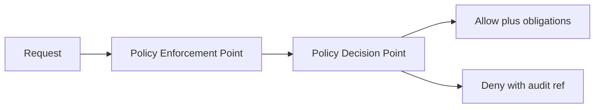

<!-- [KFM_META_BLOCK_V2]
doc_id: kfm://policy_decision/<uuid>@v1
title: "PDR: <short, specific title>"
type: standard
version: v1
status: draft
owners: <team or names>
created: YYYY-MM-DD
updated: YYYY-MM-DD
policy_label: internal
related: [<paths or kfm:// ids>]
tags: [kfm, policy, pdr]
notes: ["Template for KFM Policy Decision Records (PDRs)."]
[/KFM_META_BLOCK_V2] -->

# Policy Decision Record: <title>

> **Status:** draft | review | published | superseded
> **Owners:** <team or names>
> **Policy area:** access-control | sensitivity | licensing | evidence | story-publish | pipeline-promotion | other
> **Applies to:** CI gates | runtime API | evidence resolver | UI rendering | Focus Mode | other
>
>  <!-- TODO -->
>  <!-- TODO -->
>  <!-- TODO -->

**Quick links:**
- [Summary](#summary)
- [Decision](#decision)
- [Policy-as-code](#policy-as-code)
- [Tests](#tests)
- [Auditability](#auditability)
- [Rollout and rollback](#rollout-and-rollback)
- [Approvals](#approvals)

---

## Summary

**One sentence:** <What did we decide?>

**Why:** <What problem does it solve?>

**Result:** <What changes for users / pipelines / maintainers?>

---

## Decision metadata

| Field | Value |
|---|---|
| Decision ID | `kfm://policy_decision/<uuid>@v1` |
| Date proposed | YYYY-MM-DD |
| Date approved | YYYY-MM-DD |
| Effective date | YYYY-MM-DD |
| Review-by date (required) | YYYY-MM-DD |
| Status | draft \| review \| published \| superseded |
| Supersedes | `kfm://policy_decision/<uuid>@vN` (optional) |
| Related issue / PR | `<repo>#<id>` |
| Related policy bundle | `policy/rego/<bundle_or_package>/` |
| Policy version pin | `<git_commit_sha>` (required for reproducibility) |
| Affected systems | API \| CI \| pipeline \| UI \| Focus Mode \| evidence resolver |
| Policy labels impacted | public \| public_generalized \| restricted \| internal \| embargoed \| quarantine |

---

## Scope

### In scope

- <Bullet list of what this policy covers>

### Out of scope

- <Explicitly list what this policy does NOT cover>

---

## Context and problem statement

### Background

<Provide context, timeline, and where this policy decision fits in KFM.>

### Problem

<Describe the failure mode / risk / governance gap that requires a policy decision.>

### Constraints

- **Trust membrane:** UI and external clients must not directly access databases/storage; policy is enforced at governed APIs and other PEPs.
- **Fail-closed:** default decision is deny unless explicitly allowed.
- **Cite-or-abstain:** if evidence cannot be resolved, outputs must abstain (or be denied) rather than guess.

> Replace these bullets if your repo defines different invariants, but do not remove without a linked superseding PDR.

---

## Terms and controlled vocabulary

### Policy labels

> Define any labels referenced by this decision.

| `policy_label` | Intended meaning | Allowed outputs | Notes |
|---|---|---|---|
| `public` | <...> | <...> | <...> |
| `public_generalized` | <...> | <...> | <...> |
| `internal` | <...> | <...> | <...> |
| `restricted` | <...> | <...> | <...> |
| `restricted_sensitive_location` | <...> | <...> | <...> |
| `embargoed` | <...> | <...> | <...> |
| `quarantine` | <...> | <...> | <...> |

### Actions

| `action` | Meaning |
|---|---|
| `read` | <...> |
| `export` | <...> |
| `publish` | <...> |
| `promote` | <raw→work→processed> |
| `resolve_evidence` | <...> |

---

## Assumptions and open questions

> **Rule:** Every meaningful claim must be tagged as one of: **CONFIRMED**, **PROPOSED**, **UNKNOWN**.
>
> If **UNKNOWN**, list the smallest verification steps to make it **CONFIRMED**.

### Assumptions

1. **<Claim>** — **CONFIRMED | PROPOSED | UNKNOWN**
   - Evidence: <CITATION: dcat://... | stac://... | prov://... | doc://...>
   - Verification (if UNKNOWN): <steps>

2. **<Claim>** — **CONFIRMED | PROPOSED | UNKNOWN**
   - Evidence: <...>
   - Verification (if UNKNOWN): <...>

### Open questions

- **UNKNOWN:** <Question>
  - Smallest verification steps: <steps>

---

## Options considered

### Option A — <name>

- **Description:** <...>
- **Pros:** <...>
- **Cons:** <...>
- **Decision impact:** <...>

### Option B — <name>

- **Description:** <...>
- **Pros:** <...>
- **Cons:** <...>
- **Decision impact:** <...>

### Option C — Do nothing

- **Description:** Leave behavior unchanged.
- **Pros:** No immediate work.
- **Cons:** <Enumerate risk that remains>

---

## Decision

### Decision statement

**We will:** <exact decision in plain English>

**Because:** <rationale>

### Decision details

- **Default outcome:** deny (fail-closed)
- **Allow conditions:** <list>
- **Deny conditions:** <list>
- **Obligations (required side-effects on allow):**
  - <e.g., show UI notice>
  - <e.g., apply redaction profile>
  - <e.g., attach license text on export>

### Mermaid overview



> Avoid using vertical bars in node text (Mermaid parsing and KFM style rules).

---

## Policy-as-code

> Keep CI and runtime semantics aligned. If CI and runtime produce different outcomes, CI guarantees are meaningless.

### Policy location

- Rego package: `policy/rego/<package>/` (example)
- Entry point(s): `allow`, `deny`, `obligations`
- Default: `allow = false`

### Input contract

> Document the minimum required `input` fields. Treat this as a contract.

```json
{
  "user": {
    "id": "<opaque>",
    "role": "public | steward | reviewer | admin | ..."
  },
  "action": "read | export | publish | promote | resolve_evidence",
  "resource": {
    "type": "dataset | story | evidence_bundle | artifact | ...",
    "id": "<kfm://...>",
    "policy_label": "public | restricted | internal | ...",
    "sensitivity": "public | sensitive_location | pii | ..."
  },
  "context": {
    "purpose": "interactive_map | bulk_export | api_client | ...",
    "time": "YYYY-MM-DDThh:mm:ssZ",
    "request_id": "<uuid>",
    "trace_id": "<opaque>"
  }
}
```

### Example Rego skeleton

```rego
package kfm.authz

default allow = false

# Deny-by-default. Allow must be explicitly granted.
allow {
  input.user.role == "steward"
}

allow {
  input.user.role == "public"
  input.action == "read"
  input.resource.policy_label == "public"
}

# Obligations can require the caller to take extra steps (UI notice, redaction, etc.).
obligations[o] {
  input.resource.policy_label == "public_generalized"
  o := {"type": "show_notice", "message": "Geometry generalized due to policy."}
}
```

> Replace with your actual packages and rules. Keep examples minimal and test-backed.

---

## Tests

### Unit tests (policy)

> Policy tests must run in CI and block merges.

```rego
package kfm.authz_test

import data.kfm.authz

test_public_can_read_public {
  authz.allow with input as {
    "user": {"role": "public"},
    "action": "read",
    "resource": {"policy_label": "public"}
  }
}

test_public_cannot_read_restricted {
  not authz.allow with input as {
    "user": {"role": "public"},
    "action": "read",
    "resource": {"policy_label": "restricted"}
  }
}
```

### Conftest example

```bash
# Example: validate policy fixtures and fail closed
conftest test -p policy/rego policy/fixtures/*.json
```

### Required fixtures

- ✅ `allow` fixture(s)
- ✅ `deny` fixture(s)
- ✅ `obligations` fixture(s)
- ✅ regression tests for known past incidents

---

## Runtime enforcement points

### Where this policy is enforced

- **CI (PR gates):** schema validation + policy tests must block merges.
- **Runtime API:** policy check before serving data.
- **Evidence resolver:** policy check before resolving evidence bundles.
- **UI:** renders policy badges/notices, but **never** makes policy decisions.

### Failure behavior

- If the PDP is unavailable, return **deny** (fail-closed).
- Do not leak restricted metadata in error responses.

---

## Auditability

### What must be recorded

- `decision_id` (this PDR)
- policy bundle version (git SHA and/or bundle digest)
- input summary (redacted/pseudonymized where needed)
- `decision` (allow/deny) and any `obligations`
- `audit_ref` returned to callers

### Example audit event

```json
{
  "audit_ref": "kfm://audit/<uuid>",
  "decision_id": "kfm://policy_decision/<uuid>@v1",
  "policy_bundle": {
    "git_commit": "<sha>",
    "digest": "sha256:<bundle_digest>"
  },
  "request": {
    "request_id": "<uuid>",
    "user_role": "public",
    "action": "read",
    "resource_id": "kfm://dataset/<slug>@<dataset_version_id>",
    "resource_policy_label": "public"
  },
  "result": {
    "decision": "allow",
    "obligations": []
  },
  "timestamps": {
    "decided_at": "YYYY-MM-DDThh:mm:ssZ"
  }
}
```

---

## Sensitivity, redaction, and generalization

### Rules

> **Defaults (PROPOSED):** adjust only with explicit justification and tests.

- **Default deny** for `restricted` and `restricted_sensitive_location`.
- If any public representation is allowed, produce a separate **`public_generalized`** dataset version.
- Never leak restricted metadata in `403/404` responses.
- Do not embed precise coordinates in Story Nodes or Focus Mode outputs unless policy explicitly allows.
- Treat redaction/generalization as a first-class transform recorded in PROV.

### Redaction as a first-class transform

If redaction/generalization is applied:

- Produce a new artifact/version (do not overwrite originals)
- Record the transformation in PROV
- Attach a redaction receipt to the audit record

---

## Licensing and rights

### Rules

> **Defaults (PROPOSED):** adjust only with explicit justification and tests.

- Online availability does not equal permission to reuse.
- Promotion gate requires **license + rights holder** for every distribution.
- "Metadata-only reference" mode is allowed (catalog without mirroring) if rights do not allow distribution.
- Export functions must include attribution and license text automatically.
- Story publishing gate blocks if rights are unclear for included media.

### Metadata-only mode

If rights do not allow mirroring/distribution:

- Catalog the resource with metadata only
- Ensure exports/downloads are blocked or constrained by policy

---

## Rollout and rollback

### Rollout plan (small, reversible, additive)

1. Add/modify policy code in `policy/rego/`.
2. Add fixtures + tests; wire into CI.
3. Deploy policy bundle to staging; enable decision logging.
4. Run staged rollout (feature flag or targeted routes).
5. Promote to production.

### Rollback plan

- **Kill-switch:** <how to disable the policy change quickly>
- **Revert path:** <commit/PR revert instructions>
- **Data impact:** <any backfill or cleanup steps>

---

## Risks and mitigations

| Risk | Why it matters | Mitigation (minimum) |
|---|---|---|
| Toolchain drift | Breaks CI gates or changes semantics | Pin versions; regression suite |
| False positives | Blocks valid work | Staged rollout; add fixtures |
| Sensitive leakage | Harmful exposure | Deny-by-default; redact logs |

---

## Approvals

> List the required reviewers for *this* policy area.

- [ ] Policy steward: <name>
- [ ] Security: <name>
- [ ] Data steward: <name>
- [ ] Community / CARE review (if applicable): <name>
- [ ] Engineering owner: <name>

**Decision published by:** <name> on YYYY-MM-DD

---

## Changelog

- YYYY-MM-DD — draft created
- YYYY-MM-DD — revised: <what changed>
- YYYY-MM-DD — published

---

## Appendix

<details>
<summary>Optional: machine-readable sidecar sketch</summary>

If your tooling supports indexing policy decisions, consider a sidecar JSON stored next to this file.

```json
{
  "kfm_policy_decision_version": "v1",
  "decision_id": "kfm://policy_decision/<uuid>@v1",
  "status": "draft",
  "policy_area": "access-control",
  "applies_to": ["ci", "runtime_api"],
  "effective_date": "YYYY-MM-DD",
  "policy_bundle_git_commit": "<sha>",
  "inputs_contract": "contracts/policy/<name>.jsonschema",
  "rego_packages": ["kfm.authz"],
  "tests": {
    "rego_test_packages": ["kfm.authz_test"],
    "conftest_command": "conftest test -p policy/rego policy/fixtures/*.json"
  },
  "related": {
    "issues": ["<repo>#<id>"],
    "pdrs": [],
    "datasets": [],
    "docs": []
  }
}
```

</details>

[Back to top](#policy-decision-record-title)
