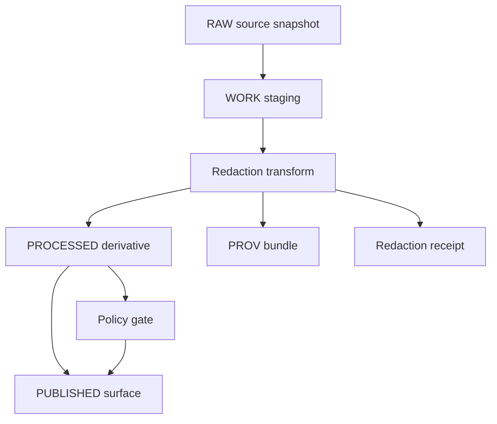

<!-- [KFM_META_BLOCK_V2]
doc_id: kfm://doc/<uuid-v4-here>
title: TEMPLATE — Redaction Plan
type: standard
version: v1
status: draft
owners: <team-or-names>
created: YYYY-MM-DD
updated: YYYY-MM-DD
policy_label: public|restricted
related: [
  "docs/standards/governance/ROOT-GOVERNANCE.md",
  "docs/standards/policy/README.md",
  "data/**/catalog.*",
  "policy/rego/**"
]
tags: [kfm, policy, redaction, provenance, fair, care]
notes: [
  "Template file. Copy + rename for each dataset/asset needing redaction.",
  "Do not paste raw restricted content into this document; reference it via evidence bundles."
]
[/KFM_META_BLOCK_V2] -->

# Redaction Plan
One-page + build-ready plan to transform a sensitive source into a policy-safe derivative (with provenance, tests, and approvals).

---

## Impact
**Status:** template (copy/paste)  
**Owners:** `<data-governance>` · `<security>` · `<domain-steward>`  
**Applies to:** dataset / layer / document / model output (choose)  
**Primary risk:** sensitive-data leakage (field-level, location precision, small counts)  
**Default posture:** fail-closed until policy + tests pass  
**Last updated:** `YYYY-MM-DD`

Badges (optional; replace or remove):
- 
- 
- 

Quick links:
- [Scope](#scope)
- [Decision Summary](#decision-summary)
- [Sensitivity Classification](#sensitivity-classification)
- [Redaction Rules](#redaction-rules)
- [Provenance and Receipts](#provenance-and-receipts)
- [Validation and Non-Regression](#validation-and-non-regression)
- [Approvals](#approvals)
- [Appendix](#appendix)

---

## Scope

### What this plan covers
- **In-scope assets:** `<dataset_id / layer_id / document_id / endpoint>`
- **Redaction target:** `<public | restricted-role | aggregate-only | internal-only>`
- **Lifecycle boundary:** RAW → WORK → PROCESSED → PUBLISHED (choose stages impacted)

### What this plan does *not* cover
- Legal advice or a complete compliance review.
- “Security through obscurity” (e.g., hiding a URL but leaving data intact).
- Retroactive cleanup of previously published leaks **without** a rollback plan (see [Release and Rollback](#release-and-rollback)).

---

## Where this fits

**Template path:** `docs/templates/policy/TEMPLATE__REDACTION_PLAN.md`  
**Instance path (recommended):** `docs/policy/redaction/<dataset_id>/REDACTION_PLAN.md`

**Upstream inputs:** RAW data + catalogs + evidence references  
**Downstream surfaces:** governed API, Story Nodes, Focus Mode, map tiles/exports, search indexes

---

## Acceptable inputs

Provide references, not raw sensitive content:
- `dataset_id` / `dataset_version`
- Source manifest(s) and checksums
- Catalog records (STAC/DCAT/PROV, as applicable)
- Policy label(s) and sensitivity class
- Evidence bundle reference(s) (digest-addressed if possible)
- Test plan + expected denial/allow behaviors (golden tests)

---

## Exclusions
**Do not** attach or paste:
- raw records containing PII
- precise coordinates for sensitive locations
- small-count tables that could enable re-identification
- access tokens, secrets, private URLs

Instead, include **references** (digest IDs, internal paths, or governed resolvers).

---

## Decision Summary

| Field | Value |
|---|---|
| Redaction Plan ID | `urn:kfm:policy:redaction:<dataset_id>:<yyyymmdd>` |
| Source Dataset ID | `<dataset_id>` |
| Source Version / Snapshot | `<version or snapshot id>` |
| Output Dataset ID | `<dataset_id_redacted or derivative id>` |
| Output Zone | `<WORK | PROCESSED | PUBLISHED>` |
| Sensitivity class | `<Public | Restricted | Sensitive-location | Aggregate-only>` |
| Redaction profile ID | `<e.g., public_default | restricted_default | ...>` |
| Governing policy basis | `<policy doc / statute / governance rule>` |
| Primary transformation | `<drop | mask | generalize | aggregate | perturb | tokenize>` |
| Expected utility impact | `<low | medium | high>` |
| Release type | `<minor | material>` |
| Required approvals | `<names/roles>` |

---

## Evidence Discipline

Every meaningful assertion in this plan must be labeled:

- **CONFIRMED:** backed by evidence reference(s)
- **PROPOSED:** a design choice pending approval
- **UNKNOWN:** not yet validated; list the *smallest verification steps* to make it CONFIRMED

### Evidence table (fill in)

| Assertion | Status | Evidence reference(s) | Verification steps (if UNKNOWN) |
|---|---|---|---|
| `<example: field X contains PII>` | `<CONFIRMED>` | `<evidence bundle digest + path>` | `<n/a>` |
| `<example: publish must be aggregate-only>` | `<PROPOSED>` | `<policy ref>` | `<run small-count risk audit>` |

---

## Sensitivity Classification

### Class selection (choose one)
- [ ] **Public** — safe to publish without redaction  
- [ ] **Restricted** — requires role-based access (e.g., ownership/identity data)  
- [ ] **Sensitive-location** — coordinates must be generalized or suppressed  
- [ ] **Aggregate-only** — publish only above thresholds (avoid small counts)

### Policy labels (required)
List **all** labels applied at dataset / record / field level:

| Level | Label | Notes |
|---|---|---|
| Dataset | `<public|restricted|...>` | `<why>` |
| Record | `<label>` | `<why>` |
| Field | `<label>` | `<why>` |

---

## Threat Model and Risk Register

| Risk | Attack / leak vector | Impact | Mitigation | Status |
|---|---|---|---|---|
| Precise point leakage | tile export, API geometry | harms / targeting | generalize/jitter; deny high precision unless authorized | `<PROPOSED>` |
| PII leakage | API fields, logs, receipts | re-identification | drop/mask; log structural events only | `<PROPOSED>` |
| Small-count disclosure | group-by outputs | re-identification | k-threshold suppression; aggregate-only | `<PROPOSED>` |

**UNKNOWNs:** list the smallest tests/audits needed (e.g., “run k-anonymity check by county-month”).

---

## Redaction Rules

> IMPORTANT: Redaction should be implemented as a first-class transformation with explicit provenance, producing a **separate derivative dataset** (not mutating RAW in place).

### Rule matrix (minimum)

| Rule ID | Data element | Location (table/field/layer) | Sensitivity | Action | Parameters | Justification | Utility impact | Test coverage |
|---|---|---|---|---|---|---|---|---|
| R-001 | `<owner_name>` | `<parcels.owner_name>` | Restricted | mask | `<hash+salt in vault OR tokenization>` | `<policy basis>` | `<med>` | `<unit+policy>` |
| R-002 | `<site_point>` | `<archaeology.geom>` | Sensitive-location | generalize | `<grid=1km OR jitter=...>` | `<policy basis>` | `<high>` | `<spatial leak tests>` |
| R-003 | `<case_count>` | `<health.count>` | Aggregate-only | suppress | `<k>=<n>` | `<policy basis>` | `<low>` | `<small-count tests>` |

### Geometry and map-specific rules (if applicable)
- Coordinate precision cap: `<e.g., 3 decimals ~ 110m>`  
- Export limits: `<no raw points; clusters only>`  
- Tile generation: `<only from redacted derivative>`  
- Renderer preflight: `<thin/jitter/coarsen/mask>`  

### Temporal rules (if applicable)
- Coarsening: `<day → month>`  
- Windowing constraints: `<minimum window size>`  

---

## Transformation Spec

### Inputs (references only)
- RAW snapshot: `<path or digest ref>`
- Catalog record(s): `<stac.json, dcat.json, prov.jsonld>`
- Policy bundle: `<policy bundle id / hash>`
- Toolchain versions: `<gdal=..., geopandas=..., dbt=..., etc>`

### Deterministic identity
- `spec_hash`: `sha256-<computed from canonicalized spec>`
- `run_id`: `urn:kfm:run:redaction:<sha256_16>`
- Output dataset version: `<semver or date-based>`

### Pseudocode spec (replace with real config)
```yaml
redaction_plan:
  id: "urn:kfm:policy:redaction:<dataset_id>:<yyyymmdd>"
  source:
    dataset_id: "<dataset_id>"
    snapshot_ref: "<immutable ref>"
    policy_labels: ["<...>"]
    sensitivity_class: "<Public|Restricted|Sensitive-location|Aggregate-only>"
  output:
    dataset_id: "<dataset_id__redacted>"
    zone: "<WORK|PROCESSED|PUBLISHED>"
    policy_label: "<public|restricted>"
  rules:
    - id: "R-001"
      match: { field: "<table.field>" }
      action: "mask"
      params: { method: "tokenize", token_scope: "dataset", secret_ref: "<vault-ref>" }
    - id: "R-002"
      match: { geometry: true }
      action: "generalize"
      params: { method: "snap_to_grid", grid_meters: 1000 }
    - id: "R-003"
      match: { metric: "count" }
      action: "suppress_small_counts"
      params: { k_min: 10 }
```

---

## Provenance and Receipts

### Required artifacts (minimum)
- `redaction_receipt.json` — what was redacted, how, and why (policy-safe summary)
- `prov.bundle.jsonld` — PROV-O lineage: RAW → redaction activity → derivative
- Updated catalog(s): STAC/DCAT entries for derivative dataset
- Checksums: `sha256` for produced artifacts
- Policy evaluation output: conftest/OPA results (pass/fail with reasons)

### Recommended output layout
```text
data/
  raw/<domain>/<dataset_id>/<snapshot_id>/
  work/<domain>/<dataset_id>/<spec_hash>/
  processed/<domain>/<dataset_id__redacted>/<spec_hash>/
docs/
  policy/redaction/<dataset_id>/
    REDACTION_PLAN.md
reports/
  redaction/<dataset_id>/<run_id>/
    redaction_receipt.json
    validate.log
    policy.results.json
prov/
  <dataset_id>/<run_id>/
    prov.bundle.jsonld
```

---

## Validation and Non-Regression

### Fail-closed gates (required)
- [ ] Schema validation passes for derivative artifacts
- [ ] Policy-as-code passes (OPA/Conftest) for zone promotion
- [ ] Non-regression “golden leak” tests: known leak queries must fail forever
- [ ] Field-level tests: restricted fields absent or transformed as specified
- [ ] Spatial leak tests: unauthorized users cannot access high-precision coordinates
- [ ] Audit integrity tests: responses include audit reference + evidence bundle hash

### Test plan
| Test ID | Type | What it proves | Expected result | Evidence status |
|---|---|---|---|---|
| T-001 | unit | `<field removed/masked>` | pass | `<CONFIRMED>` |
| T-002 | policy | `<deny high-precision access>` | deny | `<CONFIRMED>` |
| T-003 | regression | `<previous leak query>` | deny | `<CONFIRMED>` |
| T-004 | utility | `<aggregate accuracy within bounds>` | pass | `<PROPOSED>` |

---

## Release and Rollback

### Release plan
- Output versioning strategy: `<dataset_version rules>`
- Promotion target: `<WORK → PROCESSED → PUBLISHED>`
- Changelog entry: `<what changed + why>`
- Communication: `<who is notified + where>`

### Rollback plan (required)
- Rollback trigger(s): `<policy regression fail | leak detected | utility break>`
- Rollback action: `<revoke published artifacts | rotate tokens | re-run redaction>`
- Post-incident steps: `<add a golden test for the leak; update policy suite>`

---

## Approvals

> No promotion to PUBLISHED until all required roles sign off.

| Role | Name | Decision | Date | Notes |
|---|---|---:|---|---|
| Data steward | `<name>` | ☐ Approve ☐ Reject | `YYYY-MM-DD` |  |
| Security | `<name>` | ☐ Approve ☐ Reject | `YYYY-MM-DD` |  |
| Governance | `<name>` | ☐ Approve ☐ Reject | `YYYY-MM-DD` |  |
| Domain owner | `<name>` | ☐ Approve ☐ Reject | `YYYY-MM-DD` |  |

---

## Appendix

### A. Redaction receipt skeleton (policy-safe)
```json
{
  "redaction_plan_id": "urn:kfm:policy:redaction:<dataset_id>:<yyyymmdd>",
  "run_id": "urn:kfm:run:redaction:<sha256_16>",
  "source": {
    "dataset_id": "<dataset_id>",
    "snapshot_ref": "<immutable ref>",
    "sensitivity_class": "<...>",
    "policy_labels": ["<...>"]
  },
  "output": {
    "dataset_id": "<dataset_id__redacted>",
    "zone": "<PROCESSED>",
    "artifacts": [
      {"path": "data/processed/.../file.parquet", "sha256": "sha256-..."}
    ]
  },
  "rules_applied": [
    {"id": "R-001", "action": "mask", "summary": "Masked owner_name using tokenization"},
    {"id": "R-002", "action": "generalize", "summary": "Snapped coordinates to 1km grid"},
    {"id": "R-003", "action": "suppress_small_counts", "summary": "Suppressed counts where k<10"}
  ],
  "tests": {
    "schema": "pass",
    "policy": "pass",
    "leak_regression": "pass"
  },
  "notes": [
    "Receipt must not contain raw restricted rows or precise sensitive coordinates."
  ]
}
```

### B. Mermaid diagram


### C. OPA/Conftest checklist (copy/paste)
- [ ] default deny
- [ ] deny if required redaction profile missing for non-public sensitivity
- [ ] deny if redaction receipt missing when publishing
- [ ] deny if restricted fields present in derivative schema
- [ ] deny if sensitive-location precision exceeds allowed threshold

---

## Version History

| Version | Date | Author | Summary |
|---:|---|---|---|
| v1 | `YYYY-MM-DD` | `<name>` | Initial plan |

---

[Back to top](#redaction-plan)
