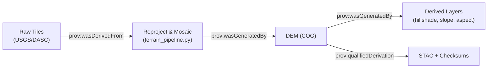

<div align="center">

# 🔗 **Kansas Frontier Matrix — Provenance Record Template**  
`docs/templates/provenance.md`

**Purpose:** A **structured, MCP- & FAIR-aligned** template to capture the **lineage and transformation history** of datasets, models, and derived products in the **Kansas Frontier Matrix (KFM)** — ensuring **traceability**, **accountability**, **security**, and **reproducibility** across the full data lifecycle.

[](../../docs/)
[](../../.github/workflows/docs-validate.yml)
[](https://www.go-fair.org/fair-principles/)
[](https://stacspec.org/)
[](https://www.w3.org/TR/prov-o/)
[](../../.github/workflows/policy-check.yml)
[](../../.github/workflows/)
[](../../.github/workflows/sbom.yml)
[](../../LICENSE)

</div>

---

```yaml
---
title: "Kansas Frontier Matrix — Provenance Record Template"
version: "v1.3.0"
last_updated: "2025-10-18"
owners: ["@kfm-data","@kfm-docs","@kfm-security","@kfm-architecture"]
tags: ["provenance","stac","prov-o","reproducibility","mcp","fair","slsa","sbom","ethics","security"]
status: "Template"
license: "CC-BY 4.0"
semantic_alignment:
  - W3C PROV-O
  - STAC 1.0
  - ISO 19115 (metadata)
  - JSON Schema
  - ISO 8601 / EPSG
  - FAIR Principles
  - GeoSPARQL
supply_chain:
  slsa_target: "Level 3"
  sbom_format: "SPDX 2.3 (JSON)"
ci_required_checks:
  - stac-validate
  - checksums
  - docs-validate
  - policy-check
  - codeql
  - trivy
  - gitleaks
---
```

---

## 🧭 Provenance Record Metadata

| Field                      | Description                                                                 |
| :------------------------- | :-------------------------------------------------------------------------- |
| **Provenance ID**          | Unique identifier (e.g., `PROV-2025-001-TERRAIN`)                           |
| **Entity Type**            | Dataset / Model / Experiment / Document                                     |
| **Associated ID(s)**       | Link to dataset/model/experiment IDs (e.g., `DATASET-2025-001-TERRAIN-DEM`) |
| **Author(s)**              | Responsible curator / pipeline engineer                                     |
| **Affiliation**            | Team or organization                                                        |
| **Date Created / Updated** | YYYY-MM-DD / YYYY-MM-DD                                                     |
| **Version**                | v1.0, v1.1, etc. (SemVer)                                                   |
| **Domain**                 | Terrain / Hydrology / Climate / Landcover / Hazards / Tabular / Text        |
| **Status**                 | Active / Archived / Superseded / Deprecated                                 |
| **PID / DOI (optional)**   | Persistent identifier if minted (e.g., Zenodo DOI)                          |
| **License**                | CC-BY 4.0 / Public Domain / MIT (as applicable)                             |
| **Sensitivity**            | Public / Restricted / Contains redactions                                   |

> **PROV-O mapping:** *prov:Entity* (this record) attributed to *prov:Agent* (author) via *prov:wasAttributedTo*; creation via *prov:generatedAtTime*.

---

## 📜 Provenance Overview

Provide a concise narrative of origins and transformations leading to current state.

> **Example**  
> Processed Kansas LiDAR-derived 1 m DEM (2018–2020) from USGS 3DEP + KS DASC sources. Steps: acquisition → QA → reprojection → mosaicking → void-fill → hillshade derivation → STAC/checksum → publication to `data/processed/terrain/`. Reproducible via `make terrain`.

---

## 🧩 Lineage Chain (Stepwise)

| Step | Type      | Description                    | Input(s)          | Output(s)                                        | Tool / Script                    | PROV-O                     |
|:---:|:----------|:-------------------------------|:------------------|:-------------------------------------------------|:---------------------------------|:---------------------------|
| 1   | Source    | Raw tile acquisition           | `usgs_3dep_dem`   | `data/raw/terrain/ks_3dep_tiles.zip`             | `make fetch-raw`                 | *prov:wasDerivedFrom*      |
| 2   | Transform | Reproject & mosaic (EPSG:4326) | Raw tiles         | `data/processed/terrain/ks_1m_dem_2018_2020.tif` | `terrain_pipeline.py`            | *prov:wasGeneratedBy*      |
| 3   | Derive    | Hillshade / slope / aspect     | DEM GeoTIFF       | `ks_hillshade_2018_2020.tif`                     | `gdaldem`                        | *prov:wasGeneratedBy*      |
| 4   | Validate  | CRS, extent, nodata QA         | Processed rasters | QA report                                        | `gdalinfo`, custom checks        | *prov:used*                |
| 5   | Verify    | SHA-256 checksums              | Outputs           | `.sha256` files                                  | `make checksums`                 | *prov:wasInfluencedBy*     |
| 6   | Describe  | STAC item(s)                   | Outputs           | `data/stac/terrain/*.json`                       | `stac-generator.py`              | *prov:qualifiedGeneration* |

<details>
<summary><b>📦 Extended lineage attributes (click to expand)</b></summary>

- **Temporal extent:** 2018-01-01 → 2020-12-31  
- **Spatial extent (WGS84 bbox):** `[-102.05, 36.99, -94.59, 40.00]`  
- **Nodata policy:** `-9999` propagated; masked in derivatives  
- **Resampling:** bilinear (mosaic); cubic (hillshade)  
- **Overviews:** internal overviews at {2, 4, 8, 16}  
- **Compression:** COG / DEFLATE; overview JPEG  

</details>

---

## 🧾 Source Provenance

| Source            | Provider               | Access Method | License       | Source Manifest                           |
| :---------------- | :--------------------- | :------------ | :------------ | :---------------------------------------- |
| **USGS 3DEP DEM** | U.S. Geological Survey | REST / HTTPS  | Public Domain | `data/sources/terrain/usgs_3dep_dem.json` |
| **KS DASC LiDAR** | Kansas DASC            | FTP / HTTPS   | CC-BY 4.0     | `data/sources/terrain/ks_dasc_lidar.json` |

> Each source must exist in the **Source Registry** and include retrieval time, original filename, size, and original checksum (when provided).

---

## 🧮 Derived Products

| Product                          | Type     | Description                    | File Path                 |
| :------------------------------- | :------- | :----------------------------- | :------------------------ |
| `ks_1m_dem_2018_2020.tif`        | Raster   | Reprojected statewide DEM      | `data/processed/terrain/` |
| `ks_hillshade_2018_2020.tif`     | Raster   | Hillshade visualization layer  | `data/processed/terrain/` |
| `ks_1m_dem_2018_2020.json`       | Metadata | STAC item (assets, bbox, time) | `data/stac/terrain/`      |
| `ks_1m_dem_2018_2020.tif.sha256` | Checksum | SHA-256 integrity              | `data/checksums/terrain/` |

---

## 🧪 Validation & Verification

| Validation          | Description                  | Tool / Workflow                       | Result     |
| :------------------ | :--------------------------- | :------------------------------------ | :--------- |
| **Checksum**        | File integrity (SHA-256)     | `make checksums`                      | ✅ Passed   |
| **STAC Validation** | Item/collection schema       | `.github/workflows/stac-validate.yml` | ✅ Passed   |
| **Spatial QA/QC**   | CRS, bbox, nodata            | `gdalinfo`, `rio info`                | ✅ Passed   |
| **COG Compliance**  | Internal tiling & overviews  | `cog_validate`                        | ✅ Passed   |
| **Policy Gates**    | Front-matter/fields required | `.github/workflows/policy-check.yml`  | ✅ Passed   |
| **CI/CD Audit**     | Build & artifact consistency | `site.yml`, `checksums.yml`           | ✅ Passed   |
| **Manual Review**   | Curator sign-off             | Governance log / PR                   | ✅ Approved |

> Store logs under: `data/work/logs/provenance/<provenance_id>.log`

---

## 🗂️ Environment & Supply Chain Capture

| Aspect           | Capture                                                              |
| :--------------- | :------------------------------------------------------------------- |
| **Container**    | Image + digest (e.g., `ghcr.io/org/kfm:terrain-1.0@sha256:<digest>`) |
| **Env Lockfile** | `requirements.txt` / `environment.yml` / `poetry.lock` pinned        |
| **SBOM**         | `sbom-<provenance_id>.spdx.json` (SPDX 2.3)                          |
| **Provenance**   | Attestations (SLSA/Sigstore) if configured                           |

> **Repro tip:** include `conda env export --from-history` or `pip freeze` snapshots in artifacts.

---

## 🔐 Access, Retention & Governance

| Policy                  | Setting                                                               |
| :---------------------- | :-------------------------------------------------------------------- |
| **Access Level**        | Public (read) / Restricted (explain constraints)                      |
| **Embargo / Redaction** | If redacted, document fields & rationale                              |
| **Retention**           | Maintain last 3 published versions; archival target defined           |
| **Steward**             | Role/team responsible for maintenance                                 |

---

## 🧠 Change History

| Version | Date       | Author                   | Summary                                           |
| :-----: | :--------- | :----------------------- | :------------------------------------------------ |
| v1.3    | 2025-10-18 | KFM Data Governance Team | Added policy gates, SBOM/SLSA capture, CI audit   |
| v1.2    | 2025-10-17 | KFM Docs Team            | MCP-DL metadata; ISO/GeoSPARQL references        |
| v1.1    | 2025-10-05 | (You)                    | Clarified QA steps; added env capture             |
| v1.0    | 2025-10-04 | KFM Documentation Team   | Initial provenance template                       |

---

## 🧩 PROV Graph (Optional)



---

## 👥 Responsible Parties

| Role                  | Name / Team | Responsibility          |
| :-------------------- | :---------- | :---------------------- |
| **Data Engineer**     | …           | Ingestion & transforms  |
| **Metadata Curator**  | …           | STAC/PROV documentation |
| **Quality Assurance** | …           | QA/QC & CI validations  |
| **Approver**          | …           | Final sign-off          |

---

## 🧰 Reproducibility Quickstart

```bash
# 1) Fetch sources and verify
make fetch-raw && make checksums

# 2) Build terrain artifacts
make terrain

# 3) Validate outputs & metadata
make stac-validate && make qa-terrain

# 4) Publish artifacts (internal)
make publish-terrain
```

> **Containerized run:**  
> `docker run --rm -v $PWD:/work -w /work ghcr.io/org/kfm:terrain-1.0 make terrain`

---

## 🧠 MCP Compliance Summary

| MCP Principle           | Implementation                                     |
| :---------------------- | :------------------------------------------------- |
| **Documentation-first** | Provenance authored & versioned with data/pipeline |
| **Reproducibility**     | Deterministic steps + env & container capture      |
| **Open Standards**      | STAC 1.0, PROV-O, COG, GeoJSON, SPDX               |
| **Provenance**          | Full lineage chain from sources to products        |
| **Auditability**        | CI logs, checksums, SBOM, build attestations       |

---

## 🔗 Related Documentation

| File                                     | Description                           |
| :--------------------------------------- | :------------------------------------ |
| `docs/templates/dataset.md`              | Dataset documentation (public-facing) |
| `docs/templates/experiment.md`           | Experiment protocol & metrics         |
| `docs/templates/model_card.md`           | Model transparency & evaluation       |
| `docs/architecture/data-architecture.md` | Repository data layout & flows        |
| `.github/workflows/stac-validate.yml`    | Automated STAC checks                 |

---

## 📚 References

1. **W3C PROV-O Ontology** — <https://www.w3.org/TR/prov-o/>  
2. **STAC Specification v1.0.0** — <https://stacspec.org>  
3. **MCP Guidelines** — KFM Documentation Framework  
4. **FAIR Principles** — <https://www.go-fair.org/fair-principles/>  
5. **SPDX** — <https://spdx.dev> (Software Bill of Materials)

---

<div align="center">

**Kansas Frontier Matrix** — *“Every Dataset Has a Story. Every Step Leaves a Trace.”*  
📍 `docs/templates/provenance.md` — MCP-compliant provenance template for KFM.

</div>