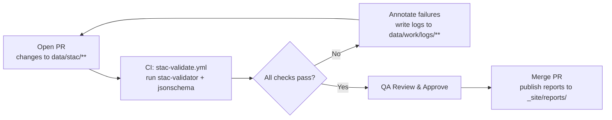

<div align="center">

# 🧾 **Kansas Frontier Matrix — Standard Operating Procedure (SOP) Template**  
`docs/templates/sop.md`

**Purpose:** A **reproducible, MCP/FAIR-aligned** framework for documenting operational procedures in the  
**Kansas Frontier Matrix (KFM)** — ensuring **documentation-first**, **deterministic**, **auditable** workflows using open standards.

[](../../docs/)
[](../../.github/workflows/docs-validate.yml)
[](https://www.go-fair.org/fair-principles/)
[](../../.github/workflows/policy-check.yml)
[](../../.github/workflows/)
[](../../.github/workflows/sbom.yml)
[](../../LICENSE)

</div>

---

```yaml
---
title: "Kansas Frontier Matrix — SOP Template"
version: "v1.3.0"
last_updated: "2025-10-18"
owners: ["@kfm-docs","@kfm-architecture","@kfm-data","@kfm-security"]
tags: ["sop","process","mcp","stac","validation","ci","provenance","security","fair","slsa","accessibility"]
status: "Template"
license: "CC-BY 4.0"
semantic_alignment:
  - MCP-DL v6.3
  - STAC 1.0
  - JSON Schema
  - FAIR Principles
  - W3C PROV-O
  - ISO 19115 / ISO 8601 / EPSG
  - GeoSPARQL
ci_required_checks:
  - docs-validate
  - policy-check
  - pre-commit
  - stac-validate
  - checksums
  - codeql
  - trivy
  - gitleaks
supply_chain:
  slsa_target: "Level 3"
  sbom_format: "SPDX 2.3 (JSON)"
---
```

---

## 🧭 SOP Metadata

| Field                      | Description                                               |
| :------------------------- | :-------------------------------------------------------- |
| **SOP ID**                 | Unique identifier (e.g., `SOP-2025-001-STAC`)             |
| **Title**                  | Short title describing the process                        |
| **Author(s)**              | Individual(s) responsible for this procedure              |
| **Affiliation**            | Team / Org (e.g., “KFM Data Ops”)                         |
| **Date Created / Updated** | YYYY-MM-DD / YYYY-MM-DD                                   |
| **Version**                | v1.0, v1.1, etc. (SemVer)                                 |
| **Status**                 | Draft / In Review / Approved / Deprecated                 |
| **Domain**                 | Data / Pipelines / Web / CI-CD / Metadata / Documentation |
| **Associated Workflow(s)** | `.github/workflows/*.yml` names and links                 |
| **Approval Authority**     | Governance lead or committee                              |
| **License**                | CC-BY 4.0 (Docs) / MIT (Code)                             |
| **Change Control**         | PR # / ADR # / Issue link(s)                              |

---

## 🎯 Objective

Describe the **purpose**, **expected outcomes**, and why this SOP is needed in KFM.

> *Example:* Standardize validation for **all STAC Items/Collections** ensuring STAC 1.0.0 compliance, deterministic builds, and traceable provenance per MCP.

---

## 🧩 Scope

| Parameter          | Definition                                     |
| :----------------- | :--------------------------------------------- |
| **Applies To**     | Teams, systems, pipelines, data classes        |
| **Exclusions**     | What is out-of-scope                           |
| **Dependencies**   | Other SOPs, datasets, environments, CI jobs    |
| **Frequency**      | Per commit / nightly / pre-release / quarterly |
| **Entry Criteria** | Conditions to start                            |
| **Exit Criteria**  | Acceptance gates to finish                     |

> *Example:* Applies to all JSON metadata in `data/stac/**`. Runs automatically on PRs to `dev` and merges to `main`.

---

## 🧑‍🤝‍🧑 Roles & RACI

| Role                    | Responsible | Accountable | Consulted | Informed |
| :---------------------- | :---------: | :---------: | :-------: | :------: |
| **Run Operator**        |      ✅      |             |           |          |
| **Automation Engineer** |      ✅      |             |     ✅     |          |
| **Data Manager**        |             |      ✅      |     ✅     |     ✅    |
| **Metadata Curator**    |             |             |     ✅     |     ✅    |
| **Security/Compliance** |             |             |     ✅     |     ✅    |

---

## 🧰 Prerequisites & Requirements

| Requirement       | Description                                                                                 |
| :---------------- | :------------------------------------------------------------------------------------------ |
| **Software**      | Python ≥3.11, `stac-validator ≥3.0`, `jsonschema`, GDAL (if spatial QA), `sha256sum`        |
| **Access**        | GitHub Actions runner, repo read/write for CI artifacts                                     |
| **Dependencies**  | Make targets (`setup`, `checksums`, `stac-validate`, `qa-*`), scripts (paths)               |
| **Data / Inputs** | `data/stac/**`, `data/processed/**`, `data/checksums/**`                                    |
| **Schemas**       | STAC 1.0.0 + local `schema.json` (extensions), JSON Schema contracts                        |
| **Environment**   | Pinned `requirements.txt` / `environment.yml`; optional container image & digest + SBOM     |

> *Tip:* Capture SBOM (`*.spdx.json`) and container digest for supply-chain visibility.

---

## 🔄 Procedure (Exact Order of Execution)

### Step 1 — Initialize Environment

```bash
make setup
pip install --upgrade stac-validator jsonschema
```

### Step 2 — Validate Metadata (STAC)

```bash
make stac-validate
# or:
stac-validator data/stac/**/*.json --recursive --links
```

### Step 3 — Verify Integrity (Checksums)

```bash
make checksums
diff -u data/checksums/current.sha256 data/checksums/expected.sha256 || true
```

### Step 4 — Spatial QA/QC (Optional)

```bash
make qa-terrain  # runs GDAL/rio sanity checks
```

### Step 5 — Review Results & Gate

* Confirm **all validations succeeded**; triage per **Error Matrix** (below), fix, re-run.

### Step 6 — Approve / Reject

* **Approve:** Merge PR, attach logs.  
* **Reject:** Comment issues, assign owners, re-run once fixed.

---

## ✅ Acceptance Criteria (Go/No-Go)

| Gate                | Threshold                                                  |
| :------------------ | :--------------------------------------------------------- |
| **STAC compliance** | 0 errors, 0 critical warnings                              |
| **Checksums**       | 100% match; no missing/extra files                         |
| **Spatial QA**      | Correct CRS/bbox; nodata consistent; COG valid (if raster) |
| **CI**              | All required workflows pass (green)                        |
| **Docs**            | SOP/Provenance/README updated when needed                  |
| **Policy**          | OPA/Conftest pass; required front-matter present           |

---

## 📦 Outputs & Deliverables

| Output                | Format    | Location                     | Description                         |
| :-------------------- | :-------- | :--------------------------- | :---------------------------------- |
| **Validation Log**    | `.log`    | `data/work/logs/validation/` | Full STAC + schema run details      |
| **Checksum Manifest** | `.sha256` | `data/checksums/`            | Integrity confirmation              |
| **STAC Report**       | `.json`   | `data/work/logs/ci/`         | Machine-readable validation results |
| **Summary Report**    | `.md`     | `_site/reports/`             | Human-readable outcome summary      |

---

## 🧮 Error Handling & Troubleshooting

| Error Type             | Likely Cause               | Resolution                               | Severity |
| :--------------------- | :------------------------- | :--------------------------------------- | :------- |
| **Validation Failure** | Missing fields / bad links | Fix STAC item/collection; re-run         | 🔴       |
| **Checksum Mismatch**  | Outdated hash / corruption | Rebuild artifact; update hash; re-run    | 🔴       |
| **COG Invalid**        | Missing overviews / tiling | Recreate with `rio cogeo create`; re-run | 🟠       |
| **CRS/Extent Bad**     | Wrong reprojection         | Reproject; update metadata; re-run       | 🟠       |
| **Network Timeout**    | Flaky remote               | Retry; `make fetch-raw`; pin versions    | 🟡       |

> Log all failures to `data/work/logs/errors/<SOP-ID>_errors.log` and reference in the PR.

---

## 🧪 Quality Assurance (QA) & Approvals

| Reviewer                | Step            | Verification                                  |
| :---------------------- | :-------------- | :-------------------------------------------- |
| **Data Manager**        | Post-validation | Confirms STAC + spatial QA                    |
| **Metadata Curator**    | Docs check      | Ensures completeness & accuracy               |
| **Automation Engineer** | CI review       | Verifies green workflows & artifact retention |
| **Security**            | Supply-chain    | SBOM present; scans clean; policy gates pass  |

Append all QA actions to:

```
data/work/logs/qa/<SOP-ID>_review.log
```

---

## ♻️ Rollback / Recovery

| Scenario                        | Action                                                            |
| :------------------------------ | :---------------------------------------------------------------- |
| **Bad STAC on main**            | Revert commit / redeploy previous artifact tag                    |
| **Checksum failure post-merge** | Quarantine artifact, restore last good build; re-issue checksums  |
| **COG invalid in production**   | Swap tile source to last healthy version; re-generate COG offline |

> Keep previous artifacts versioned (tags/releases or object-store versions).

---

## 📈 Runbook: Observability & Metrics

| Metric                   | Target         | Source             |
| :----------------------- | :------------- | :----------------- |
| **Validation pass rate** | ≥ 99% rolling  | CI summaries       |
| **Time to validate**     | ≤ 5 min per PR | CI duration        |
| **Rework rate**          | ≤ 5% of PRs    | Issue labels/links |
| **Checksum drift**       | 0 in releases  | Manifest diffs     |

---

## 🤖 Automation Mapping (CI/CD)

* **Workflows:** `.github/workflows/stac-validate.yml`, `checksums.yml`, `docs-validate.yml`, `policy-check.yml`, `site.yml`  
* **Artifacts retention:** ≥ 14 days (logs, reports)  
* **Required checks:** `stac-validate`, `checksums`, `docs-validate`, `policy-check`, optional `codeql`/`trivy`  
* **Secrets:** Use OIDC; no plaintext keys in logs  

---

## 🧠 MCP Compliance Summary

| MCP Principle           | Implementation                                             |
| :---------------------- | :--------------------------------------------------------- |
| **Documentation-first** | SOP finalized before/with implementation; versioned in Git |
| **Reproducibility**     | Deterministic steps; pinned env; optional container        |
| **Open Standards**      | Markdown, STAC 1.0.0, JSON Schema, COG, GeoJSON            |
| **Provenance**          | Logs, checksums, STAC, PR links, ADRs                      |
| **Auditability**        | CI logs, artifacts, QA records captured & retained         |

---

## 🔗 Related Documentation

| File                                     | Description                          |
| :--------------------------------------- | :----------------------------------- |
| `docs/templates/experiment.md`           | Experiment protocol & metrics        |
| `docs/templates/provenance.md`           | Provenance & lineage capture         |
| `docs/templates/model_card.md`           | Model transparency & evaluation      |
| `docs/architecture/ci-cd.md`             | CI/CD architecture & required checks |
| `docs/architecture/data-architecture.md` | Data flow & validation lifecycle     |
| `.github/workflows/stac-validate.yml`    | CI implementation of this SOP        |

---

## 🧾 References

1. **STAC v1.0.0** — <https://stacspec.org>  
2. **OGC / Geo standards** — <https://ogc.org>  
3. **Master Coder Protocol (MCP)** — KFM Standards  
4. **FAIR Principles** — <https://www.go-fair.org/fair-principles/>

---

## 🗂️ Revision & Control

| Version | Date       | Author             | Reviewer             | Change Summary                                                   |
| :-----: | :--------- | :----------------- | :------------------- | :--------------------------------------------------------------- |
| **v1.3.0** | 2025-10-18 | KFM Docs Team      | Governance Lead      | Added policy gates, security scans, SBOM/SLSA, observability map |
| **v1.2.0** | 2025-10-17 | KFM Docs Team      | Governance Lead      | MCP-DL metadata, CI refs, metrics, recovery guidance             |
| **v1.1.0** | 2025-10-05 | KFM Engineering    | Governance Lead      | RACI, rollback, runbook metrics, supply-chain capture            |
| **v1.0.0** | 2025-10-04 | Documentation Team | Data Governance Lead | Initial SOP template                                             |

---

<details>
<summary><b>📊 Process Diagram (click to expand)</b></summary>



</details>

---

<div align="center">

**Kansas Frontier Matrix** — *“Every Procedure Documented. Every Operation Reproducible.”*  
📍 `docs/templates/sop.md` · MCP-compliant operational procedure template for KFM.

</div>