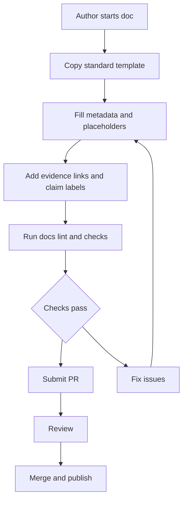

<!-- [KFM_META_BLOCK_V2]
doc_id: kfm://doc/fbb7e40c-0aa7-4b71-9b6c-b5b40327e7b6
title: Standard Documentation Templates
type: standard
version: v1
status: draft
owners: ["@Kansas-Frontier-Matrix/core"]
created: 2026-03-05
updated: 2026-03-05
policy_label: public
related: ["docs/README.md", "docs/governance/ROOT_GOVERNANCE.md", "docs/specs/README.md", "docs/templates/README.md"]
tags: [kfm, templates, docs, governance]
notes: ["Template directory README. Update related links once repo paths are confirmed."]
[/KFM_META_BLOCK_V2] -->

# Standard documentation templates
One canonical place to start new **KFM docs** with consistent structure, governance hooks, and review-ready checklists.

---

## Impact
- **Status:** `draft` (**PROPOSED** — promote to `active` once templates exist + CI checks reference them.)
- **Owners:** `@Kansas-Frontier-Matrix/core` (**PROPOSED** — update to actual CODEOWNERS owners.)
- **Policy label:** `public` (**PROPOSED** — adjust if templates include restricted guidance.)
- **Audience:** anyone writing docs in `docs/` (**PROPOSED**)

Badges (placeholders — replace with repo-standard shields):

- 
- 

Quick navigation: [Scope](#scope) · [Where-this-fits](#where-this-fits) · [Template-inventory](#template-inventory) · [Quickstart](#quickstart) · [Conventions](#conventions) · [Directory-tree](#directory-tree) · [Definition-of-done](#definition-of-done) · [FAQ](#faq)

---

## Scope
- **CONFIRMED:** KFM documentation is a *production surface* and must support governance, provenance, and “cite-or-abstain” behavior.
- **PROPOSED:** This folder provides **copy/paste templates** for the most common doc types in KFM (README, SPEC, RUNBOOK, ADR, CHECKLIST).
- **PROPOSED:** Templates in this folder optimize for:
  - fast authoring (clear placeholders),
  - consistent review (standard section order),
  - deterministic ingestion (stable headings + metadata),
  - policy alignment (explicit gates + invariants),
  - low-maintenance evolution (small, additive changes).

### Acceptable inputs
- **PROPOSED:** Markdown templates (`*.template.md`) for KFM doc types.
- **PROPOSED:** Small, self-contained examples in `_examples/` that demonstrate correct usage.
- **PROPOSED:** Reusable snippets/fragments (impact block, meta block, checklists).
- **PROPOSED:** Lightweight checklists that can be enforced by humans *or* CI.

### Exclusions
- **PROPOSED:** Do **not** store one-off project docs here (put them in the appropriate `docs/<area>/` folder).
- **PROPOSED:** Do **not** store code scaffolds here (use `tools/` or project generators).
- **PROPOSED:** Do **not** store datasets or sample data here (use the data zones: RAW → WORK → PROCESSED → PUBLISHED).

[Back to top](#standard-documentation-templates)

---

## Where this fits
Path: `docs/templates/standard/` (**PROPOSED** — this README defines the intended purpose of the path.)

### Upstream
- **CONFIRMED:** Governance and architecture invariants (trust membrane, fail-closed policy, promotion gates).
- **PROPOSED:** Style/formatting requirements for repo docs (badges, nav, Mermaid diagrams, checklists).

### Downstream
- **PROPOSED:** Every new doc added under `docs/` starts from one of these templates.
- **PROPOSED:** CI runs a docs-lint job that fails PRs when:
  - required headers/sections are missing,
  - Mermaid diagrams are invalid,
  - “evidence discipline” fields are absent,
  - links/paths violate repo conventions.

[Back to top](#standard-documentation-templates)

---

## Template inventory

> **NOTE:** Until the template files are committed, this table is a **PROPOSED registry**. Treat filenames as placeholders.

| Template | Intended use | Primary audience | Key sections enforced | File (proposed) |
|---|---|---|---|---|
| Directory README | Explains a folder’s purpose + boundaries | Contributors, reviewers | Purpose, where it fits, inputs, exclusions, tree, quickstart, diagram, DoD | `README.template.md` |
| Standard doc | General “how/why/what” narrative | Mixed | Impact block, scope, decisions, checklists | `STANDARD_DOC.template.md` |
| Spec | Interface / contract / schema spec | Engineers | Contract, schemas, versioning, validation gates, rollback | `SPEC.template.md` |
| Runbook | Ops/SRE run instructions | Operators | Preconditions, commands, troubleshooting, rollback, evidence artifacts | `RUNBOOK.template.md` |
| ADR | Decision record | Engineers | Context, decision, options, consequences, follow-ups | `ADR.template.md` |
| Checklist | Gate checklist | Reviewers, CI owners | Gates, thresholds, evidence outputs | `CHECKLIST.template.md` |

[Back to top](#standard-documentation-templates)

---

## Quickstart

### 1) Copy a template
(**PROPOSED** filenames — update once template files exist.)

```bash
# Example: create a new directory README
mkdir -p docs/<area>/<topic>
cp docs/templates/standard/README.template.md docs/<area>/<topic>/README.md
```

### 2) Fill placeholders
- **PROPOSED:** Replace `TODO:` markers.
- **PROPOSED:** Add/adjust claim labels (**CONFIRMED / PROPOSED / UNKNOWN**) where meaningful.
- **PROPOSED:** Add links to *primary evidence* (datasets, catalogs, policies, ADRs).

### 3) Run doc checks locally
(**UNKNOWN:** exact command names vary by repo tooling.)

```bash
# Option A (Makefile)
make docs-lint

# Option B (npm)
npm run lint:docs

# Option C (python)
python -m tools.docs.lint
```

If no docs-lint exists yet, add one before scaling documentation volume. (**PROPOSED**)

[Back to top](#standard-documentation-templates)

---

## Conventions

### Claim labels
- **CONFIRMED:** backed by an authoritative artifact (policy doc, standard, schema, test, catalog).
- **PROPOSED:** recommended design or planned behavior; not yet enforced or validated.
- **UNKNOWN:** not verified; list the smallest steps to confirm.

**PROPOSED rule:** If a statement could mislead a reviewer about repo state, prefer **UNKNOWN**.

### Minimum doc skeleton
**PROPOSED:** Every template in this folder should include:

1. `KFM_META_BLOCK_V2` header (HTML comment)
2. Impact block (Status, Owners, quick nav, badges)
3. Purpose + boundaries (inputs + exclusions)
4. “Where it fits” (upstream/downstream)
5. At least one Mermaid diagram
6. Definition of Done checklist (gates)
7. Appendix in `<details>` for long material

### Governance hooks baked into templates
- **CONFIRMED:** UI/clients must not access storage or databases directly; access crosses a governed API + policy boundary.
- **CONFIRMED:** Fail-closed policy is the default posture.
- **CONFIRMED:** Dataset promotion requires integrity + catalogs (e.g., STAC/DCAT/PROV) and auditable provenance.
- **CONFIRMED:** Focus/assistant outputs must “cite or abstain.”

[Back to top](#standard-documentation-templates)

---

## Diagram



[Back to top](#standard-documentation-templates)

---

## Directory tree

> **PROPOSED** tree — update after the folder is populated.

```text
docs/templates/standard/
  README.md                  # this file
  README.template.md         # directory README template
  STANDARD_DOC.template.md   # generic standard doc template
  SPEC.template.md           # spec/contract template
  RUNBOOK.template.md        # ops runbook template
  ADR.template.md            # architecture decision record template
  CHECKLIST.template.md      # gate checklist template
  _examples/
    filled/                  # example filled-in docs (small, readable)
    snippets/                # reusable fragments (impact block, metablok, etc.)
```

[Back to top](#standard-documentation-templates)

---

## Contributing

### Add a new template
- **PROPOSED:** Prefer *additive* templates or fragments instead of rewriting existing ones.
- **PROPOSED:** Keep templates short; put long guidance in `docs/guides/` and link to it.
- **PROPOSED:** Add the template to the [Template inventory](#template-inventory) table.
- **PROPOSED:** Add at least one example usage under `_examples/filled/`.

### Review checklist for template PRs
- **PROPOSED:** A reviewer should confirm:
  - the template compiles (valid Markdown),
  - Mermaid diagrams render,
  - section order matches repo standards,
  - placeholders are obvious and searchable (e.g., `TODO:`),
  - no sensitive instructions are embedded without governance review.

[Back to top](#standard-documentation-templates)

---

## Definition of Done

**PROPOSED:** This folder is “done” when:

- [ ] Each template in the [Template inventory](#template-inventory) exists as a file
- [ ] Each template includes `KFM_META_BLOCK_V2` + Impact block + Mermaid diagram
- [ ] Docs-lint exists and runs in CI (fail-closed)
- [ ] At least one filled example exists per template type
- [ ] No template encourages bypassing governed APIs or policy boundaries
- [ ] Changes include a rollback path (e.g., keep old template version or changelog)

[Back to top](#standard-documentation-templates)

---

## FAQ

### Why so much structure?
- **CONFIRMED:** KFM aims for auditable, evidence-first outputs; templates reduce variance and review load.

### Do I have to use these templates?
- **PROPOSED:** Yes for new docs under `docs/` (unless you have a documented exception in an ADR).

### Where do “real docs” go?
- **PROPOSED:** Put them in the appropriate domain folder (e.g., `docs/governance/`, `docs/specs/`, `docs/runbooks/`) and link back here only when relevant.

[Back to top](#standard-documentation-templates)

---

<details>
<summary>Appendix: Copy/paste snippets</summary>

### Meta block snippet (KFM_META_BLOCK_V2)
```html
<!-- [KFM_META_BLOCK_V2]
doc_id: kfm://doc/<uuid>
title: <Title>
type: standard
version: v1
status: draft|review|published
owners: <team or names>
created: YYYY-MM-DD
updated: YYYY-MM-DD
policy_label: public|restricted|...
related: [<paths or kfm:// ids>]
tags: [kfm]
notes: [<short notes>]
[/KFM_META_BLOCK_V2] -->
```

### Claim label snippet
```text
- CONFIRMED: ...
- PROPOSED: ...
- UNKNOWN: ... (verification: ...)
```

</details>
