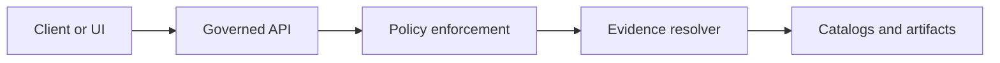

<!-- [KFM_META_BLOCK_V2]
doc_id: kfm://doc/<uuid>
title: ADR <NNNN>: <Decision title>
type: standard
version: v1
status: draft
owners: <team or names>
created: YYYY-MM-DD
updated: YYYY-MM-DD
policy_label: internal
related: [<paths or kfm:// ids>]
tags: [kfm, adr]
notes: ["Template file — copy to a new ADR and fill in"]
[/KFM_META_BLOCK_V2] -->

<!--
TEMPLATE INSTRUCTIONS
- Copy this file to: docs/adr/ADR-<NNNN>-<slug>.md (or your repo’s ADR naming convention)
- Fill in all <placeholders>.
- Keep ADRs small and decision-focused; one decision per ADR.
- If this ADR changes core invariants (policy, IDs, catalogs, trust membrane), link it from the PR description.
-->

# ADR <NNNN>: <Decision title>

## Impact

| Field | Value |
| --- | --- |
| Status | Draft • Proposed • Accepted • Superseded • Deprecated |
| Decision date | YYYY-MM-DD |
| Owners | <team or names> |
| Related PR(s) | <link(s) or N/A> |
| Related issue(s) | <link(s) or N/A> |
| Supersedes | ADR-<NNNN> (optional) |
| Superseded by | ADR-<NNNN> (optional) |
| Affected areas | <e.g., policy, catalogs, ingestion, UI, Focus Mode> |
| Risk level | Low • Medium • High |
| Reversibility | Easy • Moderate • Hard |

---

## Summary

<1–3 sentences. What are we deciding, and why now?>

---

## Context

### Problem statement

<What problem are we solving? Who is affected?>

### Decision drivers

<List the forces that matter (constraints, goals, risks). Examples: trust membrane, licensing, reproducibility, performance, cost.>

### Constraints and assumptions

- <Constraint 1>
- <Assumption 1>

### Prior art / references

- <Link to prior ADRs, RFCs, docs, or external references>

---

## Decision

### Decision statement

<The decision, stated clearly and unambiguously.>

### Decision details

- <Key detail 1>
- <Key detail 2>

### Status

- **Status:** <Draft | Proposed | Accepted | Superseded | Deprecated>
- **Accepted on:** YYYY-MM-DD (if accepted)
- **Approvers:** <names/roles> (if applicable)

---

## Alternatives considered

> Keep this section concrete. List the real options you were prepared to take.

### Alternative A: <name>

- **Description:** <what it is>
- **Pros:**
  - <pro 1>
- **Cons / risks:**
  - <con 1>
- **Why not chosen:** <reason>

### Alternative B: <name>

- **Description:** <what it is>
- **Pros:**
  - <pro 1>
- **Cons / risks:**
  - <con 1>
- **Why not chosen:** <reason>

---

## Consequences

### Positive

- <What becomes easier / safer / faster?>

### Negative / tradeoffs

- <What becomes harder / riskier / slower?>

### Operational impact

- <On-call, runbooks, backups, DR, cost, etc.>

---

## Rollback plan

> Required for KFM-governed changes. Define what “rollback” means and how to do it safely.

### Rollback trigger(s)

- <Trigger 1: e.g., CI gate failures in prod, data quality regression, policy leak risk>

### Rollback steps

1. <Step 1>
2. <Step 2>

### Data compatibility / reversibility notes

- <Is there a schema migration? Can data be down-migrated?>
- <Are old dataset versions still servable?>

---

## Implementation plan

> Prefer small, reversible, additive changes.

### Milestones

1. <Milestone 1: e.g., add schemas/contracts + fixtures>
2. <Milestone 2: implement code behind feature flag>
3. <Milestone 3: enable in staging, validate, then prod>

### Migration / rollout strategy

- <Feature flags, dual-write/dual-read, backfill approach, cutover steps>

### Guardrails

- <What will fail closed? What checks block merge/promotion?>

---

## Verification plan

### CI / tests

- [ ] Unit tests added/updated
- [ ] Contract tests added/updated (OpenAPI / JSON Schema)
- [ ] Policy tests added/updated (default deny + fixtures)
- [ ] Determinism / reproducibility checks (digests, spec_hash, receipts)

### Runtime verification

- <Smoke tests, canaries, dashboards, alerting>

---

## Governance checklist

> This is the “did we preserve KFM invariants?” pass.

- [ ] **Trust membrane** preserved: UI/clients do not access DB/object storage directly; access goes through governed APIs.
- [ ] **Promotion gates** preserved: RAW → WORK → PROCESSED → CATALOG → PUBLISHED flow still enforced by CI/policy gates.
- [ ] **Catalog triplet** preserved: DCAT + STAC + PROV remain schema-valid and cross-linked so EvidenceRefs resolve.
- [ ] **Cite-or-abstain** preserved: citations resolve, are policy-allowed, and publishing is blocked on failures.
- [ ] **Policy & sensitivity** addressed: policy_label changes, obligations, redaction/generalization requirements documented.
- [ ] **Licensing** addressed: SPDX/license metadata present where required.
- [ ] **Rollback-first**: rollback is documented and feasible.

---

## Diagram

> Optional but recommended for non-trivial architecture changes.

---

## Open questions

- <Question 1>
- <Question 2>

---

## References

- <PR link>
- <Issue link>
- <Related ADRs>
- <Docs/specs>
